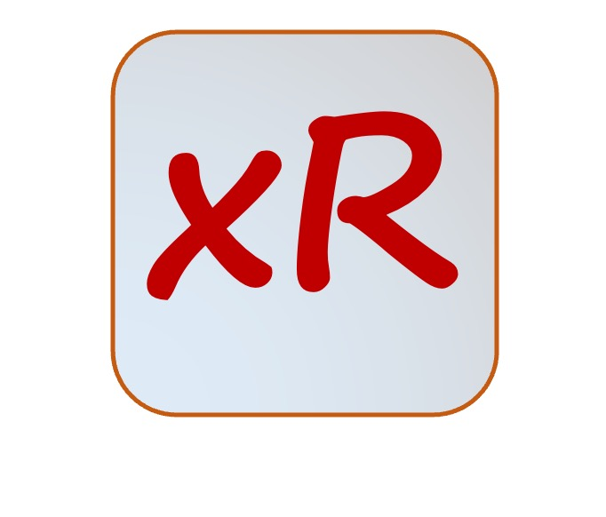

# xRegistry

<!-- no verify-specs -->

<!--  -->

xRegistry...

Para2...

## xRegsitry Documents

|                               |                                 Latest Release                                  |                                      Working Draft                                       |
| :---------------------------- | :-----------------------------------------------------------------------------: | :--------------------------------------------------------------------------------------: |
| **Core xRegistry Specification:**    |
| xRegistry                     | n/a | [WIP](core/spec.md) |
|                               |
| **Domain Specific Specifications:**  |
| Endpoint Registry             | n/a | [WIP](endpoint/spec.md)                         |
| Message Registry              | n/a | [WIP](message/spec.md)                         |
| Schema Registry               | n/a | [WIP](schema/spec.md)                         |
|                               |
| **Additional Documentation:** |
| xRegistry Primer              | n/a | [WIP](core/primer.md)                          |
| Pagination Specification      | n/a | [WIP](pagination/spec.md)                          |

Additional release related information:
  [Historical releases and changelogs](docs/RELEASES.md)

If you are new to the family of xRegistry specifications, it is recommended
that you start by reading the [xRegistry Primer](core/primer.md) for an
overview of the specification's goals and design decisions, and then move on
to the [core specification](core/spec.md).

## Community and Docs

Learn more about the people and organizations who are creating a dynamic cloud
native ecosystem by making our systems interoperable with xRegistry.

- Our [Governance](docs/GOVERNANCE.md) documentation.
- [Contributing](docs/CONTRIBUTING.md) guidance.
- [Roadmap](docs/ROADMAP.md)
- [Contributors](docs/contributors.md): people and organizations who helped
  us get started or are actively working on the xRegistry specifications.
- [Demos & open source](docs/README.md) -- if you have something to share
  about your use of xRegistry, please submit a PR!
- [Code of Conduct](https://github.com/cncf/foundation/blob/master/code-of-conduct.md)

### Security Concerns

If there is a security concern with one of the specifications in this
repository please [open an issue](https://github.com/xregistry/spec/issues).

### Communications

The main mailing list for e-mail communications:

- Send emails to: [cncf-xregistry](mailto:cncf-xregistry@lists.cncf.io)
- To subscribe see: https://lists.cncf.io/g/cncf-xregistry
- Archives are at: https://lists.cncf.io/g/cncf-xregistry/topics

And a #xregistry Slack channel under
[CNCF's Slack workspace](http://slack.cncf.io/).

### Meeting Time

See the [CNCF public events calendar](https://www.cncf.io/community/calendar/).
This specification is being developed by the
[CNCF Serverless Working Group](https://github.com/cncf/wg-serverless). This
working group meets every Thursday at 9AM PT (USA Pacific)
([World Time Zone Converter](http://www.thetimezoneconverter.com/?t=9:00%20am&tz=San%20Francisco&)):

Please see the
[meeting minutes doc](https://docs.google.com/document/d/1OVF68rpuPK5shIHILK9JOqlZBbfe91RNzQ7u_P7YCDE/edit#)
for the latest information on how to join the calls.

Recording from our calls are available 
[here](https://www.youtube.com/playlist?list=PLO-qzjSpLN1BEyKjOVX_nMg7ziHXUYwec), and
older ones are
[here](https://www.youtube.com/playlist?list=PLj6h78yzYM2Ph7YoBIgsZNW_RGJvNlFOt).

Periodically, the group may have in-person meetings that coincide with a major
conference. Please see the
[meeting minutes doc](https://docs.google.com/document/d/1OVF68rpuPK5shIHILK9JOqlZBbfe91RNzQ7u_P7YCDE/edit#)
for any future plans.
