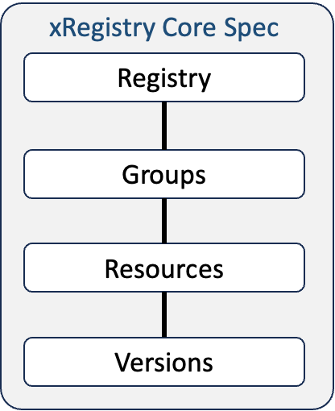
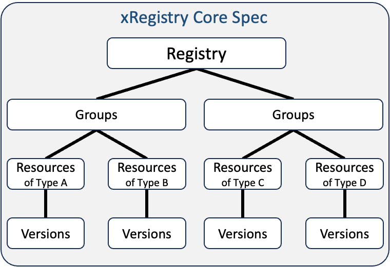
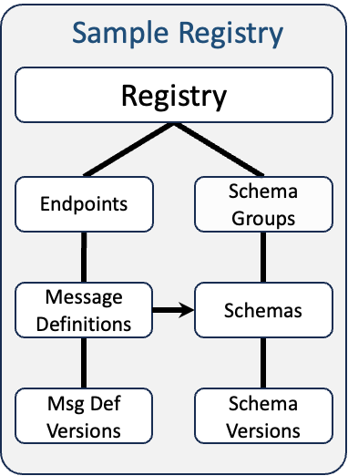

# Registry Service - Version 0.5-wip

## Abstract

A Registry Service exposes Resources, and their metadata, for the purposes
of enabling discovery of those Resources for either end-user consumption or
automation and tooling.

## Table of Contents

- [Overview](#overview)
- [Notations and Terminology](#notations-and-terminology)
  - [Notational Conventions](#notational-conventions)
  - [Terminology](#terminology)
- [Registry Attributes and APIs](#registry-attributes-and-apis)
  - [Attributes and Extensions](#attributes-and-extensions)
  - [Registry APIs](#registry-apis)
    - [Registry Collections](#registry-collections)
    - [Entity Processing Rules](#entity-processing-rules)
  - [Registry Entity](#registry-entity)
    - [Retrieving the Registry](#retrieving-the-registry)
    - [Updating the Registry Entity](#updating-the-registry-entity)
  - [Registry Capabilities](#registry-capabilities)
  - [Registry Model](#registry-model)
    - [Retrieving the Registry Model](#retrieving-the-registry-model)
    - [Updating the Registry Model](#updating-the-registry-model)
  - [Groups](#groups)
    - [Retrieving a Group Collection](#retrieving-a-group-collection)
    - [Creating or Updating Groups](#creating-or-updating-groups)
    - [Retrieving a Group](#retrieving-a-group)
    - [Deleting Groups](#deleting-groups)
  - [Resources](#resources)
    - [Retrieving a Resource Collection](#retrieving-a-resource-collection)
    - [Creating or Updating Resources and
       Versions](#creating-or-updating-resources-and-versions)
    - [Retrieving a Resource](#retrieving-a-resource)
    - [Deleting Resources](#deleting-resources)
  - [Versions](#versions)
    - [Retrieving all Versions](#retrieving-all-versions)
    - [Creating or Updating Versions](#creating-or-updating-versions)
    - [Retrieving a Version](#retrieving-a-version)
    - [Deleting Versions](#deleting-versions)
  - [Configuring Responses](#configuring-responses)
    - [Inline](#inline)
    - [Filter](#filter)
    - [Compact](#compact)
  - [HTTP Header Values](#http-header-values)

## Overview

A Registry Service is one that manages metadata about Resources. At its core,
the management of an individual Resource is simply a REST-based interface for
creating, modifying, and deleting the Resource. However, many Resource models
share a common pattern of grouping Resources and can optionally support
versioning of those Resources. This specification aims to provide a common
interaction pattern for these types of services with the goal of providing an
interoperable framework that will enable common tooling and automation to be
created.

This document is meant to be a framework from which additional specifications
can be defined that expose model specific Resources and metadata.

A Registry consists of two main types of entities: Groups and Resources.

Groups, as the name implies, is a mechanism by which related Resources are
arranged together under a single collection - the Group. The reason for the
grouping is not defined by this specification, so the owners of the Registry
can choose to define (or enforce) any pattern they wish. In this sense, a
Group is similar to a "directory" on a filesystem.

Resources represent the main data of interest for the Registry. In the
filesystem analogy, these would be the "files". All Resources exists under a
single Group and, similar to Groups, has a set of Registry metadata.
However, unlike a Group which only has Registry metadata, each Resource can
also have a "document" associated with it. For example, a "schema" Resource
might have a "schema document" as its "document". This specification places no
restriction on the type of content stored in the Resource's document.

This specification defines a set of common metadata that can appear on both
Groups and Resources, and allows for domain-specific extensions to be added.

The following 3 diagrams show (from left to right):<br>
1 - The core concepts of the Registry in its most abstract form.<br>
2 - A Registry concept model with multiple types of Groups/Resources.<br>
3 - A concrete sample usage of Registry that includes the use of an attribute
    on "Message Definition" that is a reference to a "Schema" document - all
    within the same Registry instance.

&nbsp;&nbsp;&nbsp;&nbsp;&nbsp;&nbsp;

For easy reference, the JSON serialization of a Registry adheres to this form:

```yaml
{
  "specversion": "STRING",
  "registryid": "STRING",
  "self": "URL",
  "shortself": "URL", ?
  "xid": "URI",
  "epoch": UINTEGER,
  "name": "STRING", ?
  "description": "STRING", ?
  "documentation": "URL", ?
  "labels": { "STRING": "STRING" * }, ?
  "createdat": "TIMESTAMP",
  "modifiedat": "TIMESTAMP",

  "capabilities": {                     # Supported capabilities/options
    "enforcecompatibility": BOOLEAN, ?
    "flags": [                          # Query parameters
      "epoch",? "compact",? "filter",? "inline",?
      "nodefaultversionid",? "nodefaultversionsticky",? "noepoch",?
      "noreadonly",?  "schema",? "setdefaultversionid",? "specversion",?
      "STRING" *
    ],
    "mutable": [                        # What is mutable in the Registry
      "capabilities",? "entities",? "model",? "STRING"*
    ], ?
    "pagination": BOOLEAN, ?
    "schemas": [ "xRegistry-json/0.5", "STRING" * ], ?
    "shortself": BOOLEAN, ?
    "specversions": [ "0.5", "STRING"* ], ?

    "STRING": ... *                     # Extension capabilities
  }, ?

  "model": {                            # Only if inlined
    "labels": { "STRING": "STRING" * }, ?
    "attributes": {                     # Registry level attributes/extensions
      "STRING": {                       # Attribute name (case sensitive)
        "name": "STRING",               # Same as attribute's key
        "type": "TYPE",                 # string, decimal, array, object, ...
        "target": "STRING", ?           # If "type" is "relation"
        "description": "STRING", ?
        "enum": [ VALUE * ], ?          # Array of scalar values of type "TYPE"
        "strict": BOOLEAN, ?            # Just "enum" values or not.Default=true
        "readonly": BOOLEAN, ?          # From client's POV. Default: false
        "immutable": BOOLEAN, ?         # Once set, can't change. Default=false
        "clientrequired": BOOLEAN, ?    # Default: false
        "serverrequired": BOOLEAN, ?    # Default: false
        "default": VALUE, ?             # Attribute's default value, scalars

        "attributes": { ... }, ?        # If "type" above is object
        "item": {                       # If "type" above is map,array
          "type": "TYPE", ?             # map value type, or array type
          "attributes": { ... }, ?      # If this item "type" is object
          "item": { ... } ?             # If this item "type" is map,array
        } ?

        "ifvalues": {                   # If "type" is scalar
          "VALUE": {                    # Possible attribute value
            "siblingattributes": { ... } # See "attributes" above
          } *
        } ?
      } *
    },

    "groups": {
      "STRING": {                       # Key=plural name, e.g. "endpoints"
        "plural": "STRING",             # e.g. "endpoints"
        "singular": "STRING",           # e.g. "endpoint"
        "labels": { "STRING": "STRING" * }, ?
        "attributes": { ... }, ?        # Group level attributes/extensions

        "resources": {
          "STRING": {                   # Key=plural name, e.g. "messages"
            "plural": "STRING",         # e.g. "messages"
            "singular": "STRING",       # e.g. "message"
            "maxversions": UINTEGER, ?  # Num Vers(>=0). Default=0, 0=unlimited
            "setversionid": BOOLEAN, ?  # Supports client specified Version IDs
            "setdefaultversionsticky": BOOLEAN, ?    # Supports client "default" selection
            "hasdocument": BOOLEAN, ?     # Has separate document. Default=true
            "typemap": MAP, ?             # contenttype mappings
            "labels": { "STRING": "STRING" * }, ?
            "attributes": { ... }, ?      # Version attributes/extensions
            "metaattributes": { ... } ?   # Resource attributes/extensions
          } *
        } ?
      } *
    } ?
  }, ?

  # Repeat for each Group type
  "GROUPSurl": "URL",                              # e.g. "endpointsurl"
  "GROUPScount": UINTEGER,                         # e.g. "endpointscount"
  "GROUPS": {                                      # Only if inlined
    "KEY": {                                       # Key=the Group id
      "GROUPid": "STRING",                         # The Group ID
      "self": "URL",
      "shortself": "URL", ?
      "xid": "URI",
      "epoch": UINTEGER,
      "name": "STRING", ?
      "description": "STRING", ?
      "documentation": "URL", ?
      "labels": { "STRING": "STRING" * }, ?
      "createdat": "TIMESTAMP",
      "modifiedat": "TIMESTAMP",

      # Repeat for each Resource type in the Group
      "RESOURCESurl": "URL",                       # e.g. "messagesurl"
      "RESOURCEScount": UINTEGER,                  # e.g. "messagescount"
      "RESOURCES": {                               # Only if inlined
        "KEY": {                                   # The Resource id
          # These are inherited from the "default" Version (except 'self')
          "RESOURCEid": "STRING",
          "versionid": "STRING",
          "self": "URL",                           # Resource URL, not Version
          "shortself": "URL", ?
          "xid": "URI",
          "epoch": UINTEGER,                       # Version's epoch
          "name": "STRING", ?
          "isdefault": true,
          "description": "STRING", ?
          "documentation": "URL", ?
          "labels": { "STRING": "STRING" * }, ?
          "createdat": "TIMESTAMP",
          "modifiedat": "TIMESTAMP",
          "contenttype": "STRING, ?

          "RESOURCEurl": "URL", ?                  # If not local
          "RESOURCE": ... Resource document ..., ? # If local & inlined & JSON
          "RESOURCEbase64": "STRING", ?            # If local & inlined & ~JSON

          # Resource level helper attributes
          "metaurl": "URL",
          "meta": {                                # Only if inlined
            "RESOURCEid": "STRING",
            "self": "URL",                         # URL to "meta" object
            "shortself": "URL", ?
            "xid": "URI",
            "xref": "URL", ?                       # xid of linked Resource
            "epoch": UINTEGER,                     # Resource's epoch
            "createdat": "TIMESTAMP",              # Resource's
            "modifiedat": "TIMESTAMP",             # Resource's
            "readonly": BOOLEAN, ?                 # Default is "false"
            "compatibility": "STRING", ?           # Default is "none"
            # TODO - add timestamp?

            "defaultversionid": "STRING",
            "defaultversionurl": "URL",
            "defaultversionsticky": BOOLEAN ?      # Default is "false"
          }, ?
          "versionsurl": "URL",
          "versionscount": UINTEGER,
          "versions": {                            # Only if inlined
            "KEY": {                               # The Version's versionid
              "RESOURCEid": "STRING",              # The Resource id
              "versionid": "STRING",               # The Version id
              "self": "URL",                       # Version URL
              "shortself": "URL", ?
              "xid": "URI",
              "epoch": UINTEGER,                   # Version's epoch
              "name": "STRING", ?
              "isdefault": BOOLEAN, ?
              "description": "STRING", ?
              "documentation": "URL", ?
              "labels": { "STRING": "STRING" * }, ?
              "createdat": "TIMESTAMP",
              "modifiedat": "TIMESTAMP",
              "contenttype": "STRING", ?

              "RESOURCEurl": "URL", ?                  # If not local
              "RESOURCE": ... Resource document ..., ? # If inlined & JSON
              "RESOURCEbase64": "STRING" ?             # If inlined & ~JSON
            } *
          } ?
        } *
      } ?
    } *
  } ?
}
```

## Notations and Terminology

### Notational Conventions

The key words "MUST", "MUST NOT", "REQUIRED", "SHALL", "SHALL NOT", "SHOULD",
"SHOULD NOT", "RECOMMENDED", "MAY", and "OPTIONAL" in this document are to be
interpreted as described in [RFC 2119](https://tools.ietf.org/html/rfc2119).

For clarity, OPTIONAL attributes (specification defined and extensions) are
OPTIONAL for clients to use, but servers MUST be prepared for them to appear
in incoming requests and MUST support them since "support" simply means
persisting them in the backing datastore. However, as with all attributes, if
accepting the attribute would result in a bad state (such as exceeding a size
limit, or results in a security issue), then the server MAY choose to reject
the request.

In the pseudo JSON format snippets `?` means the preceding item is OPTIONAL,
`*` means the preceding item MAY appear zero or more times, and `+` means the
preceding item MUST appear at least once. The presence of the `#` character
means the remaining portion of the line is a comment. Whitespace characters in
the JSON snippets are used for readability and are not normative.

When HTTP query parameters are discussed, they are presented as `?NAME` where
`NAME` is the name of the query parameter.

Use of the words `GROUP` and `RESOURCE` are meant to represent the singular
form of a Group and Resource type being used. While `GROUPS` and `RESOURCES`
are the plural form of those respective types. Use of the word `SINGULAR`
represents the singular form of the entity being referenced.

Use of acronyms and words in all capital letters (e.g. `KEY`) typically
represent a field that will be replaced by its real value at runtime.

The following are used to denote an instance of one of the associated data
types (see [Attributes and Extensions](#attributes-and-extensions) for more
information about each data type):
- `ARRAY`
- `BOOLEAN`
- `DECIMAL`
- `INTEGER`
- `MAP`
- `OBJECT`
- `RELATION`
- `STRING`
- `TIMESTAMP`
- `UINTEGER`
- `URI`
- `URIREFERENCE`
- `URITEMPLATE`
- `URL`
- `TYPE` - one of the allowable data type names (MUST be in lower case) listed
  in [Attributes and Extensions](#attributes-and-extensions)

### Terminology

This specification defines the following terms:

#### Group

An entity that acts as a collection of related Resources.

#### Registry

An implementation of this specification. Typically, the implementation would
include model specific Groups, Resources and extension attributes.

#### Resource

A Resource is typically the main entity that is stored within a Registry
Service. A Resource MUST exist within the scope of a Group and it MAY be
versioned.

## Registry Attributes and APIs

This section defines common Registry metadata attributes and APIs. It is an
explicit goal for this specification that metadata can be created and managed
in files in a file system, for instance in a Git repository, and also managed
in a Registry service that implements the API described here.

For instance, during development of a module, the metadata about the events
raised by the modules will best be managed in a file that resides alongside the
module's source code. When the module is ready to be deployed into a concrete
system, the metadata about the events will be registered in a Registry service
along with the endpoints where those events can be subscribed to or consumed
from, and which allows discovery of the endpoints and all related metadata by
other systems at runtime.

Therefore, the hierarchical structure of the Registry model is defined in such
a way that it can be represented in a single file, including but not limited
to JSON, or via the entity graph of a REST API.

If an error occurs during the processing of a request, even if the error was
during the creation of the response (e.g. an invalid `?inline` value was
provided), then an error MUST be generated and the entire request (even any
update actions) MUST be undone. In general, when an error is generated it
SHOULD be sent back to the client. However, this MAY not happen if the server
determines there is a good reason to not do so - such as due to security
concerns.

In the remainder of this specification, in particular when defining the
attributes of the Registry entities, the terms "document view" or "API view"
will be used to indicate whether the serialization of the entity in question
is meant for use as a stand-alone document or as part of a REST API message
exchange - if there is a difference between the two usages.

### Attributes and Extensions

Unless otherwise noted, all attributes and extensions MUST be mutable and MUST
be one of the following data types:
- `any` - an attribute of this type is one whose type is not known in advance
   and MUST be one of the concrete types listed here.
- `array` - an ordered list of values that are all of the same data type - one
   of the types listed here.
   - Some serializations, such as JSON, allow for a `null` type of value to
     appear in array (e.g. `[ null, 2, 3 ]` in an array of integers). In these
     cases, while it is valid for the serialization being used, it is not
     valid for the xRegistry since `null` is not a valid `integer`. Meaning,
     the serialization of an array that is syntactically valid for the
     format being used, but not semantically valid per the xRegistry model
     definition MUST NOT be accepted and MUST generate an error.
- `boolean` - case sensitive `true` or `false`.
- `decimal` - number (integer or floating point).
- `integer` - signed integer.
- `map` - set of key/value pairs, where the key MUST be of type string. The
   value MUST be of one of the types defined here.
  - Each key MUST be a non-empty string consisting of only lowercase
    alphanumeric characters (`[a-z0-9]`), `-`, `_` or a `.`; be no longer
    than 63 characters; start with an alphanumeric character and be unique
    within the scope of this map.
  - See [Serializing Resource Documents](#serializing-resource-documents)
    for more information about serializing maps as HTTP headers.
- `object` - a nested entity made up of a set of attributes of these data types.
- `relation` - MUST be a `URL` (xid) reference to another entity defined within
  the Registry. The actual entity attribute value MAY reference a non-existing
  entity (i.e. dangling pointer), but the syntax MUST reference a
  defined/valid type in the Registry. This type of attribute is used in
  place of `url` so that the Registry can do "type checking" to ensure the
  value references the correct type of Registry entity. See the definition of
  the [`target` model attribute](#model.target) for more information.
- `string` - sequence of Unicode characters.
- `timestamp` - an [RFC3339](https://tools.ietf.org/html/rfc3339) timestamp.
- `uinteger` - unsigned integer.
- `uri` - absolute URI as defined in [RFC 3986 Section
  4.3](https://tools.ietf.org/html/rfc3986#section-4.3).
- `urireference` - URI-reference as defined in [RFC 3986
  Section 4.1](https://tools.ietf.org/html/rfc3986#section-4.1).
- `uritemplate` - URI Template as defined in
  [RFC 6570 Section 3.2.1](https://tools.ietf.org/html/rfc6570#section-3.2.1).
- `url` - URL as defined in
  [RFC 1738](https://datatracker.ietf.org/doc/html/rfc1738).

All relative URIs and URLs that reference entities within the Registry MUST
begin with `/` and MUST be relative to the root path of the Registry service.
The root path of a Registry service MAY be at the root of a host or have a
`PATH` portion in its URL (e.g. `http://example.com/myregistry`)

The "scalar" data types are: `boolean`, `decimal`, `integer`, `relation`,
`string`, `timestamp`, `uinteger`, `uri`, `urireference`, `uritemplate`, `url`.
Note that `any` is not a "scalar" type as its runtime value could be a complex
type such as `object`.

All attributes (specification defined and extensions) MUST adhere to the
following rules:
- Their names MUST be between 1 and 63 characters in length.
- Their names MUST only contain lowercase alphanumeric characters or an
  underscore (`[a-z0-9_]`) and MUST NOT start with a digit (`[0-9]`).
- For STRING attributes, an empty string is a valid value and MUST NOT be
  treated the same as an attribute with no value (or absence of the attribute).
- For scalar attributes, the string serialization of the attribute name and
  its value MUST NOT exceed 4096 bytes. This is to ensure that it can appear
  in an HTTP header without exceeding implementation limits (see
  [RFC6265/Limits](https://datatracker.ietf.org/doc/html/rfc6265#section-6.1)).
  In cases where larger amounts of data is needed, it is RECOMMENDED that
  an attribute (of type URL) be defined that references a separate
  document. For example, `documentation` can be considered such an attribute
  for `description`.
- If an attribute's type is not fully defined (i.e. it is defined as an `any`
  type) but a concrete type is needed to successfully process it, then the
  server SHOULD default it to type `string`. For example, if an extension is
  defined as a map whose values are of type `any`, but it appears in an HTTP
  header with a value of `5` (and it is not clear if this would be an integer
  or a string), if the server needs to convert this to a concrete data type,
  then `string` is the default choice.
- There might be cases when it is not possible to know whether a field name is
  part of an object (in which case it is an "attribute name"), or is part of
  a map (in which case it is a "key name"). This decision would impact
  verification of the field since key names allow for a superset of the
  characters allowed for attribute names. This will only happen when the
  `any` type has been used higher-up in the model. As a result, any portion of
  the entity that appears under the scope of an `any` typed attribute or
  map-value is NOT REQUIRED to be validated except to ensure that the syntax
  is valid per the rules of the serialization format used.

Implementations of this specification MAY define additional (extension)
attributes. However they MUST adhere to the following rules:

- All attributes MUST conform to the model definition of the Registry. This
  means that they MUST satisfy at least one of the following:
  - Be explicitly defined (by name) as part of the model.
  - Be permitted due to the presence of the `*` (undefined) extension attribute
    name at that level in the model.
  - Be permitted due to the presence of an `any` type for one of its parent
    attribute definitions.
- They MUST NOT change the semantics of the Registry - they MUST only be
  additional metadata to be persisted in the Registry since servers MUST
  persist all valid extensions.
  TODO is this really ok?
- They MUST NOT conflict with the name of an attribute defined by this
  specification, including the `RESOURCE*` and `COLLECTION*` attributes that
  are implicitly defined. Note that if a Resource type has the `hasdocument`
  attribute set the `false` then this rule does not apply for the `RESOURCE*`
  attributes as those attributes are not used for that Resource type.
- It is RECOMMENDED that extension attributes on different entities not use the
  same name unless they have the exact same semantic meaning.
- It is STRONGLY RECOMMENDED that they be named in such a way as to avoid
  potential conflicts with future Registry level attributes. For
  example, use of a model (or domain) specific prefix could be used to help
  avoid possible future conflicts.

#### Common Attributes

The following attributes are used by one or more entities defined by this
specification. They are defined here once rather than repeating them
throughout the specification.

For easy reference, the JSON serialization these attributes adheres to this
form:
- `"SINGULARid": "STRING"`
- `"self": "URL"`
- `"shortself": "URL"`
- `"xid": "URI"`
- `"epoch": UINTEGER`
- `"name": "STRING"`
- `"description": "STRING"`
- `"documentation": "URL"`
- `"labels": { "STRING": "STRING" * }`
- `"createdat": "TIMESTAMP"`
- `"modifiedat": "TIMESTAMP"`

The definition of each attribute is defined below:

##### `SINGULARid` (`id`) Attribute

- Type: String
- Description: An immutable unique identifier of the Registry, Group, Resource
  or Version. The actual name of this attribute will vary based on the entity it
  identifies. For example, a `schema` Resource would use an attribute name of
  `schemaid`. This attribute MUST be named `registryid` for the Registry
  itself, and MUST be named `versionid` for all Version entities.
- Constraints:
  - MUST be a non-empty string consisting of [RFC3986 `unreserved`
    characters](https://datatracker.ietf.org/doc/html/rfc3986#section-2.3)
    (ALPHA / DIGIT / `-` / `.` / `_` / `~`) and `@`, MUST start with
    ALPHA, DIGIT or `_` and MUST be between 1 and 128 characters in length.
  - MUST be case insensitive unique within the scope of the entity's parent.
    In the case of the `registryid` for the Registry itself, the uniqueness
    scope will be based on where the Registry is used. For example, a publicly
    accessible Registry might want to consider using a globally unique value,
    while a private Registry does not need to be so widely unique.
  - This attribute MUST be treated as case sensitive for look-up purposes.
    This means that an HTTP request to an entity with the wrong case for its
    `SINGULARid` MUST be treated as "not found".
  - In cases where an entity's `SINGULARid` is specified outside of the
    serialization of the entity (e.g. part of a request URL, or a map key), its
    presence within the serialization of the entity is OPTIONAL. However, if
    present, it MUST be the same as any other specification of the `SINGULARid`
    outside of the entity, and it MUST be the same as the entity's existing
    `SINGULARid` if one exists, otherwise an HTTP `400 Bad Request` error MUST
    be generated.
  - MUST be immutable.
- Examples:
  - `a183e0a9-abf8-4763-99bc-e6b7fcc9544b`
  - `myEntity`
  - `myEntity.example.com`

While `SINGULARid` can be something like a UUID, when possible, it is
RECOMMENDED that it be something human friendly as these values will often
appear in user-facing situations such as URLs or as command-line parameters.
And, in cases where [`name`](#name-attribute) is absent, it might be used as
the display name.

Note, since `SINGULARid` is immutable, in order to change its value a new
entity would need to be created with the new `SINGULARid` that is a deep-copy
of the existing entity. Then the existing entity can be deleted.

##### `self` Attribute

- Type: URL
- Description: A server generated unique URL for the current entity. In the
  case of pointing to an entity in a [Registry
  Collection](#registry-collections), the URL MUST be a combination of the
  base URL for the collection appended with the `SINGULARid` of the entity.

  When this URL references a Resource or Version, and the Resource has the
  `hasdocument` model aspect set to `true`, then it MUST include `$details`
  appended to its `SINGULARid` if the request asked for the serialization of the
  xRegistry metadata. This would happen when `$details` was used in the
  request, or when the Resource (or Version) is included in the serialization
  of a parent entity.

  If the Resource or Version has the `hasdocument` model aspect set to `false`,
  then this URL MUST be appended with `$details` only if the request was
  directed at the Resource or Version and included `$details`. Otherwise in
  all other situations `$details` MUST NOT be included.

- Constraints:
  - MUST be unique across all entities in the Registry.
  - MUST be a non-empty absolute URL, except when `?compact` is enabled
    then it MUST be a relative URL.
  - MUST be a read-only attribute in API view.
- Examples:
  - `https://example.com/registry/endpoints/ep1`

##### `shortself` Attribute

- Type: URL
- Description: A server generated unique absolute URL for an entity. This
  attribute MUST be an alternative URL for the owning entity's `self`
  attribute. The intention is that `shortself` SHOULD be shorter in length
  than `self` such that it MAY be used when the length of the URL referencing
  the owning entity is important. For example, in cases where the size of a
  message needs to be as small as possible.

  This specification makes no statement as to how this URL is constructed,
  to which host/path it references, or whether a request to this URL
  will directly perform the desired operation or whether it returns a
  redirect to the full `self` URL requiring the client to resend the request.

  If an entity is deleted and then a new entity is created that results in
  the same `self` URL, this specification does not mandate that the same
  `shorturl` be generated, but it MAY do so.

  This attribute MUST only appear in the serialization if the `shortself`
  capability is enabled. However, if this capability is enabled, then disabled,
  and then re-enabled, the `shortself` values MUST retain their original
  values. In this sense, implementations might create a `shortself` that is
  known for the lifetime of the entity and the capability controls whether
  the attribute is serialized or not.

- Constraints:
  - MUST be unique across all entities in the Registry.
  - MUST be a non-empty absolute URL referencing the same entity as the `self`
    URL, either directly or indirectly via an HTTP redirect.
  - MUST be a read-only attribute in API view.
  - MUST NOT change during the lifetime of the entity.
- Examples:
  - `https://tinyurl.com/xreg123` redirects to
    `https://example.com/endpoints/e1`

##### `xid` Attribute

- Type: URL
- Description: An immutable server generated unique identifier of the entity.
  Unlike `SINGULARid`, which is unique within the scope of its parent, `xid`
  MUST be unique across the entire Registry, and as such is defined to be a
  relative URL from the root of the Registry. This value MUST be the same as
  the PATH portion of its `self` URL, after the Registry's base URL, without
  any `$` suffix (e.g. `$details`).

  This attribute is provided as a convenience for users who need a reference
  to the entity without running the risk of incorrectly extracting it from
  the `self` URL, which might be ambiguous at times. The `xid` value is also
  meant to be used as a `xref` value (see [Cross Referencing
  Resources](#cross-referencing-resources), or as the value attributes of
  type `relation` (see [`target` model attribute](#model.target)).

- Constraints:
  - MUST be a non-empty relative URL to the current entity.
  - MUST be of the form: `/[GROUPS/gID[/RESOURCES/rID[/meta | /versions/vID]]]`.
  - MUST start with the `/` character.
  - MUST be a read-only attribute in API view.
- Examples:
  - `/endpoints/endpoint1`

##### `epoch` Attribute

- Type: Unsigned Integer
- Description: A numeric value used to determine whether an entity has been
  modified. Each time the associated entity is updated, this value MUST be
  set to a new value that is greater than the current one. This attribute
  MUST be updated for every update operation, even if no attributes were
  explicitly updated, such as a `PATCH` with no attributes. This then acts
  like a `touch` type of operation.

  During a single write operation, whether this value is incremented for
  each modified attribute of an entity, or updated just once for the entire
  operation is an implementation choice.

  During a create operation, if this attribute is present in the request then
  it MUST be silently ignored by the server.

  During an update operation, if this attribute is present in the request then
  an error MUST be generated if the request includes a non-null value that
  differs from the existing value. A value of `null` MUST be treated the same
  as a request with no `epoch` attribute at all.

  The semantics of `epoch` are the same as the semantics of the
  [HTTP ETag](https://datatracker.ietf.org/doc/html/rfc9110#section-8.8.3)
  and
  [HTTP If-Match](https://datatracker.ietf.org/doc/html/rfc9110#section-13.1.1)
  Headers, and as such the following rules apply when using HTTP as the
  protocol:
  - When the response body references a single entity, its `epoch` value MUST
    also appear as an HTTP `ETag` header. Note that a response body with a
    map or array that only includes one entity does not satisfy this
    requirement.
  - When the xRegistry metadata of a Resource, or Version, is serialized as
    HTTP headers, and prefixed with `xRegistry-`, the `xRegistry-epoch` header
    MUST NOT be present since the `ETag` header MUST already be present with
    the value.
  - When a request includes an HTTP `If-Match` header, then its value MUST
    match the existing entity's `epoch` value. And if not, a
    `412 Precondition Failed` error MUST be generated. Note, that `*` MUST
    match all possible `epoch` value, but will fail if the entity does not
    already exist (per the HTTP specification).
  - The `If-Match` verification MUST be done in addition to the `epoch`
    checking specified above. In other words, a present but non-matching value
    in either location MUST generate an error.

  If an entity has a nested xRegistry collection, its `epoch` value MUST
  be updated each time an entity in that collection is added or removed.
  However, its `epoch` value MUST NOT be updated solely due to modifications of
  an existing entity in the collection.
- Constraints:
  - MUST be an unsigned integer equal to or greater than zero.
  - MUST increase in value each time the entity is updated.
- Examples:
  - `0`, `1`, `2`, `3`

##### `name` Attribute

- Type: String
- Description: A human readable name of the entity. This is often used
  as the "display name" for an entity rather than the `SINGULARid` especially
  when the `SINGULARid` might be something that isn't human friendly, like a
  UUID. In cases where `name` is OPTIONAL and absent, the `SINGULARid` value
  SHOULD be displayed in its place.

  This specification places no uniqueness constraints on this attribute.
  This means that two sibling entities MAY have the same value. Therefore,
  this value SHOULD NOT be used for unique identification purposes, the
  `SINGULARid` SHOULD be used instead.

  Note that implementations MAY choose to enforce additional constraints on
  this value. For example, they could mandate that `SINGULARid` and `name` be
  the same value. Or, it could mandate that `name` be unique within the scope
  of a parent entity. How any such requirement is shared with all parties is
  out of scope of this specification.
- Constraints:
  - If present, MUST be non-empty.
- Examples:
  - `My Endpoints`

##### `description` Attribute

- Type: String
- Description: A human readable summary of the purpose of the entity.
- Constraints:
  - None
- Examples:
  - `A queue of the sensor generated messages`

##### `documentation` Attribute

- Type: URL
- Description: A URL to additional information about this entity.
  This specification does not place any constraints on the data returned from
  an HTTP `GET` to this URL.
- Constraints:
  - If present, MUST be a non-empty URL.
  - MUST support an HTTP(s) `GET` to this URL.
- Examples:
  - `https://example.com/docs/myQueue`

##### `labels` Attribute

- Type: Map of name/value string pairs
- Description: A mechanism in which additional metadata about the entity can
  be stored without changing the schema of the entity.
- Constraints:
  - If present, MUST be a map of zero or more name/value string pairs. See
    [Attributes and Extensions](#attributes-and-extensions) for more
    information.
  - Keys MUST be non-empty strings.
  - Values MAY be empty strings.
- Examples:
  - `"labels": { "owner": "John", "verified": "" }` when in the HTTP body
  - `xRegistry-labels-owner: John` <br>
    `xRegistry-labels-verified:`  when in HTTP headers

  Note: HTTP header values can be empty strings but some client-side tooling
  might make it challenging to produce them. For example, `curl` requires
  the header to be specified as `-HxRegistry-labels-verified;` - notice the
  semi-colon(`;`) is used instead of colon(`:`). So, this might be something
  to consider when choosing to use labels that can be empty strings.

##### `createdat` Attribute

- Type: Timestamp
- Description: The date/time of when the entity was created.
- Constraints:
  - MUST be a [RFC3339](https://tools.ietf.org/html/rfc3339) timestamp.
  - If present in a write operation request, the value MUST override any
    existing value, however a value of `null` MUST use the current date/time
    as the new value.
  - When absent in a write operation request, any existing value MUST remain
    unchanged, or if not present, set to the current date/time
  - In cases where the `createdat` attribute is set to the current date/time
    on multiple entities within the same operation, the same value MUST be
    applied to all of the entities.
  - For Versions, if this attribute is updated such that the owning Version
    becomes the "newest" Version and the Resource's `defaultversionsticky`
    attribute is `false`, then this Version MUST become the "default" Version.
- Examples:
  - `2030-12-19T06:00:00Z`

##### `modifiedat` Attribute

- Type: Timestamp
- Description: The date/time of when the entity was last updated
- Constraints:
  - MUST be a [RFC3339](https://tools.ietf.org/html/rfc3339) timestamp
    representing the time when the entity was last updated.
  - Any update operation (even one that does not change any attribute, such as
    a `PATCH` with no attributes provided), MUST update this attribute. This
    then acts like a `touch` type of operation.
  - Upon creation of a new entity, this attribute MUST match the `createdat`
    attribute's value.
  - Updates to an existing entity in an xRegistry collection MUST NOT cause an
    update to its parent entity's `modifiedat` value. However, adding or
    removing an entity from a nested xRegistry collection MUST update the
    `modifiedat` value of the parent entity.
  - If present in a write operation request, the following applies:
    - If the request value is the same as the existing value, then the
      current date/time MUST be used as its new value.
    - If the request value is different than the existing value, then the
      request value MUST be used as its new value.
    - If the request value is `null` then the current date/time MUST be used
      as the new value.
  - When absent in a write operation request, it MUST be set to the current
    date/time.
  - In cases where the `modifiedat` attribute is set to the current date/time
    on multiple entities within the same operation, the same value MUST be
    applied to all of the entities.
- Examples:
  - `2030-12-19T06:00:00Z`

---

### Registry APIs

This specification defines the following API patterns:

```yaml
/                                               # Access the Registry
/capabilities                                   # Access available features
/model                                          # Access the model definitions
/export                                         # Retrieve compact Registry
/GROUPS                                         # Access a Group Type
/GROUPS/gID                                     # Access a Group
/GROUPS/gID/RESOURCES                           # Access a Resource Type
/GROUPS/gID/RESOURCES/rID                       # Default Version of a Resource
/GROUPS/gID/RESOURCES/rID/versions              # Versions of a Resource
/GROUPS/gID/RESOURCES/rID/versions/vID          # Access a Version of a Resource
```

Where:
- `GROUPS` is a Group type name (plural). e.g. `endpoints`.
- `GROUP`, not shown, is the singular name of a Group type.
- `gID` is the `SINGULARid` of a single Group.
- `RESOURCES` is a Resource type name (plural). e.g. `messages`.
- `RESOURCE`, not shown, is the singular name of a Resource type.
- `rID` is the `SINGULARid` of a single Resource.
- `vID` is the `versionid` of a single Version of a Resource.

These acronym definitions apply to the remainder of this specification.

While these APIs are shown to be at the root path of a Registry Service,
implementation MAY choose to prefix them as necessary. However, the same
prefix MUST be used consistently for all APIs in the same Registry instance.

Support for any particular API defined by this specification is OPTIONAL,
however it is STRONGLY RECOMMENDED that server-side implementations support at
least the "read" (e.g. HTTP `GET`) operations. Implementations MAY choose to
incorporate authentication and/or authorization mechanisms for the APIs.

If an OPTIONAL HTTP path is not supported by an implementation, then any
use of that API MUST generate a `404 Not Found` error.

If a HTTP method is not supported for a defined HTTP path then a
`405 Method Not Allowed` error MUST be generated.

Implementations MAY support extension APIs however the following rules MUST
apply:
- New HTTP paths that extend non-root paths MUST NOT be defined.
- New root HTTP paths MAY be defined as long as they do not use Registry level
  HTTP paths or attribute names. This include extension and GROUPS collection
  attribute names.
- Additional HTTP methods for specification defined HTTP paths MUST NOT be
  defined.

For example, a new API with an HTTP path of `/my-api` is allowed, but APIs with
`/model/my-api` or `/name` HTTP paths are not.

This specification attempts to follow a standard REST/HTTP processing model.
The following key aspects are called out to help understand the overall
pattern of the APIs:
- A `PUT` or `POST` operation is a full replacement of the entities being
  processed. Any missing attributes MUST be interpreted as a request for them
  to be deleted. However, attributes that are managed by the server might have
  specialized processing in those cases, in particular, mandatory attributes
  MUST be reset to their default values rather than deleted.
- A `PATCH` operation MUST only modify the attributes explicitly mentioned
  in the request. Any attribute with a value of `null` MUST be interpreted
  as a request to delete the attribute, and as with `PUT`/`POST`, server
  managed attributes might have specialized processing.
- `PUT` MUST NOT be targeted at xRegistry collections. A `POST` or `PATCH`
  MUST be used instead to add entities to the collection, and a
  `DELETE` MUST be used to delete unwanted entities.
- `POST` operations MUST only be targeted at xRegistry collections, not
  individual entities - with the exception of a Resource entity. In that case
  a `POST` to a Resource URL MUST be treated as an alias for a `POST` to the
  Resource's `versions` collection.
- Unknown query parameters SHOULD be silently ignored by servers. This
  includes specification defined but unsupported query parameters.

In general, if a server is unable to retrieve all of the data intended to be
sent in a response then an error MUST be generated and the request rejected
without any changes being made. However, it is permissible for a server to
attempt some creative processing. For example, if while processing a `GET`
the server can only retrieve half of the entities to be returned at the
current point in time, then it could return those with an indication of
there being more (via the pagination specification). Then during the
next `GET` request it could return the remainder of the data - or an error
if it is still not available. Note, that if an entity is to be sent then
it MUST be serialized in its entirety (all attributes, and requested child
entities) or an error MUST be generated.

There might be situations where someone will do a `GET` to retrieve data
from a Registry, and then do an update operation to a Registry with that data.
Depending on the use case, they might not want some of the retrieved data
to be applied during the update - for example, they might not want the
`epoch` validation checking to occur. Rather than forcing the user to edit
the data to remove the potentially problematic attributes, the following
query parameters MAY be included on write operations to control certain
aspects of the processing:
- `?noepoch` - presence of this query parameter indicates that any `epoch`
  attribute included in the request MUST be ignored.
- `?nodefaultversionid` - presence of this query parameter indicates that any
  `defaultversionid` attribute included in the request MUST be ignored.
- `?nodefaultversionsticky` - presence of this query parameter indicates that
  any `defaultversionsticky` attribute included in the request MUST be ignored.
- `?noreadonly` - presence of this query parameter indicates that any attempt
  to update a read-only Resource MUST be silently ignored.

#### No-Code Servers

One of the goals of xRegistry is to be as broadly supported as possible.
Requiring all xRegistry endpoints to support the full range of APIs defined
in this specification might not be feasible in all cases. In particular, there
might be cases where someone wishes to host a read-only xRegistry server to
only expose their documents (and metadata) and therefore the write operations
or advanced features (such as inlining or filtering) might not be needed.
In those cases, simple file serving HTTP servers, such as blob stores, ought
to be sufficient, and in those cases requiring support for query parameters
and other advanced features (that could require code) might not always be
possible.

To support these simple (no-code) scenarios, this specification is written
such that all of the APIs are OPTIONAL, and all of the query parameters on
the read operations are OPTIONAL (typically specified by saying that they
`SHOULD` be supported). However, it is STRONGLY RECOMMENDED that full API
servers support the query parameters when possible to enable a better user
experience, and increase interoperability.

Note that simple file servers SHOULD support exposing Resources where the HTTP
body response contains the Resource's associated "document" as well as the
case where the HTTP response body contains a JSON serialization of the
Resource via the `$details` suffix on the URL path. This can be achieved by
creating a secondary sibling file on disk with `$details` at the end of its
filename.

---

The remainder of this specification mainly focuses on the successful interaction
patterns of the APIs. For example, most examples will show an HTTP "200 OK"
as the response. Each implementation MAY choose to return a more appropriate
response based on the specific situation. For example, in the case of an
authentication error the server could return `401 Unauthorized`.

The following sections define the APIs in more detail.

---

#### Registry Collections

Registry collections (`GROUPS`, `RESOURCES` and `versions`) that are defined
by the [Registry Model](#registry-model) MUST be serialized according to the
rules defined below.

The serialization of a collection is done as 3 attributes and they MUST adhere
to their respective forms as follows:

```yaml
"COLLECTIONSurl": "URL",
"COLLECTIONScount": UINTEGER,
"COLLECTIONS": {
  # Map of entities in the collection, key is the "SINGULARid" of the entity
}
```

Where:
- The term `COLLECTIONS` MUST be the plural name of the collection
  (e.g. `endpoints`, `versions`).
- The `COLLECTIONSurl` attribute MUST be a URL that can be used to retrieve
  the `COLLECTIONS` map via an HTTP(s) `GET` (including any necessary
  [filtering](#filter)) and MUST be a read-only attribute that MUST
  be silently ignored by a server during a write operation. An empty
  collection MUST return an HTTP 200 with an empty map (`{}`). This attribute
  MUST be an absolute URL except when `?compact` is enabled and the collection
  is inlined, in which case it MUST be a relative URL.
- The `COLLECTIONScount` attribute MUST contain the number of entities in the
  `COLLECTIONS` map (after any necessary [filtering](#filter)) and MUST
  be a read-only attribute that MUST be silently ignored by a server during
  an write operation.
- The `COLLECTIONS` attribute is a map and MUST contain the entities of the
  collection (after any necessary [filtering](#filter)), and MUST use
  the `SINGULARid` of each entity as its map key.
- The key of each entity in the collection MUST be unique within the scope of
  the collection.
- The specifics of whether each attribute is REQUIRED or OPTIONAL will be
  based whether document or API view is being used - see the next section.

When the `COLLECTIONS` attribute is expected to be present in the
serialization, but the number of entities in the collection is zero, it MUST
still be included as an empty map (e.g. `{}`).

The set of entities that are part of the `COLLECTIONS` attribute is a
point-in-time view of the Registry. There is no guarantee that a future `GET`
to the `COLLECTIONSurl` will return the exact same collection since the
contents of the Registry might have changed. This specification makes no
statement as to whether a subsequent `GET` that is missing previously returned
entities is an indication of those entities being deleted or not.

Since collections could be too large to retrieve in one request, when
retrieving a collection the client MAY request a subset by using the
[pagination specification](../pagination/spec.md). Likewise, the server
MAY choose to return a subset of the collection using the same mechanism
defined in that specification even if the request didn't ask for pagination.
The pagination specification MUST only be used when the request is directed at
a collection, not at its owning entity (such as the root of the Registry,
or at an individual Group or Resource).

In the remainder of the specification, the presence of the `Link` HTTP header
indicates the use of the [pagination specification](../pagination/spec.md)
MAY be used for that API.

The requirements on the presence of the 3 `COLLECTIONS` attributes varies
between Document and API views, and is defined below:

##### Document view

In document view:
- `COLLECTIONSurl` and `COLLECTIONScount` are OPTIONAL.
- `COLLECTIONS` is REQUIRED.

##### API view

In API view:
- `COLLECTIONSurl` is REQUIRED for responses even if there are no entities
  in the collection.
- `COLLECTIONScount` is STRONGLY RECOMMENDED for responses even if
  there are no entities in the collection. This requirement is not mandated
  to allow for cases where calculating the exact count is too costly.
- `COLLECTIONSurl` and `COLLECTIONScount` are OPTIONAL for requests and MUST
   be silently ignored by the server if present.
- `COLLECTIONS` is OPTIONAL for responses and MUST only be included if the
  request included the [`?inline`](#inline) query parameter indicating that
  this collection's entities are to be returned. If `?inline` is present then
  `COLLECTIONS` is REQUIRED and MUST be present in the response even if it is
  empty (e.g. `{}`).
- `COLLECTIONS` is OPTIONAL for requests. See [Updating Nested Registry
  Collections](#updating-nested-registry-collections) for more details.

##### Updating Nested Registry Collections

When updating an entity that can contain Registry collections, the request
MAY contain the 3 collection attributes. The `COLLECTIONSurl` and
`COLLECTIONScount` attributes MUST be silently ignored by the server.

If the `COLLECTIONS` attribute is present, the server MUST process each entity
in the collection map as a request to create or update that entity according to
the semantics of the HTTP method used. An entry in the map that isn't a valid
entity (e.g. is `null`) MUST generate an error.

For example:

```yaml
PUT https://example.com/endpoints/ep1

{
  "endpointid": "ep1",
  "name": "A cool endpoint",

  "messages": {
    "mymsg1": { ... },
    "mymsg2:" { ... }
  }
}
```

will not only create/update an `endpoint` Group with an `endpointid` of `ep1`
but will also create/update its `message` Resources (`mymsg1` and `mymsg2`).

Any error while processing a nested collection entity MUST result in the entire
request being rejected.

An absent `COLLECTIONS` attribute MUST be interpreted as a request to not
modify the collection at all.

If a client wishes to replace an entire collection, rather than just add new
entities, the client MUST use one of the `DELETE` operations on the collection
first.

In cases where an update operation includes attributes meant to be applied
to the "default" Version of a Resource, and the incoming inlined `versions`
collections includes that "default" Version, the Resource's default Version
attributes MUST be silently ignored. This is to avoid any possible conflicting
data between the two sets of data for that Version. In other words, the
Version attributes in the incoming `versions` collection wins.

To better understand this scenario, consider the following HTTP request to
update a Message where the `defaultversionid` is `v1`:

```yaml
PUT http://example.com/endpoints/ep1/messages/msg1

{
  "messageid": "msg1",
  "versionid": "v1",
  "name": "Blob Created"

  "versions": {
    "v1": {
      "messageid": "msg1",
      "versionid": "v1",
      "name": "Blob Created Message Definition"
    }
  }
}
```

If the `versions` collection were not present with the `v1` entity then the
top-level attributes would be used to update the default Version (`v1` in this
case). However, because it is present, the request to update `v1` becomes
ambiguous because it is not clear if the server is meant to use the top-level
attributes or if it is to use the attributes under the `v1` entity of the
`versions` collection. When both sets of attributes are the same then it does
not matter. However, in this cases the `name` attributes have different
values. The paragraph above mandates that in these potentially ambiguous cases
the entity in the `versions` collection is to be used and the top-level
attributes are to be ignored - for the purposes of updating the "default"
Version's attributes. So, in this case the `name` of the default(`v1`)
Version will be `Blob Created Message Definition`.

---

#### Entity Processing Rules

Rather than repeating the processing rules for each type of xRegistry
entity or Registry collection, the overall pattern is defined once in this
section and any entity, or collection, specific rules will be detailed in the
appropriate section in the specification.

##### Creating or Updating Entities
This defines the general rules for how to update entities.

Creating or updating entities MAY be done using HTTP `PUT`, `PATCH` or `POST`
methods:
- `PUT    PATH-TO-ENTITY[?OPTIONS]`           # Process a single entity
- `PATCH  PATH-TO-ENTITY[?OPTIONS]`           # Process a single entity
- `PATCH  PATH-TO-COLLECTION[?OPTIONS]`       # Process a set of entities
- `POST   PATH-TO-COLLECTION[?OPTIONS]`       # Process a set of entities

Based on the entity being processed, the `OPTIONS` available will vary.

The `PUT` variant MUST adhere to the following:
  - The URL MUST be of the form: `PATH-TO-ENTITY`.
  - The HTTP body MUST contain the full updated serialization of the entity to
    be processed.
  - The entity processed MUST either be created (if it does not already
    exist), or updated (if it does exist).
  - Any mutable attribute which is either missing or present with a value of
    `null`, MUST be interpreted as a request to delete the attribute.
  - Excluding any Registry collection attributes, all mutable attributes
    specified MUST be a full serialization of the attribute. Any missing
    nested attribute MUST be interpreted as a request to delete the attribute.

The `POST` variant MUST adhere to the following:
  - The HTTP body MUST contain a JSON map where the key MUST be the
    `SINGULARid` of each entity in the map. Note, that in the case of a map of
    Versions, the `versionid` is used instead.
  - Each value in the map MUST be the full serialization of the entity to be
    either added or updated. Note that `POST` does not support deleting
    entities from a collection, so a separate delete operation might be needed
    if there are entities that need to be removed.
  - The processing of each individual entity in the map MUST follow the same
    rules as defined for `PUT` above.

The `PATCH` variant when directed at a single entity, MUST adhere to the `PUT`
semantics defined above with the following exceptions:
  - Any mutable attribute which is missing MUST be interpreted as a request to
    leave it unchanged. However, modifying some other attribute (or some other
    server semantics) MAY modify it. A value of `null` MUST be interpreted as
    a request to delete the attribute.
  - When processing a Resource or Version, that has its `hasdocument` model
    aspect set to `true`, the URL accessing the entity MUST include the
    `$details` suffix, and MUST generate an error in the absence of the
    `$details` suffix.
    This is because when it is absent, the processing of the HTTP `xRegistry-`
    headers are already defined with "patch" semantics so a normal `PUT` or
    `POST` can be used instead. Using `PATCH` in this case would mean that the
    request is also trying to "patch" the Resource's "document", which this
    specification does not support at this time.
  - `PATCH` MAY be used to create new entities, but as with any of the create
    operations, any missing REQUIRED attributes MUST generate an error.

The `PATCH` variant when directed at an xRegistry collection, MUST adhere to
the following:
  - The HTTP body MUST contain a JSON map where the key MUST be the
    `SINGULARid` of each entity in the map. Note, that in the case of a map of
    Versions, the `versionid` is used instead.
  - Each value in the map MUST contain just the attributes that are to be
    updated for that entity. See `PATCH` semantics when directed as a single
    entity above.
  - The processing of each individual entity in the map MUST follow the same
    rules as defined for `PATCH` of a single entity above.

The processing of each individual entity follows the same set of rules:
- If an entity with the specified `SINGULARid` already exists then it MUST be
  interpreted as a request to update the existing entity. Otherwise, it MUST
  be interpreted as a request to create a new entity with that value.
- See the definition of each attribute for the rules governing how it is
  processed.
- All attributes present MUST be a full representation of its value. This means
  any complex attributes (e.g. object, maps), MUST be fully replaced by the
  incoming value.
- A request to update, or delete, a read-only attribute MUST be silently
  ignored. However, a request that includes a `SINGULARid` MUST be compared
  with the entity's current value and if it differs then an error MUST be
  generated. This include both `RESOURCEid` and `versionid` in the case of
  Resources and Versions. This is to prevent accidentally updating the wrong
  entity.
- A request to update a mutable attribute with an invalid value MUST generate
  an error (this includes deleting a mandatory mutable attribute).
- Any Registry collection attributes MUST be processed per the rules specified
  in the [Updating Nested Registry
  Collections](#updating-nested-registry-collections) section.
- Any error during the processing of an entity, or its nested entities, MUST
  result in the entire request being rejected and no updates performed.

A successful response MUST return the same response as a `GET` to the entity
(or entities) processed , showing their current representation, with the
following exceptions:
- In the `POST` case, or a `PATCH` directed to an xRegistry collection, the
  result MUST contain only the entities processed,
  not the entire Registry collection, nor any entities deleted as a result
  of processing the request.
- In the `PUT` or `PATCH` cases that are directed to a single entity, for a
  newly created entity, the HTTP status MUST be `201 Created`, and it MUST
  include an HTTP `Location` header with a URL to the newly created entity.
  Note that this URL MUST be the same as the `self` attribute of that entity.

Otherwise an HTTP `200 OK` without an HTTP `Location` header MUST be returned.

Note that the response MUST be generated applying the semantics of any
query parameters specified on the request URL (e.g. `?inline`). If an error
is generated while generating the response (e.g. invalid `?filter`), then
an error MUST be generated and the entire operation MUST be undone.

##### Retrieving a Registry Collection

To retrieve a Registry collection, an HTTP `GET` MAY be used. The request
MUST be of the form:

```yaml
GET PATH-TO-COLLECTION
```

A successful response MUST be of the form:

```yaml
HTTP/1.1 200 OK
Content-Type: application/json; charset=utf-8
Link: <URL>;rel=next;count=UINTEGER ?

{
  "KEY": {                                           # SINGULARid value
    "SINGULARid": "STRING",
    ... remaining entity attributes ...
  } *
}
```

##### Retrieving an Entity from a Registry Collection

To retrieve an entity, an HTTP `GET` MAY be used. The request MUST be of the
form:

```yaml
GET PATH-TO-COLLECTION/ID-OF-ENTITY
```

A successful response MUST be of the form:

```yaml
HTTP/1.1 200 OK
Content-Type: application/json; charset=utf-8

{
  "SINGULARid": "STRING",
  ... remaining entity attributes ...
}
```

##### Deleting Entities in a Registry Collection

There are two ways to delete entities from a Registry collection:

1. to delete a single entity, an HTTP `DELETE` MAY be used. The request MUST
be of the form:

```yaml
DELETE PATH-TO-COLLECTION/ID-OF-ENTITY[?epoch=UINTEGER]
```

Where:
- The request body SHOULD be empty.
- If the entity can not be found, then an HTTP `404 Not Found` error MUST
  be generated.
- In the case of deleting Resources, a `DELETE` directed to the `meta`
  sub-object is not supported and MUST generate an HTTP
  `405 Method Not Allowed` error in response.

The following query parameter SHOULD be supported by servers:
- `epoch`<br>
  The presence of this query parameter indicates that the server MUST check
  to ensure that the `epoch` value matches the entity's current `epoch` value
  and if it differs then an error MUST be generated.

2. to delete multiple entities within a Registry collection the request MUST
be in one of two forms:

For non-Resource entities:
```yaml
DELETE PATH-TO-COLLECTION

{
  "KEY": {                                            # SINGULARid of entity
    "epoch": UINTEGER ?
  } *
} ?
```

or

For Resource entities (see below for more details):
```yaml
DELETE PATH-TO-COLLECTION

{
  "KEY": {                                            # SINGULARid of entity
    "meta": {
      "epoch": UINTEGER ?
    } ?
  } *
} ?
```

Where:
- If the request body is empty (no map), then all entities in the collection
  MUST be deleted.
- If the request body is not empty, then it MUST be a map containing zero or
  more entries where the key of each entry is each entity's unique
  identifier - which is the `SINGULARid` of the entity.
- If an `epoch` value is specified for an entity then the server MUST check
  to ensure that the value matches the entity's current `epoch` value and if it
  differs then an error MUST be generated.
- When deleting Resources, since the `epoch` attribute is located under the
  `meta` sub-object (and not as a top-level entity attribute), if included
  in the `DELETE` request, it MUST appear under a `meta` sub-object. Any
  additional `epoch` at the top-level MUST be silently ignored. Additionally,
  `DELETE` request of Resources that only has `epoch` at a top-level attribute
  but not as a `meta` attribute MUST generate an error as it is likely that
  the client is using the Resource's default Version `epoch` value by mistake.
  A top-level `epoch` in the presence of a `meta` `epoch` MUST be ignored.
- If the entity's unique identifier is present in the object, then it MUST
  match its corresponding `KEY` value.
- Any other entity attributes that are present in the request MUST be silently
  ignored, even if their values are invalid.
- If one of the referenced entities can not be found then the server MUST
  silently ignore this condition and not treat it as an error.

Whether the request is to delete a single entity or multiple, deleting an
entity MUST delete all children entities as well - meaning, any entities
within any nested Registry collections.

Any error MUST result in the entire request being rejected.

A successful response MUST return either:

```yaml
HTTP/1.1 204 No Content
```

with an empty HTTP body, or:

```yaml
HTTP/1.1 200 OK
```

if, as an extension, the server chooses to return additional data in the
HTTP body.

---

### Registry Entity

The Registry entity represents the root of a Registry and is the main
entry-point for traversal and discovery.

The serialization of the Registry entity adheres to this form:

```yaml
{
  "specversion": "STRING",
  "registryid": "STRING",
  "self": "URL",
  "shortself": "URL", ?
  "xid": "URI",
  "epoch": UINTEGER,
  "name": "STRING", ?
  "description": "STRING", ?
  "documentation": "URL", ?
  "labels": { "STRING": "STRING" * }, ?
  "createdat": "TIMESTAMP",
  "modifiedat": "TIMESTAMP",

  "capabilities": { Registry capabilities }, ?   # Only if inlined
  "model": { Registry model }, ?                 # Only if inlined

  # Repeat for each Group type
  "GROUPSurl": "URL",                            # e.g. "endpointsurl"
  "GROUPScount": UINTEGER,                       # e.g. "endpointscount"
  "GROUPS": { GROUPS collection } ?              # Only if inlined
}
```

The Registry entity includes the following
[common attributes](#common-attributes):
- [`registryid`](#singularid-id-attribute) - REQUIRED in responses and document
  view, otherwise OPTIONAL
- [`self`](#self-attribute) - REQUIRED in responses, otherwise OPTIONAL
- [`shortself`](#shortself-attribute) - OPTIONAL
- [`xid`](#xid-attribute) - REQUIRED in responses, otherwise OPTIONAL
- [`epoch`](#epoch-attribute) - REQUIRED in responses, otherwise OPTIONAL
- [`name`](#name-attribute) - OPTIONAL
- [`description`](#description-attribute) - OPTIONAL
- [`documentation`](#documentation-attribute) - OPTIONAL
- [`labels`](#labels-attribute) - OPTIONAL
- [`createdat`](#createdat-attribute) - REQUIRED in responses, otherwise
  OPTIONAL
- [`modifiedat`](#modifiedat-attribute) - REQUIRED in responses, otherwise
  OPTIONAL

and the following Registry level attributes:

##### `specversion` Attribute
- Type: String
- Description: The version of this specification that the serialization
  adheres to
- Constraints:
  - REQUIRED in responses, OPTIONAL in requests.
  - REQUIRED in document view.
  - MUST be a read-only attribute in API view.
  - If present, MUST be non-empty.
- Examples:
  - `1.0`

##### `model` Attribute
- Type: Registry Model
- Description: A description of the features, extension attributes, Groups and
  Resources supported by this Registry. See [Registry Model](#registry-model)
- Constraints:
  - OPTIONAL.
  - MUST NOT be included in responses unless requested.
  - MUST be included in responses if requested.
  - SHOULD be included in document view when the model is not known in advance.

##### `GROUPS` Collections
- Type: Set of [Registry Collections](#registry-collections)
- Description: A list of Registry collections that contain the set of Groups
  supported by the Registry.
- Constraints:
  - REQUIRED in responses, MAY be present in requests.
  - REQUIRED in document view.
  - If present, it MUST include all nested Group Collection types in the
    Registry, even if some of the collections are empty.

#### Retrieving the Registry

To retrieve the Registry, its metadata attributes, and Groups, an HTTP `GET`
MAY be used.

The request MUST be of the form:

```yaml
GET /[?specversion=...]
```

The following query parameter SHOULD be supported by servers:
- `specversion`<br>
  The presence of this OPTIONAL query parameter indicates that the response
  MUST adhere to the xRegistry specification version specified (case
  insensitive). If the version is not supported then an error MUST be
  generated. Note that this query parameter MAY be included on any API request
  to the server not just the root of the Registry. When not present, the
  default value is the newest version of this specification supported by the
  server.

A successful response MUST be of the form:

```yaml
HTTP/1.1 200 OK
Content-Type: application/json; charset=utf-8
ETag: "UINTEGER"

{
  "specversion": "STRING",
  "registryid": "STRING",
  "self": "URL",
  "shortself": "URL", ?
  "xid": "URI",
  "epoch": UINTEGER,
  "name": "STRING", ?
  "description": "STRING", ?
  "documentation": "URL", ?
  "labels": { "STRING": "STRING" * }, ?
  "createdat": "TIMESTAMP",
  "modifiedat": "TIMESTAMP",

  "capabilities": { Registry capabilities }, ?   # Only if inlined
  "model": { Registry model }, ?                 # Only if inlined

  # Repeat for each Group type
  "GROUPSurl": "URL",                 # e.g. "endpointsurl"
  "GROUPScount": UINTEGER,            # e.g. "endpointscount"
  "GROUPS": { GROUPS collection } ?   # Only if inlined
}
```

**Examples:**

Retrieve a Registry that has 2 types of Groups (`endpoints` and
`schemagroups`):

```yaml
GET /
```

```yaml
HTTP/1.1 200 OK
Content-Type: application/json; charset=utf-8
ETag: "1"

{
  "specversion": "0.5",
  "registryid": "myRegistry",
  "self": "https://example.com/",
  "xid": "/",
  "epoch": 1,
  "createdat": "2024-04-30T12:00:00Z",
  "modifiedat": "2024-04-30T12:00:01Z",

  "endpointsurl": "https://example.com/endpoints",
  "endpointscount": 42,

  "schemagroupsurl": "https://example.com/schemagroups",
  "schemagroupscount": 1
}
```

Another example where:
- The request asks for the model to be included in the response.
- The request asks for the `schemagroups` Group to be inlined in the response.
- The `endpoints` Group has one extension attribute defined.

```yaml
GET /?inline=schemagroups,model

HTTP/1.1 200 OK
Content-Type: application/json; charset=utf-8
ETag: "1"

{
  "specversion": "0.5",
  "registryid": "myRegistry",
  "self": "https://example.com/",
  "xid": "/",
  "epoch": 1,
  "createdat": "2024-04-30T12:00:00Z",
  "modifiedat": "2024-04-30T12:00:01Z",

  "model": {
    ... xRegistry spec defined attributes excluded for brevity ...
    "groups": {
      "endpoints": {
        "plural": "endpoints",
        "singular": "endpoint",
        "attributes": {
          ... xRegistry spec defined attributes excluded for brevity ...
          "shared": {
            "name": "shared",
            "type": "boolean"
          }
        },

        "resources": {
          "messages": {
            "plural": "messages",
            "singular": "message",
            "attributes": {
              ... xRegistry spec defined attributes excluded for brevity ...
              "*": {
                type: "any"
              }
            },
            "maxversions": 1
          }
        }
      },
      "schemagroups": {
        "plural": "schemagroups",
        "singular": "schemagroup",
        ... xRegistry spec defined attributes excluded for brevity ...

        "resources": {
          "schemas": {
            "plural": "schemas",
            "singular": "schema",
            ... xRegistry spec defined attributes excluded for brevity ...
            "maxversions": 1
          }
        }
      }
    }
  },

  "endpointsurl": "https://example.com/endpoints",
  "endpointscount": 42,

  "schemagroupsurl": "https://example.com/schemagroups",
  "schemagroupscount": 1,
  "schemagroups": {
    "mySchemas": {
      "schemaid": "mySchemas",
      # Remainder of schemagroup is excluded for brevity
    }
  }
}
```

#### Updating the Registry Entity

To update the Registry entity, an HTTP `PUT` or `PATCH` MAY be used.

The request MUST be of the form:

```yaml
PUT /
or
PATCH /
Content-Type: application/json; charset=utf-8
If-Match: "UINTEGER|*" ?

{
  "registryid": "STRING", ?
  "epoch": UINTEGER, ?
  "name": "STRING", ?
  "description": "STRING", ?
  "documentation": "URL", ?
  "labels": { "STRING": "STRING" * }, ?
  "createdat": "TIMESTAMP", ?
  "modifiedat": "TIMESTAMP", ?

  "model": { Registry model }, ?

  # Repeat for each Group type
  "GROUPS": { GROUPS collection } ?
}
```

Where:
- The HTTP body MUST contain the full JSON representation of the Registry
  entity's mutable attributes.
- The request MAY include the `'model` attribute if the Registry model
  definitions are to be updated as part of the request. See [Updating the
  Registry Model](#updating-the-registry-model) for more information.
  If present, the Registry's model MUST be updated prior to any entities being
  updated. A value of `null` MUST generate an error.

A successful response MUST include the same content that an HTTP `GET`
on the Registry would return, and be of the form:

```yaml
HTTP/1.1 200 OK
Content-Type: application/json; charset=utf-8
ETag: "UINTEGER"

{
  "specversion": "STRING",
  "registryid": "STRING",
  "self": "URL",
  "shortself": "URL", ?
  "xid": "URI",
  "epoch": UINTEGER,
  "name": "STRING", ?
  "description": "STRING", ?
  "documentation": "URL", ?
  "labels": { "STRING": "STRING" * }, ?
  "createdat": "TIMESTAMP",
  "modifiedat": "TIMESTAMP",

  # Repeat for each Group type
  "GROUPSurl": "URL",
  "GROUPScount": UINTEGER
}
```

Note that the response MUST NOT include the `model` attribute, nor any
inlined GROUPS collections.

**Examples:**

Updating a Registry's metadata

```yaml
PUT /
Content-Type: application/json; charset=utf-8

{
  "registryid": "myRegistry",
  "name": "My Registry",
  "description": "An even cooler registry!"
}
```

```yaml
HTTP/1.1 200 OK
Content-Type: application/json; charset=utf-8
ETag: "2"

{
  "specversion": "0.5",
  "registryid": "myRegistry",
  "self": "https://example.com/",
  "xid": "/",
  "epoch": 2,
  "name": "My Registry",
  "description": "An even cooler registry!",
  "createdat": "2024-04-30T12:00:00Z",
  "modifiedat": "2024-04-30T12:00:01Z",

  "endpointsurl": "https://example.com/endpoints",
  "endpointscount": 42,

  "schemagroupsurl": "https://example.com/schemagroups",
  "schemagroupscount": 1
}
```

---

### Registry Capabilities

In order to programmatically discover which capabilities are supported by an
implementation, servers MUST support exposing this information via a
"capabilities" map that lists each supported feature along with any related
configuration detail that will help in successful usage of that feature.

The "key" of the capabilities map is the "name" of each feature, and the
"value" is a feature specific set of configuration values. With the most basic
being a `BOOLEAN` value of `true` to indicate support for the feature.

The capabilities map MAY be retrieved via two mechanisms:
- An HTTP `GET` request to the `/capabilities` API and MUST be supported
  by all compliant implementations. However, as with all defined APIs,
  security/access controls MAY be mandated.
- The Registry `capabilities` attribute MAY be requested via the `?inline`
  query parameter. Note that support for the `?inline` query parameter itself
  is OPTIONAL. The `capabilities` attribute MUST only appear when explicitly
  requested by the client via the `?inline` query parameter.

Regardless of the retrieval mechanism, the format of the capabilities map MUST
be of the form:

```
{
  "enforcecompatibility": BOOLEAN, ?
  "flags": [ "STRING" * ], ?
  "mutable": [ "STRING" * ], ?
  "pagination": BOOLEAN, ?
  "schemas": [ "STRING" * ], ?
  "shortself": BOOLEAN, ?
  "specversions": [ "STRING" ], ?

  "STRING": ... capability configuration ... *   // Extension capabilities
}
```

Where:
- `"STRING"` MUST be the name of the capability. This specification places
  no restriction on the `"STRING"` value, other than it MUST be unique across
  all capabilities and not be the empty string. It is RECOMMENDED that
  extensions use some domain specific name to avoid possible conflicts with
  other extensions.

Absence of a capability in the capability map is an indication of that feature
not being supported, or if it is specification mandated feature, then its
configuration is the default value as specified by this specification.
Each capability MAY define its own value syntax and all supported extensions
SHOULD be included in the list.

Absence, presence, or configuration values of a feature in the map MAY vary
based on the authorization level of the client making the request.

The following defines the specification defined capabilities:

#### `enforcecompatibility`
- Name: `enforcecompatibility`
- Type: Boolean
- Description: Indicates whether the server will enforce the `compatibility`
  value defined by the owning Resource. When set to `true` the server MUST
  reject all attempts to create/update a Resource (or its Versions) that would
  result in those entities violating the stated compatibility rules.

  This includes the server rejecting requests to update the `compatibility`
  attribute's value if any of the Resource's Versions would violate the
  compatibility rules.

  A value of `false` indicates that the server MUST NOT perform any
  compatibility checking.

  Attempts to change this value from `false` to `true` MUST fail if doing so
  would result in any existing Version violating the `compatibility` rules
  defined for the owning Resource.
- If not specified, the default value is `false`.

#### `flags`
- Name: `flags`
- Type: Array of strings
- Description: The list of supported flags (query parameters). Absence in the
  map indicates no support for that flag, and if included in a request
  SHOULD be silently ignored by servers.
- Defined values:
    `epoch`, `compact`, `filter`, `inline`, `nodefaultversionid`,
    `nodefaultversionsticky`, `noepoch`, `noreadonly`, `schema`,
    `setdefaultversionid`, `specversion`.
  - If not specified, the default value is an empty list and no query
    parameters are supported.
- Examples:
  - `"flags": [ "filter", "inline" ]`    # Just these 2
  - `"flags": [ "*" ]                    # All flags

#### `mutable`
- Name `mutable`
- Type: Array of strings
- Description: The list of items in the Registry that can be edited by the
  client. `entities` refers to Groups, Resources, Versions and the Registry
  itself. `model` refers to the ability to modify Registry model.
  `capabilities` refers to the ability to modify (and configure) the
  server. Presence in this list does not guarantee that a client can edit
  all items of that type. For example, some Resources might still be read-only
  even if the client has the ability to edit Resources in general.
- Supported values: `capabilities`, `entities`, `model`.
- If not specified, the default value is an empty list and the Registry
  is read-only.

#### `pagination`
- Name: `pagination`
- Type: Boolean
- Description: Indicates whether the server support the use of the
  [pagination](../pagination/spec.md) specification (value of `true`).
- If not specified, the default value is `false`.

#### `schemas`
- Name: `schemas`
- Type: Array of Strings
- Description: The list of schema formats supported by the server when
  serializing the model. Each value MUST be a schema document format name
  (e.g. `jsonSchema/2020-12`), and SHOULD be of the form `NAME[/VERSION]`.
  All implementations of this specification MUST support
  `xRegistry-json/0.5` (the JSON serialization as defined by this
  specification).
- The values MUST be case insensitive.
- A value of `xRegistry-json/0.5` MUST be included in the list.
- If not specified, the default value is `xRegistry-json/0.5`.

#### `shortself`
- Name: `shortself`
- Type: Boolean
- Description: Indicates whether the `shortself` attribute MUST be included
  in the server serialization of the entities within the Registry (value of
  `true`).
- If not specified, the default value is `false`.

#### `specversions`
- Name: `specversions`
- Type: Array of strings
- Description: List of xRegistry specification versions supported.
- Supported values include: `0.5`.
- A value of `0.5` MUST be included in the list.
- If not specified, the default value is `0.5`.

The list of values for the arrays MUST be case insensitive and MAY include
extension values.

For clarity, servers SHOULD include all capabilities in the serialization,
even if they are set to their default values or have empty lists.

If supported, updates to the server's capabilities MAY be done via an HTTP
`PUT` to the `/capabilities` API, or by updating the `capabilities`
attribute on the root of the Registry. In either case, the complete set of
capabilities MUST be specified and any missing capability MUST be interpreted
as a request to reset it to its default value.

The request to the `/capabilities` API MUST be of the form:

```yaml
PUT /capabilities
Content-Type: application/json; charset=utf-8

{ ... Capabilities map ...  }
```

Where:
- The HTTP body MUST contain the full representation of the desired
  capabilities.
- Any change to the configuration of the server that is not supported MUST
  result in an error and no changes applied. Likewise, any unknown
  capability keys specified MUST generate an error.

A successful response MUST include a full representation of the Registry
capabilities map and be of the form:

```yaml
HTTP/1.1 200 OK
Content-Type: application/json; charset=utf-8

{ ... Capabilities map ... }
```

Updates via the `capabilities` attribute follows the same attribute
update semantics as the other Registry level attributes. Note that using
an HTTP `PATCH` to update the Registry's attributes MAY include the
`capabilities` attribute, however it MUST contain the full set of capabilities.

During the processing of a request to update the capabilities, the semantic
change MUST NOT take effect until after the processing of the current
request. Note that if the response includes the serialization of the
Registry's capabilities then the changes MUST appear in that serialization.

For any capability that is an array of strings, a value of `"*"` MAY be used to
to indicate that the server MUST replace `"*"` with the full set of items that
are available. An error MUST be generated if `"*"` appears with any other value
in the list. `"*"` MUST NOT appear in the serialization in any server's
response.

Regardless of the mechanism used to update the capabilities, the Registry's
`epoch` value MUST be incremented.

---

### Registry Model

The Registry model defines the Groups, Resources, extension attributes and
changes to specification defined attributes. This information is
intended to be used by tooling that does not have knowledge of the structure of
the Registry in advance and therefore will need to dynamically discover it.

To enable support for a wide range of use cases, but to also ensure
interoperability across implementations, the following rules have been defined
with respect to how models are defined or updated:
- Specification defined attributes that are `serverrequired` MUST NOT have
  this aspect changed to `false`.
- Specification defined attributes that are `readonly` and `serverrequired`
  MUST NOT have the `readonly` aspect changed to `false`.
- Once an attribute is defined (per the specification or as an extension), the
  `name` and `type` aspects of the attribute MUST NOT be changed.

Changes to specification defined attributes MAY be included in the request.
Any specification attributes not included in the request MUST be included in
the resulting model. In other words, the Registry's model consists of the
specification defined attributes overlaid with the attributes that are
explicitly defined as part of an update request.

Note: there is no mechanism defined to delete specification defined attributes
from the model.

Registries MAY support extension attributes to the model language (meaning,
new attributes within the model definitions themselves), but only if
the server supports them. Servers MUST reject model definitions that include
unknown model language attributes.

Once a Registry has been created, implementations MAY choose to limit the
types of changes made to the model - for example, to ensure backwards
compatibility of clients or to ensure existing entities do not need to be
changed to be consistent with the new model.

Implementations are REQUIRED to ensure that after any model changes are made,
all of the entities in the Registry are valid with respect to the new model
definition (including all Versions of Resources). How this is achieved will
be implementation specific. For example, implementations can choose to
automatically modify existing entities, or even to delete non-conforming
entities (such as when Groups or Resource types are removed). However, it is
STRONGLY RECOMMENDED that implementations not delete entities due to attribute
modifications.

When model changes are made, it might be necessary to modify existing entity's
attributes to ensure they are conformant with the new model. The following
ordered suggestions are defined to provide consistency across implementations,
but it is NOT REQUIRED for implementations to follow these rules if a
different set of changes are more appropriate:
- If a `default` value is defined for the attribute, then it SHOULD be used.
- If the attribute is OPTIONAL, then the attribute SHOULD be deleted.
- If an enum is defined and `strict` is `true`, the first `enum` value SHOULD
  be used.
- If valid, the zero value for the attribute's type SHOULD be used:
  - Array, Map, Object: empty value (e.g. `[]`, `{}`, `{}` respectively).
  - Boolean: false.
  - Numeric: zero.
  - String, URI, URIReference, URI-Template, URL: empty string (`""`).
  - Timestamp: zero (00:00:00 UTC Jan 1, 1970).
- If valid, String attributes SHOULD use `"undefined"`.

Changes to the model MUST NOT include changing the `hasDocument` aspect of a
Resource from `false` to `true` if there are attributes defined on that
Resource whose names conflict with the `RESOURCE*` attributes. Any attempt do
to so MUST generate an error.

If a backwards incompatible change is needed, and the existing entities need
to be preserved, then it is RECOMMENDED that users define a new Group or
Resource types for future instances of those entities.

The xRegistry schema for an empty Registry can be found [here](./model.json),
while a schema for a sample xRegistry (with Groups and Resources) can be
found [here](./sample-model.json).

The Registry model can be retrieved two ways:

1. as a stand-alone entity via an HTTP `GET` to the `/model` API. This is
   useful when management of the Registry's model is needed independent of the
   entities within the Registry.  See [Retrieving the Registry
   Model](#retrieving-the-registry-model) for more information.
2. as part of the Registry contents by requesting the `model` attribute be
   inlined. This is useful when it is desirable to view the entire Registry as
   a single document - such as an "export" type of scenario. See the
   [Retrieving the Registry](#retrieving-the-registry) section for more
   information on this option.

Regardless of how the model is retrieved, the overall format is as follows:

```yaml
{
  "labels": { "STRING": "STRING" * }, ?
  "attributes": {                      # Registry level extensions
    "STRING": {                        # Attribute name
      "name": "STRING",                # Same as attribute's key
      "type": "TYPE",                  # boolean, string, array, object, ...
      "target": "STRING", ?            # If "type" is "relation"
      "description": "STRING",
      "enum": [ VALUE * ], ?           # Array of values of type "TYPE"
      "strict": BOOLEAN, ?             # Just "enum" values or not. Default=true
      "readonly": BOOLEAN, ?           # From client's POV. Default: false
      "immutable": BOOLEAN, ?          # Once set, can't change. Default: false
      "clientrequired": BOOLEAN, ?     # Default: false
      "serverrequired": BOOLEAN, ?     # Default: false
      "default": VALUE, ?              # Attribute's default value, scalars

      "attributes": { ... }, ?         # If "type" above is object
      "item": {                        # If "type" above is map,array
        "type": "TYPE", ?              # map value type, or array type
        "attributes": { ... }, ?       # If this item "type" is object
        "item": { ... } ?              # If this item "type" is map,array
      } ?

      "ifvalues": {                    # If "type" is scalar
        "VALUE": {
          "siblingattributes": { ... } # Siblings to this "attribute"
        } *
      } ?
    } *
  },

  "groups": {
    "STRING": {                        # Key=plural name, e.g. "endpoints"
      "plural": "STRING",              # e.g. "endpoints"
      "singular": "STRING",            # e.g. "endpoint"
      "labels": { "STRING": "STRING" * }, ?
      "attributes": { ... }, ?         # See "attributes" above

      "resources": {
        "STRING": {                    # Key=plural name, e.g. "messages"
          "plural": "STRING",          # e.g. "messages"
          "singular": "STRING",        # e.g. "message"
          "maxversions": UINTEGER, ?   # Num Vers(>=0). Default=0, 0=unlimited
          "setversionid": BOOLEAN, ?   # Supports client specified Version IDs
          "setdefaultversionsticky": BOOLEAN, ? # Supports client "default" selection
          "hasdocument": BOOLEAN, ?     # Has separate document. Default=true
          "typemap": MAP, ?             # contenttype mappings
          "labels": { "STRING": "STRING" * }, ?
          "attributes": { ... }, ?      # Version attributes/extensions
          "metaattributes": { ... } ?   # Resource attributes/extensions
        } *
      } ?
    } *
  } ?
}
```

The following describes the attributes of Registry model:
- `labels`
  - A set of name/value pairs that allows for additional metadata about the
    Registry to be stored without changing the schema of the model.
  - If present, MUST be a map of zero or more name/value string pairs.
    See [Attributes and Extensions](#attributes-and-extensions) for more
    information.
  - Keys MUST be non-empty strings.
  - Values MAY be empty strings.
  - The following labels are defined for convenience and MAY also be used
    as labels for Groups or Resource model types:
    - Name: `modelversion`
      Value: The version of the model. For many specifications it's a
      combination of major and minor version numbers, e.g. `1.2`.
      This label will most likely only appear as a label on the model itself,
      not on Groups or Resource model definitions.
    - Name: `compatiblewith`
      Value: An absolute URL to the model specification that this model is
      compatible with. This specification does not mandate any runtime
      validation of this claim.
  - Model authors MAY define additional labels.

- `attributes`
  - The set of attributes defined at the indicated level of the Registry. This
    includes extensions and specification defined/modified attributes.
  - Type: Map where each attribute's name MUST match the key of the map.
  - REQUIRED at specification defined locations, otherwise OPTIONAL for
    extensions Objects.

- `attributes."STRING"`
  - The name of the attribute being defined. See `attributes."STRING".name`
    for more information.
  - Type: String.
  - REQUIRED.

- `attributes."STRING".name`
  - The name of the attribute. MUST be the same as the key used in the owning
    `attributes` attribute. A value of `*` indicates support for undefined
    extension names. Absence of a `*` attribute indicates lack of support for
    undefined extensions and an error MUST be generated if one is present in
    a request.

    Often `*` is used with a `type` of `any` to allow for any undefined
    extension name of any supported data type. By default, the model
    does not support undefined extensions. Note that undefined extensions, if
    supported, MUST adhere to the same rules as
    [defined extensions](#attributes-and-extensions).

    An attribute of `*` MUST NOT use the `ifvalues` feature, but a non-`*`
    attribute MAY define an `ifvalues` attribute named `*` as long as there
    isn't already one defined for this level in the entity

    An extension attribute MUST NOT use a name that conflicts with any
    specification defined attribute, sub-object attribute or collection
    related attribute names defined at the same level in the hierarchy. For
    Resource/Version attributes, this applies for both levels - e.g. a Version
    level extension MUST NOT use a name that conflicts with its Resource level
    attribute names.
  - Type: String.
  - REQUIRED.

- `attributes."STRING".type`
  - The "TYPE" of the attribute being defined. MUST be one of the data types
    (in lower case) defined in [Attributes and
    Extensions](#attributes-and-extensions).
  - Type: TYPE.
  - REQUIRED.

- `attributes."STRING".target` <span id="model.target"></span>
  - The type of entity that this attribute points to when `type` is set to
    `relation`, `url-reference` or `uri-reference`. `target` MUST NOT be used
    for any other type of attribute. The value of this model attribute MUST be
    a "xid template" of one of the following forms:
    - `/GROUPS` - a plural Group type name. An entity attribute of this
      type/target MUST reference an instance of this Group type.
    - `/GROUPS/RESOURCES` - a plural Resource type name. An entity attribute
      of this type/target MUST reference an instance of this Resource type,
      not a specific Version of the Resource.
    - `/GROUPS/RESOURCES[/versions]` - a Version or Resource type name. An
      entity attribute of this type/target MUST reference either an instance
      of this Resource type or an instance of a Version of this Resource type.
    - `/GROUPS/RESOURCES/versions` - a Version of a Resource type. An entity
      attribute of this type/target MUST reference an instance of a Version
      of this Resource type, not the Resource itself.
  - Example: `/endpoints/messages`
  - A `relation` entity attribute that includes a `target` value as part of
    its model definition MUST match the `target` entity type specified. A
    `relation` attribute that does not include `target` definition has no
    such restriction and MAY be any valid `xid` value.
  - A URI/URL-reference entity attribute MAY include `target` as part of its
    definition. If so, then any runtime value that is a relative URI/URL
    (begins with `/`) MUST be an `xid` and MUST adhere to the `target` entity
    type specified. Absolute URIs/URLs are not constrained by the presence of
    a `target` value.
  - Type: STRING.
  - To keep the model, and processing simple, the value MUST NOT reference a
    type that uses `ximport` to reference another model entity definition. In
    other words, `target` is not transitive.

- `attributes."STRING".description`
  - A human readable description of the attribute.
  - Type: String.
  - OPTIONAL.

- `attributes."STRING".enum`
  - A list of possible values for this attribute. Each item in the array MUST
    be of type defined by `type`. When not specified, or an empty array, there
    are no restrictions on the value set of this attribute. This MUST only be
    used when the `type` is a scalar. See the `strict` attribute below.

    When specified without `strict` being `true`, this list is just a
    suggested set of values and the attribute is NOT REQUIRED to use one of
    them.
  - Type: Array.
  - OPTIONAL.

- `attributes."STRING".strict`
  - Indicates whether the attribute restricts its values to just the array of
    values specified in `enum` or not. A value of `true` means that any
    values used that is not part of the `enum` set MUST generate an error.
    This attribute has no impact when `enum` is absent or an empty array.
  - When not specified, the default value is `true`.
  - Type: Boolean.
  - OPTIONAL.

- `attributes."STRING".readonly`
  - Indicates whether this attribute is modifiable by a client. During
    creation, or update, of an entity if this attribute is specified then
    its value MUST be silently ignored by the server even if the value is
    invalid.

    Typically, attributes that are completely under the server's control
    will be `readonly` - e.g. `self`.

    When not specified the default value is `false`. When the attribute name is
    `*` then `readonly` MUST NOT be set to `true`. Note, both `clientrequired`
    and `readonly` MUST NOT be set to `true` at the same time.
  - Type: Boolean.
  - OPTIONAL.

- `attributes."STRING".immutable`
  - Indicates whether this attribute's value can be changed once it is set.
    This MUST ONLY be used for server controlled specification defined
    attributes, such as `specversion` and `SINGULARid`, and MUST NOT be used for
    extension attributes. As such, it is only for informational purposes for
    clients.

    Once set, any attempt to update the value MUST be silently ignored by
    the server.

    When not specified, the default value is `false`.
  - Type: Boolean.
  - OPTIONAL.

- `attributes."STRING".clientrequired`
  - Indicates whether this attribute is a REQUIRED field for a client when
    creating or updating an entity. When not specified the default value is
    `false`. When the attribute name is `*` then `clientrequired` MUST NOT be
    set to `true`.

    During creation or update of an entity if this attribute is not
    specified then an error MUST be generated.

  - Type: Boolean.
  - OPTIONAL.

- `attributes."STRING".serverrequired`
  - Indicates whether this attribute is a REQUIRED field for a server when
    serializing an entity. When not specified the default value is `false`.
    When the attribute name is `*` then `serverrequired` MUST NOT be set to
    `true`. When `clientrequired` is `true` then `serverrequired` MUST also be
    `true`.

  - Type: Boolean
  - OPTIONAL

- `attributes."STRING".default`
  - This value MUST be used to populate this attribute's value if one was
    not provided by a client. An attribute with a default value does not mean
    that its owning Object is mandated to be present, rather the attribute
    would only appear when the owning Object is present. By default,
    attributes have no default values.
  - Type: MUST be the same type as the `type` of this attribute and MUST
    only be used for scalar types.
  - OPTIONAL.

- `attributes."STRING".attributes`
  - This contains the list of attributes defined as part of a nested resource.
  - Type: Object, see `attributes` above.
  - MAY be present when the owning attribute's `type` is `object`, otherwise it
    MUST NOT be present. It MAY be absent or an empty list if there are no
    defined attributes for the nested `object`.

- `attributes."STRING".item`
  - Defines the nested resource that this attribute references. This
    attribute MUST only be used when the owning attribute's `type` value is
    `map` or `array`.
  - Type: Object.
  - REQUIRED when owning attribute's `type` is `map` or `array`.

- `attributes."STRING".item.type`
  - The "TYPE" of this nested resource.
  - Type: TYPE.
  - REQUIRED.

- `attributes."STRING".item.attributes`
  - See `attributes` above.
  - OPTIONAL, and MUST ONLY be used when `item.type` is `object`.

- `attributes."STRING".item.item`
  - See `attributes."STRING".item` above.
  - REQUIRED when `item.type` is `map` or `array`.

- `attributes."STRING".ifvalues`
  - This map can be used to conditionally include additional
    attribute definitions based on the runtime value of the current attribute.
    If the string serialization of the runtime value of this attribute matches
    the `ifvalues` `"VALUE"` (case sensitive) then the `siblingattributes` MUST
    be included in the model as siblings to this attribute.

    If `enum` is not empty and `strict` is `true` then this map MUST NOT
    contain any value that is not specified in the `enum` array.

    This aspect MUST only be used for scalar attributes.

    All attributes defined for this `ifvalues` MUST be unique within the scope
    of this `ifvalues` and MUST NOT match a named attributed defined at this
    level of the entity. If multiple `ifvalues` sections, at the same entity
    level, are active at the same time then there MUST NOT be duplicate
    `ifvalues` attributes names between those `ifvalues` sections.
  - `ifvalues` `"VALUE"` MUST NOT be an empty string.
  - `ifvalues` `"VALUE"` MUST NOT start with the `^` (caret) character as its
    presence at the beginning of `"VALUE"` is reserved for future use.
  - `ifvalues` `siblingattributes` MAY include additional `ifvalues`
    definitions.
  - Type: Map where each value of the attribute is the key of the map.
  - OPTIONAL.

- `groups`
  - The set of Group types supported by the Registry.
  - Type: Map where the key MUST be the plural name (`groups.plural`) of the
    Group type (`GROUPS`).
  - REQUIRED if there are any Group types defined for the Registry.

- `groups.singular`
  - The singular name of a Group type e.g. `endpoint` (`GROUP`).
  - Type: String.
  - REQUIRED.
  - MUST be unique across all Group types in the Registry.
  - MUST be non-empty and MUST be a valid attribute name with the exception
    that it MUST NOT exceed 58 characters (not 63).

- `groups.plural`
  - The plural name of the Group type e.g. `endpoints` (`GROUPS`).
  - Type: String.
  - REQUIRED.
  - MUST be unique across all Group types in the Registry.
  - MUST be non-empty and MUST be a valid attribute name with the exception
    that it MUST NOT exceed 58 characters (not 63).

- `groups.labels`
  - See `labels` above.

- `groups.attributes`
  - See `attributes` above.

- `groups.resources`
  - The set of Resource types defined for the Group type.
  - Type: Map where the key MUST be the plural name (`groups.resources.plural`)
    of the Resource type (`RESOURCES`).
  - REQUIRED if there are any Resource types defined for the Group type.

- `groups.resources.singular`
  - The singular name of the Resource type e.g. `message` (`RESOURCE`).
  - Type: String.
  - REQUIRED.
  - MUST be non-empty and MUST be a valid attribute name with the exception
    that it MUST NOT exceed 58 characters (not 63).
  - MUST be unique within the scope of its owning Group type.

- `groups.resources.plural`
  - The plural name of the Resource type e.g. `messages` (`RESOURCES`).
  - Type: String.
  - REQUIRED.
  - MUST be non-empty and MUST be a valid attribute name with the exception
    that it MUST NOT exceed 58 characters (not 63).
  - MUST be unique within the scope of its owning Group type.

- `groups.resources.maxversions`
  - Number of Versions that will be stored in the Registry for this Resource
    type.
  - Type: Unsigned Integer.
  - OPTIONAL.
  - The default value is zero (`0`).
  - A value of zero (`0`) indicates there is no stated limit, and
    implementations MAY prune non-default Versions at any time.
  - When the limit is exceeded, implementations MUST prune Versions by
    deleting the oldest Version (based on creation times) first, skipping the
    Version marked as "default". An exception to this pruning rule is if
    `maxversions` value is one (`1`) then the newest Version of the Resource
    MUST always be the "default" and the `setdefaultversionsticky` aspect
    MUST be `false`.

- `groups.resources.setversionid`
  - Indicates whether support for client-side setting of a Version's
    `versionid` is supported.
  - Type: Boolean (`true` or `false`, case sensitive).
  - OPTIONAL.
  - The default value is `true`.
  - A value of `true` indicates the client MAY specify the `versionid` of a
    Version during its creation process.
  - A value of `false` indicates that the server MUST choose an appropriate
    `versionid` value during creation of the Version.

- `groups.resources.setdefaultversionsticky`
  - Indicates whether support for client-side selection of the "default"
    Version is supported for Resources of this type. Once set, the default
    Version MUST NOT change unless there is some explicit action by a client
    to change it - hence the term "sticky".
  - Type: Boolean (`true` or `false`, case sensitive).
  - OPTIONAL.
  - The default value is `true`.
  - A value of `true` indicates a client MAY select the default Version of
    a Resource via one of the methods described in this specification rather
    than the server always choosing the default Version.
  - A value of `false` indicates the server MUST choose which Version is the
    default Version.
  - This attribute MUST NOT be `true` if `maxversions` is one (`1`).

- `groups.resources.hasdocument`
  - Indicates whether or not Resources of this type can have a document
    associated with it. If `false` then the xRegistry metadata becomes "the
    document". Meaning, an HTTP `GET` to the Resource's URL will return the
    xRegistry metadata in the HTTP body. The `xRegistry-` HTTP headers MUST
    NOT be used for requests or response messages for these Resources.
    Use of `$details` on the request URLs MAY be used to provide consistency
    with the cases where this attribute is set to `true` - but the output
    remains the same.

    A value of `true` does not mean that these Resources are guaranteed to
    have a non-empty document, and an HTTP `GET` to the Resource MAY return an
    empty HTTP body.
  - Type: Boolean (`true` or `false`, case sensitive).
  - OPTIONAL.
  - The default value is `true`.
  - A value of `true` indicates that Resource of this type supports a separate
    document to be associated with it.

- `groups.resources.typemap`
  - When a Resource's metadata is serialized in a response and the
    `?inline=RESOURCE` feature is enabled, the server will attempt to
    serialize the Resource's "document" under the `RESOURCE` attribute.
    However, this can only happen under two situations:<br>
    1 - The Resource document's bytes are already in the same format as
        the xRegistry metadata - in other words JSON, or<br>
    2 - The Resource's document can be considered a "string" and therefore
        can be serialized as a "string", possibly with some escaping.<br>

    For some well-known `contenttype` values (e.g. `application/json`) the
    first case can be easily determined by the server. However, for custom
    `contenttype` values the server will need to be explicitly told how to
    interpret its value (e.g. to know if it is a string or JSON).
    The `typemap` attribute allows for this by defining a mapping of
    `contenttype` values to well-known xRegistry format types.

    Since the `contenttype` value is a "media-type" per
    [RFC9110](https://datatracker.ietf.org/doc/html/rfc9110#media.type),
    for purposes of looking it up in the `typemap`, just the `type/subtype`
    portion of the value (case insensitively) MUST be used. Meaning, any
    `parameters` MUST be excluded.

    If more than one entry in the `typemap` matches the `contenttype`, but
    they all have the same value, then that value MUST be used. If they are
    not all the same, then `binary` MUST be used.

  - This specification defines the following values (case insensitive):
    - `binary`
    - `json`
    - `string`

    Implementations MAY define additional values.

    A value of `binary` indicates that the Resource's document is to be treated
    as an array of bytes and serialized under the `RESOURCEbase64` attribute,
    even if the `contenttype` is of the same type of the xRegistry metadata
    (e.g. `application/json`). This is useful when it is desireable to not
    have the server potentially modify the document (e.g. "pretty-print" it).

    A value of `json` indicates that the Resource's document is JSON and MUST
    be serialized under the `RESOURCE` attribute if it is valid JSON. Note that
    if there is a syntax error in the JSON then the server MUST treat the
    document as `binary` to avoid sending invalid JSON to the client. The
    server MAY choose to modify the formating of the document (e.g. to
    "pretty-print" it).

    A value of `string` indicates that the Resource's document is to be treated
    as a string and serialized using the default string serialization rules
    for the format being used to serialize the Resource's metadata. For example,
    when using JSON, this means escaping all non-printable characters.

    Specifying an unknown (or unsupported) value MUST generate an error during
    the update of the xRegistry model.

    By default, the following
    [RFC9110](https://datatracker.ietf.org/doc/html/rfc9110#media.type)
    `typemap` keys MUST be implicitly defined as follows, unless overridden
    by an explicit `typemap` entry:
    - `application/json`: mapped to `json`
    - `*+json`: mapped to `json`
    - `text/plain`: mapped to `string`

  - Type: Map where the keys and values MUST be non-empty strings. The key
    MAY include at most one `*` to act as a wildcard to mean zero or more
    instance of any character at that position in the string - similar to a
    `.*` in a regular expression. The key MUST be a case insensitive string.

  - OPTIONAL.
  - Example:<br>
    ```yaml
    "typemap": {
      "text/*": "string",
      "text/mine": "json"
    }
    ```

- `groups.resources.labels`
  - See `attributes` above.

- `groups.resources.attributes`
  - The list of attributes associated with each Version of the Resource.
  - See `attributes` above, and `metaattributes` below.
  - The list of `groups.resources.attributes` names MUST NOT overlap with the
    list of `groups.resource.metaattributes` names.

- `groups.resources.metaattributes`
  - The list of attributes associated with the Resource, not its Versions,
    and will appear in the `meta` sub-object of the Resource.
  - See `attributes` above.
  - The list of `groups.resources.attributes` names MUST NOT overlap with the
    list of `groups.resource.metaattributes` names.

#### Retrieving the Registry Model

To retrieve the Registry Model as a stand-alone entity, an HTTP `GET` MAY be
used.

Registries MAY support exposing the model in a variety of well-defined schema
formats. The `schemas` capabilities attribute MUST expose the set of schema
formats available.

The resulting schema document MUST include the full Registry model - meaning
all specification defined attributes, extension attributes, Group types and
Resource types.

For the sake of brevity, this specification doesn't include the full definition
of the specification defined attributes as part of the snippets of output.
However, the full model definition of the Registry level attributes can be
found in [model.json](model.json), and the Group and Resource level attributes
can be found in this sample [sample-model.json](sample-model.json).

The request MUST be of the form:

```yaml
GET /model[?schema=NAME[/VERSION]]
```

Where:
- If specified, the `?schema` query parameter MUST be one of the valid
  `schema` capabilities values (case insensitive). If not specified, the
  default value MUST be `xRegistry-json/0.5`.

Implementations of this specification MUST support `xRegistry-json/0.5`.

A successful response MUST be of the form:

```yaml
HTTP/1.1 200 OK
Content-Type: ...

... xRegistry model in a schema specific format ...
```

Where:
- The HTTP body MUST be a schema representation of the Registry model
  in the format requested by the `?schema` query parameter.
- If a `VERSION` is not specified as part of the `?schema` query parameter then
  the server MAY choose any schema version of the specified schema format.
  However, it is RECOMMENDED that the newest supported version be used.

If the specified schema format is not supported then an HTTP `400 Bad Request`
error MUST be generated.

When the `schema` is `xRegistry-json/0.5` then the response MUST be of the
form:

```yaml
HTTP/1.1 200 OK
Content-Type: application/json; charset=utf-8

{
  "labels": { "STRING": "STRING" * }, ?
  "attributes": {
    "STRING": {
      "name": "STRING",
      "type": "TYPE",
      "description": "STRING", ?
      "enum": [ VALUE * ], ?
      "strict": BOOLEAN, ?
      "readonly": BOOLEAN, ?
      "immutable": BOOLEAN, ?
      "clientrequired": BOOLEAN, ?
      "serverrequired": BOOLEAN, ?
      "default": VALUE, ?

      "attributes": { ... }, ?
      "item": { ... }, ?

      "ifvalues": {
        "VALUE": {
          "siblingattributes": { ... }
        } *
      } ?
    } *
  },

  "groups": {
    "STRING": {
      "plural": "STRING",
      "singular": "STRING",
      "labels": { "STRING": "STRING" * }, ?
      "attributes": { ... }, ?

      "resources": {
        "STRING": {
          "plural": "STRING",
          "singular": "STRING",
          "maxversions": UINTEGER, ?
          "setversionid": BOOLEAN, ?
          "setdefaultversionsticky": BOOLEAN, ?
          "hasdocument": BOOLEAN, ?
          "typemap": MAP, ?
          "labels": { "STRING": "STRING" * }, ?
          "attributes": { ... }, ?
          "metaattributes": { ... } ?
        } *
      } ?
    } *
  } ?
}
```

**Examples:**

Retrieve a Registry model that has one extension attribute on the
`endpoints` Group, and supports returning the schema of the Registry
as JSON Schema:

```yaml
GET /model
```

```yaml
HTTP/1.1 200 OK
Content-Type: application/json; charset=utf-8

{
  "attributes": {
    ... xRegistry spec defined attributes excluded for brevity ...
  },
  "groups": {
    "endpoints": {
      "plural": "endpoints",
      "singular": "endpoint",
      "attributes": {
        ... xRegistry spec defined attributes excluded for brevity ...
        "shared": {
          "name": "shared",
          "type": "boolean"
        }
      },

      "resources": {
        "messages": {
          "plural": "messages",
          "singular": "message",
            ... xRegistry spec defined attributes excluded for brevity ...
            "*": {
              type: "any"
            }
          },
          "metaattributes": {
            ... xRegistry spec defined attributes excluded for brevity ...
            "*": {
              type: "any"
            }
          }
        }
      }
    }
  }
}
```

#### Updating the Registry Model

To update the Registry model, the new full representation of the model
MAY be included on an HTTP `PUT` to the Registry Entity in the `model`
attribute, or a `PUT` MAY be done to the `/model` API. Note that `PATCH`
is not supported via the `/model` API.

While the remainder of this section is presented within the scope of the
`/model` API, the processing rules of the model definition MUST also apply
when it is updated via the `model` attribute on the Registry entity.

The request MUST be of the form:

```yaml
PUT /model
Content-Type: application/json; charset=utf-8

{
  "labels": { "STRING": "STRING" * }, ?
  "attributes": {
    "STRING": {
      "name": "STRING",
      "type": "TYPE",
      "description": "STRING", ?
      "enum": [ VALUE * ], ?
      "strict": BOOLEAN, ?
      "readonly": BOOLEAN, ?
      "immutable": BOOLEAN, ?
      "clientrequired": BOOLEAN, ?
      "serverrequired": BOOLEAN, ?
      "default": VALUE, ?

      "attributes": { ... }, ?               # For nested object
      "item": { ... }, ?                     # For nested map, array

      "ifvalues": {
        "VALUE": {
          "siblingattributes": { ... }
        } *
      } ?
    } *
  },

  "groups": {
    "STRING": {
      "plural": "STRING",
      "singular": "STRING",
      "labels": { "STRING": "STRING" * }, ?
      "attributes": { ... }, ?               # See "attributes" above

      "resources": {
        "STRING": {
          "plural": "STRING",
          "singular": "STRING",
          "maxversions": UINTEGER, ?
          "setversionid": BOOLEAN, ?
          "setdefaultversionsticky": BOOLEAN, ?
          "hasdocument": BOOLEAN, ?
          "typemap": MAP, ?
          "labels": { "STRING": "STRING" * }, ?
          "attributes": { ... }, ?           # Version attributes/extensions
          "metaattributes": { ... } ?        # Resource attributes/extensions
        } *
      } ?
    } *
  } ?
}
```

Where:
- The HTTP body MUST contain all of the attributes, Groups and Resources that
  the client wishes to define.
- Group and Resource types that are not present in the request MUST be
  interpreted as a request to delete them and all entities of those types MUST
  be deleted.
- Attributes not present in the request MUST be interpreted as a request to
  delete the attribute, and if the attribute is a specification defined
  attribute then it MUST be added back with its default definition.

A successful response MUST include a full representation of the Registry model
and be of the form:

```yaml
HTTP/1.1 200 OK
Content-Type: application/json; charset=utf-8

{
  "labels": { "STRING": "STRING" * }, ?
  "attributes": {
    "STRING": {
      "name": "STRING",
      "type": "TYPE",
      "description": "STRING", ?
      "enum": [ VALUE * ], ?
      "strict": BOOLEAN, ?
      "readonly": BOOLEAN, ?
      "immutable": BOOLEAN, ?
      "clientrequired": BOOLEAN, ?
      "serverrequired": BOOLEAN, ?
      "default": VALUE, ?

      "attributes": { ... }, ?
      "item": { ... }, ?

      "ifvalues": {
        "VALUE": {
          "siblingattributes": { ... }
        } *
      } ?
    } *
  },

  "groups": {
    "STRING": {
      "plural": "STRING",
      "singular": "STRING",
      "labels": { "STRING": "STRING" * }, ?
      "attributes": { ... }, ?

      "resources": {
        "STRING": {
          "plural": "STRING",
          "singular": "STRING",
          "maxversions": UINTEGER, ?
          "setversionid": BOOLEAN, ?
          "setdefaultversionsticky": BOOLEAN, ?
          "hasdocument": BOOLEAN, ?
          "typemap": MAP, ?
          "labels": { "STRING": "STRING" * }, ?
          "attributes": { ... }, ?
          "metaattributes": { ... } ?
        } *
      } ?
    } *
  } ?
}
```

**Examples:**

Update a Registry's model to add a new Group type:

```yaml
PUT /model
Content-Type: application/json; charset=utf-8

{
  "groups": {
    "endpoints": {
      "plural": "endpoints",
      "singular": "endpoint",
      "attributes": {
        "shared": {
          "name": "shared",
          "type": "boolean"
        }
      },

      "resources": {
        "messages": {
          "plural": "messages",
          "singular": "message",
          "attributes": {
            "*": {
              type: "any"
            }
          }
        }
      }
    },
    "schemagroups": {
      "plural": "schemagroups",
      "singular": "schemagroup",

      "resources": {
        "schemas": {
          "plural": "schemas",
          "singular": "schema"
        }
      }
    }
  }
}
```

```yaml
HTTP/1.1 200 OK
Content-Type: application/json; charset=utf-8

{
  "attributes": {
    ... xRegistry spec defined attributes excluded for brevity ...
  },
  "groups": {
    "endpoints" {
      "plural": "endpoints",
      "singular": "endpoint",
      "attributes": {
        ... xRegistry spec defined attributes excluded for brevity ...
        "shared": {
          "name": "shared",
          "type": "boolean"
        }
      },

      "resources": {
        "messages": {
          "plural": "messages",
          "singular": "message",
          ... xRegistry spec defined attributes excluded for brevity ...
          "attributes": {
            "*": {
              type: "any"
            }
          }
          "maxversions": 1
        }
      }
    },
    "schemagroups": {
      "plural": "schemagroups",
      "singular": "schemagroup",

      "resources": {
        "schemas": {
          "plural": "schemas",
          "singular": "schema"
          ... xRegistry spec defined attributes excluded for brevity ...
        }
      }
    }
  }
}
```

##### Reuse of Resource Definitions

When a Resource type definition is to be shared between Groups, rather than
creating a duplicate Resource definition, the `ximport` mechanism MAY be used
instead. When defining the Resources of a Group, a special Resource "plural"
name MAY be used to reference other Resource definitions from within the same
Registry. For example, the following abbreviated model definition defines
one Resource type (`messages`) under the `messagegroups` Group, that is
also used by the `endpoints` Group.

```yaml
"model": {
  "groups": {
    "messagegroups": {
      "plural": "messagegroups",
      "singular": "messagegroup",
      "resources": {
        "messages": {
          "plural": "messages",
          "singular": "message"
        }
      }
    },
    "endpoints": {
      "plural": "endpoints",
      "singular": "endpoint",
      "resources": {
        "ximport": [ "messagegroups/messages" ]
      }
    }
  }
}
```

The format of the `ximport` specification is:

```yaml
"ximport": [ "GROUPS/RESOURCES", * ]
```

where:
- Each array value MUST be a reference to another GROUPS/RESOURCES plural
combination defined within the same Registry. It MUST NOT reference the
same Group under which the `ximport` resides.
- An empty array MAY be specified, implying no Resources are imported.

Since the `resources` attribute is a map, use of the `ximport` feature MUST
only be used once per Group definition.

Additional locally defined Resources MAY be defined within a Group that uses
the `ximport` feature, however, Resource `plural` and `singular` values
MUST be unique across all imported and locally defined Resources. Locally
defined Resources MUST NOT use `ximport` as a `plural` or `singular` name.

See [Cross Referencing Resources](#cross-referencing-resources) for more
additional information.

##### Includes in the xRegistry Model Data

There might be times when it is necessary for an xRegistry model to reuse
portions of another xRegistry model defined elsewhere. Rather than forcing
the duplication of the model definitions, an "include" type of JSON directive
MAY be used.

The general formats of the include are:
```yaml
"$include": "PATH-TO-DOCUMENT#JSON-POINTER-IN-DOC"
```
or
```yaml
"$includes": [ "PATH-TO-DOCUMENT#JSON-POINTER-IN-DOC" * ]
```
where the first form specifies a single reference to be included, and the
second form specifies multiple. The fragment (`#...`) portion is OPTIONAL.

For example:
```yaml
"$include": "http://example.com/xreg-model.json#/groups/mygroup/attributes"
```
is asking for the attributes of a GROUP called `mygroup` to be included at
this location of the current model definition.

These directives MAY be used in any JSON Object or Map entity in an
xRegistry model definition. The following rules apply for how to process the
include directive:
- The include path reference value MUST be compatible with the environment in
  which the include is being evaluated. For example, in an xRegistry server it
  would most likely always be a URL. However, in an external tool the reference
  might be to a local file on disk or a URL.
- The include MUST reference a JSON Object or Map that is consistent with
  the model definition of where the include appears, and the target attributes,
  or keys, are processed in place of the `$include` attribute.
- Any attributes already present (as siblings to the include) MUST take
  precedence over an included attribute - matching is done via comparing
  the `name` of the attributes.
- When `$includes` is used, the references MUST be processed in order and
  earlier attributes included take precedence over subsequently included
  attributes.
- Both `$include` and `$includes` MUST NOT be present at the same time at the
  same level in the model.
- Included model definitions MAY use `include` directives, but MUST NOT be
  recursive.
- Resolution of the include path MUST follow standard path resolution.
  Meaning, relative paths are relative to the document with the include
  directive.
- If present, the fragment (`#...`) part of the reference MUST adhere to the
  [JSON Pointer](https://datatracker.ietf.org/doc/html/rfc6901) specification.

When the directives are used in a request to update the model, the server MUST
resolve all includes prior to processing the request and MUST return the
expanded model in responses to the request for the model. The includes MUST NOT
be processed again at a later time. A request to re-evaluate the includes can
be done via an subsequent model update operation. Note, this means that when
the model is subsequently retrieved (e.g. via an HTTP `GET`) the include
directives MUST NOT be in the response.

**Examples:**

A model definition that includes xRegistry attributes from a file on a remote
server, and adds the definition of one attribute to a GROUP named `mygroups`
from an external Group named `group1` in another xRegistry.

```yaml
{
  "attributes": {
    "$include": "http://example.com/someattributes",
    "myattribute": {
      "name": "myattribute",
      "type": "string"
    }
  }
  "groups": {
    "mygroups": {
      "plural": "mygroups",
      "singular": "mygroup",
      "attributes": {
        "attr1": {
          "$include": "http://example.com/model#/groups/group1/attributes/attr1"
        }
        ... remainder of model excluded for brevity ...
      }
    }
  }
}
```

where `http://example.com/someattributes` might look like:

```yaml
{
  "myattr": {
    "name": "myattr",
    "type": "string"
  }
}
```

and the second include target might look like:

```yaml
{
  "name": "attr1",
  "type": "string"
}
```

---

### Exporting

The `/export` API MUST be an alias for
`GET /?compact&inline=*,model,capabilities". If supported, it MUST only
support the `GET` HTTP method. This API was created:
- As a short-hand convenience syntax for clients that need to download the
  entire Registry as a single document. For example, to then be used in an
  "import" type of operation for another Registry, or for tooling that
  does not need the duplication of information that `?compact` removes.
- To allow for servers that do not support query parameters (such as
  [No-Code Servers](#no-code-servers)) to expose the entire Registry with a
  single API call.

Query parameters MAY be included on the request and any `?inline` flag
specified MUST override the default value defined above.

---

### Groups

Groups represent entities that typically act as a collection mechanism for
related Resources. However, it is worth noting that Groups do not have to have
Resources associated with them. It is possible to have Groups be the main (or
only) entity of a Registry. Each Group type MAY have any number of Resource
types within it. This specification does not define how the Resources within a
Group type are related to each other.

The serialization of a Group entity adheres to this form:

```yaml
{
  "GROUPid": "STRING",
  "self": "URL",
  "shortself": "URL", ?
  "xid": "URI",
  "epoch": UINTEGER,
  "name": "STRING", ?
  "description": "STRING", ?
  "documentation": "URL", ?
  "labels": { "STRING": "STRING" * }, ?
  "createdat": "TIMESTAMP",
  "modifiedat": "TIMESTAMP",

  # Repeat for each Resource type in the Group
  "RESOURCESurl": "URL",                    # e.g. "messagesurl"
  "RESOURCEScount": UINTEGER,               # e.g. "messagescount"
  "RESOURCES": { RESOURCES collection } ?   # If inlined
}
```

Groups include the following
[common attributes](#common-attributes):
- [`GROUPid`](#singularid-id-attribute) - REQUIRED in responses and document
  view, otherwise OPTIONAL.
- [`self`](#self-attribute) - REQUIRED in responses, otherwise OPTIONAL.
- [`shortself`](#shortself-attribute) - OPTIONAL
- [`xid`](#xid-attribute) - REQUIRED in responses, otherwise OPTIONAL.
- [`epoch`](#epoch-attribute) - REQUIRED in responses, otherwise OPTIONAL.
- [`name`](#name-attribute) - OPTIONAL.
- [`description`](#description-attribute) - OPTIONAL.
- [`documentation`](#documentation-attribute) - OPTIONAL.
- [`labels`](#labels-attribute) - OPTIONAL.
- [`createdat`](#createdat-attribute) - REQUIRED in responses, otherwise
  OPTIONAL.
- [`modifiedat`](#modifiedat-attribute) - REQUIRED in responses, otherwise
  OPTIONAL.

and the following Group level attributes:

##### `RESOURCES` Collections
- Type: Set of [Registry Collections](#registry-collections).
- Description: A list of Registry collections that contain the set of
  Resources supported by the Group.
- Constraints:
  - REQUIRED in responses, MAY be present in requests.
  - REQUIRED in document view.
  - If present in a response, it MUST include all nested Resource Collection
    types of the owning Group, even if some of the collections are empty.

#### Retrieving a Group Collection

To retrieve a Group collection, an HTTP `GET` MAY be used.

The request MUST be of the form:

```yaml
GET /GROUPS
```

A successful response MUST be of the form:

```yaml
HTTP/1.1 200 OK
Content-Type: application/json; charset=utf-8
Link: <URL>;rel=next;count=UINTEGER ?
ETag: "UINTEGER"

{
  "KEY": {                                     # GROUPid
    "GROUPid": "STRING",
    "self": "URL",
    "shortself": "URL", ?
    "xid": "URI",
    "epoch": UINTEGER,
    "name": "STRING", ?
    "description": "STRING", ?
    "documentation": "URL", ?
    "labels": { "STRING": "STRING" * }, ?
    "createdat": "TIMESTAMP",
    "modifiedat": "TIMESTAMP",

    # Repeat for each Resource type in the Group
    "RESOURCESurl": "URL",                    # e.g. "messagesurl"
    "RESOURCEScount": UINTEGER,               # e.g. "messagescount"
    "RESOURCES": { RESOURCES collection } ?   # If inlined
  } *
}
```

**Examples:**

Retrieve all entities in the `endpoints` Group:

```yaml
GET /endpoints
```

```yaml
HTTP/1.1 200 OK
Content-Type: application/json; charset=utf-8
Link: <https://example.com/endpoints&page=2>;rel=next;count=100

{
  "ep1": {
    "endpointid": "ep1",
    "self": "https://example.com/endpoints/ep1",
    "xid": "/endpoints/ep1",
    "epoch": 1,
    "name": "A cool endpoint",
    "createdat": "2024-04-30T12:00:00Z",
    "modifiedat": "2024-04-30T12:00:01Z",

    "messagesurl": "https://example.com/endpoints/ep1/messages",
    "messagescount": 5
  },
  "ep2": {
    "endpointid": "ep2",
    "self": "https://example.com/endpoints/ep2",
    "xid": "/endpoints/ep2",
    "epoch": 3,
    "name": "Redis Queue",
    "createdat": "2024-04-30T12:00:00Z",
    "modifiedat": "2024-04-30T12:00:01Z",

    "messagesurl": "https://example.com/endpoints/ep2/messages",
    "messagescount": 1
  }
}
```

Notice that the `Link` HTTP header is present, indicating that there
is a second page of results that can be retrieved via the specified URL,
and that there are total of 100 items in this collection.

#### Creating or Updating Groups

Creating or updating Groups via HTTP MAY be done by using the HTTP `PUT`
or `POST` methods:
- `PUT   /GROUPS/gID`
- `PATCH /GROUPS/gID`
- `PATCH /GROUPS`
- `POST  /GROUPS`

The overall processing of these two APIs is defined in the [Creating or
Updating Entities](#creating-or-updating-entities) section.

Each individual Group definition MUST adhere to the following:

```yaml
{
  "GROUPid": "STRING", ?
  "self": "URL", ?
  "shortself": "URL", ?
  "xid": "URI", ?
  "epoch": UINTEGER, ?
  "name": "STRING", ?
  "description": "STRING", ?
  "documentation": "URL", ?
  "labels": { "STRING": "STRING" * }, ?
  "createdat": "TIMESTAMP", ?
  "modifiedat": "TIMESTAMP", ?

  # Repeat for each Resource type in the Group
  "RESOURCESurl": "URL",                     # e.g. "messagesurl"
  "RESOURCEScount": UINTEGER,                # e.g. "messagescount"
  "RESOURCES": { RESOURCES collection } ?
}
```

Each individual Group in a successful response MUST adhere to the following:

```yaml
{
  "GROUPid": "STRING",
  "self": "URL",
  "shortself": "URL", ?
  "xid": "URI",
  "epoch": UINTEGER,
  "name": "STRING", ?
  "description": "STRING", ?
  "documentation": "URL", ?
  "labels": { "STRING": "STRING" * }, ?
  "createdat": "TIMESTAMP",
  "modifiedat": "TIMESTAMP",

  # Repeat for each Resource type in the Group
  "RESOURCESurl": "URL",                    # e.g. "messagesurl"
  "RESOURCEScount": UINTEGER                # e.g. "messagescount"
}
```

**Examples:**

Targeted request to a create a specific Group by `GROUPid`:

```yaml
PUT /endpoints/ep1
Content-Type: application/json; charset=utf-8

{
  "endpointid": "ep1",
  ... remainder of Endpoint 'ep1' definition ...
}
```

```yaml
HTTP/1.1 201 Created
Content-Type: application/json; charset=utf-8
Location: https://example.com/endpoints/ep1

{
  "endpointid": "ep1",
  ... remainder of Endpoint 'ep1' definition ...
}
```

Multiple Groups specified in the HTTP body:

```yaml
POST /endpoints
Content-Type: application/json; charset=utf-8

{
  "ep1": {
    "endpointid": "ep1",
    ... remainder of ep1 definition ...
  },
  "ep2": {
    "endpointid": "ep2",
    ... remainder of ep2 definition ...
  }
}
```

```yaml
HTTP/1.1 200 OK
Content-Type: application/json; charset=utf-8

{
  "ep1": {
    "endpointid": "ep1",
    ... remainder of ep1 definition ...
  },
  "ep2": {
    "endpointid": "ep2",
    ... remainder of ep2 definition ...
  }
}
```

#### Retrieving a Group

To retrieve a Group, an HTTP `GET` MAY be used.

The request MUST be of the form:

```yaml
GET /GROUPS/gID
```

A successful response MUST be of the form:

```yaml
HTTP/1.1 200 OK
Content-Type: application/json; charset=utf-8
ETag: "UINTEGER"

{
  "GROUPid": "STRING",
  "self": "URL",
  "shortself": "URL", ?
  "xid": "URI",
  "epoch": UINTEGER,
  "name": "STRING", ?
  "description": "STRING", ?
  "documentation": "URL", ?
  "labels": { "STRING": "STRING" * }, ?
  "createdat": "TIMESTAMP",
  "modifiedat": "TIMESTAMP",

  # Repeat for each Resource type in the Group
  "RESOURCESurl": "URL",                     # e.g. "messagesurl"
  "RESOURCEScount": UINTEGER,                # e.g. "messagescount"
  "RESOURCES": { RESOURCES collection } ?    # If inlined
}
```

**Examples:**

Retrieve a single `endpoints` Group:

```yaml
GET /endpoints/ep1
```

```yaml
HTTP/1.1 200 OK
Content-Type: application/json; charset=utf-8
ETag: "1"

{
  "GROUPid": "ep1",
  "self": "https://example.com/endpoints/ep1",
  "xid": "/endpoints/ep1",
  "epoch": 1,
  "name": "myEndpoint",
  "createdat": "2024-04-30T12:00:00Z",
  "modifiedat": "2024-04-30T12:00:01Z",

  "messagesurl": "https://example.com/endpoints/ep1/messages",
  "messagescount": 5
}
```

#### Deleting Groups

To delete one or more Groups, an HTTP `DELETE` MAY be used:
- `DELETE /GROUPS/gID[?epoch=UINTEGER]`
- `DELETE /GROUPS`

The processing of these two APIs is defined in the [Deleting Entities in a
Registry Collection](#deleting-entities-in-a-registry-collection)
section.

---

### Resources

Resources typically represent the main entity that the Registry is managing.
Each Resource is associated with a Group to aid in their discovery and to show
a relationship with Resources in that same Group. Resources appear within the
Group's `RESOURCES` collection.

Resources, like all entities in the Registry, can be modified but Resources
can also have a version history associated with them, allowing for users to
retrieve previous Versions of the Resource. In this respect, Resources have
a 2-layered definition. The first layer is the Resource entity itself,
and the second layer is its `versions` collection - the version history of
the Resource.

The Resource entity serves three purposes:
1 - It represents the collection for the historical Versions of the data being
    managed. This is true even if the Resource type is defined to not use
    versioning, meaning the number of Versions allowed is just one. The
    Versions will appear as a nested entity under the `versions` attribute.<br>
2 - It is an alias for the "default" Version of the Resource. And most
    operations directed at the URL of the Resource will act upon that Version,
    not the Resource itself. See
    [Default Version of a Resource](#default-version-of-a-resource) and
    [Versions](#versions) for more details.<br>
3 - It has a set of attributes for Resource level metadata - data that is not
    specific to one Version of the Resource but instead applies to the
    Resource in general. These attributes appear under a `meta`
    attribute/sub-object so as to keep them separate from any Version level
    attributes. Note that these attribute do not appear on the Versions.

The URL of a Resource can be thought of as an alias for the "default"
Version of the Resource, and as such, most of the attributes shown when
processing the Resource will be mapped from the "default" Version.

However, there a few exceptions:
- `self` MUST be an absolute URL to the Resource, and not to the "default"
  Version in the `versions` collection. The Resource's `defaultversionurl`
  attribute (in the `meta` sub-object) can be used to locate the "default"
  Version.
- `shortself`, if present, MUST be an alternative URL for `self`.
- `xid` MUST be a relative URI to the Resource, and not to the "default"
  Version in the `versions` collection.
- A few extra attributes will appear to help with the navigation of the
  Resource. For example, a URL to the `meta` sub-object and the `versions`
  Collection attributes.

The remainder of this section discusses the processing rules for Resources
and Versions. While it mainly uses the term "Resource" for ease of reading, in
most cases it can be assumed that the same applies for "Versions". When this
is not the case it will be explicitly called out.

#### Resource Metadata vs Resource Document

Unlike Groups, which consist entirely of xRegistry managed metadata, Resources
typically have their own domain specific data and document format that needs
to be kept distinct from the xRegistry Resource metadata. As discussed
previously, the model definition for Resource has a `hasdocument` attribute
indicating whether a Resource type defines its own separate document or not.

This specification does not define any requirements for the contents of this
separate document, and it doesn't even need to be stored within the Registry.
The Resource MAY choose to simply store a URL reference to the externally
managed document instead. When the document is stored within the Registry, it
can be managed as an opaque array of bytes.

When a Resource does have a separate document, HTTP interactions to the URL
for the Resource MUST include this document in the HTTP body as it is typically
the data of interest for end users. As a convenance, the simple (mainly
scalar) xRegistry metadata of the Resource will appear as HTTP headers.

To change this view such that the xRegistry metadata becomes the data of
interest, the request URLs MUST have `$details` appended to them. In these
cases the HTTP body of the requests and responses MUST have a JSON
serialization of the entity's xRegistry metadata, and the separate document
MAY appear as an attribute within that metadata based on the specific
operation being done.

For example:

```yaml
GET https://example.com/schemagroups/mygroup/schemas/myschema
```
will retrieve the schema document associated with the `myschema` Resource,
while:

```yaml
GET https://example.com/schemagroups/mygroup/schemas/myschema$details
```
will retrieve the xRegistry metadata information for the `myschema` Resource.

When the Resource's path is appended with `$details`, the Resource's document
becomes available via a set of `RESOURCE*` attributes within that metadata:

- `RESOURCE`: this attribute MUST be used when the contents of the Resource's
  document are stored within the Registry and its "array of bytes" can be
  used directly in the serialization of the Resource metadata "as is". Meaning,
  in the JSON case, those bytes can be parsed as a JSON value without any
  additional processing (such as escaping) being done. This is a convenience
  (optimization) attribute to make it easier to view the document when it
  happens to be in the same format as the xRegistry itself.

  The model Resource attribute `typemap` MAY be used to help the server
  determine which `contenttype` values are of the same format - see
  [Registry Model](#registry-model) for more information. If a Resource has
  a matching `contenttype` but the contents of the Resource's document do not
  successfully parse (e.g. it's `application/json` but the JSON is invalid),
  then `RESOURCE` MUST NOT be used and `RESOURCEbase64` MUST be used instead.

- `RESOURCEurl`: this attribute MUST be used when the contents of the
  Resource's are stored within the Registry but `RESOURCE` can not be used.
  The Resource's document is base64 encoded and serialized as a string.

- `RESOURCEurl`: this attribute MUST be used when the Resource is stored
  external to the Registry and its value MUST be a URL that can be used to
  retrieve its contents via an HTTP(s) `GET`.

When accessing a Resource's metadata via `$details`, often it is to
view or update the xRegistry metadata and not the document, as such, including
the potentially large amount of data from the Resource's document in request
and response messages could be cumbersome. To address this, the `RESOURCE` and
`RESOURCEbase64` attributes do not appear by default as part of the
serialization of the Resource. Rather, they MUST only appear in responses when
the [`?inline=RESOURCE`](#inline) query parameter is used. Likewise, in
requests, these attributes are OPTIONAL and would only need to be used when a
change to the document's content is needed at the same time as updates to the
Resource's metadata. However, the `RESOURCEurl` attribute MUST always appear
if it has a value.

Note that the serialization of a Resource MUST only use at most one of these 3
attributes at a time.

#### Resource Attributes

Resource attributes are non-versioned attributes associated with a Resource.
In a sense they can be considered to be global to the Resource and its
Versions, but they are not part of, or serialized in, any Version. Instead,
they are serialized in two different ways:

1 - some will appear within a `meta` attribute/sub-object to the Resource.
    This keeps them separate from the default Version attributes that might
    appear. However, the `meta` attribute itself will appear as a sibling to
    the default Version attributes. Note that `meta` will only be
    serialized when requested by the client.<br>
2 - some will appear as siblings to the default Version attributes within the
    Resource serialization. These appear here, rather than under `meta`,
    because they are specifically designed to help with the traversal of the
    Resource's hierarchy and putting them "one level down" would reduce their
    usefulness.

When the Resource is serialized as a JSON object, the serialization of the
Resource attribute MUST adhere to the following:

```yaml
{
  "RESOURCEid": "STRING",
  "versionid": "STRING",
  "self": "URL",                           # URL to Resource, not Version
  "shortself": "URL", ?
  "xid": "URI",                            # Relative URI to Resource
  # Default Version attributes appear here

  "metaurl": "URL",
  "meta": {                                # Only if inlined
    "RESOURCEid": "STRING",
    "self": "URL",                         # Absolute Meta URL, not Version
    "shortself": "URL", ?
    "xid": "URI",                          # Relative Meta URI, not Version
    "xref": "URL", ?                       # Ptr to linked Resource
    "epoch": UINTEGER,                     # Resource's epoch
    "createdat": "TIMESTAMP",              # Resource's
    "modifiedat": "TIMESTAMP",             # Resource's
    "readonly": BOOLEAN, ?                 # Default is "false"
    "compatibility": "STRING", ?           # Default is "none"

    "defaultversionid": "STRING",
    "defaultversionurl": "URL",
    "defaultversionsticky": BOOLEAN ?      # Default is "false"
  }, ?
  "versionsurl": "URL",
  "versionscount": UINTEGER,
  "versions": { map of Versions }          # Only if inlined
}
```

Note that the `meta` and `versions` attributes MUST only appear when
requested by the client - for example, via the `?inline` flag.

When the Resource is serialized with its domain specific document in the
HTTP body, then the `metaurl`, `versionsurl` and `versionscount` attributes
MUST appear as HTTP headers and adhere to the following:

```yaml
xRegistry-RESOURCEid: STRING
xRegistry-versionid: STRING
xRegistry-self: URL
xRegistry-xid: URI
# Default Version attributes, and other HTTP headers, appear here
xRegistry-metaurl: URL
xRegistry-versionsurl: URL
xRegistry-versionscount: UINTEGER
```

Notice the `meta` and `versions` attributes are not included.

The Resource level attributes include the following
[common attributes](#common-attributes):
- [`RESOURCEid`](#singularid-id-attribute) - REQUIRED in responses and document
  view, otherwise OPTIONAL.
- [`self`](#self-attribute) - REQUIRED in responses, otherwise OPTIONAL. MUST
  be an absolute URL to the `meta` sub-object.
- [`shortself`](#shortself-attribute) - OPTIONAL. MUST be an alternative URL
  for `self`.
- [`xid`](#xid-attribute) - REQUIRED in responses, otherwise OPTIONAL. MUST
  be an relative URL to the `meta` sub-object.

and the following Resource level attributes:

##### `xref` Attribute
- Type: Relative URL (xid) of a same-typed entity in the Registry.
- Description: indicates that this Resource is a reference to another Resource
  within the same Registry. See [Cross Referencing
  Resources](#cross-referencing-resources) for more information.

##### `readonly` Attribute
- Type: Boolean
- Description: indicates whether this Resource is updateable by clients. This
  attribute is a server controlled attribute and therefore can not be modified
  by clients. This specification makes no statement as to when Resource are to
  be read-only.
- Constraints:
  - When not present, the default value is `false`.
  - REQUIRED when `true`, otherwise OPTIONAL.
  - If present, it MUST be a case sensitive `true` or `false`.
  - A request to update this attribute, on a non-read-only Resource, MUST be
    silently ignored.
  - A request to update a read-only Resource MUST generate an error unless
    the `?noreadonly` query parameter was used, in which case the error MUST
    be silently ignored. See [Registry APIs](#registry-apis) for more
    information.

##### `compatibility` Attribute
- Type: String (with resource-specified enumeration of possible values)
- Description: indicates whether Versions of this Resource need to adhere to
  a certain compatibility rule. For example, a "backward" compatibility
  value would indicate that all Versions of a Resource are mandated to be
  backwards compatible with the next oldest Version, as determined by their
  `createdat` timestamp attributes.

  The exact meaning of what each `compatibility` value means might vary based
  on the data model of the Resource, therefore this specification only defines
  a very high-level abstract meaning for each to ensure some degree of
  consistency. However, domain specific specifications are expected to
  modify the `compatibility` enum values defined in the Resource's model to
  limit the list of available values and to define the exact meaning of each.
  Implementations MUST include `none` as one of the possible values and when
  set to `none` then compatibility checking MUST NOT be performed.

  If the `enforcecompatibility" capability is set to `true` then
  implementations of this specification are REQUIRED to perform the proper
  compatibility checks to ensure that all Versions of a Resource adhere to the
  rules defined by the current value of this attribute. This includes rejecting
  requests to add/delete/modify Versions or update this attribute in such a
  way as to make the existing Versions incompatible due to the new value.

  Note that, like all attributes, if a default value is defined as part of the
  model, then this attribute MUST be populated with that value if no value
  is provided.

  This specification defines the following enumeration values. Implementations
  MAY choose to extend this list, or use a subset of it.
  - `backward` - A Version is compatible with the next oldest Version.
  - `backward_transitive` - A Version is compatible with all older Versions.
  - `forward` - A Version is compatible with the next newest Version.
  - `forward_transitive` - A Version is compatible with all newer Versions.
  - `full` - A Version is compatible with the next oldest and next newest
    Versions.
  - `full_transitive` - A Version is compatible with all older and all newer
    Versions.
  - `none` - No compatibility checking is performed.

- Constraints:
  - If present, it MUST be a case sensitive value from the model defined
    enumeration range.
  - When not present, the implied default value is `none`.

##### `defaultversionid` Attribute
- Type: String
- Description: the `versionid` of the default Version of the Resource.
  This specification makes no statement as to the format of this string or
  versioning scheme used by implementations of this specification. However, it
  is assumed that newer Versions of a Resource will have a "higher"
  value than older Versions.
- Constraints:
  - REQUIRED in responses and document view, OPTIONAL in requests.
  - If present, MUST be non-empty.
  - MUST be the `versionid` of the default Version of the Resource.
  - See the `defaultversionsticky` section above for how to process these two
    attributes.
- Examples:
  - `1`, `2.0`, `v3-rc1` (v3's release candidate 1)

##### `defaultversionurl` Attribute
- Type: URL
- Description: a URL to the default Version of the Resource.

  The Version URL path MUST include `$details` if the request asked for
  the serialization of the Resource metadata. This would happen when
  `$details` was used in the request, or when the Resource is included in the
  serialization of a Group, such as when the `?inline` feature is used.
- Constraints:
  - REQUIRED in responses, OPTIONAL in requests.
  - OPTIONAL in document view.
  - MUST be a read-only attribute in API view.
  - MUST be an absolute URL to the default Version of the Resource, and MUST
    be the same as the Version's `self` attribute, except when `?compact`
    is enabled, and the Version is present in the response, then it MUST be a
    relative URL.
- Examples:
  - `https://example.com/endpoints/ep1/messages/msg1/versions/1.0`

##### `defaultversionsticky` Attribute
- Type: Boolean
- Description: indicates whether or not the "default" Version has been
  explicitly set or whether the "default" Version is always the newest one
  based on the `createdat` timestamp. A value of `true` means that it has been
  explicitly set and the value of `defaultversionid` MUST NOT automatically
  change if newer Versions are added. A value of `false` means the default
  Version MUST be the newest Version based on `createdat` timestamps.

  When set to `true`, if the default Version is deleted, then without any
  indication of which Version is to become the new default Version, the
  sticky aspect MUST be disabled and the default Version MUST be the newest
  Version. See [Default Version of a Resource](#default-version-of-a-resource)
  for more information.

- Constraints:
  - When not present, the default value is `false`.
  - REQUIRED when `true`, otherwise OPTIONAL.
  - If present, it MUST be a case sensitive `true` or `false`.
  - If present in a request, a value of `null` has the same meaning as
    deleting the attribute, implicitly setting it to `false`.
  - Since this attribute and `defaultversionid` are closely related, the
    processing of them in a request message MUST adhere to the following:
    - The `defaultversionsticky` attribute is applied first. As a reminder,
      in the `PATCH` case, if this attribute is missing in the request then
      this attribute remains unchanged in the Resource.
    - If the resulting value of this attribute is `false` then the sticky
      aspect MUST be turned off, and any `defaultversionid` in the request
      MUST be ignored. The newest Version MUST be the default Version.
    - If the resulting value of this attribute is `true` then the sticky
      aspect MUST be turned on, and any `defaultversionid` attribute from
      the request is applied - where a value of `null` means "newest".
      If the request was a `PUT` or `POST` and did not have a
      `defaultversionid` then the implicit value of `null` MUST be used,
      resulting in "newest". If the request was a `PATCH` and did not have a
      `defaultversionid` then the current default Version MUST be used.
      A reference to a Version that does not exist MUST generate an error.
- Examples:
  - `true`, `false`

##### `meta` Attribute/Sub-object
- Type: Object
- Description: an object that contains most of the Resource level attributes.
- Constraints:
  - If present, it MUST appear as an attribute of the Resource as a sibling
    to the Resource's default Version attributes.
  - REQUIRED in responses only if requested by the client.MUST NOT appear
    unless requested by the client.
  - OPTIONAL in requests.
  - REQUIRED in document view.
  - The `meta` sub-object is an entity unto itself, meaning it supports the
    `GET`, `PUT` and `PATCH` APIs as described for all entities within the
    xRegistry. It also has its own `epoch` value which adheres to the normal
    `epoch` processing rules already described, and its value is only updated
    when the `meta` attributes are updated.

Note: doing a `PUT` to a Resource, or a `POST` to an xRegistry Collection, as
a mechanism to update the `meta` sub-object MUST include the Resource
default Version attributes in the request. If not present, the server will
interpret it as a request to delete the default Version attributes. If
possible, an update request to the `metaurl` directly would be a better
choice, or use `PATCH` instead and only include the `meta` sub-object.

During a write operation, the absence of the `meta` attribute indicates that
no changes are to be made to the `meta` sub-object.

##### `metaurl` Attribute
- Type: URL
- Description: a URL to the Resource's `meta` sub-object. This sub-object will
  contain most of the Resource level attributes.
- Constraints:
  - If present, it MUST appear as an attribute of the Resource as a sibling
    to the Resource's default Version attributes.
  - REQUIRED in responses, OPTIONAL in requests.
  - OPTIONAL in document view.
  - MUST be a read-only attribute in API view.
  - MUST be an absolute URL to the Resource's `meta` sub-object, except when
    `?compact` is enabled and the meta sub-object is inlined, in which case
    it MUST be a relative URL.
- Examples:
  - `https://example.com/endpoints/ep1/messages/msg1/meta`

##### `versions` Collection
- Type: [Registry Collection](#registry-collections)
- Description: A map of Versions of the Resource.
- Constraints:
  - REQUIRED in responses, MAY be present in requests.
  - REQUIRED in document view.
  - If present, it MUST always have at least one Version.

#### Serializing Resources

Serializing Resources requires some special processing due to Resources not
representing just a single set of data. In particular, the following
aspects need to be taken into account:
- Operations directed to the URL of a Resource are actually acting upon the
  "default" Version of that Resource.
- Management of the Resource's xRegistry metadata needs to be separate from the
  management of any particular Version of the Resource, as well as any
  potential domain-specific document associated with the Resource/Version.
- The actions, and learning, necessary for end-users to access the most likely
  "data of interest" needs to be minimal.

To address these aspects, the serialization of a Resource will vary based
on whether it is defined to have a domain-specific document and whether the
client wishes to focus on managing its xRegistry metadata or that secondary
document.

As discussed above, there are two ways to serialize a Resource in an HTTP
message's body:
- As its underlying domain specific document.
- As its xRegistry metadata.

Which variant is used is controlled by the use of `$details` on the URL path.
The following sections go into more details about these two serialization
options.

##### Serializing Resource Documents

When a Resource is serialized as its underlying domain specific document,
in other words `$details` is not appended to its URL path, the HTTP body of
requests and responses MUST be the exact bytes of the document. If the
document is empty, or there is no document, then the HTTP body MUST be empty
(zero length).

In this serialization mode it might be useful for clients to have access to
Resource's xRegistry metadata. To support this, some of the Resource's
xRegistry metadata will appear as HTTP headers in response messages.

On responses, unless otherwise stated, all top-level scalar attributes of the
Resource MUST appear as HTTP headers where the header name is the name of the
attribute prefixed with `xRegistry-`. Certain attributes do not follow this
rule if a standard HTTP header name is to be used instead (e.g. `contenttype`
MUST use `Content-Type`, not `xRegistry-contenttype`).

Top-level map attributes whose values are of scalar types MUST also appear as
HTTP headers (each key having it's own HTTP header) and in those cases the
HTTP header names will be of the form: `xRegistry-ATTRIBUTENAME-KEYNAME`. Note
that map keys MAY contain the `-` character, so any `-` after the 2nd `-` is
part of the key name. See
[HTTP Header Values](#http-header-values) for additional information and
[`labels`](#labels-attribute) for an example of one such attribute.

Complex top-level attributes (e.g. arrays, objects, non-scalar maps) MUST NOT
appear as HTTP headers.

On update requests, similar serialization rules apply. However, rather than
these headers being REQUIRED, the client would only need to include those
top-level attributes that they would like to change. But, including unchanged
attributes MAY be done. Any attributes not included in request messages
MUST be interpreted as a request to leave their values unchanged. Using a
value of `null` (case sensitive) indicates a request to delete that attribute.

Any top-level map attributes that appear as HTTP headers MUST be included
in their entirety and any missing keys MUST be interpreted as a request to
delete those keys from the map.

Since only some types of attributes can appear as HTTP headers, `$details`
MUST be used to manage the others. See the next section for more details.

When a Resource (not a Version) is serialized with the Resource document
in the HTTP body, it MUST adhere to this form:

```yaml
Content-Type: STRING ?
xRegistry-RESOURCEid: STRING               # ID of Resource, not default Version
xRegistry-versionid: STRING                # ID of the default Version
xRegistry-self: URL                        # Resource URL, not default Version
xRegistry-xid: URI                         # Relative Resource URI
xRegistry-epoch: UINT                      # Start default Version's attributes
xRegistry-name: STRING ?
xRegistry-isdefault: true ?
xRegistry-description: STRING ?
xRegistry-documentation: URL ?
xRegistry-labels-KEY: STRING *
xRegistry-createdat: TIME
xRegistry-modifiedat: TIME
xRegistry-RESOURCEurl: URL ?               # End of default Version attributes
xRegistry-metaurl: URL                     # Resource level attributes
xRegistry-versionsurl: URL
xRegistry-versionscount: UINTEGER
Location: URL
Content-Location: URL ?
Content-Disposition: STRING ?

... Resource document ... ?
```

Where:
- The `RESOURCEid` is the `SINGULARid` of the Resource, not the default
  Version.
- The `versionid` attribute MUST be the ID of the Resource's default Version.
- The `self` URL references the Resource, not the default Version.
- The `shortself` URL, if present, MUST be an alternative URL for `self`.
- The `xid` URI references the Resource, not the default Version.
- The serialization of the `labels` attribute is split into separate HTTP
  headers (one per label name).
- The `versionsurl` and `versionscount` Collection attributes are included,
  but not the `versions` collection itself.
- The `Location` header only appears in response to a create operation and
  MUST be the same as the `self` URL.
- The `Content-Location` header MAY appear, and if present, MUST reference
  the "default" Version.
- `Content-Disposition` SHOULD be present and if so, MUST be the `RESOURCEid`
  value. This allows for HTTP tooling that is not aware of xRegistry to know
  the desired filename to use if the HTTP body were to be written to a file.

Version serialization will look similar, but the set of xRegistry HTTP headers
will be slightly different (to exclude Resource level attributes). See the
next sections for more information.

Scalar default Version extension attributes would also appear as
`xRegistry-` HTTP headers.

##### Serializing Resource Metadata

Appending `$details` to a Resource or Version's URL path modifies the
serialization of the entity such that rather than the HTTP body containing
the entity's domain specific "document" and the xRegistry metadata being
in HTTP headers, all of them are instead within the HTTP body as one JSON
object. If the entity's "document" is included within the object then it'll
appear under a `RESOURCE*` attribute (as discussed above).

The advantage of this format is that the HTTP body will contain all of the
xRegistry metadata and not just the scalar values - as is the case when they
appear as HTTP headers. This allows for management of all metadata as well
as any possible domain specific document at one time.

Note that in the case of a reference to a Resource (not a Version), the
metadata will be from the default Version, plus the extra `meta` and `versions`
related attributes.

When serialized as a JSON object, a Resource (not a Version) MUST adhere to
this form:

```yaml
{
  "RESOURCEid": "STRING",                  # ID of Resource, not default Version
  "versionid": "STRING",                   # ID of default Version
  "self": "URL",                           # URL of Resource,not default Version
  "shortself": "URL", ?
  "xid": "URI",                            # Relative URI of Resource
  # These are inherited from the default Version
  "epoch": UINTEGER,
  "name": "STRING", ?
  "isdefault" true,
  "description": "STRING", ?
  "documentation": "URL", ?
  "labels": { "STRING": "STRING" * }, ?
  "createdat": "TIMESTAMP",
  "modifiedat": "TIMESTAMP",
  "contenttype": "STRING", ?

  "RESOURCEurl": "URL", ?                  # If not local
  "RESOURCE": ... Resource document ..., ? # If inlined & JSON
  "RESOURCEbase64": "STRING", ?            # If inlined & ~JSON

  # Resource level helper attributes
  "metaurl": "URL",
  "meta": {                                # If inlined
    "RESOURCEid": "STRING",
    "self": "URL",                         # URL to "meta"
    "shortself": "URL", ?
    "xid": "URI",                          # Relative URI to "meta"
    "xref": "URL", ?                       # Ptr to linked Resource
    "epoch": UINTEGER,                     # Resource's epoch
    "createdat": "TIMESTAMP",              # Resource's
    "modifiedat": "TIMESTAMP",             # Resource's
    "readonly": BOOLEAN, ?                 # Default is "false"
    "compatibility": "STRING", ?           # Default is "none"

    "defaultversionid": "STRING",
    "defaultversionurl": "URL",
    "defaultversionsticky": BOOLEAN ?      # Default is "false"
  }, ?
  "versionsurl": "URL",
  "versionscount": UINTEGER,
  "versions": { Versions collection } ?    # If inlined
}
```

The serialization of a Version will look similar except the `meta` and
`versions` related Resource level attributes MUST NOT be present. More on this
in the next sections.

#### Cross Referencing Resources

Typically, Resources exist within the scope of a single Group, however there
might be situations where a Resource needs to be related to multiple Groups.
In these cases there are two options. First, a copy of the Resource could be
made into the second Group. The obvious downside to this is that there's no
relationship between the two Resources and any changes to one would need to
be done in the other - running the risk of them getting out of sync.

The second, and better, option is to create a cross-reference from one
(the "source" Resource) to the other ("target" Resource). This is done
by setting the `xref` attribute on the source Resource to be the `xid`
of the target Resource.

The `xref` attribute is defined in the model as:

```yaml
"xref": {
  "name": "xref",
  "type": "relation",
  "target": "/GROUPS/RESOURCES"
}
```

where `/GROUPS/RESOURCES` will be the actual Group and Resource plural names
of this Resource.

Looking at a specific example, a Group/Resource model definition of:

```yaml
{
  "groups" : {
    "schemagroups": {
      "plural": "schemagroups",
      "singular": "schemagroup",

      "resources": {
        "plural": "schemas",
        "singular": "schema",
        "attributes": {
          "xref": {
            "name": "xref",
            "type": "relation",
            "target": "/schemagroups/schemas"
          }
        }
      }
    }
  }
}
```

Means that `schemas` can be cross-referenced to other `/schemagroups/schema`
Resource. Notice that `target` is a `xid` template to itself.

For example: a `schema` Resource instance defined as (HTTP body of
`PUT /schemagroups/group1/schemas/mySchema$details`):

```yaml
{
  "schemaid": "mySchema",
  "meta": {
    "xref": "/schemagroups/group2/schemas/sharedSchema"
  }
}
```

means that `mySchema` references `sharedSchema`, which exists in `group2`.
When this source Resource (`mySchema`) is retrieved, all of the target
Resource's attributes (except its `RESOURCEid`) will appear as if they were
locally defined.

So, if the target Resource (`sharedSchema`) is defined as:

```yaml
{
  "resourceid": "sharedSchema",
  "versionid": "v1",
  "self": "http://example.com/schemagroups/group2/schemas/sharedSchema",
  "xid": "/schemagroups/group2/schemas/sharedSchema",
  "epoch": 2,
  "isdefault": true,
  "createdat": "2024-01-01-T12:00:00",
  "modifiedat": "2024-01-01-T12:01:00",

  "metaurl": "http://example.com/schemagroups/group2/schemas/sharedSchema/meta",
  "versionscount": 1,
  "versionsurl": "http://example.com/schemagroups/group2/schemas/sharedSchema/versions"
}
```

then the resulting serialization of the source Resource would be:

```yaml
{
  "resourceid": "mySchema",
  "versionid": "v1",
  "self": "http://example.com/schemagroups/group1/schemas/mySchema",
  "xid": "/schemagroups/group1/schemas/mySchema",
  "epoch": 2,
  "isdefault": true,
  "createdat": "2024-01-01-T12:00:00",
  "modifiedat": "2024-01-01-T12:01:00",

  "metaurl": "http://example.com/schemagroups/group1/schemas/mySchema/meta",
  "meta": {
    "resourceid": "mySchema",
    "self": "http://example.com/schemagroups/group1/schemas/mySchema/meta",
    "xid": "/schemagroups/group1/schemas/mySchema/meta",
    "xref": "/schemagroups/group2/schemas/sharedSchema",
    "createdat": "2024-01-01-T12:00:00",
    "modifiedat": "2024-01-01-T12:01:00"
  },
  "versionscount": 1,
  "versionsurl": "http://example.com/schemagroups/group1/schemas/mySchema/versions"
}
```

Note:
- Any attributes referencing the source MUST use the source's metadata. In
  this respect, users of this serialization would never know that this is a
  cross-referenced Resource except for the presence of the `xref` attribute.
  For example, its `RESOURCEid` MUST be the source's `id` and not the target's.
- The `xref` attribute MUST appear within the `meta` sub-object so a client
  can easily determine that this Resource is a cross-referenced Resource, and
  it provides a reference to the targeted Resource.
- The `xref` URL MUST be the `xid` of the target Resource.

From a consumption (read) perspective, aside from the presence of the `xref`
attribute, the Resource appears to be a normal Resource that exists within
`group1`. All of the specification defined features (e.g. `?inline`,
`?filter`) MAY be used when retrieving the Resource.

However, from a write perspective it is quite different. In order to update
the target Resource's attributes (or nested entities), a write operation MUST
be done on the appropriate target Resource entity directly. Write
operations on the source MAY be done, however the changes are limited to
converting it from a "cross-reference" Resource back into a "normal"
Resource.  See the following for more information:

When converting a "normal" Resource into a cross-reference Resource (adding
an `xref` value), or creating a new Resource that will be a cross-reference
Resource, the following MUST be adhere to:
- The request MUST include an `xref` attribute with a value that is
  the `xid` of the target Resource.
- The request MAY include the `RESOURCEid` attribute (of the source
  Resource) on the Resource or `meta` sub-object.
- The request MAY include `epoch` within `meta` (to do an `epoch` validation
  check) only if the Resource already exists.
- The request MUST NOT include any other attributes or nested collections.
  This includes default Version attributes within the Resource serialization.
- If the Resource already exists then any Versions associated with the Resource
  MUST be deleted.

When converting a cross-reference Resource back into a "normal" Resource, the
following MUST be adhered to:
- The request MUST delete the `xref` attribute or set it to `null`.
- A default Version of the Resource MUST be created.
- Any attributes specified at the Resource level MUST be interpreted as a
  request to set the default Version attributes. Absence of any attributes
  MUST result in a a default Version being created with all attributes set
  to their default values. Note that normal Resource update semantics apply.
- If not specified in the request, the Resource's `createdat` value MUST be
  reset to the timestamp of when this source Resource was originally created.
- If not specified in the request, the Resource's `modifiedat` value MUST be
  set to "now".
- The Resource's `epoch` value (in `meta`) MUST be greater than the original
  Resource's previously known value (if any) and greater than the target
  Resource's `epoch` value. In pseudo code this is:
    `epoch = max(original_Epoch, target_Resource_Epoch) + 1`.
  This will ensure that the Resource's `epoch` value will never decrease as a
  result of this operation. Note that going from a "normal" Resource to a
  cross-reference Resource does not have this guarantee. If the target Resource
  no longer exists then `target_Resource_Epoch` MUST be treated as zero.
- Aside from the processing rules specified above, the Resource's attributes
  that might have existed prior to the Resource being converted from a
  "normal" Resource into a cross-reference Resource MUST NOT be resurrected
  with their old values.
- Any relationship with the target Resource MUST be deleted.

If the target Resource itself is a cross reference Resource, then including
the target Resource's attributes MUST NOT be done when serializing the
source Resource. Recursive, or transitively, following of `xref` URLs it not
done.

Both the source and target Resources MUST be of the same Resource model type,
simply having similar Resource type definitions is not sufficient. This
implies that use of the `ximport` feature in the model to reference a
Resource type from another Group type definition MUST be used if the same
Resource type is to exist in different Group types. See
[`ximport`](#reuse-of-resource-definitions) for more information.

An `xref` value that points to a non-existing Resource, either because
it was deleted or never existed, is not an error and is not a condition
that a server is REQUIRED to detect. In these "dangling xref" situations the
serialization of the source Resource will not include any target Resource
attributes, or nested collections. Rather, it will only show the `RESOURCEid`
and `xref` attributes.

---

#### Resource and Version APIs

For convenience, the Resource and Version create, update and delete APIs can be
summarized as:

**`POST /GROUPS/gID/RESOURCES`**<br>
**`PATCH /GROUPS/gID/RESOURCES`**

- Creates or updates one or more Resources.

**`PUT   /GROUPS/gID/RESOURCES/rID[$details]`**<br>
**`PATCH /GROUPS/gID/RESOURCES/rID$details`**

- Creates a new Resource, or update the default Version of a Resource.

**`POST /GROUPS/gID/RESOURCES/rID[$details]`**<br>
**`PATCH /GROUPS/gID/RESOURCES/rID$details`**

- Creates or updates a single Version of a Resource.

**`PUT   /GROUPS/gID/RESOURCES/rID/meta`**<br>
**`PATCH /GROUPS/gID/RESOURCES/rID/meta`**

- Updates the `meta` sub-object of a Resource.

**`POST /GROUPS/gID/RESOURCES/rID/versions`**<br>
**`PATCH /GROUPS/gID/RESOURCES/rID/versions`**

- Creates or updates one or more Versions of a Resource.

**`PUT   /GROUPS/gID/RESOURCES/rID/versions/vID[$details]`**<br>
**`PATCH /GROUPS/gID/RESOURCES/rID/versions/vID$details`**

- Creates or updates a single Version of a Resource.

And the delete APIs are summarized as:

**`DELETE /GROUPS/gID/RESOURCES`**

- Delete a list of Resources, or all if the list is absent.

**`DELETE /GROUPS/gID/RESOURCES/rID`**

- Delete a single Resource.

**`DELETE /GROUPS/gID/RESOURCES/rID/versions`**

- Delete a list of Versions, or all (and the Resource) if the list is absent.

**`DELETE /GROUPS/gID/RESOURCES/rID/versions/vID`**

- Delete a single Version of a Resource, and the Resource if last Version.

The following sections go into more detail about each API.

---

#### Retrieving a Resource Collection

To retrieve all Resources in a Resource Collection, an HTTP `GET` MAY be used.

The request MUST be of the form:

```yaml
GET /GROUPS/gID/RESOURCES
```

A successful response MUST be of the form:

```yaml
HTTP/1.1 200 OK
Content-Type: application/json; charset=utf-8
Link: <URL>;rel=next;count=UINTEGER ?

{
  "KEY": {                                    # The Resource ID
    "RESOURCEid": "STRING",                   # The Resource ID
    "versionid": "STRING",                    # Default Version ID
    "self": "URL",                            # URL to the Resource
    "shortself": "URL", ?
    "xid": "URI",                             # Relative URI to the Resource
    "epoch": UINTEGER,                        # Start of Default Ver attribs
    "name": "STRING", ?
    "isdefault": true,
    "description": "STRING", ?
    "documentation": "URL", ?
    "labels": { "STRING": "STRING" * }, ?
    "createdat": "TIMESTAMP",
    "modifiedat": "TIMESTAMP",
    "contenttype": "STRING", ?

    "RESOURCEurl": "URL", ?                  # If not local
    "RESOURCE": ... Resource document ..., ? # If inlined & JSON
    "RESOURCEbase64": "STRING", ?            # If inlined & ~JSON

    # Resource level helper attributes
    "metaurl": "URL",
    "meta": {                                # If inlined
      "RESOURCEid": "STRING",                # Resource ID
      "self": "URL",                         # URL to "meta"
      "shortself": "URL", ?
      "xid": "URI",                          # Relative URI to "meta"
      "xref": "URL", ?                       # Ptr to linked Resource
      "epoch": UINTEGER,                     # Resource's epoch
      "createdat": "TIMESTAMP",              # Resource's
      "modifiedat": "TIMESTAMP",             # Resource's
      "readonly": BOOLEAN, ?                 # Default is "false"
      "compatibility": "STRING", ?           # Default is "none"

      "defaultversionid": "STRING",
      "defaultversionurl": "URL",
      "defaultversionsticky": BOOLEAN ?
    }
    "versionsurl": "URL",
    "versionscount": UINTEGER,
    "versions": { Versions collection } ?    # If inlined
  } *
}
```

Where:
- The key of each item in the map MUST be the `RESOURCEid` of the respective
  Resource.

**Examples:**

Retrieve all `messages` of an `endpoint` whose `RESOURCEid` is `ep1`:

```yaml
GET /endpoints/ep1/messages
```

```yaml
HTTP/1.1 200 OK
Content-Type: application/json; charset=utf-8
Link: <https://example.com/endpoints/ep1/messages&page=2>;rel=next;count=100

{
  "msg1": {
    "messageid": "msg1",
    "versionid": "1.0",
    "self": "https://example.com/endpoints/ep1/messages/msg1$details",
    "xid": "/endpoints/ep1/messages/msg1",
    "epoch": 1,
    "name": "Blob Created",
    "createdat": "2024-04-30T12:00:00Z",
    "modifiedat": "2024-04-30T12:00:01Z",

    "metaurl": "https://example.com/endpoints/ep1/messages/msg1/meta",
    "versionsurl": "https://example.com/endpoints/ep1/messages/msg1/versions",
    "versionscount": 1
  }
}
```

#### Creating or Updating Resources and Versions

These APIs follow the overall pattern described in the [Creating or Updating
Entities](#creating-or-updating-entities) section. Any variations will be
called out.

Creating and updating of Resources via HTTP MAY be done using the HTTP `POST`,
`PUT` or `PATCH` methods as described below:

`POST  /GROUPS/gID/RESOURCES`<br>
`PATCH /GROUPS/gID/RESOURCES`

Where:
- This API MUST create or update one or more Resources within the specified
  Group.
- The HTTP body MUST contain a map of Resources to be created or updated,
  serialized as xRegistry metadata.

`PUT   /GROUPS/gID/RESOURCES/rID[$details]`<br>
`PATCH /GROUPS/gID/RESOURCES/rID[$details]`

Where:
- These APIs MUST create or update a single Resource in the Group.
- When `$details` is present, the HTTP body MUST be an xRegistry
  serialization of the Resource.
- When `$details` is absent, the HTTP body MUST contain the Resource's
  document (an empty body means the document is to be empty).

`POST  /GROUPS/gID/RESOURCES/rID[$details][?setdefaultversionid=vID]`<br>
`PATCH /GROUPS/gID/RESOURCES/rID[$details][?setdefaultversionid=vID]`

Where:
- This API MUST create, or update, a single new Version of the specified
  Resource.
- When the Resource has the `hasdocument` aspect set to `true`:
  - If `$details` is present in the URL, then the HTTP body MUST be an
    xRegistry serialization of the Version that is to be created or updated.
  - If `$details` is absent in the URL, then the HTTP body MUST contain
    the Version's document (an empty body means the document is to be empty).
    Note that the xRegistry metadata (e.g. the Version's `versionid`) MAY be
    included as HTTP headers.
- When the Resource has the `hasdocument` aspect set to `false` then the
  HTTP body MUST be an xRegistry serialization of the Version that is to be
  created or updated.

`PUT   /GROUPS/gID/RESOURCES/rID/meta`<br>
`PATCH /GROUPS/gID/RESOURCES/rID/meta`
Where:
- This API MUST update the `meta` sub-object of the specified Resource.
- As with all update operations, if the incoming request includes an `epoch`
  value that does not match the existing `meta` `epoch` value then an
  error MUST be generated.

`POST  /GROUPS/gID/RESOURCES/rID/versions[?setdefaultversionid=vID]`<br>
`PATCH /GROUPS/gID/RESOURCES/rID/versions[?setdefaultversionid=vID]`

Where:
- This API MUST create or update one or more Versions of the Resource.
- The HTTP body MUST contain a map of Versions to be create or updated,
  serialized as xRegistry metadata. Note that the map key of each entry
  MUST be the Version's `versionid` not the Resource's.
- If the Resource does not exist prior to this operation, it MUST be implicitly
  created, the following rules apply:
  - If there is only one Version created, then it MUST become the default
    Version, and use of the `?setdefaultversionid` query parameter is OPTIONAL.
  - If there is more than one Version created, then use of the
    `?setdefaultversionid` query parameter is RECOMMENDED.
  - There MUST be at least one Version specified in the HTTP body. In other
    words, an empty collection MUST generate an error since creating a Resource
    with no Versions would immediate delete that Resource.

See [Default Version of a Resource](#default-version-of-a-resource) for more
information about the `?setdefaultversionid` query parameter.

`PUT   /GROUPS/gID/RESOURCES/rID/versions/vID[$details][?setdefaultversionid=vID]`<br>
`PATCH /GROUPS/gID/RESOURCES/rID/versions/vID[$details][?setdefaultversionid=vID]`

Where:
- This API MUST create or update single Version in the Resource.
- When the Resource has the `hasdocument` aspect set to `true`:
  - If `$details` is present in the URL, then the HTTP body MUST be an
    xRegistry serialization of the Version that is to be created or updated.
  - If `$details` is absent in the URL, then the HTTP body MUST contain
    the Version's document (an empty body means the document is to be empty).
    Note that the xRegistry metadata (e.g. the Version's `versionid`) MAY be
    included as HTTP headers.
- When the Resource has the `hasdocument` aspect set to `false` then the
  HTTP body MUST be an xRegistry serialization of the Version that is to be
  created or updated.

See [Default Version of a Resource](#default-version-of-a-resource) for more
information about the `?setdefaultversionid` query parameter.

---

To reduce the number of interactions needed, these APIs are designed to allow
for the implicit creation of all parent entities specified in the PATH. And
each entity not already present with the specified `SINGULARid` MUST be
created with that value. Note: if any of those entities have REQUIRED
attributes then they can not be implicitly created, and would need to be
created manually.

When specified as an xRegistry JSON object, each individual Resource or Version
in the request MUST adhere to the following:

```yaml
{
  "RESOURCEid": "STRING", ?
  "versionid": "STRING", ?
  "self": "URL",
  "shortself": "URL", ?
  "xid": "URI",
  "epoch": UINTEGER,
  "name": "STRING", ?                      # Version level attributes
  "isdefault": BOOLEAN, ?
  "description": "STRING", ?
  "documentation": "URL", ?
  "labels": { "STRING": "STRING" * }, ?
  "createdat": "TIMESTAMP", ?
  "modifiedat": "TIMESTAMP", ?
  "contenttype": "STRING", ?

  "RESOURCEurl": "URL", ?                  # If not local
  "RESOURCE": ... Resource document ..., ? # If inlined & JSON
  "RESOURCEbase64": "STRING", ?            # If inlined & ~JSON

  "metaurl": "STRING",                     # Resource level attributes
  "meta": {
    "RESOURCEid": "STRING",
    "self": "URL",
    "shortself": "URL", ?
    "xid": "URI",
    "xref": "URL", ?
    "epoch": UINTEGER,
    "createdat": "TIMESTAMP",
    "modifiedat": "TIMESTAMP",
    "readonly": BOOLEAN, ?
    "compatibility": "STRING", ?

    "defaultversionid": "STRING",
    "defaultversionurl": "URL",
    "defaultversionsticky": BOOLEAN ?
  }
  "versionsurl": "URL",
  "versionscount": UINTEGER,
  "versions": { Versions collection } ?
}
```

When the HTTP body contains the Resource's (or Version's) document, then any
xRegistry scalar metadata MUST appear as HTTP headers and the request MUST
adhere to the following:

```yaml
[METHOD] [PATH]
Content-Type: STRING ?
xRegistry-RESOURCEid: STRING ?
xRegistry-versionid: STRING ?
xRegistry-self: URL
xRegistry-xid: URI
xRegistry-epoch: UINTEGER ?
xRegistry-name: STRING ?
xRegistry-isdefault: BOOLEAN ?
xRegistry-description: STRING ?
xRegistry-documentation: URL ?
xRegistry-labels-KEY: STRING *
xRegistry-createdat: TIMESTAMP ?
xRegistry-modifiedat: TIMESTAMP ?
xRegistry-RESOURCEurl: URL ?
xRegistry-metaurl: BOOLEAN ?               # For Resources
xRegistry-versionsurl: URL ?               # For Resources
xRegistry-versionscount: UINTEGER ?        # For Resources

... entity document ... ?
```

Where:
- In the cases where xRegistry metadata appears as HTTP headers, if the
  `RESOURCEurl` attribute is present with a non-null value, the HTTP body
  MUST be empty. If the `RESOURCEurl` attribute is absent, then the contents
  of the HTTP body (even if empty) are to be used as the entity's document.
- If the Resource's `hasdocument` model attribute has a value of `false` then
  the following rules apply:
  - Only the first form (serialization as a JSON Object) MUST be used.
  - Use of the `$details` suffix on the request URL is OPTIONAL and has no
    impact on processing beyond resulting in any URLs in the response being
    appended with `$details` if they reference this Resource (or its
    Versions).
  - Any request that includes the xRegistry HTTP headers MUST generate an
    error.
  - An update request with an empty HTTP body MUST be interpreted as a request
    to delete all xRegistry mutable attributes - in essence, resetting the
    entity back to its default state.
- If the `versionid` attribute is present but it does not match the existing
  "default" Version's `versionid` (after any necessary processing of the
  `defaultversionid` attribute), then an error MUST be generated. Also see
  [Default Version of a Resource](#default-version-of-a-resource).
- When the xRegistry metadata is serialized as a JSON object, the processing
  of the 3 `RESOURCE` attributes MUST follow these rules:
  - At most only one of the 3 attributes MAY be present in the request, and the
    presence of any one of them MUST delete the other 2 attributes.
  - If the entity already exists and has a document (not a `RESOURCEurl`),
    then absence of all 3 attributes MUST leave all 3 unchanged.
  - An explicit value of `null` for any of the 3 attributes MUST delete all
    3 attributes (and any associated data).
  - When `RESOURCE` is present, the server MAY choose to modify non-semantic
    significant characters. For example, to remove (or add) whitespace. In
    other words, there is no requirement for the server to persist the
    document in the exact byte-for-byte format in which it was provided. If
    that is desired then `RESOURCEbase64` MUST be used instead.
  - On a `PUT` or `POST`, when `RESOURCE` is present, if no `contenttype`
    value is provided then the server MUST set it to same type as the incoming
    request, e.g. `application/json`, even if the entity previous had a
    `contenttype` value.
  - On a `PATCH`, when `RESOURCE` or `RESOURCEbase64` is present, if no
    `contenttype` value is provided then the server MUST set it to the same
    type as the incoming request, e.g. `application/json`, only if the entity
    does not already have a value. Otherwise, the existing value remains
    unchanged.

A successful response MUST include the current representation of the entities
created or updated and be in the same format (`$details` variant or not) as
the request.

If the request used the `PUT` or `PATCH` variants directed at a single entity,
and a new Version was created, then a successful response MUST include a
`Content-Location` HTTP header to the newly created Version entity, and if
present, it MUST be the same as the Version's `self` attribute.

Note that the response MUST NOT include any inlinable attributes (such as
`RESOURCE`, `RESOURCEbase64` or nested objects/collections).

**Examples:**

Create a new Resource:

```yaml
PUT /endpoints/ep1/messages/msg1
Content-Type: application/json; charset=utf-8
xRegistry-name: Blob Created

{
  # Definition of a "Blob Created" event (document) excluded for brevity
}
```

```yaml
HTTP/1.1 201 Created
Content-Type: application/json; charset=utf-8
xRegistry-messageid: msg1
xRegistry-versionid: 1.0
xRegistry-self: https://example.com/endpoints/ep1/messages/msg1
xRegistry-xid: /endpoints/ep1/messages/msg1
xRegistry-epoch: 1
xRegistry-name: Blob Created
xRegistry-isdefault: true
xRegistry-metaurl: https://example.com/endpoints/ep1/messages/msg1/meta
xRegistry-versionsurl: https://example.com/endpoints/ep1/messages/msg1/versions
xRegistry-versionscount: 1
Location: https://example.com/endpoints/ep1/messages/msg1
Content-Location: https://example.com/endpoints/ep1/messages/msg1/versions/1.0
Content-Disposition: msg1

{
  # Definition of a "Blob Created" event (document) excluded for brevity
}
```

Update default Version of a Resource as xRegistry metadata:

```yaml
PUT /endpoints/ep1/messages/msg1$details
Content-Type: application/json; charset=utf-8
ETag: "1"

{
  "epoch": 1,
  "name": "Blob Created",
  "description": "a cool event",

  "message": {
    # Updated definition of a "Blob Created" event excluded for brevity
  }
}
```

```yaml
HTTP/1.1 200 OK
Content-Type: application/json; charset=utf-8
Content-Location: https://example.com/endpoints/ep1/messages/msg1/versions/1.0
ETag: "2"

{
  "messageid": "msg1",
  "versionid": "1.0",
  "self": "https://example.com/endpoints/ep1/messages/msg1$details",
  "xid": "/endpoints/ep1/messages/msg1",
  "epoch": 2,
  "name": "Blob Created",
  "isdefault": true,
  "description": "a cool event",
  "createdat": "2024-04-30T12:00:00Z",
  "modifiedat": "2024-04-30T12:00:01Z",

  "message": {
    # Updated definition of a "Blob Created" event excluded for brevity
  },

  "metaurl": "https://example.com/endpoints/ep1/messages/msg1/meta",
  "versionsurl": "https://example.com/endpoints/ep1/messages/msg1/versions",
  "versionscount": 1
}
```

Update several Versions (adding a label):

```yaml
PATCH /endpoints/ep1/messages/msg1/versions
Content-Type: application/json; charset=utf-8

{
  "1.0": {
    "labels": { "customer": "abc" },
  },
  "2.0": {
    "labels": { "customer": "abc" },
  },
  "3.0": {
    "labels": { "customer": "abc" },
  }
}
```

```yaml
HTTP/1.1 200 OK
Content-Type: application/json; charset=utf-8

{
  "1.0": {
    "messageid": "msg1",
    "versionid": "1.0",
    "labels": { "customer": "abc" },
    # Remainder of xRegistry metadata excluded for brevity
  },
  "2.0": {
    "messageid": "msg1",
    "versionid": "2.0",
    "labels": { "customer": "abc" },
    # Remainder of xRegistry metadata excluded for brevity
  },
  "3.0": {
    "messageid": "msg1",
    "versionid": "3.0",
    "labels": { "customer": "abc" },
    # Remainder of xRegistry metadata excluded for brevity
  }
]
```

Note that in this case the new "label" replaces all existing labels, it is
not a "merge" operation because all attributes need to be specified in their
entirety.

#### Retrieving a Resource

To retrieve a Resource, an HTTP `GET` MAY be used.

The request MUST be of the form:

```yaml
GET /GROUPS/gID/RESOURCES/rID
```

This MUST retrieve the default Version of a Resource. Note that `rID` will be
for the Resource and not the `versionid` of the underlying Version (see
[Resources](#resources)).

A successful response MUST either be:
- `200 OK` with the Resource document in the HTTP body.
- `303 See Other` with the location of the Resource's document being
  returned in the HTTP `Location` header if the Resource has a `RESOURCEurl`
  value, and the HTTP body MUST be empty.

In both cases the Resource's default Version attributes, along with the
`meta` and `versions` related scalar attributes, MUST be serialized as HTTP
`xRegistry-` headers when the Resource's `hasdocument` model attribute has a
value of `true`.

Note that if the Resource's `hasdocument` model attribute has a value of
`false` then the "Resource document" will be the xRegistry metadata for the
default Version - same as in the [Retrieving a Resource as
Metadata](#retrieving-a-resource-as-metadata) section but without the explicit
usage of `$details`.

When `hasdocument` is `true`, the response MUST be of the form:

```yaml
HTTP/1.1 200 OK|303 See Other
Content-Type: STRING ?
xRegistry-RESOURCEid: STRING
xRegistry-versionid: STRING
xRegistry-self: URL
xRegistry-xid: URI
xRegistry-epoch: UINT
xRegistry-name: STRING ?
xRegistry-description: STRING ?
xRegistry-documentation: URL ?
xRegistry-labels-KEY: STRING *
xRegistry-createdat: TIME
xRegistry-modifiedat: TIME
xRegistry-RESOURCEurl: URL ?    # If Resource is not in body
xRegistry-metaurl: URL
xRegistry-versionsurl: URL
xRegistry-versionscount: UINTEGER
Location: URL ?                 # If Resource is not in body
Content-Location: URL ?
Content-Disposition: STRING

... Resource document ...       # If RESOURCEurl is not set
```

Where:
- `RESOURCEid` MUST be the `SINGULARid` of the Resource, not of the default
  Version of the Resource.
- `self` MUST be a URL to the Resource, not to the default Version of the
  Resource.
- `shortself`, if present, MUST be an alternative URL for `self`.
- `xid` MUST be a relative URI to the Resource, not to the default Version of
  the Resource.
- If `RESOURCEurl` is present then it MUST have the same value as `Location`.
- If `Content-Location` is present then it MUST be a URL to the Version of the
  Resource in the `versions` collection - same as `defaultversionurl`.
- `Content-Disposition` SHOULD be present and if so, MUST be the `RESOURCEid`
  value. This allows for HTTP tooling that is not aware of xRegistry to know
  the desired filename to use if the HTTP body were to be written to a file.

#### Retrieving a Resource as Metadata

When a Resource has the `hasdocument` model attribute set to `true`, to
retrieve a Resource's metadata (Resource attributes) as a JSON object, an
HTTP `GET` with `$details` appended to its URL path MAY be used.

The request MUST be of the form:

```yaml
GET /GROUPS/gID/RESOURCES/rID$details
```

A successful response MUST be of the form:

```yaml
HTTP/1.1 200 OK
Content-Type: application/json; charset=utf-8
Content-Location: URL ?
ETag: "UINTEGER"

{
  "RESOURCEid": "STRING",
  "versionid": "STRING",
  "self": "URL",                           # URL to Resource, not default Ver
  "shortself": "URL", ?
  "xid": "URI",                            # Relative URI to Resource
  "epoch": UINTEGER,
  "name": "STRING", ?
  "description": "STRING", ?
  "documentation": "URL", ?
  "labels": { "STRING": "STRING" * }, ?
  "createdat": "TIMESTAMP",
  "modifiedat": "TIMESTAMP",
  "contenttype": "STRING", ?

  "RESOURCEurl": "URL", ?                  # If not local
  "RESOURCE": ... Resource document ..., ? # If inlined & JSON
  "RESOURCEbase64": "STRING", ?            # If inlined & ~JSON

  "metaurl": "URL",
  "meta": {
    "RESOURCEid": "STRING", ?
    "self": "URL",                         # URL to "meta" sub-object
    "shortself": "URL", ?
    "xid": "URI",                          # Relative URI to "meta" sub-object
    "xref": "URL", ?
    "epoch": UINTEGER,
    "createdat": "TIMESTAMP",
    "modifiedat": "TIMESTAMP",
    "readonly": BOOLEAN, ?
    "compatibility": "STRING", ?

    "defaultversionid": "STRING",
    "defaultversionurl": "URL",
    "defaultversionsticky": BOOLEAN ?
  },
  "versionsurl": "URL",
  "versionscount": UINTEGER,
  "versions": { Versions collection } ?    # If inlined
}
```

Where:
- `RESOURCEid` MUST be the Resource's `SINGULARid`, not the `versionid` of
  the default Version.
- `self` is a URL to the Resource (with `$details`), not to the default
  Version of the Resource.
- `shortself`, if present, MUST be an alternative URL for `self`.
- `xid` is a relative URI to the Resource (without `$details`), not to the
  default Version of the Resource.
- `RESOURCE`, or `RESOURCEbase64`, MUST only be included if requested via use
  of the `?inline` feature and `RESOURCEurl` is not set.
- If `Content-Location` is present then it MUST be a URL to the Version of the
  Resource in the `versions` collection - same as `defaultversionurl`.

**Examples:**

Retrieve a `message` Resource as xRegistry metadata:

```yaml
GET /endpoints/ep1/messages/msg1$details
```

```yaml
HTTP/1.1 200 OK
Content-Type: application/json; charset=utf-8
Content-Location: https://example.com/endpoints/ep1/messages/msg1/versions/1.0
ETag: "1"

{
  "messageid": "msg1",
  "versionid": "1.0",
  "self": "https://example.com/endpoints/ep1/messages/msg1$details,
  "xid": "/endpoints/ep1/messages/msg1,
  "epoch": 1,
  "name": "Blob Created",
  "isdefault": true,
  "createdat": "2024-04-30T12:00:00Z",
  "modifiedat": "2024-04-30T12:00:01Z",

  "metaurl": "https://example.com/endpoints/ep1/messages/msg1/meta",
  "versionsurl": "https://example.com/endpoints/ep1/messages/msg1/versions",
  "versionscount": 1
}
```

#### Deleting Resources

To delete one or more Resources, and all of their Versions, an HTTP `DELETE`
MAY be used:
- `DELETE /GROUPS/gID/RESOURCES/rID[?epoch=UINTEGER]`
- `DELETE /GROUPS/gID/RESOURCES`

The processing of these two APIs is defined in the [Deleting Entities in a
Registry Collection](#deleting-entities-in-a-registry-collection)
section.

Deleting a Resource MUST delete all Versions within the Resource.

---

### Versions

Versions represent historical instances of a Resource. When a Resource is
updated, there are two actions that might take place. First, the update can
completely replace an existing Version of the Resource. This is most typically
done when the previous state of the Resource is no longer needed and there
is no reason to allow people to reference it. The second situation is when
both the old and new Versions of a Resource are meaningful and both might need
to be referenced. In this case the update will cause a new Version of the
Resource to be created and will be have a unique `versionid` within the scope
of the owning Resource.

For example, updating the data of Resource without creating a new Version
would make sense if there is a typo in the `description` field. But, adding
additional data to the document of a Resource might require a new Version and
a new `versionid` (e.g. changing it from "1.0" to "1.1").

This specification does not mandate a particular versioning algorithm or
Version identification (`versionid`) scheme.

When serialized as a JSON object, the Version entity adheres to this form:

```yaml
{
  "RESOURCEid": "STRING",                  # SINGULARid of Resource
  "versionid": "STRING",
  "self": "URL",
  "shortself": "URL", ?
  "xid": "URI",
  "epoch": UINTEGER,
  "name": "STRING", ?
  "isdefault": BOOLEAN, ?
  "description": "STRING", ?
  "documentation": "URL", ?
  "labels": { "STRING": "STRING" * }, ?
  "createdat": "TIMESTAMP",
  "modifiedat": "TIMESTAMP",
  "contenttype": "STRING", ?

  "RESOURCEurl": "URL", ?                  # If not local
  "RESOURCE": ... Resource document ..., ? # If inlined & JSON
  "RESOURCEbase64": "STRING" ?             # If inlined & ~JSON
}
```

Version extension attributes would also appear as additional top-level JSON
attributes.

Versions include the following
[common attributes](#common-attributes):
- [`RESOURCEid`](#singularid-id-attribute) - REQUIRED in responses and document
  view, otherwise OPTIONAL. MUST be the `RESOURCEid` of the owning Resource.
- [`versionid`](#versionid-attribute) - REQUIRED in responses and document view,
  otherwise OPTIONAL.
- [`self`](#self-attribute) - REQUIRED in responses, otherwise OPTIONAL - URL
  to this Version, not the Resource.
- [`shortself`](#shortself-attribute) - OPTIONAL.
  to this Version, not the Resource.
- [`xid`](#xid-attribute) - REQUIRED in responses, otherwise OPTIONAL -
  relative URL to this Version, not the Resource.
- [`epoch`](#epoch-attribute) - REQUIRED in responses, otherwise OPTIONAL. MUST
  be the `epoch` value of the owning Resource.
- [`name`](#name-attribute) - OPTIONAL.
- [`description`](#description-attribute) - OPTIONAL.
- [`documentation`](#documentation-attribute) - OPTIONAL.
- [`labels`](#labels-attribute) - OPTIONAL.
- [`createdat`](#createdat-attribute) - REQUIRED in responses, otherwise
  OPTIONAL.
- [`modifiedat`](#modifiedat-attribute) - REQUIRED in responses, otherwise
  OPTIONAL.
- [`contenttype`](#contenttype-attribute) - OPTIONAL.

and the following Version level attributes:

- [`isdefault`](#isdefault-attribute) - REQUIRED when `true`, otherwise
  OPTIONAL.
- [`RESOURCEurl`](#resourceurl-attribute) - OPTIONAL.
- [`RESOURCE`](#resource-attribute) - OPTIONAL.
- [`RESOURCEbase64`](#resourcebase64-attribute) - OPTIONAL.

as defined below:

##### `versionid` Attribute

- Type: String
- Description: An immutable unique identifier of the Version.
- Constraints:
  - See [SINGULARid](#singularid-id-attribute).
  - MUST NOT use a value of `null` or `request` due to these being reserved
    for use by the `?setdefaultversionid` feature.
- Examples:
  - `1.0`
  - `v2`
  - `v3-rc`

##### `isdefault` Attribute
- Type: Boolean
- Description: indicates whether this Version is the "default" Version of the
  owning Resource. This value is different from other attributes in that it
  might often be a calculated value rather than persisted in a datastore.
  Thus, when its value changes due to the default Version of a Resource
  changing, the Version itself does not change - meaning attributes such as
  `modifiedat` remains unchanged.

  See [Creating or Updating Resources and
  Versions](#creating-or-updating-resources-and-versions) for additional
  information about this attribute.

- Constraints:
  - REQUIRED in responses when the value is `true`, OPTIONAL when `false`.
  - REQUIRED in document view when the value is `true`, OPTIONAL when `false`.
  - If present, MUST be either `true` or `false`, case sensitive.
  - If not present in responses, the default value MUST be `false`.
  - If present in requests, it MUST be silently ignored.
- Examples:
  - `true`
  - `false`

##### `contenttype` Attribute
- Type: String
- Description: The media type of the entity as defined by
  [RFC9110](https://datatracker.ietf.org/doc/html/rfc9110#media.type).
- Constraints:
  - SHOULD be compliant with
    [RFC9110](https://datatracker.ietf.org/doc/html/rfc9110#media.type).
  - When serialized as an HTTP header, it MUST be named `Content-Type` not
    `xRegistry-contenttype` like other xRegistry headers.
  - On an update request when the xRegistry metadata appears in HTTP headers,
    unlike other attributes that will remain unchanged when not specified,
    this attribute MUST be erased if the incoming request does not include
    the `Content-Type` HTTP header.
  - This attribute MAY be specified even for Resources that use the
    `RESOURCEurl` attribute. While this specification can not guarantee that
    this attribute's value will match the `Content-Type` returned by an
    HTTP `GET` to the `RESOURCEurl`, it is expected that they will match.
- Examples:
  - `application/json`

##### `RESOURCEurl` Attribute
- Type: URI
- Description: if the Resources document is stored outside of the
  current Registry then this attribute MUST contain a URL to the
  location where it can be retrieved. If the value of this attribute
  is a well-known identifier that is readily understood by all registry
  users and resolves to a common representation of the Resource, or
  an item in some private store/cache, rather than a networked document
  location, then it is RECOMMENDED for the value to be a uniform resource
  name ([URN](https://datatracker.ietf.org/doc/html/rfc8141)).
- Constraints:
  - REQUIRED if the Resource's document is not stored inside of the current
    Registry.
  - If the document is stored in a network accessible endpoint then the
    referenced URL MUST support an HTTP(s) `GET` to retrieve the contents.
  - MUST NOT be present if the Resource's `hasdocument` model attribute is
    set to `false`.

##### `RESOURCE` Attribute
- Type: Resource Document
- Description: This attribute is a serialization of the corresponding
  Resource document's contents. If the document bytes "as is" allow for them to
  appear as the value of this attribute, then this attribute MUST be used if
  the request asked for the document to be inlined in the response.
- Constraints
  - MUST NOT be present when the Resource's Registry metadata is being
    serialized as HTTP headers.
  - If the Resource's document is to be serialized and is not empty,
    then either `RESOURCE` or `RESOURCEbase64` MUST be present.
  - MUST only be used if the Resource document (bytes) is in the same
    format as the Registry Resource entity.
  - MUST NOT be present if `RESOURCEbase64` is also present.
  - MUST NOT be present if the Resource's `hasdocument` model attribute is
    set to `false.

##### `RESOURCEbase64` Attribute
- Type: String
- Description: This attribute is a base64 serialization of the corresponding
  Resource document's contents. If the Resource document (which is stored as
  an array of bytes) are not conformant with the format being used to serialize
  with the Resource object (i.e. as a JSON value), then this attribute MUST be
  used in instead of the `RESOURCE` attribute.
- Constraints:
  - MUST NOT be present when the Resource's Registry metadata is being
    serialized as HTTP headers.
  - If the Resource's document is to be serialized and it is not empty,
    then either `RESOURCE` or `RESOURCEbase64` MUST be present.
  - MUST be a base64 encoded string of the Resource's document.
  - MUST NOT be present if `RESOURCE` is also present.
  - MUST NOT be present if the Resource's `hasdocument` model attribute is
    set to `false.

#### Version IDs

If a server does not support client-side specification of the `versionid` of a
new Version (see the `setversionid` attribute in the [Registry
Model](#registry-model), or if a client chooses to not specify the `versionid`,
then the server MUST assign new Version an `versionid` that is unique within
the scope of its owning Resource.

Servers MAY have their own algorithm for the creation of new Version
`versionid` values, but the default algorithm is as follows:
- `versionid` MUST be a string serialization of a monotonically increasing
  (by `1`) unsigned integer starting with `1` and is scoped to the owning
  Resource.
- Each time a new `versionid` is needed, if an existing Version already has
  that `versionid` then the server MUST generate the next `versionid` value
  and try again.
- The search for the next value does not restart with `1` each time, it MUST
  continue from the highest previously generated value.

With this default versioning algorithm, when semantic versioning is needed,
it is RECOMMENDED to include a major version identifier in the Resource
`RESOURCEid`, like `"com.example.event.v1"` or `"com.example.event.2024-02"`,
so that incompatible, but historically related Resources can be more easily
identified by users and developers. The Version's `versionid` then functions
as the semantic minor version identifier.

#### Default Version of a Resource

As Versions of a Resource are added or removed there needs to be a mechanism
by which the "default" one is determined. There are three options for how this
might be done:

1. Server's choice. If the Resource's model has the `setdefaultversionsticky`
   aspect set to `false` then the server will always choose which Version is
   the "default" and any attempt by the client to control it MUST result in the
   generation of an error.

   This specification does not mandate the algorithm that the server uses,
   however the default choice SHOULD be "newest = default" (option 2).

2. Newest = Default. The newest Version created (based on `createdat` timestamp)
   is always the "default" Version. This is the default choice. If more than
   one Version has the same "newest" `createdat` timestamp, then the choice
   the Version with the highest alphabetical `versionid` value using case
   insensitive compares MUST be chosen. For example, if there are 3 Versions
   with `versionid` values of `v10`, `z1` and `V2`, then ordering of the
   Versions from oldest to newest would be: `v10`, `V2`, `z1.

3. Client explicitly chooses the "default". In this option, a client has
   explicitly chosen which Version is the "default" and it will not change
   until a client chooses another Version, or that Version is deleted (in
   which case the server MUST revert back to option 2 (newest = default)).
   This is referred to as the default Version being "sticky" as it will not
   change until explicitly requested by a client.

If supported (as determined by the `setdefaultversionsticky` model attribute),
a client MAY choose the "default" Version two ways:
1. Via the Resource `defaultversionsticky` and `defaultversionid` attributes
   in its `meta` sub-object. See [Resource Attributes](#resource-attributes)
   for more information about these attributes.
2. Via the `?setdefaultversionid` query parameter that is available on certain
   APIs, as defined below.

The `?setdefaultversionid` query parameter is defined as:

```yaml
...?setdefaultversionid=vID
```

Where:
- `vID` is the `versionid` of the Version that is to become the "default"
  version of the referenced Resource. A value of `null` indicates that the
  client wishes to switch to the "newest = default" algorithm, in other words,
  the "sticky" aspect of the current default Version will be removed. It is
  STRONGLY RECOMMENDED that clients provide an explicit value when possible.
  However, if a Version create operation asks the server to choose the value,
  then including that value in the query parameter is not possible. In those
  cases a value of `request` MAY be used as a way to reference the Version
  being processed in the current request, and if the request creates more than
  one Version then an error MUST be generated.
- If a non-`null` and non-`request` `vID` does not reference an existing
  Version of the Resource, after all Version processing is completed, then an
  HTTP `400 Bad Request` error MUST be generated.

Any use of this query parameter on a Resource that has the
`setdefaultversionsticky` aspect set to `false` MUST generate an error.

Updating a Resource's `defaultversionid`, regardless of the mechanism used to
do so, MUST adhere to the following rules:
- Aside from the special values of `null` and `request`, its value MUST be
  the `versionid` of a Version for the specified Resource after all Version
  processing is completed (i.e. after any Versions are added or removed). Its
  value is not limited to the Versions involved in the current operation.
- When the operation also involves updating a Resource's "default" Version's
  attributes, the update to the default Version pointer MUST be done before
  the attributes are updated. In other words, the Version updated is the new
  default Version, not the old one.
- Choosing a new default Version of a Resource MUST NOT change any attributes
  in any Resource's Versions, for example, attributes such as `modifiedat`
  remain unchanged.

#### Retrieving all Versions

To retrieve all Versions of a Resource, an HTTP `GET` MAY be used.

The request MUST be of the form:

```yaml
GET /GROUPS/gID/RESOURCES/rID/versions
```

A successful response MUST be of the form:

```yaml
HTTP/1.1 200 OK
Content-Type: application/json; charset=utf-8
Link: <URL>;rel=next;count=UINTEGER ?

{
  "KEY": {                                    # The versionid
    "RESOURCEid": "STRING",                   # ID of Resource
    "versionid": "STRING",
    "self": "URL",
    "shortself": "URL", ?
    "xid": "URI",
    "epoch": UINTEGER,
    "name": "STRING", ?
    "isdefault": BOOLEAN,
    "description": "STRING", ?
    "documentation": "URL", ?
    "labels": { "STRING": "STRING" * }, ?
    "createdat": "TIMESTAMP",
    "modifiedat": "TIMESTAMP",
    "contenttype": "STRING", ?

    "RESOURCEurl": "URL", ?                  # If not local
    "RESOURCE": ... Resource document ..., ? # If inlined & JSON
    "RESOURCEbase64": "STRING" ?             # If inlined & ~JSON
  } *
}
```

Where:
- The key of each item in the map MUST be the `versionid` of the respective
  Version.

**Examples:**

Retrieve all Version of a `message` Resource:

```yaml
GET /endpoints/ep1/messages/msg1/versions
```

```yaml
HTTP/1.1 200 OK
Content-Type: application/json; charset=utf-8
Link: <https://example.com/endpoints/ep1/messages/msg1/versions&page=2>;rel=next;count=100

{
  "1.0": {
    "messageid": "msg1",
    "versionid": "1.0",
    "self": "https://example.com/endpoints/ep1/messages/msg1$details",
    "xid": "/endpoints/ep1/messages/msg1",
    "epoch": 1,
    "name": "Blob Created",
    "isdefault": true,
    "createdat": "2024-04-30T12:00:00Z",
    "modifiedat": "2024-04-30T12:00:01Z"
  }
}
```

#### Creating or Updating Versions

See [Creating or Updating Resources and
Versions](#creating-or-updating-resources-and-versions).

#### Retrieving a Version

To retrieve a particular Version of a Resource, an HTTP `GET` MAY be used.

The request MUST be of the form:

```yaml
GET /GROUPS/gID/RESOURCES/rID/versions/vID
```

A successful response MUST either return the Version or an HTTP redirect to
the `RESOURCEurl` value if set.

In the case of returning the Version's document, the response MUST be of the
form:

```yaml
HTTP/1.1 200 OK
Content-Type: STRING ?
xRegistry-RESOURCEid: STRING
xRegistry-versionid: STRING
xRegistry-self: URL
xRegistry-xid: URI
xRegistry-epoch: UINT
xRegistry-name: STRING ?
xRegistry-isdefault: BOOLEAN ?
xRegistry-description: STRING ?
xRegistry-documentation: URL ?
xRegistry-labels-KEY: STRING *
xRegistry-createdat: TIME
xRegistry-modifiedat: TIME
Content-Disposition: STRING

... Version document ...
```

Where:
- `RESOURCEid` MUST be the `SINGULARid` of the owning Resource.
- `versionid` MUST be the `SINGULARid` of the Version.
- `self` MUST be a URL to the Version, not to the owning Resource.
- `shortself` MUST be an alternative URL for `self`.
- `xid` MUST be a relative URI to the Version, not to the owning Resource.
- `Content-Disposition` SHOULD be present and if so, MUST be the `RESOURCEid`
  value. This allows for HTTP tooling that is not aware of xRegistry to know
  the desired filename to use if the HTTP body were to be written to a file.

In the case of a redirect, the response MUST be of the form:

```yaml
HTTP/1.1 303 See Other
Content-Type: STRING ?
xRegistry-RESOURCEid: STRING
xRegistry-versionid: STRING
xRegistry-self: URL
xRegistry-xid: URI
xRegistry-epoch: UINT
xRegistry-name: STRING ?
xRegistry-isdefault: BOOLEAN ?
xRegistry-description: STRING ?
xRegistry-documentation: URL ?
xRegistry-labels-KEY: STRING *
xRegistry-createdat: TIME
xRegistry-modifiedat: TIME
xRegistry-RESOURCEurl: URL
Location: URL
Content-Disposition: STRING     TODO: yes or let redirect do it?
```

Where:
- `Location` and `RESOURCEurl` MUST have the same value.

**Examples:**

Retrieve a specific Version (`1.0`) of a `message` Resource:

```yaml
GET /endpoints/ep1/messages/msg1/versions/1.0
```

```yaml
HTTP/1.1 200 OK
Content-Type: application/json; charset=utf-8
xRegistry-messageid: msg1
xRegistry-versionid: 1.0
xRegistry-self: https://example.com/endpoints/ep1/messages/msg1/versions/1.0
xRegistry-xid: /endpoints/ep1/messages/msg1/versions/1.0
xRegistry-epoch: 2
xRegistry-name: Blob Created
xRegistry-isdefault: true
Content-Disposition: msg1

{
  # Definition of a "Blob Created" event excluded for brevity
}
```

#### Retrieving a Version as Metadata

To retrieve a particular Version's metadata, an HTTP `GET` with `$details`
appended to its `RESOURCEid` MAY be used.

The request MUST be of the form:

```yaml
GET /GROUPS/gID/RESOURCES/rID/versions/vID$details
```

A successful response MUST be of the form:

```yaml
HTTP/1.1 200 OK
Content-Type: application/json; charset=utf-8
ETag: "UINTEGER"

{
  "RESOURCEid": "STRING",
  "versionid": "STRING",
  "self": "URL",
  "shortself": "URL", ?
  "xid": "URI",
  "epoch": UINTEGER,
  "name": "STRING", ?
  "isdefault": BOOLEAN,
  "description": "STRING", ?
  "documentation": "URL", ?
  "labels": { "STRING": "STRING" * }, ?
  "createdat": "TIMESTAMP",
  "modifiedat": "TIMESTAMP",
  "contenttype": "STRING", ?

  "RESOURCEurl": "URL", ?                  # If not local
  "RESOURCE": ... Resource document ..., ? # If inlined & JSON
  "RESOURCEbase64": "STRING" ?             # If inlined & ~JSON
}
```

Where:
- `RESOURCEid` MUST be the `SINGULARid` of the owning Resource.
- `versionid` MUST be the `SINGULARid` of the Version.
- `self` MUST be a URL to the Version, not to the owning Resource.
- `shortself` MUST be an alternative URL for `self`.
- `xid` MUST be a relative URI to the Version, not to the owning Resource.

**Examples:**

Retrieve a specific Version of a `message` Resource as xRegistry metadata:

```yaml
GET /endpoints/ep1/messages/msg1/versions/1.0$details
```

```yaml
HTTP/1.1 200 OK
Content-Type: application/json; charset=utf-8
ETag: "2"

{
  "messageid": "msg1",
  "versionid": "1.0",
  "self": "https://example.com/endpoints/ep1/messages/msg1/versions/1.0$details",
  "xid": "/endpoints/ep1/messages/msg1/versions/1.0",
  "epoch": 2,
  "name": "Blob Created",
  "isdefault": true,
  "createdat": "2024-04-30T12:00:00Z",
  "modifiedat": "2024-04-30T12:00:01Z"
}
```

#### Deleting Versions

To delete one or more Versions of a Resource, an HTTP `DELETE` MAY be used:
- `DELETE /GROUPS/gID/RESOURCES/rID/versions/vid[?epoch=UINTEGER&setdefaultversionid=vID]`
- `DELETE /GROUPS/gID/RESOURCES/rID/versions[?setdefaultversionid=vID]`

The processing of these two APIs is defined in the [Deleting Entities in a
Registry Collection](#deleting-entities-in-a-registry-collection)
section. For more information about the `?setdefaultversionid` query
parameter see the [Default Version of a
Resource](#default-version-of-a-resource) section.

If as a result of one of these operations a Resource has no Versions, then the
Resource MUST also be deleted.

A successful response MUST return either:

```yaml
HTTP/1.1 204 No Content
```

with an empty HTTP body, or:

```yaml
HTTP/1.1 200 OK
```

If, as an extension, the server chooses to return additional data in the
HTTP body.

**Examples:**

Delete a single Version of a `message` Resource:

```yaml
DELETE /endpoints/ep1/messages/msg1/versions/1.0
```

```yaml
HTTP/1.1 204 No Content
```

---

### Configuring Responses

Any request MAY include a set of query parameters (flags) to control how the
response is to be generated. The following sections will defined the following
flags:
- [`?inline`](#inline)
- [`?filter`](#filter)
- [`?compact`](#compact)

Implementations of this specification SHOULD support all 3 flags.

Note: If the Registry can not return all expected data in one response because
it is too large then it MUST generate an HTTP `406 Not Acceptable` error and
SHOULD include an error message in the HTTP body indicating which attributes
are too large to be sent in one message. In those cases, the client will need
to query the individual inlinable attributes in isolation so the Registry can
leverage [pagination](../pagination/spec.md) of the response.

#### Inline

The `?inline` query parameter (flag) MAY be used on requests to indicate whether
nested collections/objects, or certain (potentially large) attributes, are to
be included in the response message.

The `?inline` query parameter on a request indicates that the response
MUST include the contents of all specified inlinable attributes. Inlinable
attributes include:
- The `model` attribute on the Registry entity.
- The `capabilities` attribute on the Registry entity.
- All [Registry Collection](#registry-collections) types - e.g. `GROUPS`,
  `RESOURCES` and `versions`.
- The `RESOURCE` attribute in a Resource or Version.
- The `meta` attribute in a Resource.

While the `RESOURCE` and `RESOURCEbase64` attributes are defined as two
separate attributes, they are technically two separate "views" of the same
underlying data. As such, the usage of each will be based on the content type
of the Resource, specifying `RESOURCE` in the `?inline` query parameter MUST
be interpreted as a request for the appropriate attribute. In other words,
`RESOURCEbase64` is not a valid inlinable attribute name.

Use of this feature is useful for cases where the contents of the Registry are
to be represented as a single (self-contained) document.

Some examples:
- `GET /?inline=model`                 # Just 'model'
- `GET /?inline=model,endpoints`       # Model and one level under `endpoints`
- `GET /?inline=*`                     # Everything except 'model'
- `GET /?inline=model,*`               # Everything, including 'model'
- `GET /?inline=endpoints.messages`    # One level below 'endpoints.messages'
- `GET /?inline=endpoints.*`           # Everything below 'endpoints'
- `GET /endpoints/ep1/?inline=messages.message`     # Just 'message'
- `GET /endpoints/ep1/messages/msg1?inline=message` # Just 'message'

The format of the `?inline` query parameter is:

```yaml
?inline[=PATH[,...]]
```

Where `PATH` is a string indicating which inlinable attributes to show in
in the response. References to nested attributes are represented using a
dot (`.`) notation where the xRegistry collections names along the hierarchy
are concatenated. For example: `endpoints.messages.versions` will inline all
Versions of Messages. Non-leaf parts of the `PATH` MUST only reference
xRegistry collection names and not any specific entity IDs since `PATH` is
meant to be an abstract traversal of the model.

To reference an attribute with a dot as part of its name, the JSONPath
escaping mechanism MUST be used: `['my.name']`. For example,
`prop1.my.name.prop2` would be specified as `prop1['my.name'].prop2` if
`my.name` is the name of an attribute.

There MAY be multiple `PATH`s specified, either as comma separated values on
a single `?inline` query parameter or via multiple `?inline` query parameters.

The `*` value MAY be used to indicate that all nested inlinable attributes
at that level in the hierarchy (and below) MUST be inlined - except `model`
and `capabilities` at the root of the Registry. These two are excluded since
the data associated with them are configuration related. To include their data
the request MUST include `PATH` values of `model` or `capabilities`. Use of
`*` MUST only be used as the last part of the `PATH` (in its entirety). For
example, `foo*` and `*.foo` are not valid `PATH` values, but `*` and
`endpoints.*` are.

An `?inline` query parameter without any value MAY be supported and if so it
MUST have the same semantic meaning as `?inline=*`.

The specific value of `PATH` will vary based on where the request is directed.
For example, a request to the root of the Registry MUST start with a `GROUPS`
name, while a request directed at a Group would start with a `RESOURCES` name.

For example, given a Registry with a model that has `endpoints` as a Group and
`messages` as a Resource within `endpoints`, the table below shows some
`PATH` values and a description of the result:

| HTTP `GET` Path | Example ?inline=PATH values | Comment |
| --- | --- | --- |
| / | ?inline=endpoints | Inlines the `endpoints` collection, but just one level of it, not any nested inlinable attributes |
| / | ?inline=endpoints.messages.versions | Inlines the `versions` collection of all messages. Note that this implicitly means the parent attributes (`messages` and `endpoints` would also be inlined - however any other `GROUPS` or `RESOURCE`s types would not be |
| /endpoints | ?inline=messages | Inlines just `messages` and not any nested attributes. Note we don't need to specify the parent `GROUP` since the URL already included it |
| /endpoints/ep1 | ?inline=messages.versions | Similar to the previous `endpoints.messages.version` example |
| /endpoints/ep1 | ?inline=messages.message | Inline the Resource itself |
| /endpoints/ep1 | ?inline=endpoints | Invalid, already in `endpoints` and there is no `RESOURCE` called `endpoints` |
| / | ?inline=endpoints.messages.meta | Inlines the `meta` attributes/sub-object of each `message` returned. |
| / | ?inline=endpoints.* | Inlines everything for all `endpoints`. |

Note that asking for an attribute to be inlined will implicitly cause all of
its parents to be inlined as well, but just the parent's collections needed to
show the child. In other words, just the collection in the parent in which the
child appears, not all collections in the parent.

When specifying a collection to be inlined, it MUST be specified using the
plural name for the collection in its defined case.

A request to inline an unknown, or non-inlinable, attribute MUST generate an
error.

#### Filter

The `?filter` query parameter (flag) on a request indicates that the response
MUST include only those entities that match the specified filter criteria.
This means that any Registry Collection's attributes MUST be modified
to match the resulting subset. In particular:
- If the collection is inlined it MUST only include entities that match the
  filter expression(s).
- The collection `url` attribute MUST include the appropriate filter
  expression(s) in its query parameters such that an HTTP `GET` to that URL
  would return the same subset of entities.
- The collection `count` attribute MUST only count the entities that match the
  filter expression(s).

The format of the `?filter` query parameter is:

```yaml
filter=EXPRESSION[,EXPRESSION]
```

Where:
- All `EXPRESSION` values within the scope of one `?filter` query parameter
  MUST be evaluated as a logical `AND` and any matching entities MUST satisfy
  all of the specified expressions within that `?filter` query parameter.
- The `?filter` query parameter can appear multiple times and if so MUST
  be evaluated as a logical `OR` with the other `?filter` query parameters that
  appear and the response MUST include all entities that match any of the
  individual `?filter` query parameters.

The abstract processing logic would be:
- For each `?filter` query parameter, find all entities that satisfy all
  expressions for that `?filter`. Each will result in a sub-tree of entities.
- After processing all individual `?filter` query parameters, combine those
  sub-trees into one result set and remove any duplicates - adjusting any
  collection `url` and `count` values as needed.

The format of `EXPRESSION` is:

```yaml
[PATH.]ATTRIBUTE[=[VALUE]]
```

Where:
- `PATH` MUST be a dot (`.`) notation traversal of the Registry to the entity
  of interest, or absent if at the top of the Registry request. Note that
  the `PATH` value is based on the requesting URL and not the root of the
  Registry. See the examples below. To reference an attribute with a dot as
  part of its name, the JSONPath escaping mechanism MUST be used:
  `['my.name']`. For example, `prop1.my.name.prop2` would be specified as
  `prop1['my.name'].prop2` if `my.name` is the name of one attribute.
- `PATH` MUST only consist of valid `GROUPS`, `RESOURCES` or `versions`,
  otherwise an error MUST be generated.
- `ATTRIBUTE` MUST be the attribute in the entity to be examined.
- Complex attributes (e.g. `labels`) MUST use dot (`.`) to reference nested
  attributes. For example: `labels.stage=dev` for a filter.
- A reference to a nonexistent attribute SHOULD NOT generate an error and
  SHOULD be treated the same as a non-matching situation.
- When the equals sign (`=`) is present with a `VALUE` then `VALUE` MUST be
  the desired value of the attribute being examined. Only entities whose
  specified `ATTRIBUTE` with this `VALUE` MUST be included in the response.
- When the equals sign (`=`) is present without a `VALUE` then the implied
  value is an empty string, and the matching MUST be as specified in the
  previous bullet.
- When the equals sign (`=`) is not present then the response MUST include all
  entities that have the `ATTRIBUTE` present with any value. In database terms
  this is equivalent to checking for entities with a non-NULL value.

When comparing an `ATTRIBUTE` to the specified `VALUE` the following rules
MUST apply for an entity to be considered a match of the filter expression:
- For boolean attributes, its value MUST be an exact case sensitive match
  (`true` or `false`).
- For numeric attributes, it MUST be an exact match.
- For string attributes, it MUST be an exact match (case insensitive) when no
  wildcard (`*`) character appears in the `VALUE`. The presence of a wildcard
  indicates that any number of characters can appear at that location in the
  `VALUE`. The wildcard MAY be escaped via the use of a backslash (`\\`)
  character (e.g. `abc\*def`) to mean that the `*` is to be interpreted as
  a normal character and not as a wildcard. Note that a `VALUE` of `*` MUST
  be equivalent to checking for the the existence of the attribute, with any
  value (even an empty string). In other words, the filter will only fail if
  the attribute has no value at all.

If the request references an entity (not a collection), and the `EXPRESSION`
references an attribute in that entity (i.e. there is no `PATH`), then if the
`EXPRESSION` does not match the entity, that entity MUST NOT be returned. In
other words, a `404 Not Found` would be generated in the HTTP protocol case.

**Examples:**

| Request PATH | Filter query | Commentary |
| --- | --- | --- |
| / | `?filter=endpoints.description=*cool*` | Only endpoints with the word `cool` in the description |
| /endpoints | `?filter=description=*CooL*` | Same results as previous, with a different request URL |
| / | `?filter=endpoints.messages.versions.versionid=1.0` | Only versions (and their owning endpoints.messages) that have a versionid of `1.0` |
| / | `?filter=endpoints.name=myendpoint,endpoints.description=*cool*& filter=schemagroups.labels.stage=dev` | Only endpoints whose name is `myendpoint` and whose description contains the word `cool`, as well as any schemagroups with a `label` name/value pair of `stage/dev` |
| / | `?filter=description=no-match` | Returns a 404 if the Registry's `description` doesn't equal `no-match` |
| / | `?filter=endpoints.messages.meta.readonly=true` | Only messages that are `readonly` |

Specifying a filter does not imply inlining. However, inlining can be used at
the same time but MUST NOT result in additional entities being included in
the results unless they are children of leaf entity from one of the sub-trees.

For example, in the following entity URL paths representing a Registry:

```yaml
mygroups/g1/myresources/r1/versions/v1
mygroups/g1/myresources/r1/versions/v2
mygroups/g1/myresources/r2/versions/v1
mygroups/g2/myresources/r3/versions/v1
```

This request:
```yaml
GET /?filter=mygroups.myresources.myresourceid=r1&inline=*
```

would result in the following entities (and their parents along the specified
paths) being returned:

```yaml
mygroups/g1/myresources/r1/versions/v1  # versions are due to inlining
mygroups/g1/myresources/r1/versions/v2
```

However, this request:

```yaml
GET /?filter=mygroups.mygroupid=g2&filter=mygroups.myresources.myresourceid=r1&inline=*
```

would result in the following returned:

```yaml
mygroups/g1/myresources/r1/versions/v1   # from 2nd ?filter
mygroups/g1/myresources/r1/versions/v2   # from 2nd ?filter
mygroups/g2/myresources/r3/versions/v1   # from 1nd ?filter
```

And, this request:

```yaml
GET /?filter=mygroups.mygroupid=g1&filter=mygroups.myresources.myresourceid=r1&inline=*
```

would result in the following being returned:

```yaml
mygroups/g1/myresources/r1/versions/v1   # from 2nd ?filter
mygroups/g1/myresources/r1/versions/v2   # from 2nd ?filter
mygroups/g1/myresources/r2/versions/v1   # from 1st ?filter
```

And, finally this request:

```yaml
GET /?filter=mygroups.mygroupid=g1,mygroups.myresources.myresourceid=r1&inline=*
```

would result in the following being returned:

```yaml
mygroups/g1/myresources/r1/versions/v1
mygroups/g1/myresources/r1/versions/v2
```

Notice the first part of the `?filter` expression (to the left of the "and"
(`,`)) has no impact on the results because the list of resulting leaves in
that sub-tree is not changed by that search criteria.

#### Compact

The `?compact` query parameter (flag) MAY be used to indicate that the response
MUST be modified to do the following:
- Remove the default Version attributes from a Resource's serialization.
- When a Resource (source) uses the `xref` feature, the target Resource's
  attributes are excluded from the source's serialization.
- Convert the following attributes into relative URLs if the entities that
  they reference are included in the response output:
  `self`, `COLLECTIONSurl`, `metaurl`, `defaultversionurl`.

This is useful when a client wants to minimize the amount of data returned by
a server because the duplication of that data (typically used for human
readability purposes) isn't necessary.  For example, if tooling would ignore
the duplication, or if the data will be used to populate a new Registry, then
this feature might be used. It also makes the output more of a "stand-alone"
document that minimizes external references.

For clarity, the serialization of a Resource when "compact" is used will
adhere to the following:

```yaml
{
  "RESOURCEid": "STRING",
  "self": "URL",
  "shortself": "URL", ?
  "xid": "URI",

  "metaurl": "URL",
  "meta": {
    "RESOURCEid": "STRING",
    "self": URL",
    "shortself": "URL", ?
    "xid": "URI",
    "xref": "URL" ?
    # Remaining attributes are absent if 'xref' is set
    "epoch": UINTEGER",
    "createdat": "TIMESTAMP",
    "modifiedat": "TIMESTAMP",
    "readonly": BOOLEAN, ?
    "compatibility": "STRING", ?

    "defaultversionid": "STRING",
    "defaultversionurl": "URL"
    "defaultversionsticky": BOOLEAN ?
  }
}
```

Note that the attributes `epoch` through `defaultversionsticky` MUST be
excluded if `xref` is set because those would be picked-up from the target
Resource's `meta` sub-object.

If `?compact` is used on a request directed to a Resource, or Version,
that has the `hasdocument` model aspect set to `true`, then the processing
of the request MUST take place as if the `$details` suffix was specified
in the URL.

If `?compact` is used on a request directed to a Resource's `versions`
collection, or to one of its Versions, but the Resource is defined as an
`xref` to another Resource, then the server MUST generate a
`400 Bad Request` error and SHOULD indicate that using `?compact` on this
part of the hierarchy is not valid - due to it not technically existing
in this "compact" view.

### HTTP Header Values

Some attributes can contain arbitrary UTF-8 string content,
and per [RFC7230, section 3][rfc7230-section-3], HTTP headers MUST only use
printable characters from the US-ASCII character set, and are terminated by a
CRLF sequence with OPTIONAL whitespace around the header value.

When encoding an attribute's value as an HTTP header it MUST be
percent-encoded as described below. This is compatible with [RFC3986, section
2.1][rfc3986-section-2-1] but is more specific about what needs
encoding. The resulting string SHOULD NOT be further encoded.
(Rationale: quoted string escaping is unnecessary when every space
and double-quote character is already percent-encoded.)

When decoding an HTTP header into an attribute's value, any HTTP header
value MUST first be unescaped with respect to double-quoted strings,
as described in [RFC7230, section 3.2.6][rfc7230-section-3-2-6]. A single
round of percent-decoding MUST then be performed as described
below. HTTP headers for attribute values do not support
parenthetical comments, so the initial unescaping only needs to handle
double-quoted values, including processing backslash escapes within
double-quoted values. Header values produced via the
percent-encoding described here will never include double-quoted
values, but they MUST be supported when receiving events, for
compatibility with older versions of this specification which did
not require double-quote and space characters to be percent-encoded.

Percent encoding is performed by considering each Unicode character
within the attribute's canonical string representation. Any
character represented in memory as a [Unicode surrogate
pair][surrogate-pair] MUST be treated as a single Unicode character.
The following characters MUST be percent-encoded:

- Space (U+0020).
- Double-quote (U+0022).
- Percent (U+0025).
- Any characters outside the printable ASCII range of U+0021-U+007E
  inclusive.

Space and double-quote are encoded to avoid requiring any further
quoting. Percent is encoded to avoid ambiguity with percent-encoding
itself.

Steps to encode a Unicode character:

- Encode the character using UTF-8, to obtain a byte sequence.
- Encode each byte within the sequence as `%xy` where `x` is a
  hexadecimal representation of the most significant 4 bits of the byte,
  and `y` is a hexadecimal representation of the least significant 4
  bits of the byte.

Percent-encoding SHOULD be performed using upper-case for values A-F,
but decoding MUST accept lower-case values.

When performing percent-decoding, values that have been unnecessarily
percent-encoded MUST be accepted, but encoded byte sequences which are
invalid in UTF-8 MUST be rejected. (For example, "%C0%A0" is an overlong
encoding of U+0020, and MUST be rejected.)

Example: a header value of "Euro &#x20AC; &#x1F600;" SHOULD be encoded as
follows:

- The characters, 'E', 'u', 'r', 'o' do not require encoding.
- Space, the Euro symbol, and the grinning face emoji require encoding.
  They are characters U+0020, U+20AC and U+1F600 respectively.
- The encoded HTTP header value is therefore "Euro%20%E2%82%AC%20%F0%9F%98%80"
  where "%20" is the encoded form of space, "%E2%82%AC" is the encoded form
  of the Euro symbol, and "%F0%9F%98%80" is the encoded form of the
  grinning face emoji.

[rfc7230-section-3]: https://tools.ietf.org/html/rfc7230#section-3
[rfc3986-section-2-1]: https://tools.ietf.org/html/rfc3986#section-2.1
[rfc7230-section-3-2-6]: https://tools.ietf.org/html/rfc7230#section-3.2.6
