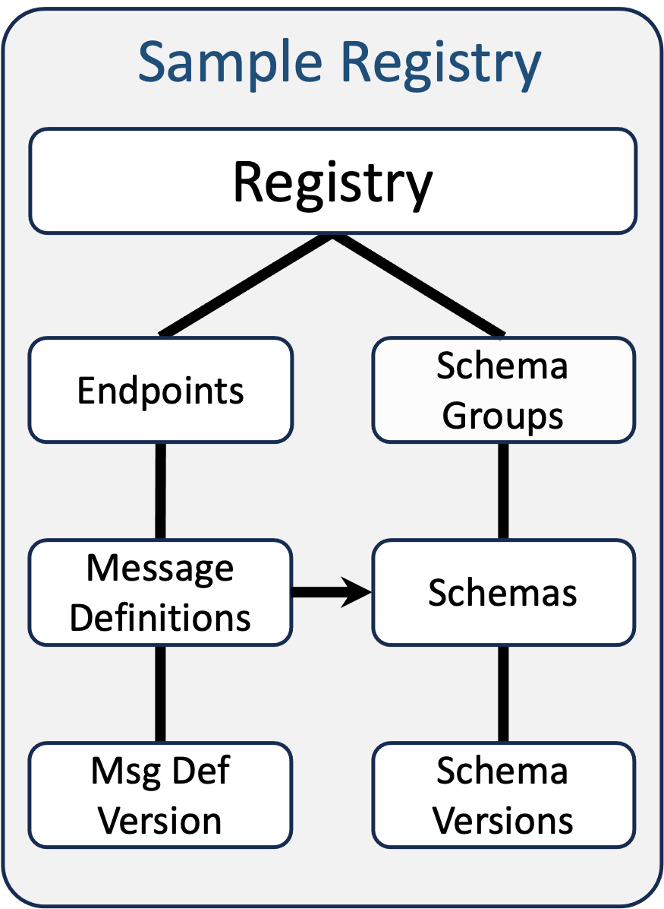
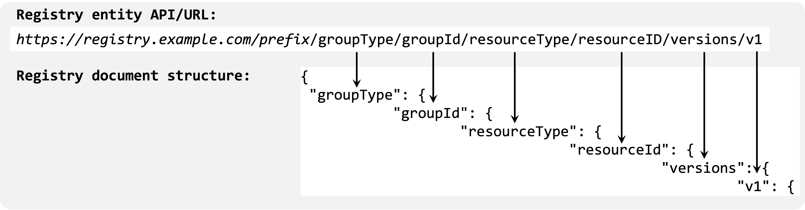

# xRegistry Service - Version 1.0-rc2

## Abstract

This specification defines an extensible model for managing metadata
registries. The metadata artifacts can be for any purpose, such as schemas
or message definitions, and the registry provides both "document" and "API"
projections of the data to enable their discovery for end-user consumption
or automation and tooling usage.

## Table of Contents

- [Overview](#overview)
- [Notations and Terminology](#notations-and-terminology)
  - [Notational Conventions](#notational-conventions)
  - [Terminology](#terminology)
- [Registry Design](#registry-design)
  - [Registry Entity](#design-registry-entity)
  - [Group Entity](#design-group-entity)
  - [Resource and Version Entities](#design-resource-and-version-entities)
  - [Registry Views](#design-registry-views)
  - [No-Code Servers](#design-no-code-servers)
  - [Protocol Bindings](#design-protocol-bindings)
  - [JSON Serialization](#design-json-serialization)
- [Registry Model](#registry-model)
  - [Implementation Customizations](#implementation-customizations)
  - [Attributes and Extensions](#attributes-and-extensions)
  - [Registry Collections](#registry-collections)
  - [Registry Capabilities](#registry-capabilities)
  - [Group Entity](#group-entity)
  - [Resource Entity](#resource-entity)
    - [Creating or Updating Resources and
       Versions](#creating-or-updating-resources-and-versions)
  - [Version Entity](#version-entity)
- [Flags](#flags)
  - [Binary Flag](#binary-flag)
  - [Collections Flag](#collections-flag)
  - [Doc Flag](#doc-flag)
  - [Epoch Flag](#epoch-flag)
  - [Filter Flag](#filter-flag)
  - [IgnoreDefaultVersionID Flag](#ignoredefaultversionid-flag)
  - [IgnoreDefaultVersionSticky Flag](#ignoredefaultversionsticky-flag)
  - [IgnoreEpoch Flag](#ignoreepoch-flag)
  - [IgnoreReadOnly Flag](#ignorereadonly-flag)
  - [Inline Flag](#inline-flag)
  - [SetDefaultVersionID Flag](#setdefaultversionid-flag)
  - [Sort Flag](#sort-flag)
  - [SpecVersion Flag](#specversion-flag)
- [Error Processing](#error-processing)
- [Events](#events)

## Overview

A Registry consists of two main types of entities: Resources and Groups of
such Resources.

Resources typically represent the main data of interest in the Registry, while
Groups, as the name implies, allows related Resources to be arranged together
under a single collection. Resources can, optionally, also be versioned if
needed.

This specification defines a set of common metadata that can appear on both
Resources and Groups, and allows for domain-specific extensions to be added.
Additionally, this specification defines a common interaction pattern to
manage, view and discover the entities in the Registry with the goal of
providing an interoperable framework that will enable common tooling and
automation.

See the [Registry Design](#registry-design) section for a more complete
discussion of the xRegistry concepts.

The following 3 diagrams show (from left to right):<br>
1 - The core concepts of the Registry in its most abstract form.<br>
2 - A Registry concept model with multiple types of Groups/Resources.<br>
3 - A concrete sample usage of Registry that includes the use of an attribute
    on "Message Definition" that is a reference to a "Schema" document - all
    within the same Registry instance.

&nbsp;&nbsp;&nbsp;&nbsp;&nbsp;&nbsp;

The Registry, while typically exposed as a "service", is also intended to
support exporting its data as a "document" that can then be used independently
from the service. For example, the document can be checked into a code
repository or used as input for tooling. To enable a seamless transition
between the "document" and "API" views of the data, the specification ensures
a consistent mapping between the two:


This specification is meant to be a framework from which additional
specifications can be defined that expose model-specific Resources and
metadata. See the [Endpoint](../endpoint/spec.md) and
[Schema](../schema/spec.md) extension specifications as examples.

Additionally, this specification defines the core model and semantics of
xRegistry, while secondary specifications (such as
[xRegistry HTTP Binding](./http.md)) will discuss how to expose them in a
protocol-specific way.

## Notations and Terminology

### Notational Conventions

The key words "MUST", "MUST NOT", "REQUIRED", "SHALL", "SHALL NOT", "SHOULD",
"SHOULD NOT", "RECOMMENDED", "MAY", and "OPTIONAL" in this document are to be
interpreted as described in [RFC 2119](https://tools.ietf.org/html/rfc2119).

For clarity, OPTIONAL attributes (specification-defined and extensions) are
OPTIONAL for clients to use, but the servers' responsibility will vary.
Server-unknown extension attributes MUST be silently stored in the backing
datastore. Specification-defined, and server-known extension attributes, MUST
generate an error if the corresponding feature is not supported or enabled.
However, as with all attributes, if accepting the attribute results in a
bad state (such as exceeding a size limit, or results in a security issue),
then the server MAY choose to reject the request.

In the pseudo JSON format snippets `?` means the preceding item is OPTIONAL,
`*` means the preceding item MAY appear zero or more times, and `+` means the
preceding item MUST appear at least once. The presence of the `#` character
means the remaining portion of the line is a comment. Whitespace characters in
the JSON snippets are used for readability and are not normative.

Use of `<...>` the notation indicates a substitutable value where that is
meant to be replaced with a runtime situational-specific value as defined by
the word/phrase in the angled brackets. For example `<NAME>` would be expected
to be replaced by the "name" of the item being discussed.

Use of `<GROUP>` and `<RESOURCE>` are meant to represent the singular name of a
Group and Resource type used, while `<GROUPS>` and `<RESOURCES>` are the plural
name of those respective types. Use of `<SINGULAR>` represents the singular
name of the entity referenced. For example, for a "schema document" Resource
type where its plural name is defined as `schemas` and its singular name is
defined as `schema`, the `<SINGULAR>` value would be `schema`.

Additionally, the following acronyms are defined:
- `<GID>` is the `<SINGULAR>id` of a Group.
- `<RID>` is the `<SINGULAR>id` of a Resource.
- `<VID>` is the `versionid` of a Version of a Resource.

The following are used to denote an instance of one of the associated data
types (see [Attributes and Extensions](#attributes-and-extensions) for more
information about each data type):
- `<ARRAY>`
- `<BOOLEAN>`
- `<DECIMAL>`
- `<INTEGER>`
- `<MAP>`
- `<OBJECT>`
- `<STRING>`
- `<TIMESTAMP>`
- `<UINTEGER>`
- `<URI>`
- `<URIABSOLUTE>`
- `<URIRELATIVE>`
- `<URITEMPLATE>`
- `<URL>`
- `<URLABSOLUTE>`
- `<URLRELATIVE>`
- `<XID>`
- `<XIDTYPE>`
- `<TYPE>` - one of the allowable data type names (MUST be in lower case)
  listed in [Attributes and Extensions](#attributes-and-extensions)
- `<VALUE>` - an instance of one of the above data types

### Terminology

This specification defines the following terms:

#### Group

Groups, as the name implies, allow related Resources to be arranged together
under a single collection - the Group. The reason for the grouping is not
defined by this specification, so the owners of the Registry MAY choose to
define (or enforce) any pattern they wish. In this sense, a Group is similar
to a "directory" on a filesystem.

An additional common use for Groups is for access control. Managing access
control on individual Resources, while possible, might be cumbersome, so
moving it up to the Group could be a more manageable, and user-friendly,
implementation choice.

#### Registry

A server-side implementation of this specification. Typically, the
implementation would include model-specific Groups, Resources and extension
attributes.

There is also a "Registry" entity which acts as the root of an xRegistry
instance, under which all Groups will reside. The Registry entity itself has
metadata associated with it.

#### Resource

Resources, typically, represent the main data of interest for the Registry. In
the filesystem analogy, these would be the "files". Each Resource MUST exist
under a single Group and, similar to Groups, have a set of Registry metadata.
However, unlike a Group, which only has Registry metadata, each Resource MAY
also have a secondary domain-specific "document" associated with it. For
example, a "schema" Resource might have a "schema document" as its "document".
This specification places no restriction on the type of content stored in the
Resource's document. Additionally, Resources (unlike Groups) MAY be versioned.

#### Version

A Version is an instance of a Resource that represents a particular state of
the Resource. Each Version of a Resource has its own set of xRegistry metadata
and possibly a domain-specific document associated with it. Each Resource MUST
have at least one Version associated with it.

Clients MAY interact with specific Versions or with the Resource itself, which
is equivalent to interacting with the Resource's "default" Version. While in
many cases the "default" Version will be the "newest" Version, this
specification allows for the "default" Version to be explicitly chosen and
unaffected as other Versions are added or removed.

If versioning is not important for the use case in which the Resource is used,
the default Version can be evolved without creating new ones.

This specification places no requirements on the lifecycle of Versions.
Implementations, or users of the Registry, determine when new Versions are
created, as opposed to updating existing Versions, and how many Versions are
allowed per Resource type.

## Registry Design

As discussed in the [Overview](#overview) section, an xRegistry consists of
two main entities related to the data being managed: Groups and Resources.
However, there are other concepts that make up the overall design and this
section will cover them all in more detail.

Each entity type defined within the Registry will have both a plural and
singular "type name" associated with it. For example, a Schema Resource
might have `schemas` as its "plural" type name and `schema` as its "singular"
type name. This enables the appropriate name to be used based on the context
in which it appears. In the Schema Resource example, `schemas` would be used
when a collection of Schemas is referenced, such as in URLs (e.g.
`.../schemas/myschema`), while `schema` would be used when a single Schema
is referenced (e.g. as part of its ID name: `schemaid`).

### Design: Registry Entity

An xRegistry instance, or a "Registry", can be thought of as a single rooted
tree of entities as shown in the "xRegistry Core Spec" diagram in the
[Overview](#overview) section. At the root is the Registry entity itself.
This entity is also meant to serve a few other key purposes:

  - Expose high-level metadata about the Registry itself, such as its creation
    and modified timestamps, name, link to additional documentation, etc.
  - The set of [capabilities](#registry-capabilities) (features) that are
    supported. For example, does this Registry support filtering of query
    results?
  - The domain-specific ["model"](./model.md#registry-model) that defines the
    types of entities being managed by the Registry. For example, the model
    might define a Group called `schemagroups` that has `schemas` as the
    Resources within those Groups.

### Design: Group Entity

Below the Registry, Groups serve as logical collections of related Resources.
Each Group exposes the same high-level metadata as the Registry and supports
user-defined extensions attributes. In practice, Group often act as lightweight
"directories" for Resources, but they can also encapsulate rich,
domain-specific data via custom extensions (see [Endpoint](../endpoint/spec.md)
as an example).

### Design: Resource and Version Entities

A Resource entity in the Registry holds one or more Versions of metadata, and
optionally a domain-specific document. If a Resource holds multiple Versions,
those can be organized with
[compatibility policies](#compatibility-attribute) and[
lineage](#ancestor-attribute). Each Resource
always has a default Version corresponding to one of the available Versions
that is indirectly accessed when interacting with the Resource. All held
Versions can be accessed directly through the Versions collection.

#### Document Resources vs Metadata-Only Resources

Each Version of a Resource MAY be defined to have a "domain-specific" document
associated with it. These documents MAY be stored within the Version as an
attribute, or MAY be stored external to the Version and a URL to its location
will be stored within the Version instead. This model design choice is
specified via the
[`hasdocument` aspect](./model.md#groupsstringresourcesstringhasdocument)
of the Resource's model definition.

Typically, the domain-specific document will be used when a pre-existing
document definition already exists and an xRegistry is used as the
mechanism to expose those documents in a consistent and interoperable way.
For example, the [Schema Registry](../schema/spec.md) only has a few
xRegistry Resource extension attributes defined because most of the data of
interest will be in the Schema documents associated with the Resources.

See [Resource Metadata vs Resource
Document](#resource-metadata-vs-resource-document) for more information.

### Design: Registry Views

This specification is designed such that clients can choose how they want the
data from a server to be returned. There are three main "views" that clients
can choose from:

- Single Document View

  In this view, clients retrieving all (or part) of the Registry hierarchy
  as a single document. In this case, nested (or child) entities MAY be
  "inlined" into the retrieved document such that the need for secondary
  interactions with the server is reduced.

  This is often used for cases where the documents are stored in some
  document storage system (e.g. Github), or as input into local tooling that
  expects all of the relevant data to be stored locally on disk.

  See the [HTTP `GET /export` operation](./http.md#get-export) for one way to
  generate this view.

- API View

  In this view, it is assumed that the client is interested in an interactive
  discovery and retrieval of the Registry data. Most often clients will "walk"
  the hierarchy of entities by following the references (links) provided
  within the serialization of each entity to find the data of interest. As
  such, in this view, each entity is, by default, retrieved from the server
  via independent "read" operations.

  The [Registry HTTP `GET` APIs](./http.md#registry-http-apis), without the
  use of the [`?doc` flag/query parameter](./http.md#doc-flag), is an example
  of how to generate this view.

- Multiple Document View

  This is a variant of the "API view". In situations where the Registry data
  is stored as independent files either on disk, or in some other object
  storage system, the client might want to avoid the duplication of
  information that, by default, a server might generate. For example, they
  might not want the default Version's metadata to be visible in the owning
  Resource's serialization.

  Documents generated in this view are often stored locally such that they can
  be managed independently for use in tooling or stored in some source-code
  control system (e.g. Github) to minimize the number of conflicting edits
  between users in a very fluid environment.

  The [Registry HTTP `GET` APIs](./http.md#registry-http-apis), with the use
  of the [`?doc` flag/query parameter](./http.md#doc-flag), is an example of
  how to generate this view.

This specification provides the mechanisms to allow for users to choose the
best "view" for their needs. Regardless of the view, the design allows for
the retrieved data to then be used as input into an xRegistry server.

### Design: No-Code Servers

One of the goals of xRegistry is to be as broadly supported as possible.
Requiring all xRegistry endpoints to support the full range of APIs of a
particular protocol binding might not be feasible in all cases. In particular,
there might be cases where someone wishes to host a read-only xRegistry server
and therefore the write operations or advanced features (such as inlining or
filtering) might not be available. In those cases, simple file serving HTTP
servers, such as blob stores, ought to be sufficient, and requiring support
for flag/query parameters and other advanced features (that could require
custom code) might not always be possible.

To support these simple (no-code) scenarios, this specification (and the
protocol binding specifications) are written such that the support for the
various operations and features (e.g. [flags](#flags)) will typically be
marked as OPTIONAL (often with a "SHOULD" RFC2119 key word). However, it is
STRONGLY RECOMMENDED that full servers support as many of the operations
and features/flags when possible to enable a better user experience, and
increase interoperability.

See the [HTTP Binding](./http.md#no-code-servers) for more details on how
this might manifest itself for HTTP servers.

### Design: Protocol Bindings

This specification defines the core model and semantics of an xRegistry
server implementation without regard to what protocol might be used to
interact with it.

In general, all interactions with a server SHOULD be OPTIONAL and dictated by
the specific needs of the environment in which it is being used. However, it is
STRONGLY RECOMMENDED that servers support the "read" operations, and in
particular the ability to retrieve the "capabilities" and "model" such that
tooling can then dynamically discover the remaining data within the Registry.

Implementations MAY choose to incorporate authentication and/or authorization
mechanisms as needed, but those are out of scope for this specification.

### Design: JSON Serialization

This specification defines the JSON serialization of the xRegistry entities.
Alternative serialization formats MAY be defined.

For easy reference, the JSON serialization of a Registry adheres to this form:

```yaml
{
  "specversion": "<STRING>",
  "registryid": "<STRING>",
  "self": "<URL>",
  "shortself": "<URL>", ?
  "xid": "<XID>",
  "epoch": <UINTEGER>,
  "name": "<STRING>", ?
  "description": "<STRING>", ?
  "documentation": "<URL>", ?
  "icon": "<URL>", ?
  "labels": { "<STRING>": "<STRING>" * }, ?
  "createdat": "<TIMESTAMP>",
  "modifiedat": "<TIMESTAMP>",

  "capabilities": {                     # Supported capabilities/options
    "apis": [ "/capabilities", "/export", "/model" ],
    "flags": [                          # Query parameters
      "binary", "collections",? "doc",? "epoch",? "filter",?
      "ignoredefaultversionid",? "ignoredefaultversionsticky",? "ignoreepoch",?
      "ignorereadonly",?  "inline", ? "setdefaultversionid",?  "sort",?
      "specversion",?
      "<STRING>" *
    ],
    "mutable": [                        # What is mutable in the Registry
      "capabilities",? "entities",? "model",? "<STRING>"*
    ], ?
    "pagination": <BOOLEAN>, ?
    "shortself": <BOOLEAN>, ?
    "specversions": [ "1.0-rc2", "<STRING>"* ], ?
    "stickyversions": <BOOLEAN>, ?
    "versionmodes": [ "manual", "createdat",? "modifiedat",? "semver",
      "<STRING>"* ],

    "<STRING>": ... *                   # Extension capabilities
  }, ?

  "model": {                            # Full model. Only if inlined
    "description": "<STRING>", ?
    "documentation": "<URL>", ?
    "labels": { "<STRING>": "<STRING>" * }, ?
    "attributes": {                     # Registry-level attributes/extensions
      "<STRING>": {                     # Attribute name (case-sensitive)
        "name": "<STRING>",             # Same as attribute's key
        "type": "<TYPE>",               # string, decimal, array, object, ...
        "target": "<XIDTYPE>", ?        # If "type" is "xid" or "url"
        "namecharset": "<STRING>", ?    # If "type" is "object"
        "description": "<STRING>", ?
        "enum": [ <VALUE> * ], ?        # Array of scalars of type `"type"`
        "strict": <BOOLEAN>, ?          # Just "enum" values? Default=true
        "readonly": <BOOLEAN>, ?        # From client's POV. Default=false
        "immutable": <BOOLEAN>, ?       # Once set, can't change. Default=false
        "required": <BOOLEAN>, ?        # Default=false
        "default": <VALUE>, ?           # Scalar attribute's default value

        "attributes": { ... }, ?        # If "type" above is object
        "item": {                       # If "type" above is map,array
          "type": "<TYPE>", ?           # map value type, or array type
          "target": "<XIDTYPE>", ?      # If this item "type" is xid/url
          "namecharset": "<STRING>", ?  # If this item "type" is object
          "attributes": { ... }, ?      # If this item "type" is object
          "item": { ... } ?             # If this item "type" is map,array
        } ?

        "ifvalues": {                   # If "type" is scalar
          "<STRING>": {                 # Possible attribute value
            "siblingattributes": { ... } # See "attributes" above
          } *
        } ?
      } *
    },

    "groups": {
      "<STRING>": {                       # Key=plural name, e.g. "endpoints"
        "plural": "<STRING>",             # e.g. "endpoints"
        "singular": "<STRING>",           # e.g. "endpoint"
        "description": "<STRING>", ?
        "documentation": "<URL>", ?
        "icon": "<URL>", ?
        "labels": { "<STRING>": "<STRING>" * }, ?
        "modelversion": "<STRING>", ?     # Version of the group model
        "compatiblewith": "<URI>", ?      # Statement of compatibility
        "attributes": { ... }, ?          # Group-level attributes/extensions
        "ximportresources": [ "<XIDTYPE>", * ], ?   # Include these Resources

        "resources": {
          "<STRING>": {                   # Key=plural name, e.g. "messages"
            "plural": "<STRING>",         # e.g. "messages"
            "singular": "<STRING>",       # e.g. "message"
            "description": "<STRING>", ?
            "documentation": "<URL>", ?
            "icon": "<URL>", ?
            "labels": { "<STRING>": "<STRING>" * }, ?
            "modelversion": "<STRING>", ? # Version of the resource model
            "compatiblewith": "<URI>", ?  # Statement of compatibility
            "maxversions": <UINTEGER>, ?  # Num Vers(>=0). Default=0(unlimited)
            "setversionid": <BOOLEAN>, ?  # vid settable? Default=true
            "setdefaultversionsticky": <BOOLEAN>, ? # sticky settable? Default=true
            "hasdocument": <BOOLEAN>, ?   # Has separate document. Default=true
            "versionmode": "<STRING>", ?  # 'ancestor' processing algorithm
            "singleversionroot": <BOOLEAN>, ? # Default=false"
            "typemap": <MAP>, ?               # contenttype mappings
            "attributes": { ... }, ?          # Version attributes/extensions
            "resourceattributes": { ... }, ?  # Resource attributes/extensions
            "metaattributes": { ... } ?       # Meta attributes/extensions
          } *
        } ?
      } *
    } ?
  }, ?
  "modelsource": { ... }, ?                        # Input model, if inlined

  # Repeat for each Group type
  "<GROUPS>url": "<URL>",                          # e.g. "endpointsurl"
  "<GROUPS>count": <UINTEGER>,                     # e.g. "endpointscount"
  "<GROUPS>": {                                    # Only if inlined
    "<KEY>": {                                     # Key=the Group id
      "<GROUP>id": "<STRING>",                     # The Group ID
      "self": "<URL>",
      "shortself": "<URL>", ?
      "xid": "<XID>",
      "epoch": <UINTEGER>,
      "name": "<STRING>", ?
      "description": "<STRING>", ?
      "documentation": "<URL>", ?
      "icon": "<URL>", ?
      "labels": { "<STRING>": "<STRING>" * }, ?
      "createdat": "<TIMESTAMP>",
      "modifiedat": "<TIMESTAMP>",
      "deprecated": {
        "effective": "<TIMESTAMP>", ?
        "removal": "<TIMESTAMP>", ?
        "alternative": "<URL>", ?
        "documentation": "<URL>"?
      }, ?

      # Repeat for each Resource type in the Group
      "<RESOURCES>url": "<URL>",                   # e.g. "messagesurl"
      "<RESOURCES>count": <UINTEGER>,              # e.g. "messagescount"
      "<RESOURCES>": {                             # Only if inlined
        "<KEY>": {                                 # The Resource id
          "<RESOURCE>id": "<STRING>",
          "versionid": "<STRING>",                 # Default Version's ID
          "self": "<URL>",                         # Resource URL, not Version
          "shortself": "<URL>", ?
          "xid": "<XID>",                          # Resource XID, not Version
          "epoch": <UINTEGER>,                     # Start of default Ver attrs
          "name": "<STRING>", ?
          "isdefault": true,
          "description": "<STRING>", ?
          "documentation": "<URL>", ?
          "icon": "<URL>", ?
          "labels": { "<STRING>": "<STRING>" * }, ?
          "createdat": "<TIMESTAMP>",
          "modifiedat": "<TIMESTAMP>",
          "ancestor": "<STRING>",                  # Ancestor's versionid
          "contenttype": "<STRING>, ?              # Add default Ver extensions

          "<RESOURCE>url": "<URL>", ?              # If not local
          "<RESOURCE>": ... Resource document ..., ? # If local & inlined & JSON
          "<RESOURCE>base64": "<STRING>", ?        # If local & inlined & ~JSON
                                                   # End of default Ver attrs
          # Resource-level helper attributes
          "metaurl": "<URL>",
          "meta": {                                # Only if inlined
            "<RESOURCE>id": "<STRING>",
            "self": "<URL>",                       # URL to "meta" object
            "shortself": "<URL>", ?
            "xid": "<XID>",
            "xref": "<XID>", ?                     # xid of linked Resource
            "epoch": <UINTEGER>,                   # Resource's epoch
            "createdat": "<TIMESTAMP>",            # Resource's
            "modifiedat": "<TIMESTAMP>",           # Resource's
            "readonly": <BOOLEAN>,                 # Default=false
            "compatibility": "<STRING>",           # Default=none
            "compatibilityauthority": "<STRING>", ?  # Default=external
            "deprecated": {
              "effective": "<TIMESTAMP>", ?
              "removal": "<TIMESTAMP>", ?
              "alternative": "<URL>", ?
              "documentation": "<URL>"?
            }, ?

            "defaultversionid": "<STRING>",
            "defaultversionurl": "<URL>",
            "defaultversionsticky": <BOOLEAN>      # Default=false
          }, ?
          "versionsurl": "<URL>",
          "versionscount": <UINTEGER>,
          "versions": {                            # Only if inlined
            "<KEY>": {                             # The Version's versionid
              "<RESOURCE>id": "<STRING>",          # The Resource id
              "versionid": "<STRING>",             # The Version id
              "self": "<URL>",                     # Version URL
              "shortself": "<URL>", ?
              "xid": "<XID>",
              "epoch": <UINTEGER>,                 # Version's epoch
              "name": "<STRING>", ?
              "isdefault": <BOOLEAN>,              # Default=false
              "description": "<STRING>", ?
              "documentation": "<URL>", ?
              "icon": "<URL>", ?
              "labels": { "<STRING>": "<STRING>" * }, ?
              "createdat": "<TIMESTAMP>",
              "modifiedat": "<TIMESTAMP>",
              "ancestor": "<STRING>",              # Ancestor's versionid
              "contenttype": "<STRING>", ?

              "<RESOURCE>url": "<URL>", ?                # If not local
              "<RESOURCE>": ... Resource document ..., ? # If inlined & JSON
              "<RESOURCE>base64": "<STRING>" ?           # If inlined & ~JSON
            } *
          } ?
        } *
      } ?
    } *
  } ?
}
```

---

In summary, xRegistry is designed to be a tree of entities that, along with
its extensible metadata model, can support categorizing, managing and exposing
a wide range of metadata allowing for a dynamically discoverable, yet
interoperable, programmatic access via what might otherwise be a
domain-specific set of APIs.

The following sections will define the technical details of those xRegistry
entities.

### Implicit Creation of Parent Entities

To reduce the number of interactions needed when creating an entity, all
nonexisting parent entities specified as part of `<PATH>` to the entity MUST
be implicitly created. Each of those entities MUST be created with the
`<SINGULAR>id` specified in the `<PATH>`. Note: if any of those entities have
REQUIRED attributes, then they cannot be implicitly created, and would need to
be created directly. This also means that the creation of the original entity
would fail and generate an error
([required_attribute_missing](#required_attribute_missing)) for the
appropriate parent entity.

## Registry Model

This section defines the common Registry metadata model, its semantics and
protocol-independent processing rules. It is an explicit goal for this
specification that metadata can be created and managed in files in a file
system, for instance in a Git repository, and also managed in a Registry
service that implements an xRegistry protocol binding, such as the
[HTTP Binding](./http.md).

For instance, during development of a module, the metadata about the events
raised by the modules will best be managed in a file that resides alongside the
module's source code. When the module is ready to be deployed into a concrete
system, the metadata about the events will be registered in a Registry service
along with the endpoints where those events can be subscribed to or consumed
from, and which allows discovery of the endpoints and all related metadata by
other systems at runtime.

Therefore, the hierarchical structure of the
[Registry Model](./model.md#registry-model) is defined in such a way that it
can be represented in one or more files, including but not limited to JSON, or
via the entity graph of an API.

In the remainder of this specification, in particular when defining the
attributes of the Registry entities, the terms "document view" or "API view"
will be used to indicate whether the serialization of the entity in a response
is meant for use as a stand-alone document or as part of an API message
exchange. The most notable differences are that in document view:

- References (e.g. URLs) between entities within responses will use relative
  references rather than absolute ones. This is an indication to tooling that
  the entity in question can be found locally and does not need an additional
  API call to retrieve it.
- Duplicate data will be removed. In particular, Resources will not include
  attributes from the "default" Version as part of their serialization. This is
  done with the assumption the inlined/nested `versions` collection will most
  likely include the "default" Version, so duplicating that information is
  redundant.

Most of these differences are to make it easier for tooling to use the
"stand-alone" document view of the Registry. For a complete list of the
differences in "document view" see the [Doc Flag](#doc-flag) flag.

Note that "document view" only refers to response messages when the
[Doc Flag](#doc-flag) is used. There is no "document view" concept for
requests. However, "document view" responses are designed such that they can
be used in request messages as they still convey the same information as an
"API view" response.

Unless otherwise stated in a protocol binding specification, if the processing
of a request fails (even during the generation of the response) then an error
MUST be generated and the entire request MUST be undone. See the
[Error Processing](#error-processing) section for more information.

### Implementation Customizations

This specification does not address many of the details that would need to
be added for a live instance of a service; as often times these aspects are
very specific to the environment in which the service is running. For example,
this specification does not address authentication or authorization levels of
users, nor how to securely protect the APIs, clients or servers, from attacks.
Implementations of this specification are expected to add these various
features as needed.

Additionally, implementations MAY choose to customize the data and behavior on
a per-user basis as needed. For example, the following non-exhaustive list of
customizations might be implemented:
- User-specific capabilities - e.g. admin users might see more features than
  a non-admin user.
- User-specific attribute aspects - e.g. admin users might be able to
  edit a `readonly` Resource. Note that in this case the Resource's `readonly`
  aspect will likely appear with a value of `true` even for an admin users.

The goal of these customizations is not to allow for implementations to
violate the specification, rather it is to allow for real-world requirements
to be met while maintaining the interoperability goals of the specification.

Implementations are encouraged to contact the xRegistry community if it is
unclear if certain customizations would violate the specification.

Implementations MAY (but are NOT REQUIRED) to validate cross-entity
constraints that might be violated due to changes in a referenced entity.
For example, [Endpoint's `envelope`](../endpoint/spec.md#envelope) attribute
mandates that all Messages in that Endpoint use that same `envelope` value.
One of those Messages might have a `basemessage` value that points to a
Message that breaks that rule. For a variety of reasons (e.g. authorization
constraints), server implementations might not be able to verify this
constraint. Likewise, the same situation might occur via the use of `xref`.
Clients need to be aware of these possibilities.

### Attributes and Extensions

#### Data Types

Unless otherwise noted, all attributes and extensions MUST be mutable and MUST
be one of the following data types:
- `any` - an attribute of this type is one whose type is not known in advance
   and MUST be one of the concrete types listed here.
- `array` - an ordered list of values that are all of the same data type - one
   of the types listed here.
   - Some serializations, such as JSON, allow for a `null` value to
     appear in an array (e.g. `[ null, 2, 3 ]` in an array of integers). In
     these cases, while it is valid for the serialization being used, it is
     not valid for xRegistry since `null` is not a valid `integer`. Meaning,
     the serialization of an array that is syntactically valid for the
     format being used, but not semantically valid per the
     [xRegistry model](./model.md#registry-model) definition, MUST NOT be
     accepted and MUST generate an error ([invalid_data](#invalid_data)).
- `boolean` - case-sensitive `true` or `false`.
- `decimal` - number (integer or floating point).
- `integer` - signed integer.
- `map` - set of key/value pairs, where the key MUST be of type string. The
   value MUST be of one of the types defined here.
  - Each key MUST:
    - Be a non-empty string consisting of only lowercase alphanumeric
      characters (`[a-z0-9]`), `:`, `-`, `_` or a `.`.
    - Be no longer than 63 characters.
    - Start with an alphanumeric character.
    - Be unique within the scope of this map.
- `object` - a nested entity made up of a set of attributes of these data
  types.
- `string` - sequence of Unicode characters.
- `timestamp` - an [RFC3339](https://tools.ietf.org/html/rfc3339) timestamp.
  Use of a `time-zone` notation is RECOMMENDED. All timestamps returned by
  a server MUST be normalized to UTC to allow for easy (and consistent)
  comparisons.
- `uinteger` - unsigned integer.
- `uri` - a URI as defined in [RFC 3986](https://tools.ietf.org/html/rfc3986).
   Note that it can be absolute or relative.
- `uriabsolute` - absolute URI as defined in [RFC 3986 Section
  4.3](https://tools.ietf.org/html/rfc3986#section-4.3).
- `urirelative` - relative URI as defined in [RFC 3986 Section
  4.2](https://tools.ietf.org/html/rfc3986#section-4.2).
- `uritemplate` - URI Template as defined in
  [RFC 6570 Section 3.2.1](https://tools.ietf.org/html/rfc6570#section-3.2.1).
- `url` - an absolute URL (`urlabsolute`) or relative URL (`urlrelative`).
- `urlabsolute` - an absolute URI as defined in [RFC 3986 Section
  4.3](https://datatracker.ietf.org/doc/html/rfc3986#section-4.3) with the
  added "URL" constraints mentioned in [RFC 3986 Section
  1.1.3](https://datatracker.ietf.org/doc/html/rfc3986#section-1.1.3).
- `urlrelative` - a relative URI as defined in [RFC 3986 Section
  4.2](https://datatracker.ietf.org/doc/html/rfc3986#section-4.2) with the
  added "URL" constraints mentioned in [RFC 3986 Section
  1.1.3](https://datatracker.ietf.org/doc/html/rfc3986#section-1.1.3).
- `xid` - MUST be a URL (xid) reference to another entity defined within
  the Registry. The actual entity attribute value MAY reference a non-existing
  entity (i.e. be a dangling pointer), but the syntax MUST reference a
  defined/valid type in the Registry. This type of attribute is used in
  place of `url` so that the Registry can do "type checking" to ensure the
  value references the correct type of Registry entity. See the definition of
  the [`target` model attribute](./model.md#attributesstringtarget) for more
  information. Its value MUST start with a `/`.
- `xidtype` - MUST be a URL reference to an
   [xRegistry model](./model.md#registry-model) type. The reference MUST point
   to one of: the Registry itself (`/`), a Group type (`/<GROUPS>`), a
   Resource type (`/<GROUPS>/<RESOURCES>`) or Version type for a Resource
   (`/<GROUPS>/<RESOURCES>/versions`). Its value MUST reference a
   defined/valid type in the Registry. It MUST use the plural names of the
   referenced types, if it is a Group, Resource or Version.

The 6 variants of URI/URL are provided to allow for strict type adherence
when needed. However, for attributes that are simply "pointers" that might
in practice be any of those 6 types, it is RECOMMENDED that `uri` be used.

Attributes that are defined to be relative URIs or URLs MUST state what they
are relative to and any constraints on their values, if any. How, or where,
this is specified is out of scope of this specification.

The "scalar" data types are:
  - `boolean`
  - `decimal`
  - `integer`
  - `string`,
  - `timestamp`
  - `uinteger`
  - `uri`
  - `uriabsolute`
  - `urirelative`
  - `uritemplate`,
  - `url`
  - `urlabsolute`
  - `urlrelative`
  - `xid`
  - `xidtype`

Note that `any` is not a "scalar" type as its runtime value could be a complex
type such as `object`.

#### Attributes

All attributes (specification-defined and extensions) MUST adhere to the
following rules:
- Their names MUST be between 1 and 63 characters in length.
- Their names MUST only contain lowercase alphanumeric characters or an
  underscore (`[a-z0-9_]`) and MUST NOT start with a digit (`[0-9]`).
- For string attributes, an empty string is a valid value and MUST NOT be
  treated the same as an attribute with no value (or absence of the attribute).
- For scalar attributes, the string serialization of the attribute name and
  its value MUST NOT exceed 4096 bytes. This is to ensure that it can appear
  in an HTTP header without exceeding implementation limits (see
  [RFC6265/Limits](https://datatracker.ietf.org/doc/html/rfc6265#section-6.1)).
  In cases where larger amounts of data are needed, it is RECOMMENDED that
  an attribute (of type URL) be defined that references a separate
  document. For example, `documentation` can be considered such an attribute
  for `description`.
- If an attribute's type is not fully defined (i.e. it is defined as an `any`
  type) but a concrete type is needed to successfully process it, then the
  server SHOULD default it to type `string`. For example, if an extension is
  defined as a map whose values are of type `any`, but it appears in an HTTP
  header with a value of `5` (and it is not clear if this would be an integer
  or a string), if the server needs to convert this to a concrete data type,
  then `string` is the default choice.
- There might be cases when it is not possible to know whether a field name is
  part of an object (in which case it is an "attribute name"), or is part of
  a map (in which case it is a "key name"). This decision would impact
  verification of the field since key names allow for a superset of the
  characters allowed for attribute names. This will only happen when the
  `any` type has been used higher-up in the model. As a result, any portion of
  the entity that appears under the scope of an `any` typed attribute or
  map-value is NOT REQUIRED to be validated except to ensure that the syntax
  is valid per the rules of the serialization format used.
- Attribute instances that have no value (and have no default value defined)
  are semantically equivalent to having a value of `null` or not being present
  at all, and for the sake of brevity, SHOULD NOT be serialized as part of its
  owning entity in server responses. Likewise, specifying them with a value of
  `null` in client requests SHOULD be reserved for cases where the client
  needs to indicate a request to delete that attribute value rather than to
  leave the attribute untouched (absent in the request), such as when `PATCH`
  is used in the [HTTP Binding Protocol](./http.md).

#### Extensions

Implementations of this specification MAY define additional (extension)
attributes. However, they MUST adhere to the following rules:

- All extension attributes that appear in the serialization of an entity MUST
  conform to the model definition of the Registry. This means that they MUST
  satisfy at least one of the following:
  - Be explicitly defined (by name) as part of the model.
  - Be permitted due to the presence of the `*` (undefined) extension attribute
    name at that level in the model.
  - Be permitted due to the presence of an `any` type for one of its parent
    attribute definitions.
- They MUST NOT conflict with the name of an attribute defined by this
  specification, including the `<RESOURCE>*` and `<COLLECTION>*` attributes
  that are implicitly defined. Note that if a Resource type has the
  [`hasdocument` aspect](./model.md#groupsstringresourcesstringhasdocument)
  set the `false` then this rule does not apply for
  the `<RESOURCE>*` attributes as those attributes are not implicitly defined
  for that Resource type.
- It is RECOMMENDED that extension attributes on different entities do not
  use the same name unless they have the exact same semantic meaning.
- It is STRONGLY RECOMMENDED that they be named in such a way as to avoid
  potential conflicts with future xRegistry specification-defined attributes.
  For example, use of a model (or domain) specific prefix could be used to help
  avoid possible future conflicts.

#### Common Attributes

The following attributes are used by one or more entities defined by this
specification. They are defined here once rather than repeating them throughout
the specification.

For easy reference, the JSON serialization of these attributes adheres to this
form:
- `"<SINGULAR>id": "<STRING>"`
- `"self": "<URL>"`
- `"shortself": "<URL>"`
- `"xid": "<XID>"`
- `"epoch": <UINTEGER>`
- `"name": "<STRING>"`
- `"description": "<STRING>"`
- `"documentation": "<URL>"`
- `"icon": "<URL>"`
- `"labels": { "<STRING>": "<STRING>" * }`
- `"createdat": "<TIMESTAMP>"`
- `"modifiedat": "<TIMESTAMP>"`
- `"deprecated": "<OBJECT>"`

The definition of each attribute is defined below:

##### `<SINGULAR>id` (`id`) Attribute

- Type: String
- Description: An immutable unique identifier of the owning entity.
  The actual name of this attribute will vary based on the entity it
  identifies. For example, a `schema` Resource would use an attribute name
  of `schemaid`. This attribute MUST be named `registryid` for the Registry
  itself, and MUST be named `versionid` for all Version entities.

- Constraints:
  - REQUIRED.
  - MUST be immutable.
  - MUST be a non-empty string consisting of [RFC3986 `unreserved`
    characters](https://datatracker.ietf.org/doc/html/rfc3986#section-2.3)
    (ALPHA / DIGIT / `-` / `.` / `_` / `~`), `:` or `@`, MUST start with
    ALPHA, DIGIT or `_` and MUST be between 1 and 128 characters in length.
  - MUST be unique (case-insensitively) within the scope of the entity's
    parent.
  - This attribute MUST be treated as case-sensitive for look-up purposes.
    For example, an HTTP request URL to an entity with the wrong case for its
    `<SINGULAR>id` MUST be treated as "not found".
  - In cases where an entity's `<SINGULAR>id` is specified outside of the
    serialization of the entity (e.g. part of a request  URL, or a map key),
    its presence within the serialization of the entity is OPTIONAL. However,
    if present, it MUST be the same as any other specification of the
    `<SINGULAR>id` outside of the entity, and it MUST be the same as the
    entity's existing `<SINGULAR>id` if one exists, otherwise an error
    ([mismatched_id](#mismatched_id)) MUST be generated.

- Examples:
  - `a183e0a9-abf8-4763-99bc-e6b7fcc9544b`
  - `myEntity`
  - `myEntity.example.com`

While `<SINGULAR>id` can be something like a UUID, when possible, it is
RECOMMENDED that it be human friendly as these values will often appear in
user-facing situations such as URLs or as command-line parameters.
Additionally, In cases where [`name`](#name-attribute) is absent, the
`<SINGULAR>id` might be used as the display name.

Note, since `<SINGULAR>id` is immutable, in order to change its value, a new
entity would need to be created with the new `<SINGULAR>id` that is a deep-copy
of the existing entity. Then the existing entity would be deleted.

##### `self` Attribute

- Type: URL
- Description: A server-generated unique URL referencing the current entity.
  - Each entity in the Registry MUST have a unique `self` URL value that
    locates the entity in the Registry hierarchy and from where the entity can
    be retrieved.
  - When specified as an absolute URL, it MUST be based on the URL of the
    Registry root appended with the hierarchy path of the Registry
    entities/collections leading to the entity (its `xid` value).

    In the case of pointing to an entity that has a `<SINGULAR>id` attribute,
    the URL MUST be a combination of the URL used to retrieve its parent
    appended with its `<SINGULAR>id` value.

- API View Constraints:
  - REQUIRED.
  - MUST be immutable.
  - MUST be a non-empty absolute URL based on the URL of the Registry.
  - When serializing Resources or Versions, if the
    [`hasdocument` aspect](./model.md#groupsstringresourcesstringhasdocument)
    is set to `true`, then (based on the protocol binding being used) this
    attribute might need to include some indicator that the xRegistry metadata
    is to be returned rather than the domain-specific document. See the
    [Registry Entity](./http.md#registry-entity) section for how this might
    manifest itself for HTTP.
  - MUST be a read-only attribute.

- Document View Constraints:
  - REQUIRED.
  - MUST be immutable.
  - MUST be a relative URL of the form `#JSON-POINTER` where the `JSON-POINTER`
    locates this entity within the current document. See [Doc Flag](#doc-flag)
    for more information.
  - This URL MUST NOT include any indicator signifying the entity's xRegistry
    metadata rather than its domain-specific document (e.g. `$details` in the
    [HTTP binding](./http.md) case).

- Examples:
  - `https://example.com/registry/schemagroups/g1/schemas/s1$details` (API View)
  - `https://example.com/registry/endpoints/ep1` (API View)
  - `#/endpoints/ep1` (Document View)

##### `shortself` Attribute

- Type: URL
- Description: A server-generated unique absolute URL for an entity. This
  attribute MUST be an alternative URL for the owning entity's `self`
  attribute. The intention is that `shortself` SHOULD be shorter in length
  than `self` such that it MAY be used when the length of the URL referencing
  the owning entity is important. For example, in cases where the size of a
  message referencing this entity needs to be as small as possible.

  This specification makes no statement as to how this URL is constructed,
  to which host/path it references, or whether a request to this URL
  will directly perform the desired operation or whether it returns a
  redirect to the full `self` URL requiring the client to resend the request.

  If an entity is deleted and then a new entity is created that results in
  the same `self` URL, this specification does not mandate that the same
  `shorturl` be generated, but it MAY do so.

  This attribute MUST only appear in the serialization if the `shortself`
  capability is enabled. However, if this capability is enabled, then disabled,
  and then re-enabled, the `shortself` values MUST retain their original
  values. In this sense, implementations might create a `shortself` that is
  known for the lifetime of the entity and the capability controls whether
  the attribute is serialized or not.

- Constraints:
  - REQUIRED if the `shortself` capability is enabled.
  - MUST be immutable for the lifetime of the entity.
  - MUST NOT appear in responses if the `shortself` capability is disabled.
  - MUST be unique across all entities in the Registry.
  - MUST be a non-empty absolute URL referencing the same entity as the `self`
    URL, either directly or indirectly via a protocol-specific redirect.
  - MUST be a read-only attribute.

- Examples:
  - `https://tinyurl.com/xreg123` redirects to
    `https://example.com/endpoints/e1`

##### `xid` Attribute

- Type: XID
- Description: An immutable server-generated unique identifier of the entity.
  Unlike `<SINGULAR>id`, which is unique within the scope of its parent, `xid`
  MUST be unique across the entire Registry, and as such is defined to be a
  relative URL from the root of the Registry. This value MUST be the same as
  the `<PATH>` portion of its `self` URL, after the Registry's base URL,
  without any protocol-specific xRegistry suffix (e.g. `$details` in the HTTP
  case). Unlike some other relative URIs, `xid` values MUST NOT be shortened
  based on the incoming request's URL; `xid`s are always relative to the root
  path of the Registry.

  This attribute is provided as a convenience for users who need a reference
  to the entity without running the risk of incorrectly extracting it from
  the `self` URL, which might be ambiguous at times. The `xid` value is also
  meant to be used as an `xref` value (see [Cross Referencing
  Resources](#cross-referencing-resources), or as the value for attributes of
  type `xid` (see [`target` model
  attribute](./model.md#attributesstringtarget)).

- Constraints:
  - REQUIRED.
  - MUST be immutable.
  - MUST be a non-empty relative URL to the current entity.
  - MUST be of the form:
    `/[<GROUPS>/<GID>[/<RESOURCES>/<RID>[/meta | /versions/<VID>]]]`.
  - MUST start with the `/` character.
  - MUST be a read-only attribute.

- Examples:
  - `/endpoints/ep1`

##### `epoch` Attribute

- Type: Unsigned Integer
- Description: A numeric value used to determine whether an entity has been
  modified. Each time the associated entity is updated, this value MUST be
  set to a new value that is greater than the current one. This attribute
  MUST be updated for every update operation, even if no attributes were
  explicitly updated, such as a "patch" type of operation when no attributes
  are specified. This then acts like a `touch` type of operation.

  During a single write operation, whether this value is incremented for
  each modified attribute of the entity, or updated just once for the entire
  operation is an implementation choice.

  During a create operation, if this attribute is present in the request, then
  it MUST be silently ignored by the server.

  During an update, or delete, operation, if this attribute is present in the
  request, then an error
  ([mismatched_epoch](#mismatched_epoch)) MUST be generated if the
  request includes a non-null value that differs from the existing value.
  This allows for the detection of concurrent, but conflicting, updates to the
  same entity to be detected. A value of `null` MUST be treated the same as a
  request with no `epoch` attribute at all, in which case a check MUST NOT
  be performed.

  If an entity has a nested xRegistry collection, its `epoch` value MUST
  be updated each time an entity in that collection is added or removed.
  However, its `epoch` value MUST NOT be updated solely due to modifications of
  an existing entity in the collection.

  Note that Resource entities have an `epoch` value that is serialized
  as part of its [`meta` entity](#meta-entity). Its value is only incremented
  when the `meta` attributes are updated, or when a Version is added, or
  removed, from that Resource.

- Constraints:
  - REQUIRED.
  - MUST be a read-only attribute.
  - MUST be an unsigned integer equal to or greater than zero.
  - MUST increase in value each time the entity is updated.

- Examples:
  - `0`, `1`, `2`, `3`

##### `name` Attribute

- Type: String
- Description: A human-readable name of the entity. This is often used
  as the "display name" for an entity rather than the `<SINGULAR>id` especially
  when the `<SINGULAR>id` might be something that isn't human friendly, like a
  UUID. In cases where `name` is absent, the `<SINGULAR>id` value SHOULD be
  displayed in its place.

  This specification places no uniqueness constraints on this attribute.
  This means that two sibling entities MAY have the same value. Therefore,
  this value MUST NOT be used for unique identification purposes, the
  `<SINGULAR>id` MUST be used instead.

  Note that implementations MAY choose to enforce additional constraints on
  this value. For example, they could mandate that `<SINGULAR>id` and `name` be
  the same value. Or, it could mandate that `name` be unique within the scope
  of a parent entity. How any such requirement is shared with all parties is
  out of scope of this specification.

- Constraints:
  - OPTIONAL.
  - If present, MUST be non-empty.

- Examples:
  - `My Cool Endpoint`

##### `description` Attribute

- Type: String
- Description: A human-readable summary of the purpose of the entity.

- Constraints:
  - OPTIONAL.

- Examples:
  - `A queue of the sensor-generated messages`

##### `documentation` Attribute

- Type: URL
- Description: A URL to additional information about this entity.
  This specification does not place any constraints on the data returned from
  a query to this URL.

- Constraints:
  - OPTIONAL.
  - If present, MUST be a non-empty URL.
  - MUST support retrieving the information via a query to this URL.

- Examples:
  - `https://example.com/docs/myQueue`

##### `icon` Attribute

- Type: URL
- Description: A URL to a graphical icon for the owning entity.

- Constraints:
  - OPTIONAL.
  - If present, MUST be a non-empty URL.
  - MUST be retrievable via a query to this URL.
  - STRONGLY RECOMMENDED that the icon be in SVG or PNG format and square.

- Examples:
  - `https://example.com/myRegistry.svg`

##### `labels` Attribute

- Type: Map of name/value string pairs
- Description: A mechanism in which additional metadata about the entity can
  be stored without changing the model definition of the entity.

- Constraints:
  - OPTIONAL.
  - If present, MUST be a map of zero or more name/value string pairs. See
    [Attributes and Extensions](#attributes-and-extensions) for more
    information.
  - Keys MUST be non-empty strings.
  - Values MAY be empty strings.

- Examples:
  - `"labels": { "owner": "John", "verified": "" }`

##### `createdat` Attribute

- Type: Timestamp
- Description: The date/time of when the entity was created.

- Constraints:
  - REQUIRED.
  - MUST be a [RFC3339](https://tools.ietf.org/html/rfc3339) timestamp.
  - This specification places no restrictions on the value of this attribute,
    nor on its value relative to its `modifiedat` value or the current
    date/time. Implementations MAY choose to restrict its values if necessary.
  - If present in a write operation request, the value MUST override any
    existing value, however a value of `null` MUST use the current date/time
    as the new value.
  - When absent in an update request, any existing value MUST remain
    unchanged, or if not already set, set to the current date/time.
  - During the processing of a single request, all entities that have their
    `createdat` or `modifiedat` attributes set to the current date/time MUST
    use the same value in all cases.

- Examples:
  - `2030-12-19T06:00:00Z`

##### `modifiedat` Attribute

- Type: Timestamp
- Description: The date/time of when the entity was last updated.

- Constraints:
  - REQUIRED.
  - MUST be a [RFC3339](https://tools.ietf.org/html/rfc3339) timestamp
    representing the time when the entity was last updated.
  - This specification places no restrictions on the value of this attribute,
    nor on its value relative to its `createdat` value or the current
    date/time. Implementations MAY choose to restrict its values if necessary.
  - Any update operation (even one that does not change any attribute, such as
    a "path" type of operation with no attributes provided), MUST update this
    attribute. This then acts like a `touch` type of operation.
  - Updates to an existing entity in an xRegistry collection MUST NOT cause an
    update to its parent entity's `modifiedat` value. However, adding or
    removing an entity from a nested xRegistry collection MUST update the
    `modifiedat` value of the parent entity.
  - If present in a write operation request, the following applies:
    - If the request value is `null` or the same as the existing value, then
      the current date/time MUST be used as its new value.
    - If the request value is different than the existing value, then the
      request value MUST be used as its new value.
  - When absent in a write operation request, it MUST be set to the current
    date/time.
  - During the processing of a single request, all entities that have their
    `createdat` or `modifiedat` attributes set to the current date/time MUST
    use the same value in all cases.

- Examples:
  - `2030-12-19T06:00:00Z`

##### `deprecated` Attribute

- Type: Object containing the following properties:
  - `effective`<br>
    An OPTIONAL property indicating the time when the entity entered, or will
    enter, a deprecated state. The date MAY be in the past or future. If this
    property is not present the entity is already in a deprecated state.
    If present, this MUST be an [RFC3339][rfc3339] timestamp.

  - `removal`<br>
    An OPTIONAL property indicating the time when the entity MAY be removed.
    The entity MUST NOT be removed before this time. If this property is not
    present, the client cannot make any assumptions as to when the entity
    might be removed. Note: as with most properties, this property is mutable.
    If present, this MUST be an [RFC3339][rfc3339] timestamp and MUST NOT be
    sooner than the `effective` time if present.

  - `alternative`<br>
    An OPTIONAL property specifying the URL to an alternative entity the
    client can consider as a replacement for this entity. There is no
    guarantee that the referenced entity is an exact replacement, rather the
    client is expected to investigate the entity to determine if it is
    appropriate.

  - `docs`<br>
    An OPTIONAL property specifying the URL to additional information about
    the deprecation of the entity. This specification does not mandate any
    particular format or information, however some possibilities include:
    reasons for the deprecation or additional information about likely
    alternative entities. The URL MUST support retrieval of the information
    via a query.

  Note that an implementation is not mandated to use this attribute in
  advance of removing an entity, but is it RECOMMENDED that they do so.

  This attribute can appear on Groups and Resources, however, this
  specification makes no statement as to the relationship, or validity, of the
  values of each with respect to how they might impact each other.

- Constraints:
  - OPTIONAL
- Examples:
  - `"deprecated": {}`
  - ```
    "deprecated": {
      "removal": "2030-12-19T00:00:00Z",
      "alternative": "https://example.com/entities-v2/myentity"
    }
    ```

### Registry Collections

Registry collections (`<GROUPS>`, `<RESOURCES>` and `versions`) that are
defined by the [Registry Model](./model.md#registry-model) MUST be serialized
according to the rules defined in this section.

The serialization of a collection is done as 3 attributes and they MUST adhere
to their respective forms as follows:

```yaml
"<COLLECTION>url": "<URL>",
"<COLLECTION>count": <UINTEGER>,
"<COLLECTION>": {
  # Map of entities in the collection, key is the "<SINGULAR>id" of the entity
}
```

Where:
- The term `<COLLECTION>` MUST be the plural name of the collection
  (e.g. `endpoints`, `versions`).
- The `<COLLECTION>url` attribute MUST be a URL that can be used to retrieve
  the `<COLLECTION>` map via a protocol-specific query mechanism. This URL
  MAY including any necessary [filtering](#filter-flag) and MUST be a
  read-only attribute that MUST be silently ignored by a server during a write
  operation. This attribute MUST be an absolute URL except in document view
  and the collection is inlined, in which case it MUST be a relative URL.
- The `<COLLECTION>count` attribute MUST contain the number of entities in the
  `<COLLECTION>` map (after any necessary [filtering](#filter-flag)) and MUST
  be a read-only attribute that MUST be silently ignored by a server during
  a write operation.
- The `<COLLECTION>` attribute is a map and MUST contain the entities of the
  collection (after any necessary [filtering](#filter-flag)), and MUST use
  the `<SINGULAR>id` of each entity as its map key.
- The key of each entity in the collection map MUST be unique within the scope
  of the collection.
- The specifics of whether each `<COLLECTION>*` attribute is REQUIRED or
  OPTIONAL will be based on whether the document- or API-view is used. See
  the next section for more information.

When the `<COLLECTION>` attribute is expected to be present in the
serialization, but the number of entities in the collection is zero, it MUST
still be included as an empty map (e.g. `{}`).

The set of entities that are part of the `<COLLECTION>` attribute is a
point-in-time view of the Registry. There is no guarantee that a future query
to the `<COLLECTION>url` will return the exact same collection since the
contents of the Registry might have changed. This specification makes no
statement as to whether a subsequent query that is missing previously returned
entities is an indication of those entities being deleted or not.

**Examples:**

Sample `schemagroups` collection attributes, with `schemagroups` inlined.

```yaml
"schemagroupsurl": "http://registry.example.com/schemagroups",
"schemagroupscount": 9
"schemagroups": {
  "Contoso.ERP": {...},
  "Fabrikam.InkJetPrinter": {...},
  "Fabrikam.Lumen": {...},
  "Fabrikam.RoboVac": {...},
  "Fabrikam.SmartOven": {...},
  "Fabrikam.Watchkam": {...},
  "WaterBoiler": {...},
  "WindGenerator": {...}
},
```

The requirements on the presence of the 3 `<COLLECTION>*` attributes varies
between document and API views, and is defined below:

#### Collections in Document View

In document view:
- `<COLLECTION>url` and `<COLLECTION>count` are OPTIONAL.
- `<COLLECTION>` is conditional in responses based on the values in the
  [Inline Flag](#inline-flag). If a collection is part of the flag's value then
  `<COLLECTION>` MUST be present in the response even if it is empty
  (e.g. `{}`). If the collection is not part of the flag value then
  `<COLLECTION>` MUST NOT be included in the response.

#### Collections in API View

In API view:
- `<COLLECTION>url` is REQUIRED for responses even if there are no entities
  in the collection.
- `<COLLECTION>count` is STRONGLY RECOMMENDED for responses even if
  there are no entities in the collection. This requirement is not mandated
  to allow for cases where calculating the exact count is too costly.
- `<COLLECTION>url` and `<COLLECTION>count` are OPTIONAL in requests and MUST
  be silently ignored by the server if present.
- `<COLLECTION>` is conditional in responses based on the values in the
  [Inline Flag](#inline-flag). If a collection is part of the flag's value then
  `<COLLECTION>` MUST be present in the response even if it is empty
  (e.g. `{}`). If the collection is not part of the flag value then
  `<COLLECTION>` MUST NOT be included in the response.
- `<COLLECTION>` is OPTIONAL for requests. See [Updating Nested Registry
  Collections](#updating-nested-registry-collections) for more details.

#### Updating Nested Registry Collections

When updating an entity that can contain xRegistry collections, the request
MAY contain the 3 collection attributes. The `<COLLECTION>url` and
`<COLLECTION>count` attributes MUST be silently ignored by the server.

If the `<COLLECTION>` attribute is present, the server MUST process each entity
in the collection map as a request to create or update that entity according to
the semantics of the operation method used. An entry in the map that isn't a
valid entity (e.g. is `null`) MUST generate an error
([bad_request](#bad_request)).

For example, in the case of HTTP:

```yaml
PUT https://example.com/endpoints/ep1

{
  "endpointid": "ep1",
  "name": "A cool endpoint",

  "messages": {
    "mymsg1": { ... },
    "mymsg2:" { ... }
  }
}
```

will not only create/update an `endpoint` Group with an `endpointid` of `ep1`
but will also create/update its `message` Resources (`mymsg1` and `mymsg2`).

Any error while processing a nested collection entity MUST result in the entire
request being rejected.

An absent `<COLLECTION>` attribute, or empty map, MUST be interpreted as a
request to not modify the collection at all.

If a client wishes to delete an entity from the collection, or replace the
entire collection, the client MUST use a "delete" type of operations on the
collection. This means that delete operations on these entities would need
to be handled in dedicated operations, separate from update operations.

In cases where a Resource update operation includes attributes meant to be
applied to the "default" Version of a Resource, and the incoming inlined
`versions` collections includes that "default" Version, the Resource's default
Version attributes MUST be silently ignored. This is to avoid any possible
conflicting data between the two sets of data for that Version. In other
words, the Version attributes in the incoming `versions` collection wins.

To better understand this scenario, consider the following HTTP request to
update a Message where the `defaultversionid` is `v1`:

```yaml
PUT http://example.com/endpoints/ep1/messages/msg1

{
  "messageid": "msg1",
  "versionid": "v1",
  "name": "Blob Created"

  "versions": {
    "v1": {
      "messageid": "msg1",
      "versionid": "v1",
      "name": "Blob Created Message Definition"
    }
  }
}
```

If the `versions` collection were not present with the `v1` entity then the
top-level attributes would be used to update the default Version (`v1` in this
case). However, because it is present, the request to update `v1` becomes
ambiguous because it is not clear if the server is meant to use the top-level
attributes or if it is to use the attributes under the `v1` entity of the
`versions` collection. When both sets of attributes are the same, then it does
not matter. However, in this example, the `name` attributes have different
values. The paragraph above mandates that in these potentially ambiguous cases
the entity in the `versions` collection is to be used and the top-level
attributes are to be ignored. So, in this case the `name` of the default (`v1`)
Version will be `Blob Created Message Definition`.

### Registry Entity

The Registry entity represents the root of a Registry and is the main
entry-point for traversal and discovery.

The serialization of the Registry entity MUST adhere to this form:

```yaml
{
  "specversion": "<STRING>",
  "registryid": "<STRING>",
  "self": "<URL>",
  "shortself": "<URL>", ?
  "xid": "<XID>",
  "epoch": <UINTEGER>,
  "name": "<STRING>", ?
  "description": "<STRING>", ?
  "documentation": "<URL>", ?
  "icon": "<URL>", ?
  "labels": { "<STRING>": "<STRING>" * }, ?
  "createdat": "<TIMESTAMP>",
  "modifiedat": "<TIMESTAMP>",

  "capabilities": { Registry capabilities }, ?   # Only if inlined
  "model": { Registry model }, ?                 # Only if inlined
  "modelsource": { Registry model }, ?           # Only if inlined

  # Repeat for each Group type
  "<GROUPS>url": "<URL>",                        # e.g. "endpointsurl"
  "<GROUPS>count": <UINTEGER>,                   # e.g. "endpointscount"
  "<GROUPS>": { Groups collection } ?            # Only if inlined
}
```

The Registry entity includes the following
[common attributes](#common-attributes):
- [`registryid`](#singularid-id-attribute) - REQUIRED in API and document
  views. OPTIONAL in requests.
- [`self`](#self-attribute) - REQUIRED in API and document views.
  OPTIONAL/ignored in requests.
- [`shortself`](#shortself-attribute) - OPTIONAL in API and document views,
  based on the `shortself` capability. OPTIONAL/ignored in requests.
- [`xid`](#xid-attribute) - REQUIRED in API and document views.
  OPTIONAL/ignored in requests.
- [`epoch`](#epoch-attribute) - REQUIRED in API and document views. OPTIONAL
  in requests.
- [`name`](#name-attribute) - OPTIONAL.
- [`description`](#description-attribute) - OPTIONAL.
- [`documentation`](#documentation-attribute) - OPTIONAL.
- [`icon`](#icon-attribute) - OPTIONAL.
- [`labels`](#labels-attribute) - OPTIONAL.
- [`createdat`](#createdat-attribute) - REQUIRED in API and document views.
  OPTIONAL in requests.
- [`modifiedat`](#modifiedat-attribute) - REQUIRED in API and document views.
  OPTIONAL in requests.

and the following Registry-level attributes:

#### `specversion` Attribute
- Type: String.
- Description: The version of this specification that the document
  adheres to.

- Constraints:
  - REQUIRED.
  - MUST be a read-only attribute.
  - MUST be non-empty.

- Examples:
  - `1.0`

#### `capabilities` Attribute
- Type: [Registry Capabilities](#registry-capabilities)
- Description: The set of capabilities (features) supported by the Registry.
  See [Registry Capabilities](#registry-capabilities) for more information.

  During a write operation:
  - The absence of this attribute MUST result in no changes to the capabilities
    of the Registry.
  - An explicit value of `null` for this attribute MUST result in resetting the
    capabilities to the server's default values.

- Constraints:
  - MUST NOT be included in API and document views unless requested via the
    [Inline Flag](#inline-flag).
  - MUST be included in API and document views if requested via the
    [Inline Flag](#inline-flag).
  - MAY be mutable based on the capabilities of the implementation.

#### `model` Attribute
- Type: [Registry Model](./model.md#registry-model).
- Description: A full description of the Groups, Resources and attributes
  (specification-defined and extensions) as defined by the current model
  associated with this Registry. See
  [Registry Model](./model.md#registry-model).

  This view of the model is useful for tooling that needs a complete view of
  what will be part of any message exchange with the server.

  Note that any ["include"](./model.md#includes-in-the-xregistry-model-data)
  directives that were included in the model definition MUST NOT be present in
  this view of the model.

- Constraints:
  - MUST NOT be included in API and document views unless requested via the
    [Inline Flag](#inline-flag).
  - MUST be included in API and document views if requested via the
    [Inline Flag](#inline-flag).
  - MUST be a read-only attribute.

#### `modelsource` Attribute
- Type: [Registry Model](./model.md#registry-model).
- Description: The "model" definition that was last used to define this
  Registry's model. Unlike `model`, which includes all aspects of the model,
  this is meant to represent just the customizations, or extensions, to the
  base [xRegistry model](./model.md#registry-model) as defined this
  specification. This allows for users to view (and edit) just the custom
  aspects of the model without the "noise" of the specification-defined parts.

  During the processing of an update operation, if this attribute is present,
  then the Registry's model MUST be updated prior to any entities being
  updated. A value of `null`, or an empty JSON object (`{}`), MUST result
  in all Groups, Resources and extension attributes being removed from the
  model.

  The serialization of this attribute MUST be semantically equivalent to
  what was used to create the model, but it is NOT REQUIRED to be syntactically
  equivalent. In other words, it might be "pretty-printed", but it MUST NOT
  include additional aspects even if those are defined/mandated by the
  specification or server implementation.

- Constraints:
  - MUST NOT be included in API and document views unless requested, via the
    [Inline Flag](#inline-flag).
  - MUST be included in API and document views if requested, via the
    [Inline Flag](#inline-flag).
  - MAY be mutable based on the capabilities of the implementation.

#### `<GROUPS>` Collections
- Type: Set of [Registry Collections](#registry-collections)
- Description: A list of Registry collections that contain the set of Groups
  supported by the Registry.

- Constraints:
  - REQUIRED.
  - It MUST include all nested Group Collection types in the
    Registry, even if some of the collections are empty.

### Registry Capabilities

In order to programmatically discover which capabilities are supported by an
implementation, servers SHOULD support exposing this information via a
"capabilities" map that lists each supported feature along with any related
configuration detail that will help in successful usage of that feature.

The "key" of the capabilities-map is the "name" of each feature, and the
"value" is a feature-specific set of configuration values, with the most basic
being a `<BOOLEAN>` value of `true` to indicate support for the feature.

The JSON serialization of capabilities map MUST be of the form:

```
{
  "apis": [ "<STRING>" * ], ?
  "flags": [ "<STRING>" * ], ?
  "mutable": [ "<STRING>" * ], ?
  "pagination": <BOOLEAN>, ?
  "shortself": <BOOLEAN>, ?
  "specversions": [ "<STRING>" ], ?
  "stickyversions": <BOOLEAN>, ?
  "versionmodes": [ "<STRING>" ], ?

  "<STRING>": ... capability configuration ... *   // Extension capabilities
}
```

Where:
- `"<STRING>"`, as a key, MUST be the name of the capability. This
  specification places no restriction on the `"<STRING>"` value, other than it
  MUST be unique across all capabilities and not be an empty string. It is
  RECOMMENDED that extensions use some domain-specific name to avoid possible
  conflicts with other extensions.

All capability values, including extensions, MUST be defined as one of the
following:
- Numeric (one of: integer, uinteger, decimal)
- Boolean
- String
- Array of one of the above

When serializing their supported capabilities, servers MUST include all
capabilities (including extensions) since the absence of a capability indicates
lack of support for that feature. However, absence, presence, or configuration
values of a feature in the map MAY vary based on the authorization level of
the client making the request.

The list of values for the arrays MUST be case-insensitive and MAY include
extension values.

For clarity, servers MUST include all supported capabilities in the
serialization, even if they are set to their default values or have empty
lists.

It is RECOMMENDED that protocols for this specification support retrieval of
the capabilities via the inlining of the Registry entity's `capabilities`
attribute well as a stand-alone map independent of the Registry entity (e.g.
[`GET /capabilities`](./http.md#get-capabilities) in the HTTP case). However,
as with all interactions with a server, security/access controls MAY be
needed.

The following defines the specification-defined capabilities:

#### `apis`
- Name: `apis`
- Type: Array of strings
- Description: The list of APIs (beyond the APIs for the data model) that
  are supported for read operations. This list is meant to allow for
  clients/tooling to easily discover which of the APIs, that are not related
  to the data model, are supported. Whether any of the APIs listed are
  supported for write operations can be discovered via the `mutable` capability.
- Note that it is allowable for the data that is available via more than one
  mechanism to not be available via all mechanisms. For example, it is
  possible for an implementation to support retrieving the model via a
  model-direct API (e.g. [`GET /model`](./http.md#get-model) in HTTP), but not
  support inlining the model via the [Inline Flag](#inline-flag).
- Defined values:
  - `/capabilities`
  - `/export`
  - `/model`
  - `/modelsource`
- Values MUST start with `/`.
- When not specified, the default value MUST be an empty list and no APIs
  beyond those for the data model are supported.
- Implementations MAY define their own values but they MUST NOT conflict with
  specification-defined APIs, Registry-level attributes or Group collection
  attribute names.
- It is STRONGLY RECOMMENDED that implementations support at least
  `/capabilities` and `/model`.

#### `flags`
- Name: `flags`
- Type: Array of strings
- Description: The list of supported [Flags](#flags). Absence in the map
  indicates no support for that flag.
- Defined values:
    `binary`, `collections`, `doc`, `epoch`, `filter`, `ignoredefaultversionid`,
    `ignoredefaultversionsticky`, `ignoreepoch`, `ignorereadonly`, `inline`,
    `setdefaultversionid`, `sort`, `specversion`.
- When not specified, the default value MUST be an empty list and no flags
  are supported.
- Examples:
  - `"flags": [ "filter", "inline" ]`    # Just these 2
  - `"flags": [ "*" ]                    # All supported flags, for update only

#### `mutable`
- Name `mutable`
- Type: Array of strings
- Description: The list of items in the Registry that can be edited by the
  client. Presence in this list does not guarantee that a client can edit
  all items of that type. For example, some Resources might still be read-only
  even if the client has the ability to edit Resources in general.
- Supported values:
  - `capabilities` (ability to configure the server's features)
  - `entities` (Groups, Resources, Versions and the Registry entity itself)
  - `modelsource` (the [Registry model](./model.md#registry-model))
- When not specified, the default value MUST be an empty list and the Registry
  is read-only.

#### `pagination`
- Name: `pagination`
- Type: Boolean
- Description: Indicates whether the server supports the use of a
  protocol-specific "pagination" feature when querying xRegistry collections.
  Each protocol binding specification will define which pagination
  specification(s) is to be supported, if any.
- When not specified, the default value MUST be `false`.

#### `shortself`
- Name: `shortself`
- Type: Boolean
- Description: Indicates whether the `shortself` attribute MUST be included
  in the server serialization of the entities within the Registry (value of
  `true`).
- When not specified, the default value MUST be `false`.

#### `specversions`
- Name: `specversions`
- Type: Array of strings
- Description: List of xRegistry specification versions supported by the
  `specversion` flag.
- Non-exhaustive list of supported values:
  - `1.0-rc2`
- When not specified, the default value MUST be the latest version of this
  specification supported by the server.

#### `stickyversions`
- Name: `stickyversions`
- Type: Boolean
- Description: Indicates whether the server supports clients choosing which
  Version of a Resource is to be the "default" Version. In other words, this
  capability indicates whether a request to set a Resource's
  `setdefaultversionsticky` aspect to `true` is allowed.
- When not specified, the default value MUST be `true`.

#### Updating the Capabilities of a Server

Implementations MAY support clients updating the capabilities of the server.
If so, they SHOULD support it via updates to the Registry entity's
`capabilities` attribute as well as updates via a stand-alone map independent
of the the Registry entity (e.g.
[`PUT /capabilities`](./http.md#put-capabilities) in the HTTP case).

The request to update the capabilities SHOULD include a serialization of the
capability map as described above. Whether it includes the full set of
supported capabilities or a subset will vary based on the protocol defined.
However, the following rules apply in both cases.

For any capability that is an array of strings, a value of `"*"` MAY be used to
indicate that the server MUST replace `"*"` with the full set of items that
are available. An error ([capability_error](#capability_error)) MUST be
generated if `"*"` appears along with any other value in the list. `"*"`
MUST NOT appear in the serialization in any server's response.

Regardless of the mechanism used to update the capabilities, the Registry's
`epoch` value MUST be incremented upon each update.

The enum of values allows for some special cases:
- String capabilities MAY include `*` as a wildcard character in a value
  to indicate zero or more unspecified characters MAY appear at that location
  in the value string.

A request to update a capability with a value that is compliant with the
format of the `capabilities` definition MAY still generate an error
([capability_error](#capability_error)) if the server determines it cannot
support the request. For example, due to authorization concerns or the value,
while syntactically valid, isn't allowed in certain situations.

When processing a request to update the capabilities, the semantic
changes MUST NOT take effect until after the processing of the current
request. Note that if the response includes the serialization of the
Registry's capabilities, then the changes MUST appear in that serialization.

The above requirement is driven by the idea that modifying the capabilities
of a server and modifying any entity data are typically two very distinct
actions, and will not normally happen at the same time. However, if the
situation does occur, a consistent (interoperable) processing order needs to
be defined.

#### Offered Capabilities

In order for an authorized client to update the capabilities of a server
it might need to first discover the list of available values for each
capability. This information is described via a map (similar to the capability
map itself) where each supported capability's name is the key of the
map, and the corresponding value provides details about the capability
(e.g. allowed values and pointer to its documentation).

The JSON serialization of the capabilities offering map MUST be of the form:

```yaml
{
  "<STRING>": {
    "type": "<TYPE>",
    "item": {
      "type": "<TYPE>"
    }, ?
    "enum": [ <VALUE>, * ], ?
    "min": <VALUE>, ?
    "max": <VALUE>, ?
    "documentation": "<URL>" ?
  } *
}
```

Where:
- `<STRING>` MUST be the capability name.
- `<TYPE>` MUST be one of `boolean`, `string`, `integer`, `decimal`,
  `uinteger`, `array` as defined in [Attributes and
  Extensions](#attributes-and-extensions).
- When `"type"` is `array`, `"item.type"` MUST be one of `boolean`, `string`,
  `integer`, `decimal`, `uinteger`, otherwise `"item"` MUST be absent.
- `"enum"`, when specified, contains a list of zero or more `<VALUE>`s whose
  type MUST match either `"type"` or `"item.type"` if `"item"` is `"array"`.
  This indicates the list of allowable values for this capability.
- `"min"` and `"max"`, when specified, MUST match the same type as either
  `"type"` or `"item.type"` if `"item"` is `"array"`. These indicate the
  minimum or maximum (inclusive) value range of this capability. When not
  specified, there is no stated lower (or upper) limit. These MUST only be
  used when "type" is a numeric type.
- `"documentation"` provides a URL with additional information about the
  capability.

Notice the syntax borrows much of the same structure from the
xRegistry [model definition](./model.md#registry-model) language.

To maximize discoverability for clients, even in cases where there is no
variability allowed for certain capabilities, they MUST still be listed in
a server's "offering" serialization.

For example, if `pagination` is not supported, but is a known feature, then a
server MUST still include:

```yaml
  "pagination": {
    "type": "boolean",
    "enum": [ false ]
  }
```

in the serialization of its capabilities offering map.

**Examples:**

```yaml
{
  "apis": {
    "type": "string",
    "enum": [ "/capabilities", "/export", "/model", /"modelsource" ]
  },
  "flags": {
    "type": "string",
    "enum": [ "binary", "collections", "doc", "epoch", "filter",
      "ignoredefaultversionid", "ignoredefaultversionsticky", "ignoreepoch",
      "ignorereadonly", "inline", "setdefaultversionid", "sort",
      "specversion" ]
  },
  "pagination": {
    "type": "boolean",
    "enum": [ false, true ]
  },
  "shortself": {
    "type": "boolean",
    "enum": [ false, true ]
  },
  "specversions": {
    "type": "string",
    "enum": [ "1.0-rc2" ]
  },
  "stickyversions": {
    "type": "boolean",
    "enum": [ true ]
  },
  "versionmodes": [ "manual" ]
}
```

### Group Entity

Groups represent entities that typically act as a collection mechanism for
related Resources. However, it is worth noting that Groups do not have to have
Resources associated with them. It is possible to have Groups be the main (or
only) entity of a Registry. Each Group type MAY have any number of Resource
types within it. This specification does not define how the Resources within a
Group type are related to each other.

The serialization of a Group entity MUST adhere to this form:

```yaml
{
  "<GROUP>id": "<STRING>",
  "self": "<URL>",
  "shortself": "<URL>", ?
  "xid": "<XID>",
  "epoch": <UINTEGER>,
  "name": "<STRING>", ?
  "description": "<STRING>", ?
  "documentation": "<URL>", ?
  "icon": "<URL>", ?
  "labels": { "<STRING>": "<STRING>" * }, ?
  "createdat": "<TIMESTAMP>",
  "modifiedat": "<TIMESTAMP>",
  "deprecated": {
    "effective": "<TIMESTAMP>", ?
    "removal": "<TIMESTAMP>", ?
    "alternative": "<URL>", ?
    "documentation": "<URL>"?
  }, ?

  # Repeat for each Resource type in the Group
  "<RESOURCES>url": "<URL>",                  # e.g. "messagesurl"
  "<RESOURCES>count": <UINTEGER>,             # e.g. "messagescount"
  "<RESOURCES>": { Resources collection } ?   # If inlined
}
```

Group extension attributes would also appear as additional top-level JSON
attributes.

Groups include the following
[common attributes](#common-attributes):
- [`<GROUP>id`](#singularid-id-attribute) - REQUIRED in API and document views.
  OPTIONAL in requests.
- [`self`](#self-attribute) - REQUIRED in API and document views.
  OPTIONAL/ignored in requests.
- [`shortself`](#shortself-attribute) - OPTIONAL in API and document views,
  based on the `shortself` capability. OPTIONAL/ignored in requests.
- [`xid`](#xid-attribute) - REQUIRED in API and document views.
  OPTIONAL/ignored in requests.
- [`epoch`](#epoch-attribute) - REQUIRED in API and document views. OPTIONAL in
  requests.
- [`name`](#name-attribute) - OPTIONAL.
- [`description`](#description-attribute) - OPTIONAL.
- [`documentation`](#documentation-attribute) - OPTIONAL.
- [`icon`](#icon-attribute) - OPTIONAL.
- [`labels`](#labels-attribute) - OPTIONAL.
- [`createdat`](#createdat-attribute) - REQUIRED in API and document views.
  OPTIONAL in requests.
- [`modifiedat`](#modifiedat-attribute) - REQUIRED in API and document views.
  OPTIONAL in requests.
- [`deprecated`](#deprecated-attribute) - OPTIONAL.

and the following Group-level attributes:

#### `<RESOURCES>` Collections
- Type: Set of [Registry Collections](#registry-collections).
- Description: A list of Registry collections that contain the set of
  Resources supported by the Group.

- Constraints:
  - REQUIRED.
  - It MUST include all nested Resource Collection types of the owning Group,
    even if some of the collections are empty.

### Resource Entity

Resources typically represent the main entity that the Registry is managing.
Each Resource is associated with a Group to aid in their discovery and to show
a relationship with Resources in that same Group. Resources appear within the
Group's `<RESOURCES>` collection.

Resources, like all entities in the Registry, can be modified but Resources
can also have a version history associated with them, allowing for users to
retrieve previous Versions of the Resource. In this respect, Resources have
a 2-layered definition. The first layer is the Resource entity itself,
and the second layer is its `versions` collection - the version history of
the Resource.

The Resource entity serves three purposes:

1 - It represents the collection of historical Versions of the data being
    managed. This is true even if the Resource type is defined to not use
    versioning, meaning the number of Versions allowed is just one. The
    Versions will appear as nested xRegistry collection  under the `versions`
    attribute.

2 - It acts as an alias for the "default" Version of the Resource. This means
    that any operation (read or write) that deals with attributes exposed via
    the Resource, but are inherited from the "default" Version, MUST
    act upon that Version's corresponding attribute. See
    [Default Version of a Resource](#default-version-of-a-resource),
    [Updating Nested Registry
    Collections](#updating-nested-registry-collections)
    and [Version Entity](#version-entity) for additional semantics that apply
    to write operations on Resources.

3 - It has a set of attributes for Resource-level metadata - data that is not
    specific to one Version of the Resource but instead applies to the
    Resource in general. Most of these attributes appear under a
    [`meta` entity](#meta-entity) so as to keep them separate
    from any default Version-level attributes that might appear. Note that
    these attributes do not appear on the Versions.

When a Resource is serialized as xRegistry metadata without the inherited
default Version attributes, such as when the [`doc` flag](#doc-flag) is used,
it MUST adhere to the following:

```yaml
{
  "<RESOURCE>id": "<STRING>",
  "self": "<URL>",                           # URL to Resource, not Version
  "shortself": "<URL>", ?
  "xid": "<XID>",                            # Relative URI to Resource

  "metaurl": "<URL>",                        # URL to 'meta' entity
  "meta": { meta entity }, ?                 # Only if inlined
  "versionsurl": "<URL>",                    # Absolute URL to versions
  "versionscount": <UINTEGER>,               # Size of versions collection
  "versions": { map of Versions }            # Only if inlined
}
```

When the default Version attributes do appear in the xRegistry metadata
serialization of the Resource (e.g. the [`doc` flag](#doc-flag) is not used)
it MUST adhere to the following:

```yaml
{
  "<RESOURCE>id": "<STRING>",
  "versionid": "<STRING>",                   # Default Version's ID
  "self": "<URL>",
  "shortself": "<URL>", ?
  "xid": "<XID>",
  "epoch": <UINTEGER>,                       # Start of default Ver attributes
  "name": "<STRING>", ?
  "isdefault": true,
  "description": "<STRING>", ?
  "documentation": "<URL>", ?
  "icon": "<URL>", ?
  "labels": { "<STRING>": "<STRING>" * }, ?
  "createdat": "<TIMESTAMP>",
  "modifiedat": "<TIMESTAMP>",
  "ancestor": "<STRING>",
  "contenttype": "<STRING>, ?

  "<RESOURCE>url": "<URL>", ?                # If not local
  "<RESOURCE>": ... Resource document ..., ? # If local & inlined & JSON
  "<RESOURCE>base64": "<STRING>", ?          # If local & inlined & ~JSON
                                             # End of default Ver attributes
  "metaurl": "<URL>",
  "meta": { meta entity }, ?                 # Only if inlined
  "versionsurl": "<URL>",
  "versionscount": <UINTEGER>,
  "versions": { map of Versions } ?          # Only if inlined
}
```

Note that the Version attributes that conflict with the Resource
attributes (e.g. `self`, `shortself`, `xid`) are not inherited by this
serialization. Their values are for the Resource and not the default
Version's.

#### Resource Attributes

The Resource entity includes the following
[common attributes](#common-attributes):
- [`<RESOURCE>id`](#singularid-id-attribute) - REQUIRED in API and document
  views. OPTIONAL in requests.
- [`self`](#self-attribute) - REQUIRED in API and document views.
  OPTIONAL/ignored in requests. References the Resource, not the default
  Version.
- [`shortself`](#shortself-attribute) - OPTIONAL in API and document views,
  based on the `shortself` capability. OPTIONAL/ignored in requests.
  References the Resource, not the default Version.
- [`xid`](#xid-attribute) - REQUIRED in API and document views.
  OPTIONAL/ignored in requests. References the Resource, not the default
  Version.

and the following Resource-level attributes:

##### `metaurl` Attribute
- Type: URL
- Description: a server-generated URL referencing the Resource's
  [`meta` entity](#meta-entity).

- API View Constraints:
  - REQUIRED.
  - MUST be immutable.
  - MUST be an absolute URL to the Resource's `meta` entity.
  - MUST be a read-only attribute.

- Document View Constraints:
  - REQUIRED.
  - If the `meta` entity is inlined in the document, then this attribute
    MUST be a relative URL of the form `#JSON-POINTER` where the `JSON-POINTER`
    locates the `meta` entity within the current document. See
    [Doc Flag](#doc-flag) for more information.
  - If the `meta` entity is not inlined in the document, then this attribute
    MUST be an absolute URL per the API view constraints listed above.

- Examples:
  - `https://example.com/endpoints/ep1/messages/msg1/meta` (API view)
  - `#/endpoints/ep1/messages/msg1/meta` (Document view)

##### `meta` Attribute
- Type: Object
- Description: an object that contains most of the Resource-level attributes.

  See [Meta Entity](#meta-entity) for more information.

  During a write operation, the absence of the `meta` attribute indicates that
  no changes are to be made to the `meta` entity.

- Constraints:
  - MUST NOT be included in API and document views unless requested via the
    [Inline Flag](#inline-flag).
  - MUST be included in API and document views if requested via the
    [Inline Flag](#inline-flag).

##### `versions` Collection
- Type: [Registry Collection](#registry-collections)
- Description: The set of xRegistry Collection attributes related to the
  Versions of the Resource.

  Note that Resources MUST have at least one Version.

- Constraints:
  - REQUIRED.

#### Resource Metadata vs Resource Document

Unlike Groups, which consist entirely of xRegistry managed metadata, Resource
Versions often have their own domain-specific data and document format that
needs to be kept distinct from the Version metadata. As discussed previously,
the model definition for Resources has a
[`hasdocument` aspect](./model.md#groupsstringresourcesstringhasdocument)
indicating whether a Resource type defines its own separate document or not.

This specification does not define any requirements for the contents of this
separate document, and it doesn't even need to be stored within the Registry.
The Version MAY choose to simply store a URL reference to the externally
managed document instead. When the document is stored within the Registry, it
can be managed as an opaque array of bytes and is available via the Version
[`<RESOURCE>`](#resource-attribute) or
[`<RESOURCE>base64`](#resourcebase64-attribute) attributes.

When a Resource is configured to possibly have a separate document, clients
can choose whether they want to interact with that document or with the
xRegistry metadata. In this sense, there are two "views" of the
Resource/Version that client can choose from.

Each xRegistry binding specification will define the mechanism by which clients
can indicate which view of the Resource/Version they want to interacting with.
For HTTP, see the
[Resource Metadata vs Resource Document](./http.md#resource-metadata-vs-resource-document)
section for more information, in particular about the use of the `$details`
URL suffix. Those specifications will also define any protocol-specific
serialization rules when the Resource domain-specific document view is used.

#### Creating or Updating Resources and Versions

The following rules apply to the processing of write operations for
Resources and Versions:

- If a Resource exists with only one Version then it MUST become the "default"
  Version.
- If more than one Version is created at the same time as the owning Resource
  is created, and the `meta.defaultversionid` is not set as part of the
  request, then use of the
  [SetDefaultVersionID Flag](#setdefaultversionid-flag) is RECOMMENDED. See
  [Default Version of a Resource](#default-version-of-a-resource) for more
  information.
- A create operation that results in a Resource not having any Versions MUST
  generate an error ([missing_versions](#missing_versions)) since
  a Resource with no Versions would immediately delete that Resource.
- When a write operation includes a `versionid` attribute, but it does not
  match the existing "default" Version's `versionid` (after any necessary
  processing of the `defaultversionid` attribute), then an error
  ([mismatched_id](./spec.md#mismatched_id)) MUST be generated. Also see
  [Default Version of a Resource](#default-version-of-a-resource).
- If the `versionid` attribute is present while creating a new Resource, but
  a `versions` collection is not included, rather than the server generating
  the `versionid` of the newly created "default" Version, the server MUST use
  the passed-in `versionid` attribute value. This is done as a convenience
  for clients to avoid them having to include a `versions` collection just
  to set the initial default Version's `versionid`. In other words, when
  the `versions` collection is absent on a create, but `versionid` is
  present, there is an implied `"versions": { "<VID>": {} }` (where `<VID>`
  is the `versionid` value).

When the xRegistry metadata is serialized as a JSON object, the processing
of the 3 Version-level `<RESOURCE>*` attributes MUST follow these rules:
  - At most, only one of the 3 attributes MAY be present in the request, and
    the presence of any one of them MUST delete the other 2 attributes.
  - If the entity already exists and has a document (not a `<RESOURCE>url`),
    then absence of all 3 attributes MUST leave all 3 unchanged.
  - An explicit value of `null` for any of the 3 attributes MUST delete all
    3 attributes (and any associated data).
  - When `<RESOURCE>` is present, the server MAY choose to modify non-semantic
    significant characters. For example, to remove (or add) whitespace. In
    other words, there is no requirement for the server to persist the
    document in the exact byte-for-byte format in which it was provided. If
    that is desired then `<RESOURCE>base64` MUST be used instead.
  - On a non-patch type of write operation, when `<RESOURCE>` is present,
    if no `contenttype` value is provided then the server MUST set it to same
    type as the incoming request, e.g. `application/json`, even if the entity
     previous had a `contenttype` value.
  - On a patch type of operation, when `<RESOURCE>` or `<RESOURCE>base64` is
    present, if no `contenttype` value is provided then the server MUST set it
    to the same type as the incoming request, e.g. `application/json`, only if
    the entity does not already have a value. Otherwise, the existing value
    remains unchanged.

#### Cross Referencing Resources

Typically, Resources exist within the scope of a single Group, however there
might be situations where a Resource needs to be related to multiple Groups.
In these cases, there are two options. First, a copy of the Resource could be
made into the second Group. The obvious downside to this is that there's no
relationship between the two Resources and any changes to one would need to
be done in the other - running the risk of them getting out of sync.

The second, and better, option is to create a cross-reference from one
(the "source" Resource) to the other ("target" Resource). This is done
by setting the `xref` attribute on the source Resource to be the `xid`
of the target Resource.

For example: a `schema` Resource instance defined as:

```yaml
{
  "schemaid": "mySchema",
  "meta": {
    "xref": "/schemagroups/group2/schemas/sharedSchema"
  }
}
```

means that `mySchema` references `sharedSchema`, which exists in `group2`.
When this source Resource (`mySchema`) is retrieved, all of the target
Resource's attributes (except its `<RESOURCE>id`) will appear as if they were
locally defined.

So, if the target Resource (`sharedSchema`) is defined as:

```yaml
{
  "resourceid": "sharedSchema",
  "versionid": "v1",
  "self": "http://example.com/schemagroups/group2/schemas/sharedSchema",
  "xid": "/schemagroups/group2/schemas/sharedSchema",
  "epoch": 2,
  "isdefault": true,
  "createdat": "2024-01-01-T12:00:00Z",
  "modifiedat": "2024-01-01-T12:01:00Z",
  "ancestor": "v1",

  "metaurl": "http://example.com/schemagroups/group2/schemas/sharedSchema/meta",
  "versionscount": 1,
  "versionsurl": "http://example.com/schemagroups/group2/schemas/sharedSchema/versions"
}
```

then the resulting serialization of the source Resource would be:

```yaml
{
  "resourceid": "mySchema",
  "versionid": "v1",
  "self": "http://example.com/schemagroups/group1/schemas/mySchema",
  "xid": "/schemagroups/group1/schemas/mySchema",
  "epoch": 2,
  "isdefault": true,
  "createdat": "2024-01-01-T12:00:00Z",
  "modifiedat": "2024-01-01-T12:01:00Z",
  "ancestor": "v1",

  "metaurl": "http://example.com/schemagroups/group1/schemas/mySchema/meta",
  "meta": {
    "resourceid": "mySchema",
    "self": "http://example.com/schemagroups/group1/schemas/mySchema/meta",
    "xid": "/schemagroups/group1/schemas/mySchema/meta",
    "xref": "/schemagroups/group2/schemas/sharedSchema",
    "createdat": "2024-01-01-T12:00:00Z",
    "modifiedat": "2024-01-01-T12:01:00Z",
    "readonly": false,
    "compatibility": "none"
  },
  "versionscount": 1,
  "versionsurl": "http://example.com/schemagroups/group1/schemas/mySchema/versions"
}
```

Note:
- Any attributes referencing the source MUST use the source's metadata. In
  this respect, users of this serialization would never know that this is a
  cross-referenced Resource except for the presence of the `xref` attribute.
  For example, its `<RESOURCE>id` MUST be the source's `id` and not the
  target's.
- The `xref` attribute MUST appear within the `meta` entity so a client
  can easily determine that this Resource is a cross-referenced Resource, and
  it provides a reference to the targeted Resource.
- The `xref` XID MUST be the `xid` of the target Resource.

From a consumption (read) perspective, aside from the presence of the `xref`
attribute, the Resource appears to be a normal Resource that exists within
`group1`. All of the specification-defined features (e.g. `inline`,
`filter` flags) MAY be used when retrieving the Resource.

However, from a write perspective it is quite different. In order to update
the target Resource's attributes (or nested entities), a write operation MUST
be done on the appropriate target Resource entity directly. Write
operations on the source MAY be done, however, the changes are limited to
converting it from a "cross-reference" Resource back into a "normal"
Resource. See the following for more information:

When converting a "normal" Resource into a cross-reference Resource (adding
an `xref` value), or creating/updating a Resource that is a cross-reference
Resource, the following MUST be adhered to:
- The request MUST include an `xref` attribute with a value that is
  the `xid` of the target Resource.
- The request MAY include the `<RESOURCE>id` attribute (of the source
  Resource) on the Resource or `meta` entity.
- The request MAY include `epoch` within `meta` (to do an `epoch` validation
  check) only if the Resource already exists.
- The request MUST NOT include nested collections or any other attributes
  (for the Resource or its "meta" entity). This includes default Version
  attributes within the Resource serialization.
- If the Resource already exists, as a "normal" Resource, then any Versions
  associated with the Resource MUST be deleted.

When converting a cross-reference Resource back into a "normal" Resource, the
following MUST be adhered to:
- The request MUST delete the `xref` attribute or set it to `null`.
- A default Version of the Resource MUST be created.
- Any attributes specified at the Resource level MUST be interpreted as a
  request to set the default Version attributes. Absence of any attributes
  MUST result in a default Version being created with all attributes set
  to their default values. Note that normal Resource update semantics apply.
- When not specified in the request, the Resource's `meta.createdat` value
  MUST be reset to the timestamp of when this source Resource was originally
  created.
- When not specified in the request, the Resource's `meta.modifiedat` value
  MUST be set to "now".
- The Resource's `meta.epoch` value MUST be greater than the original
  Resource's previously known value (if any) and greater than the target
  Resource's `meta.epoch` value. In pseudocode this is:
    `epoch = max(original_Epoch, target_Resource_Epoch) + 1`.
  This will ensure that the Resource's `epoch` value will never decrease as a
  result of this operation. Note that going from a "normal" Resource to a
  cross-reference Resource does not have this guarantee. If the target Resource
  no longer exists then `target_Resource_Epoch` MUST be treated as zero.
- Aside from the processing rules specified above, the Resource's attributes
  that might have existed prior to the Resource being converted from a
  "normal" Resource into a cross-reference Resource MUST NOT be resurrected
  with their old values.
- Any relationship with the target Resource MUST be deleted.

If the target Resource itself is a cross-reference Resource, then including
the target Resource's attributes MUST NOT be done when serializing the
source Resource. Recursive, or transitively, following of `xref` XIDs is not
done.

Both the source and target Resources MUST be of the same Resource model type,
simply having similar Resource type definitions is not sufficient. This
implies that the
[`ximportresources`]./model.md#groupsstringximportresources) feature to
reference a Resource type from another Group type definition MUST be
used.

An `xref` value that points to a non-existing Resource, either because
it was deleted, never existed or the current client does not have permission
to see it, is not an error and is not a condition that a server is REQUIRED to
detect. In these "dangling xref" situations, the serialization of the source
Resource will not include any target Resource attributes or nested collections.
Rather, it will only show the `<RESOURCE>id` and `xref` attributes.

### Meta Entity

The `meta` entity (within a Resource) contains most of the Resource-level
attributes that are global to the Resource, and not Version-specific. It is
an entity in its own right, meaning it supports the normal "read" and "write"
operation targeted directly to it.

Each Resource MUST have a Meta entity, and when the Resource is deleted then
the Meta entity MUST also be deleted. Delete requests directed to the Meta
entity MUST generate an error
([method_not_allowed](./spec.md#method_not_allowed)).

A non-patch type of write operation that includes a Resource, as a mechanism
to update its `meta` entity would need to include the Resource's default
Version attributes in the request. If not, the server will interpret it as a
request to delete the default Version attributes, which is probably not the
desired result. Instead, a write operation directly targeted to the `meta`
entity would be a better choice, or a "patch" type of operation where only
the `meta` entity is included in the request.

The serialization of the Meta entity MUST adhere to this form:

```yaml
{
  "<RESOURCE>id": "<STRING>",               # Resource ID
  "self": "<URL>",                          # URL to this "meta" entity
  "shortself": "<URL>", ?
  "xid": "<XID>",                           # Relative URI to this "meta"
  "xref": "<XID>", ?                        # Ptr to linked Resource
  "epoch": <UINTEGER>,                      # Resource's epoch
  "createdat": "<TIMESTAMP>",               # Resource's
  "modifiedat": "<TIMESTAMP>",              # Resource's
  "readonly": <BOOLEAN>,                    # Default=false
  "compatibility": "<STRING>",              # Default=none
  "compatibilityauthority": "<STRING>", ?   # Default=external
  "deprecated": { ... }, ?

  "defaultversionid": "<STRING>",
  "defaultversionurl": "<URL>",
  "defaultversionsticky": <BOOLEAN>
}
```

Meta extension attributes would also appear as additional top-level JSON
attributes.

The Meta entity includes the following
[common attributes](#common-attributes):
- [`<RESOURCE>id`](#singularid-id-attribute) - REQUIRED in API and document
   views. OPTIONAL in requests.
- [`self`](#self-attribute) - REQUIRED in API and document views.
  OPTIONAL/ignored in requests. References the Meta entity, not the Resource.
- [`shortself`](#shortself-attribute) - OPTIONAL in API and document views,
  based on the `shortself` capability. OPTIONAL/ignored in requests.
  References the Meta entity, not the Resource.
- [`xid`](#xid-attribute) - REQUIRED in API and document views.
  OPTIONAL/ignored in requests. References the Meta entity, not the Resource.
- [`epoch`](#epoch-attribute) - REQUIRED in API and document views. OPTIONAL
  in requests. This represents the `epoch` value of the entire Resource,
  not of one particular Version. And, it adheres to the normal `epoch`
  processing rules - its value is only updated when the Meta attributes
  are updated, but also when a Version is added/removed.
- [`createdat`](#createdat-attribute) - REQUIRED in API and document views.
  OPTIONAL in requests. Creation date of the Resource/Meta entity.
- [`modifiedat`](#modifiedat-attribute) - REQUIRED in API and document views.
  OPTIONAL in requests. Modification date of the Meta entity. This will change
  at the same time that `epoch` changes.
- [`deprecated`](#deprecated-attribute) - OPTIONAL. Deprecated state of the
  entire Resource.

and the following Meta-level attributes:

#### `xref` Attribute
- Type: XID
- Description: indicates that this Resource is a reference to another Resource
  within the same Registry. See [Cross Referencing
  Resources](#cross-referencing-resources) for more information.

- Constraints:
  - OPTIONAL.
  - If present, it MUST be the `xid` of a same-typed Resource in the Registry.

#### `readonly` Attribute
- Type: Boolean
- Description: indicates whether this Resource is updateable by clients. This
  attribute is a server-controlled attribute and therefore SHOULD NOT be
  modifiable by clients. This specification makes no statement as to when
  Resources are to be read-only.

  It is expected that only certain clients (e.g. "admin" clients) would be
  allowed to edit this attribute. So, for "normal" clients the "SHOULD NOT"
  statement above is expected to be a "MUST NOT" assertion.

- Constraints:
  - REQUIRED.
  - SHOULD be a read-only attribute.
  - When not specified, the default value MUST be `false`.
  - It MUST be a case-sensitive `true` or `false`.
  - A request to update a read-only Resource SHOULD generate an error
    ([readonly](#readonly)) unless the
    [IgnoreReadOnly Flag](#ignorereadonly-flag) was used, in which case the
    error MUST be silently ignored, and the Resource MUST remain unchanged.

#### `compatibility` Attribute
- Type: String (with Resource-specified enumeration of possible values)
- Description: States that Versions of this Resource adhere to a certain
  compatibility rule. For example, a `backward` compatibility value would
  indicate that all Versions of a Resource are backwards compatible with the
  next oldest Version, as determined by their `ancestor` attributes.

  This specification makes no statement as to which parts of the data are
  examined for compatibility (e.g. xRegistry metadata, domain-specific
  document, etc.). This SHOULD be defined by the `compatibility` values.
  The exact meaning of what each `compatibility` value means might vary based
  on the data model of the Resource, therefore this specification only defines
  a very high-level abstract meaning for each to ensure some degree of
  consistency. However, domain-specific specifications are expected to
  modify the `compatibility` enum values defined in the Resource's model to
  limit the list of available values and to define the exact meaning of each.
  Implementations MUST include `none` as one of the possible values and when
  set to `none` then compatibility checking MUST NOT be performed.

  If the `compatibilityauthority` attribute is set to `server` then
  implementations of this specification are REQUIRED to perform the proper
  compatibility checks to ensure that all Versions of a Resource adhere to the
  rules defined by the current value of this attribute.
  For `compatibility` strategies that require understanding the sequence in
  which Versions need to be compatible, the server MUST use the
  [`ancestor`](#ancestor-attribute) to determine the sequence of Versions.

  Note that, like all attributes, if a default value is defined as part of the
  model, then this attribute MUST be populated with that value if no value
  is provided.

  This specification defines the following enumeration values. Implementations
  MAY choose to extend this list, or use a subset of it.
  - `backward` - A Version is compatible with the next oldest Version.
  - `backward_transitive` - A Version is compatible with all older Versions.
  - `forward` - A Version is compatible with the next newest Version.
  - `forward_transitive` - A Version is compatible with all newer Versions.
  - `full` - A Version is compatible with the next oldest and next newest
    Versions.
  - `full_transitive` - A Version is compatible with all older and all newer
    Versions.
  - `none` - No compatibility checking is performed.

- Constraints:
  - REQUIRED.
  - It MUST be a case-sensitive value from the model-defined enumeration range.
  - When not specified, the default value MUST be `none`.
  - The enumeration range MUST include `none` as a valid value.
  - If the `compatibilityauthority` attribute is set to `server`, when
    changing the `compatibility` attribute, the server MUST validate whether
    the new `compatibility` value can be enforced across all existing
    Versions. If that's not the case, the server MUST generate an error
    ([compatibility_violation](#compatibility_violation)).

#### `compatibilityauthority` Attribute
- Name: `compatibilityauthority`
- Type: String
- Description: Indicates the authority that enforces the `compatibility`
  value defined by the owning Resource.

  This specification defines the following enumeration values. Implementations
  MAY choose to extend this list.
  - `external` - The compatibility is enforced by an external authority.
  - `server` - The compatibility is enforced by the server.

  The server MUST generate an error
  ([compatibility_violation](#compatibility_violation)) due to any
  attempt to set this attribute to `server` if the server cannot enforce,
  or validate, the compatibility for the Resource's existing Versions.

  When set to `server`, the server MUST generate an error
  ([compatibility_violation](#compatibility_violation)) following any
  attempt to create/update a Resource (or its Versions) that would result in
  those entities violating the stated compatibility statement.

  A value of `external` indicates that the server MUST NOT perform any
  compatibility checking and that the compatibility checking is performed by
  an external authority.

- Constraints:
  - MUST be present when `compatibility` is not `none`.
  - MUST NOT be present when `compatibility` is `none`.
  - When not specified, and `compatibility` is not `none`, the default value
    MUST be `external`.
  - If present, MUST be non-empty.

#### `defaultversionid` Attribute
- Type: String
- Description: the `versionid` of the default Version of the Resource.
  This specification makes no statement as to the format of this string or
  versioning scheme used by implementations of this specification. However, it
  is assumed that newer Versions of a Resource will have a "higher"
  value than older Versions.

- Constraints:
  - REQUIRED.
  - MUST be the `versionid` of the default Version of the Resource.
  - See the [`defaultversionsticky` Attribute](#defaultversionsticky-attribute)
    below for how to process these two attributes.

- Examples:
  - `1`, `2.0`, `v3-rc1` (v3's release candidate 1)

#### `defaultversionurl` Attribute
- Type: URL
- Description: a URL to the default Version of the Resource.

  Note that if the Resource's
  [`hasdocument` aspect][./model.md#groupsstringresourcesstringhasdocument)
  is set to `true`, then this URL MUST reference the xRegistry metadata view
  of the Version, not the domain-specific document view.

- API View Constraints:
  - REQUIRED.
  - MUST be an absolute URL to the default Version of the Resource, and MUST
    be the same as the Version's `self` attribute.
  - MUST be a read-only attribute.

- Document View Constraints:
  - REQUIRED.
  - If the default Version is inlined in the document, then this attribute
    MUST be a relative URL of the form `#JSON-POINTER` where the `JSON-POINTER`
    locates the default Version within the current document. See
    [Doc Flag](#doc-flag) for more information.
  - If the default Version is not inlined in the document, then this attribute
    MUST be an absolute URL per the API view constraints listed above.

- Examples:
  - `https://example.com/endpoints/ep1/messages/msg1/versions/1.0` (API View)
  - `#/endpoints/ep1/messages/msg1/versions/1.0` (Document View)

#### `defaultversionsticky` Attribute
- Type: Boolean
- Description: indicates whether or not the "default" Version has been
  explicitly set or whether the "default" Version is always set to the newest
  one (based on the Resource's
  [`versionmode`](./model.md#groupsstringresourcesstringversionmode)
  algorithm). A value of `true` means that it has been explicitly set and the
  value of `defaultversionid` MUST NOT automatically change if other Versions
  are added or removed. A value of `false` means the default Version MUST be
  the newest Version, as defined by the Resource's
  [`versionmode`](./model.md#groupsstringresourcesstringversionmode) algorithm.

  When set to `true`, if the default Version is deleted, then without any
  indication of which Version is to become the new default Version, the
  sticky aspect MUST be disabled and the default Version MUST be the newest
  Version. See [Default Version of a Resource](#default-version-of-a-resource)
  for more information.

- Constraints:
  - REQUIRED.
  - When not specified, the default value MUST be `false`.
  - When specified, it MUST be a case-sensitive `true` or `false`.
  - When specified in a request, a value of `null` MUST be interpreted as a
    request to delete the attribute, implicitly setting it to `false`.
  - The processing of the `defaultversionsticky` and `defaultversionid`
    attributes are related, and is described as follows:
    - When a "patch" type of operation is used but only one of the two
      attributes is specified in the request, then:
      - A non-`null` `defaultversionid` MUST result in processing as if
        `defaultversionsticky` has a value of `true`.
      - A `null` `defaultversionid` MUST result in processing as if
        `defaultversionsticky` has a value of `false`.
      - A `null` or `false` `defaultversionsticky` MUST result in processing
        as if `defaultversionid` has a value of `null`.
    - When a full replaced type of operation is used:
      - A `null` or absent `defaultversionid` in the request MUST result in the
        same semantics as it referencing "the newest Version".
      - A `null` or absent `defaultversionsticky` in the request MUST result in
        the same semantics as it being set to `false`.
      - A `defaultversionid` referencing a non-existing Version MUST generate
        an error ([unknown_id](#unknown_id)).
      - If `defaultversionsticky` is `false` and `defaultversionid` does not
        reference the newest Version then an error
        ([invalid_data](#invalid_data)) MUST be generated, as this
        would result in an inconsistent state.
      - For clarity, if the net result of the processing is that the sticky
        feature is turned off, then the `defaultversionid` MUST reference the
        newest Version.

- Examples:
  - `true`, `false`

### Version Entity

Versions represent historical instances of a Resource. When a Resource is
updated, there are two actions that might take place. First, the update can
completely replace an existing Version of the Resource. This is most typically
done when the previous state of the Resource is no longer needed, and there
is no reason to allow people to reference it. The second situation is when
both the old and new Versions of a Resource are meaningful and both might need
to be referenced. In this case, the update will cause a new Version of the
Resource to be created and will have a unique `versionid` within the scope
of the owning Resource.

For example, updating the data of Resource without creating a new Version
would make sense if there is an error in the `description` field. But, adding
additional data to the document of a Resource might require a new Version and
a new `versionid` (e.g. changing it from "1.0" to "1.1").

This specification does not mandate a particular versioning algorithm or
Version identification (`versionid`) scheme.

When a Version is serialized as xRegistry metadata it MUST adhere to the
following:

```yaml
{
  "<RESOURCE>id": "<STRING>",                  # <SINGULAR>id of Resource
  "versionid": "<STRING>",
  "self": "<URL>",
  "shortself": "<URL>", ?
  "xid": "<XID>",
  "epoch": <UINTEGER>,
  "name": "<STRING>", ?
  "isdefault": <BOOLEAN>,
  "description": "<STRING>", ?
  "documentation": "<URL>", ?
  "icon": "<URL>", ?
  "labels": { "<STRING>": "<STRING>" * }, ?
  "createdat": "<TIMESTAMP>",
  "modifiedat": "<TIMESTAMP>",
  "ancestor": "<STRING>",
  "contenttype": "<STRING>", ?

  "<RESOURCE>url": "<URL>", ?                  # If not local
  "<RESOURCE>": ... Resource document ..., ?   # If inlined & JSON
  "<RESOURCE>base64": "<STRING>" ?             # If inlined & ~JSON
}
```

Version extension attributes would also appear as additional top-level JSON
attributes.

Versions include the following [common attributes](#common-attributes):
- [`<RESOURCE>id`](#singularid-id-attribute) - REQUIRED in API and document
  views. OPTIONAL in requests. MUST be the `<RESOURCE>id` of the owning
  Resource.
- [`versionid`](#versionid-attribute) - REQUIRED in API and document views.
  OPTIONAL in requests.
- [`self`](#self-attribute) - REQUIRED in API and document views.
  OPTIONAL/ignored in requests. MUST be a URL to this Version, not the owning
  Resource.
- [`shortself`](#shortself-attribute) - OPTIONAL in API and document view,
  based on the `shortself` capability. OPTIONAL/ignored in requests.
- [`xid`](#xid-attribute) - REQUIRED in API and document views.
  OPTIONAL/ignored in requests. MUST be the `xid` of this Version, not the
  owning Resource.
- [`epoch`](#epoch-attribute) - REQUIRED in API and document views. OPTIONAL
  in requests. MUST be the `epoch` value of this Version, not the owning
  Resource.
- [`name`](#name-attribute) - OPTIONAL.
- [`description`](#description-attribute) - OPTIONAL.
- [`documentation`](#documentation-attribute) - OPTIONAL.
- [`icon`](#icon-attribute) - OPTIONAL.
- [`labels`](#labels-attribute) - OPTIONAL.
- [`createdat`](#createdat-attribute) - REQUIRED in API and document views.
  OPTIONAL in requests.
- [`modifiedat`](#modifiedat-attribute) - REQUIRED in API and document views.
  OPTIONAL in requests.

and the following Version-level attributes:

#### `versionid` Attribute

- Type: String
- Description: An immutable unique identifier of the Version.

- Constraints:
  - See [<SINGULAR>id](#singularid-id-attribute).
  - MUST be `<SINGULAR>id` of the Version.
  - REQUIRED in API and document views.
  - MUST NOT use a value of `null` or `request` due to these being reserved
    for use by the [SetDefaultVersionID Flag](#setdefaultversionid-flag)` .

- Examples:
  - `1.0`
  - `v2`
  - `v3-rc`

#### `isdefault` Attribute
- Type: Boolean
- Description: indicates whether this Version is the "default" Version of the
  owning Resource. This value is different from other attributes in that it
  might often be a calculated value rather than persisted in a datastore.
  Thus, when its value changes due to the default Version of a Resource
  changing, the Version itself does not change - meaning attributes such as
  `modifiedat` remains unchanged.

  See [Creating or Updating Resources and
  Versions](#creating-or-updating-resources-and-versions) for additional
  information about this attribute.

- Constraints:
  - REQUIRED.
  - MUST be a read-only attribute.
  - When not specified, the default value MUST be `false`.
  - When specified, MUST be either `true` or `false`, case-sensitive.

- Examples:
  - `true`
  - `false`

#### `ancestor` Attribute
- Type: String
- Description: The `versionid` of this Version's ancestor.

  The `ancestor` attribute MUST be set to the `versionid` of this Version's
  ancestor. If this Version is a root of an ancestor hierarchy tree then it
  MUST be set to its own `versionid` value.

  See the Resource's
  [`versionmode`](./model.md#groupsstringresourcesstringversionmode) model
  aspect for more information on how this attribute value can be populated.

  If a create operation asks the server to choose the `versionid` when
  creating a root Version, the `versionid` is not yet known and therefore
  cannot be assigned the value in the `ancestor` attribute. In those cases a
  value of `request` MUST be used as a way to reference the Version being
  processed in the current request.

- Constraints:
  - REQUIRED.
  - The `ancestor` attribute MUST NOT be set to a value that
    creates circular references between Versions and it is STRONGLY RECOMMENDED
    that the server generate an error
    ([ancestor_circular_reference](#ancestor_circular_reference)) if a request
    attempts to do so. For example, an operation that makes Version A's
    ancestor B, and Version B's ancestor A, would generate an error.
  - When absent in an update operation request, it MUST be interpreted as the
    same as if it were present with its existing value.
  - Any attempt to set an `ancestor` attribute to a non-existing `versionid`
    MUST generate an error ([invalid_data](#invalid_data)).
  - For clarity, any modification to the `ancestor` attribute MUST result in
    the owning Version's `epoch` and `modifiedat` attributes be updated
    appropriately.

#### `contenttype` Attribute
- Type: String
- Description: The media type of the entity as defined by
  [RFC9110](https://datatracker.ietf.org/doc/html/rfc9110#media.type).

- Constraints:
  - OPTIONAL.
  - SHOULD be compliant with
    [RFC9110](https://datatracker.ietf.org/doc/html/rfc9110#media.type).
  - This attribute MAY be specified even for Versions that use the
    `<RESOURCE>url` attribute. While this specification cannot guarantee that
    this attribute's value will match the media type value returned by a
    request to retrieve the document at the `<RESOURCE>url`, it is expected
    that they will match.

- Examples:
  - `application/json`

#### `<RESOURCE>url` Attribute
- Type: URI
- Description: if the Version's domain-specific document is stored outside of
  the current Registry, then this attribute MUST contain a URL to the
  location where it can be retrieved. If the value of this attribute
  is a well-known identifier that is readily understood by registry
  clients and resolves to a common representation of the Version, or
  an item in some private store/cache, rather than a networked document
  location, then it is RECOMMENDED for the value to be a uniform resource
  name ([URN](https://datatracker.ietf.org/doc/html/rfc8141)).

- Constraints:
  - REQUIRED if the Version's document is not stored inside of the current
    Registry.
  - If the document is stored in a network-accessible endpoint then the
    referenced URL MUST support a query to this URL to retrieve the contents.
    There is no requirement for the server to validate this URL.
  - MUST NOT be present if the Resource's
    [`hasdocument` aspect](./model.md#groupsstringresourcesstringhasdocument)
    is set to `false`.

#### `<RESOURCE>` Attribute
- Type: Resource Document
- Description: This attribute is a serialization of the corresponding
  Version's domain-specific document's contents. If the document's bytes
  "as is" (without any additional processing such as escaping) allows for
  them to appear as the value of this JSON attribute, then this attribute
  MUST be used if the request asked for the document to be
  [inlined](#inline-flag) in the response.

  This is a convenience (optimization) attribute to make it easier to view the
  document when it happens to be in the same format as the serialization of
  the Version.

  The model Resource attribute
  [`typemap`](./model.md#groupsstringresourcesstringtypemap)
  MAY be used to help the server determine if the document is in the
  same format. If a Version has a matching `contenttype` attribute but the
  contents of the Version's document do not successfully parse (e.g. it's
  `application/json` but the JSON is invalid), then `<RESOURCE>`
  MUST NOT be used and `<RESOURCE>base64` MUST be used instead.

- Constraints
  - If the Version's document is to be serialized and is not empty,
    then either `<RESOURCE>` or `<RESOURCE>base64` MUST be present.
  - MUST only be used if the Version's document (bytes) is in the same
    format as the serialization of the Version entity.
  - MUST NOT be present if `<RESOURCE>base64` is also present.
  - MUST NOT be present if the Resource's
    [`hasdocument` aspect](./model.md#groupsstringresourcesstringhasdocument)
    is set to `false.

#### `<RESOURCE>base64` Attribute
- Type: String
- Description: This attribute is a base64 encoding of the corresponding
  Version's domain-specific document. If the Version's document (which is
  stored as an array of bytes) is not conformant with the format being used
  to serialize the Version (e.g. as a JSON value), then this attribute MUST be
  used instead of the `<RESOURCE>` attribute.

- Constraints:
  - If the Version's document is to be serialized and it is not empty,
    then either `<RESOURCE>` or `<RESOURCE>base64` MUST be present.
  - MUST be a base64 encoded string of the Version's document.
  - MUST NOT be present if `<RESOURCE>` is also present.
  - MUST NOT be present if the Resource's
    [`hasdocument` aspect](./model.md#groupsstringresourcesstringhasdocument)
    is set to `false.

---

When accessing a Versions's xRegistry metadata, often it is to
view or update the xRegistry metadata and not the document, as such, including
the potentially large amount of data from the Version's document in request
and response messages could be cumbersome. To address this, the `<RESOURCE>`
and `<RESOURCE>base64` attributes do not appear by default as part of the
serialization of the Version. Rather, they MUST only appear in responses when
the [Inline Flag`](#inline-flag) is used. Likewise, in
requests, these attributes are OPTIONAL and would only need to be used when a
change to the document's content is needed at the same time as updates to the
Version's metadata. However, the `<RESOURCE>url` attribute MUST always appear
if it has a value, just like any other attribute.

Note that the serialization of a Version MUST only use at most one of these 3
attributes at a time.

Client and server implementations MUST be prepared for any of these 3
attributes to be used. In the case of `<RESOURCE>` or `<RESOURCE>base64`,
implementations can not assume that a previous use of one means that all
subsequent messages of that entity will use the same attribute. For example,
a client can use `<RESOURCE>` to populate the value, but the server is free
to use `<RESOURCE>base64` when returning the data.

#### Version IDs

If a server does not support client-side specification of the `versionid` of a
new Version (see the
[`setversionid` aspect](./model.md#groupsstringresourcesstringsetversionid)
in the [Registry Model](./model.md#registry-model)), or if a client chooses to
not specify the `versionid`, then the server MUST assign new Version an
`versionid` that is unique within the scope of its owning Resource.

Servers MAY have their own algorithm for the creation of new Version
`versionid` values, but the default algorithm is as follows:
- `versionid` MUST be a string serialization of a monotonically increasing
  (by `1`) unsigned integer starting with `1` and is scoped to the owning
  Resource.
- Each time a new `versionid` is needed, if an existing Version already has
  that `versionid` then the server MUST generate the next `versionid` value
  and try again.
- The search for the next value does not restart with `1` each time, it MUST
  continue from the highest previously generated value.

With this default versioning algorithm, when semantic versioning is needed,
it is RECOMMENDED to include a major version identifier in the Resource
`<RESOURCE>id`, like `"com.example.event.v1"` or `"com.example.event.2024-02"`,
so that incompatible, but historically related Resources can be more easily
identified by users and developers. The Version's `versionid` then functions
as the semantic minor version identifier.

#### Default Version of a Resource

As Versions of a Resource are added or removed, there needs to be a mechanism
by which the "default" one is determined. There are two options for how this
might be done:

1. Newest = Default. The newest Version (based on the Resource's
   [`versionmode`](./model.md#groupsstringresourcesstringversionmode)
   algorithm) MUST be the "default" Version. This is the default choice.

1. Client explicitly chooses the "default". In this option, a client has
   explicitly chosen which Version is the "default" and it will not change
   until a client chooses another Version, or that Version is deleted (in
   which case the server MUST revert back to option 1 (newest = default), if
   the client did not use the
   [SetDefaultVersionID](#setdefaultversionid-flag) to choose the next
   "default" Version - see below). This is referred to as the default Version
   being "sticky" as it will not change until explicitly requested by a client.

If supported (as determined by the
[`setdefaultversionsticky` aspect](./model.md#groupsstringresourcesstringsetdefaultversionsticky),
a client MAY choose the "default" Version two ways:
1. Via the Resource
   [ `defaultversionsticky`](#defaultversionsticky-attribute) and
   [ `defaultversionid`](#defaultversionid-attribute) attributes
   in its `meta` entity.
2. Via the
   [SetDefaultVersionID Flag](#setdefaultversionid-flag)that is available on
   certain APIs.

Updating a Resource's `defaultversionid`, regardless of the mechanism used to
do so, MUST adhere to the following rules:
- Aside from the special values of `null` and `request`, its value MUST be
  the `versionid` of a Version for the specified Resource after all Version
  processing is completed (i.e. after any Versions are added or removed). Its
  value is not limited to the Versions involved in the current operation.
- When the operation also involves updating a Resource's "default" Version's
  attributes, the update to the default Version ID/pointer MUST be done before
  the attributes are updated. In other words, the Version updated is the new
  default Version, not the old one.
- Choosing a new default Version for a Resource MUST NOT change any attributes
  in any Resource's Versions, for example, attributes such as `modifiedat`
  remain unchanged.
- And for clarity, the Resource's `meta` entity's `epoch` and `modifiedat`
  attributes MUST be updated.

### Deleting Entities

Each protocol binding will define how to delete entities, and in most cases
the operation will be straight-forward since the action will likely either
be a "delete" operation directed to the entity in question, or in the case
of deleting multiple entities, it will be directed to the owning collection
along with a map of entity IDs to be deleted.

When deleting multiple entities, the list of entities to delete MUST be
specified as a map. There will be 3 possible ways in which the map will be
serialized:

1 - Deleting multiple entities (no `epoch` value checking)

```yaml
{
  "<KEY>": {}                             # <SINGULAR>id of entity
} ?
```

While this could have been represented as an array of IDs, for consistency
with the next two variants, and with what a query for the list of entities
in a collection will return, it's a map.

2 - Deleting multiple non-Resource entities with `epoch` value checking

```yaml
{
  "<KEY>": {                              # <SINGULAR>id of entity
    "epoch": <UINTEGER> ?
  } *
} ?
```

Since each entity now has an `epoch` value associated with it, the server MUST
perform `epoch` value checking and reject the entire request if any fail. This
is similar to what an "update" operation would look like.

3 - Deleting multiple Resource entities with `epoch` value checking

```yaml
{
  "<KEY>": {                              # <SINGULAR>id of Resource
    "meta": {
      "epoch": <UINTEGER> ?
    } ?
  } *
} ?
```

Since a Resource's `epoch` value is part of its `meta` entity, and not a
top-level Resource attribute, for consistency with what the retrieval of
a Resource would look like, the `epoch` value in this case MUST appear under
a `meta` entity within the Resource. And the normal `epoch` value checking
rules would apply.

This special serialization rules for Resources was done because an `epoch`
value that appears as a top-level attribute is likely done when a client
mistakenly uses a Version's serialization rather than the owning Resource's.

If an `epoch` value only appears at the top-level (and not within `meta`) then
an error ([misplaced_epoch](./spec.md#misplaced_epoch)) MUST be generated.
If `epoch` appears in both places then the top-level one MUST be silently
ignored.

---

Regardless of type of "delete" being done, the following rules apply:

- In the case of the "delete" being directed to a collection:
  - A map with no entities MUST NOT delete any entities.
  - Each key of the map MUST be the `<SINGULAR>id` of the entity to be deleted.
  - If the request does not include a map, then all entities in the collection
    MUST be deleted.
  - If the entity's `<SINGULAR>id` is present in the request, then it MUST
    match its corresponding `<KEY>` value, other a
    [mismatched_id](#mismatched_id) MUST be generated.
  - Any other entity attributes that appear in the request MUST be silently
    ignored, even if their values are invalid.
  - If one of the referenced entities cannot be found, then the server MUST
    silently ignore this condition and not treat it as an error.
- In the case of the "delete" being directed to a single entity:
  - If the entity cannot be found, then an error
    ([not_found](./spec.md#not_found)) MUST be generated.
- Deleting an entity MUST delete all children entities as well.
- Any error MUST result in the entire request being rejected.

## Flags

This specification allows for clients to configure server-side processing
via the use of "flags" (configuration options) on requests. The allowable
flags might vary based on the specific operation being performed, and some
will influence the processing of the request while some will influence the
how the response message will be generated.

Implementations of this specification SHOULD support all
specification-defined flags.

The following sections define each flag and then the protocol-specific
specifications will indicate how they are to be serialized on each request:

- [`binary`](#binary-flag)
- [`collections`](#collections-flag)
- [`doc`](#doc-flag)
- [`epoch`](#epoch-flag)
- [`filter`](#filter-flag)
- [`ignoredefaultversionid`](#ignoredefaultversionid-flag)
- [`ignoredefaultversionsticky`](#ignoredefaultversionsticky-flag)
- [`ignoreepoch`](#ignoreepoch-flag)
- [`ignorereadonly`](#ignorereadonly-flag)
- [`inline`](#inline-flag)
- [`setdefaultversionid`](#setdefaultversionid-flag)
- [`sort`](#sort-flag)
- [`specversion`](#specversion-flag)

### Binary Flag

The `binary` flag MAY be used on requests to indicate that the server MUST use
the `<RESOURCE>base64` attribute instead of the `<RESOURCE>` attribute when
serializing any Resource's domain-specific document in the response message.
 Note, the presence of this flag does not change when the document is inlined,
just how it is serialized if it is inlined.

This flag is intended for cases where the client wishes to avoid the server
modifying the bytes of the document in any way - such as "pretty printing" it.

This flag MAY be used on any request but will only influence the serialization
of Resource and Version entities that have a domain-specific document.

See: [`?binary` Flag](./http.md#binary-flag) for the HTTP usage.

### Collections Flag

The `collections` flag MAY be used on requests directed to the Registry itself
or to Group instances to indicate that the response message MUST NOT include
any attributes from the top-level entity (Registry or Group), but instead MUST
include only all of the nested xRegistry Collection maps that are defined at
that level. Specifying it on a request directed to some other part of the
Registry MUST generate an error ([bad_flag](#bad_flag)). Use of this flag MUST
implicitly turn on [inlining](#inline-flag) within a value of `*`.

Servers MAY choose to include, or exclude, the sibling `<COLLECTION>url` and
`<COLLECTION>count` attributes for those top-level collections.

Note that this feature only applies to the root entity of the response and not
to any nested entities/collections.

This feature is meant to be used when the Collections of the Registry, or
Group, are of interest but not the top-level metadata. For example, this could
be used to export one or more Group types from a Registry where the resulting
JSON document is then used to import them into another Registry. If the
Registry-level attributes were present in the output then they would need to
be removed prior to the import, otherwise they would override the target
Registry's values.

A query result when using this feature is designed to be used on a future
"write" operation to a Registry (or Group) where the nested Collections are to
be updated without modifying the attributes of the root entity of the
operation.

For example, to export all of the Groups of one Registry into another, without
modifying the Registry entity's attributes, can be done via HTTP by taking the
results from:

```yaml
GET http://sourceRegistry.com/?collections
```

and using it as input into:

```yaml
POST http://targetRegistry.com/
```

See: [`?collections` Flag](./http.md#collections-flag) for the HTTP usage.

### Doc Flag

The `doc` flag MAY be used to indicate that the response MUST use "document
view" when serializing entities and MUST be modified to do the following:
- MUST remove the default Version attributes from a Resource's serialization.
- When a Resource (source) uses the `xref` feature, the target Resource's
  attributes MUST be excluded from the source's serialization.
- Resources and Versions MUST be serialized in their
  [xRegistry metadata view](#resource-metadata-vs-resource-document) and not
  as any potential domain-specific document.
- MUST convert the following attributes into relative URLs if, and only if,
  the entities that they reference are included in the response output:
  `self`, `<COLLECTION>url`, `metaurl`, `defaultversionurl`.

All of the relative URLs mentioned in the last bullet above MUST begin with `#`
and be followed by a
[JSON Pointer](https://datatracker.ietf.org/doc/html/rfc6901) reference to the
entity within the response, e.g. `#/endpoints/e1`. This means that they are
relative to the root of the document (response) generated, and not necessarily
relative to the root of the Registry. Additionally, when those URLs are
relative and reference a Resource or Version, any protocol-specific
modifications to the URLs (e.g. the HTTP `$details` suffix) MUST NOT be
present despite the semantics of the suffix being applied (as noted below).

For clarity, if a Registry has a Schema Resource at
`/schemagroups/g1/schemas/s1`, then this entity's `self` URL (when serialized
in document view) would change based on the path specified on the `GET`
request:

| GET Path | `self` URL |
| --- | --- |
| `http://example.com/myreg` | `#/schemagroups/g1/schemas/s1` |
| `http://example.com/myreg/schemagroups` | `#/g1/schemas/s1` |
| `http://example.com/myreg/schemagroups/g1/ ` | `#/schemas/s1` |
| `http://example.com/myreg/schemagroups/g1/schemas ` | `#/s1` |
| `http://example.com/myreg/schemagroups/g1/schemas/s1` | `#/` |

This feature is useful when a client wants to minimize the amount of data
returned by a server because the duplication of that data (typically used for
human readability purposes) isn't necessary. For example, if tooling would
ignore the duplication, or if the data will be used to populate a new
Registry, then this feature might be used. It also makes the output more of a
"stand-alone" document that minimizes external references.

For clarity, the serialization of a Resource in document view MUST adhere to
the following:

```yaml
{
  "<RESOURCE>id": "<STRING>",
  "self": "<URL>",
  "shortself": "<URL>", ?
  "xid": "<XID>",

  "metaurl": "<URL>",
  "meta": {
    "<RESOURCE>id": "<STRING>",
    "self": "<URL>",
    "shortself": "<URL>", ?
    "xid": "<XID>",
    "xref": "<XID>" ?
    # The following attributes are absent if 'xref' is set
    "epoch": <UINTEGER>,
    "createdat": "<TIMESTAMP>",
    "modifiedat": "<TIMESTAMP>",
    "ancestor": "<STRING>",
    "readonly": <BOOLEAN>,
    "compatibility": "<STRING>",
    "compatibilityauthority": "<STRING>", ?
    "deprecated": { ... }, ?

    "defaultversionid": "<STRING>",
    "defaultversionurl": "<URL>"
    "defaultversionsticky": <BOOLEAN>
  }
}
```

Note that the `meta` entity's attributes `epoch` through
`defaultversionsticky` MUST be excluded if `xref` is set because those would
appear as part of the target Resource's `meta` entity. Also notice
the default Version's attributes do not appear.

If this flag is used on a request directed to a Resource's `versions`
collection, or to one of its Versions, but the Resource is defined as an
`xref` to another Resource, then the server MUST generate an error
([cannot_doc_xref](#cannot_doc_xref)) and SHOULD indicate that using this
flag on this part of the hierarchy is not valid - due to those entities not
technically existing in document view.

See: [`?doc` Flag](./http.md#doc-flag) for the HTTP usage.

### Epoch Flag

The `epoch` flag MAY be used on any delete operation directed to a single
entity if the protocol being used doesn't normally include the serialization
of the "to be deleted" entity in the request. In those cases, this flag is
used to request that the entity's current `epoch` value matches this flag's
value for the purpose of the server's
[`epoch` conflict checking algorithm](#epoch-attribute).

See: [`?epoch` Flag](./http.md#epoch-flag) for the HTTP usage.

### Filter Flag

The `filter` flag MAY be used to indicate that the response MUST include only
those entities that match the specified filter criteria expressions. This
means that any Registry Collection's attributes MUST be modified to match the
resulting subset. In particular:
- If the collection is inlined, it MUST only include entities that match the
  filter expression(s).
- The collection `url` attribute MUST include the appropriate filter
  expression(s) such that a query to that URL would return the same subset of
  entities, if the protocol supports including the filter flag value as part
  of the URL.
- The collection `count` attribute MUST only count the entities that match the
  filter expression(s).

Parameters to this flag include one or more filter expressions. Each protocol
binding will indicate how to express logical ANDs and ORs between those
expressions. Regardless of how it is expressed the following rules apply:
- For expressions that are AND'd together, only entities that satisfy both
  expressions MUST be returned.
- For expressions that are OR'd together, only entities that satisfy either
  expression MUST be returned.

The format of a filter expression is one of:

```yaml
[<PATH>.]<ATTRIBUTE>
[<PATH>.]<ATTRIBUTE>=null
[<PATH>.]<ATTRIBUTE>=[<VALUE>]
[<PATH>.]<ATTRIBUTE><<VALUE>
[<PATH>.]<ATTRIBUTE><=<VALUE>
[<PATH>.]<ATTRIBUTE>><VALUE>
[<PATH>.]<ATTRIBUTE>>=<VALUE>
[<PATH>.]<ATTRIBUTE>!=<VALUE>
[<PATH>.]<ATTRIBUTE><><VALUE>
```

Where:
- `<PATH>` MUST be a dot (`.`) notation traversal of the Registry to the entity
  of interest, or absent if at the top of the Registry request. Note that
  the `<PATH>` value is based on the requesting URL and not the root of the
  Registry. See the examples below. To reference an attribute with a dot as
  part of its name, the JSONPath escaping mechanism MUST be used:
  `['my.name']`. For example, `prop1.my.name.prop2` would be specified as
  `prop1['my.name'].prop2` if `my.name` is the name of one attribute.
- `<PATH>` MUST only consist of valid `<GROUPS>` type names, `<RESOURCES>`
  type names or `versions`, otherwise an error
  ([invalid_data](#invalid_data)) MUST be generated.
- `<ATTRIBUTE>` MUST be the attribute in the entity to be examined.
- Complex attributes (e.g. `labels`) MUST use dot (`.`) to reference nested
  attributes. For example: `labels.stage=dev`.
- A non-`null` `<VALUE>` MUST only be used when referencing scalar attributes.
- A reference to a nonexistent attribute SHOULD NOT generate an error and
  SHOULD be treated the same as a non-matching situation. For example, a
  filter expression of `myobj.myattr=5` would not match if: `myobj` is missing,
  `myattr` is missing, or `myattr` is not `5`.
- The operators are processed as follows:
  - No operator:
    - When no operator is specified then the response MUST include
      all entities that have the `<ATTRIBUTE>` present with any non-`null`
      value.
  - `=` operator:
    - When `<VALUE>` is `null` then only entities without the specified
      `<ATTRIBUTE>` MUST be included in the response.
    - When a non-`null` `<VALUE>` is specified then `<VALUE>` MUST be the
      desired value of the attribute being examined. Only entities whose
      specified `<ATTRIBUTE>` with this `<VALUE>` MUST be included in the
      response.
    - When `<VALUE>` is absent then the implied `<VALUE>` is an empty string
      and the matching MUST be done as specified in the previous bullet.
  - `!=`, `<>` operators:
    - When `<VALUE>` is `null` then it MUST have the same semantics as a
      filter expression of `<ATTRIBUTE>` as specified above (meaning, present
      with any non-`null` value).
    - When `<VALUE>` is non-`null` then only entities without the specified
      `<ATTRIBUTE>` and `<VALUE>` MUST be included in the response. This MUST
      be semantically equivalent to `NOT(<ATTRIBUTE>=<VALUE>)`, and this also
      means that if `<ATTRIBUTE>` is missing then that attribute will match
      the filter.
  - `<`, `<=`, `>`, `>=` operators:
    - `<VALUE>` MUST NOT be `null`.
    - Only entities with the specified `<ATTRIBUTE>` and `<VALUE>` that matches
      the comparison operator's semantics MUST be included in the response.
    - `<` refers to "less than".
    - `<=` refers to "less than or equal to".
    - `>` refers to "greater than".
    - `>=` refers to "greater than or equal to".
    - Wildcards (`*`) (see below) MUST NOT be present in the `<VALUE>`.

For comparing an `<ATTRIBUTE>` to the specified `<VALUE>`, and for purposes
of sorting (see the [Sort](#sort-flag) flag), the type of the attribute
impacts how the comparisons are done:
- For boolean attributes, comparisons MUST be an exact case-sensitive match
  (`true` or `false`). For relative comparisons, `false` is less than `true`.
- For numeric attributes, standard numeric comparisons rules apply. Note that
  numerics MUST NOT be treated as strings for comparison.
- For string attributes, the following rules apply:
  - The strings MUST be compared in a case-insensitive manner.
  - It is STRONGLY RECOMMENDED to use Unicode collation based on en-US.
  - See the next paragraph for information about use of wildcards.
- For timestamp attributes, after the values have been normalized to UTC,
  these follow the same rules as "strings" above.
- For URI/URL variants, these follow the same rules as "strings" above.

See the [`Sort`](#sort-flag) section for more details concerning sorting.

Additionally, wildcards (`*`) MAY be used in string `<VALUE>`s with the
following constraints:
- They MUST only be used when the comparison operator is `=`, `!=` or `<>`.
- The presence of a wildcard indicates that any number of characters MAY
  appear at that location in the `<VALUE>`.
- The wildcard MAY be escaped via the use of a backslash (`\\`) character
  (e.g. `abc\*def`) to mean that the `*` is to be interpreted as a normal
  character and not as a wildcard.
- A `<VALUE>` of `*` MUST be equivalent to checking for the existence of the
  attribute, with any value (even an empty string). In other words, the filter
  will only fail if the attribute has no value at all.

If the request references an entity (not a collection), and the expression
references an attribute in that entity (i.e. there is no `<PATH>`), then if the
expression does not match the entity, that entity MUST NOT be returned. In
other words, a `404 Not Found` would be generated in the HTTP protocol case.

**Examples:**

Using the [HTTP protocol binding](./http.md) syntax:

| Request Path | Filter query | Commentary |
| --- | --- | --- |
| / | `?filter=endpoints.description=*cool*` | Only endpoints with the word `cool` in the description |
| /endpoints | `?filter=description=*CooL*` | Similar results as previous, with a different request URL |
| / | `?filter=endpoints.messages.versions.versionid=1.0` | Only versions (and their owning parents) that have a versionid of `1.0` |
| / | `?filter=endpoints.name=myendpoint,endpoints.description=*cool*& filter=schemagroups.labels.stage=dev` | Only endpoints whose name is `myendpoint` and whose description contains the word `cool`, as well as any schemagroups with a `label` name/value pair of `stage/dev` |
| / | `?filter=description=no-match` | Returns a 404 if the Registry's `description` doesn't equal `no-match` |
| / | `?filter=endpoints.messages.meta.readonly=true` | Only messages that are `readonly` |

Specifying a filter does not imply inlining. Inlining MAY be used at
the same time but MUST NOT result in additional entities being included in
the results unless they are children of a matching leaf entity.

For example, in the following entity URL paths representing a Registry:

```yaml
mygroups/g1/myresources/r1/versions/v1
mygroups/g1/myresources/r1/versions/v2
mygroups/g1/myresources/r2/versions/v1
mygroups/g2/myresources/r3/versions/v1
```

This HTTP request:
```yaml
GET /?filter=mygroups.myresources.myresourceid=r1&inline=*
```

would result in the following entities (and their parents along the specified
paths) being returned:

```yaml
mygroups/g1/myresources/r1/versions/v1  # versions are due to inlining
mygroups/g1/myresources/r1/versions/v2
```

However, this request:

```yaml
GET /?filter=mygroups.mygroupid=g2&filter=mygroups.myresources.myresourceid=r1&inline=*
```

would result in the following returned:

```yaml
mygroups/g1/myresources/r1/versions/v1   # from 2nd ?filter
mygroups/g1/myresources/r1/versions/v2   # from 2nd ?filter
mygroups/g2/myresources/r3/versions/v1   # from 1nd ?filter
```

And, this request:

```yaml
GET /?filter=mygroups.mygroupid=g1&filter=mygroups.myresources.myresourceid=r1&inline=*
```

would result in the following being returned:

```yaml
mygroups/g1/myresources/r1/versions/v1   # from 2nd ?filter
mygroups/g1/myresources/r1/versions/v2   # from 2nd ?filter
mygroups/g1/myresources/r2/versions/v1   # from 1st ?filter
```

And, finally this request:

```yaml
GET /?filter=mygroups.mygroupid=g1,mygroups.myresources.myresourceid=r1&inline=*
```

would result in the following being returned:

```yaml
mygroups/g1/myresources/r1/versions/v1
mygroups/g1/myresources/r1/versions/v2
```

Notice the first part of the filter expression (to the left of the "and"
(`,`)) has no impact on the results because the list of resulting leaves in
that subtree is not changed by that search criteria.

See: [`?filter` Flag](./http.md#filter-flag) for the HTTP usage.

### IgnoreDefaultVersionID Flag

The `ignoredefaultversionid` flag MAY be used on any write operation to
indicate that any `defaultversionid` attribute included in the request MUST
be ignored.

This flag is useful in cases where there is a desire to not change any
existing Resource's `defaultversionid` values based on the data in the
write operation request, and the incoming data is not easily modifiable to
remove the `defaultversionid` attributes that might be in there.

See: [`?ignoredefaultversionid` Flag](./http.md#ignoredefaultversionid-flag)
for the HTTP usage.

### IgnoreDefaultVersionSticky Flag

The `ignoredefaultversionsticky` flag MAY be used on any write operation to
indicate that any `defaultversionsticky` attribute included in the request
MUST be ignored.

This flag is useful in cases where there is a desire to not change any
existing Resource's `defaultversionsticky` values based on the data in the
write operation request, and the incoming data is not easily modifiable to
remove the `defaultversionsticky` attributes that might be in there.

See:
[`?ignoredefaultversionsticky` Flag](./http.md#ignoredefaultversionsticky-flag)
for the HTTP usage.

### IgnoreEpoch Flag

The `ignoreepoch` flag MAY be used on any write operation to
indicate that any `epoch` attribute included in the request
MUST be ignored.

This flag is useful in cases where there is a desire to not change any
existing entity's `epoch` values based on the data in the
write operation request, and the incoming data is not easily modifiable to
remove the `epoch` attributes that might be in there.

See: [`?ignoreepoch` Flag](./http.md#ignoreepoch-flag) for the HTTP usage.

### IgnoreReadOnly Flag

The `ignorereadonly` flag MAY be used on any write operation to
indicate that any attempt to modify a read-only entity MUST be silently
ignored.

This flag is useful in cases where detecting attempts to update read-only
entity is not desired and the incoming data is not easily modifiable to
remove the read-only entity.

See: [`?ignorereadonly` Flag](./http.md#ignorereadonly-flag) for the HTTP usage.

### Inline Flag

The `inline` flag MAY be used on requests to indicate whether nested
collections/objects, or certain (potentially large) attributes, are to be
included in the response message.

The `inline` flag on a request indicates that the response MUST include the
contents of all specified inlineable attributes. Inlineable attributes include:
- The `model` attribute on the Registry entity.
- The `modelsource` attribute on the Registry entity.
- The `capabilities` attribute on the Registry entity.
- All [Registry Collection](#registry-collections) types - e.g. `<GROUPS>`,
  `<RESOURCES>` and `versions`.
- The `<RESOURCE>` attribute in a Resource or Version.
- The `meta` attribute in a Resource.

While the `<RESOURCE>` and `<RESOURCE>base64` attributes are defined as two
separate attributes, they are technically two separate "views" of the same
underlying data. As such, the usage of each will be based on the content type
of the Resource, and specifying `<RESOURCE>` in the `inline` flag value
MUST be interpreted as a request for the appropriate attribute. In other words,
`<RESOURCE>base64` is not a valid `inline` value.

Use of this feature is useful for cases where the contents of the Registry are
to be represented as a single (self-contained) document.

Some examples using the [HTTP protocol binding](./http.md#inline-flag):
- `GET /?inline=model`                 # Just 'model'
- `GET /?inline=model,endpoints`       # Model and one level under `endpoints`
- `GET /?inline=*`                     # Everything except 'model','modelsource','capabilities'
- `GET /?inline=model,*`               # Everything, including 'model'
- `GET /?inline=endpoints.messages`    # One level below 'endpoints.messages'
- `GET /?inline=endpoints.*`           # Everything below 'endpoints'
- `GET /endpoints/ep1/?inline=messages.message`     # Just 'message'
- `GET /endpoints/ep1/messages/msg1?inline=message` # Just 'message'

The value of the `inline` flag is a list of `<PATH>` values where each is a
string indicating which inlineable attribute to show in the response.
References to nested attributes are represented using a dot (`.`) notation
where the xRegistry collection names along the hierarchy are concatenated. For
example: `endpoints.messages.versions` will inline all Versions of Messages.
Non-leaf parts of the `<PATH>` MUST only reference xRegistry collection names
and not any specific entity IDs since `<PATH>` is meant to be an abstract
traversal of the model.

To reference an attribute with a dot as part of its name, the JSONPath
escaping mechanism MUST be used: `['my.name']`. For example,
`prop1.my.name.prop2` would be specified as `prop1['my.name'].prop2` if
`my.name` is the name of an attribute.

There MAY be multiple `<PATH>`s specified in a single request and each
protocol binding specification will indicate how the list is specified.

The `*` value MAY be used to indicate that all nested inlineable attributes
at that level in the hierarchy (and below) MUST be inlined - except `model`,
`modelsource` and `capabilities` at the root of the Registry. These three are
excluded since the data associated with them are configuration related. To
include their data the request MUST include `<PATH>` values of `model`,
`modelsource` or `capabilities` explicitly. Use of `*` MUST only be used as
the last part of the `<PATH>` (in its entirety). For example, `foo*` and
`*.foo` are not valid `<PATH>` values, but `*` and `endpoints.*` are.

An `inline` flag without any value MAY be supported and if so it MUST have the
same semantic meaning as a value of `*`.

The specific value of `<PATH>` will vary based on where the request is
directed. For example, a request to the root of the Registry MUST start with a
`<GROUPS>` name, while a request directed at a Group would start with a
`<RESOURCES>` name.

For example, given a Registry with a model that has `endpoints` as a Group and
`messages` as a Resource within `endpoints`, the table below shows some
`<PATH>` values and a description of the result for the HTTP protocol:

| HTTP `GET` Path | Example `?inline=<PATH>` values | Comment |
| --- | --- | --- |
| / | ?inline=endpoints | Inlines the `endpoints` collection, but just one level of it, not any nested inlineable attributes |
| / | ?inline=endpoints.messages.versions | Inlines the `versions` collection of all messages. Note that this implicitly means the parent entities (`messages` and `endpoints` would also be inlined - however any other `<GROUPS>` or `<RESOURCE>`s types would not be |
| /endpoints | ?inline=messages | Inlines just `messages` and not any nested attributes. Note we don't need to specify the parent `<GROUP>` since the URL already included it |
| /endpoints/ep1 | ?inline=messages.versions | Similar to the previous `endpoints.messages.version` example |
| /endpoints/ep1 | ?inline=messages.message | Inline the Resource document |
| /endpoints/ep1 | ?inline=endpoints | Invalid, already in `endpoints` and there is no `<RESOURCE>` called `endpoints` |
| / | ?inline=endpoints.messages.meta | Inlines the `meta` entity of each `message` returned. |
| / | ?inline=endpoints.* | Inlines everything for all `endpoints`. |

Note that asking for an attribute to be inlined will implicitly cause all of
its parents to be inlined as well, but just the parent's collections needed to
show the child. In other words, just the collection in the parent in which the
child appears, not all collections in the parent.

When specifying a collection to be inlined, it MUST be specified using the
plural name for the collection in its defined case.

A request to inline an unknown, or non-inlineable, attribute MUST generate an
error ([invalid_data](#invalid_data)).

Note: If the Registry cannot return all expected data in one response because
it is too large then it MUST generate an error ([too_large](#too_large)). In
those cases, the client will need to query the individual inlineable
collection  attributes in isolation so the Registry can leverage a pagination
type of feature to iteratively retrieve the entities.

See: [`?inline` Flag](./http.md#inline-flag) for the HTTP usage.

### SetDefaultVersionID Flag

The `setdefaultversionid` flag MAY be used on any write operation directed to
a Resource or Version where a Version is created, delete or updated but
access to the `meta.defaultversionid` attribute is not available via that
operation. This is to allow for the update to the Resource/Version to happen
along with the change to the `defaultversionid` within the same operation.
Without this ability there might be times where the default Version of the
Resource could (temporarily) be pointing to the wrong Version.

This flag MUST include a single parameter, a string containing the `versionid`
of the Version that is to become the new default Version.

The following rules apply:
- A value of `null` indicates that the client wishes to switch to the
  "newest = default" algorithm, in other words, the "sticky" aspect of the
  current default Version will be removed.
- If during a Version create operation the server is asked to choose the
  `versionid` value fot the new Version, then including that value as the
  `setdefaultversionid` value is not possible. In those cases a value of
  `request` MAY be used as a way to reference that new Version.
- If `request` is used as a value, but more than one Version is created in
  the operation, then an error ([too_many_versions](#too_many_versions)) MUST
  be generated.
- If a non-`null` and non-`request` value does not reference an existing
  Version of the Resource, after all Version processing is completed, then an
  error ([unknown_id](#unknown_id)) MUST be generated.

Any use of this flag on a Resource that has the
`setdefaultversionsticky` aspect set to `false` MUST generate an error
([bad_flag](#bad_flag)).

See: [`?setdefaultversionid` Flag](./http.md#setdefaultversionid-flag) for
the HTTP usage.

### Sort Flag

When a request is directed at a collection of Groups, Resources or Versions,
the `Sort` flag MAY be used to indicate the order in which the entities of
that collection are to be returned (i.e. sorted).

This flag MUST include a single parameter, a string containing the attribute
(`<ATTRIBUTE>`) name to use as the "sort key" plus an OPTIONAL indication of
 whether the results are to be sorted in ascending or descending order.

The following rules apply:
- `<ATTRIBUTE>` MUST be the JSONPath to one of the attributes defined in
  collection's entities that will be the primary sort key for the results.
  The attribute MUST only reference a scalar attribute within the top-level
  collection, it MUST NOT attempt to traverse into a nested xRegistry
  collection even if that nested collection is inlined.
- An OPTIONAL "sort order" (`asc` for ascending, `desc` for descending) MAY
  be specified to indicate whether the first entity in the returned collection
  MUST be the "lowest" values (`asc`) or whether it MUST be the "highest"
  value (`desc`). When not specified, the default value MUST be `asc`.

If the specified attribute is not found within the entities being sorted then
implementations SHOULD treat that entity's sort-key value as `NULL`.

When a pagination type of feature is used to return the results, but
the `sort` flag is not specified, then the server MUST sort the results on the
entities' `<SINGULAR>id` value in ascending order. When pagination is not used,
it is RECOMMENDED that servers still sort the results by `<SINGULAR>id` (asc)
for consistency.

Sorting MUST be done using the data type comparison rules as specified in the
[filter Flag](#filter-flag) section. However, there are certain situations
that might introduce ambiguity between implementations. For example, not all
persistent stores support `NaNs` (Not-a-Number values), or if the data type of
an attribute changes on a per-instance basis then consistent sorting across
implementations on that attribute might be challenging. While interoperability
is critical, requiring consistency in these edge cases could be excessively
burdensome for implementations. To that end, this specification does not
mandate the exact ordering in these situations, aside from the requirement
that an implementation MUST sort the result the same way each time.

Entities that do not have a value for the specified attribute MUST be treated
the same as if they had the "lowest" possible value for that attribute. If
more than one entity shares the same attribute value then the `<SINGULAR>id`
MUST be used as a secondary sorting key, using the same `asc`/`desc` value
specified for the primary sorting key.

Some examples using the [HTTP protocol binding](./http.md#sort-flag):
- `GET /endpoints?sort=name`          # Sort (asc) on 'name', then 'endpointid'
- `GET /endpoints/e1/messages?sort=messageid=desc` # Sort (desc) on 'messageid'
- `GET /endpoints?sort=labels.stage`  # Sort (asc) on `labels.stage`, then `endpointid`

See: [`?sort` Flag](./http.md#sort-flag) for the HTTP usage.

### SpecVersion Flag

The SpecVersion flag MAY be used to indicate the xRegistry specification
version that the response MUST adhere to. The parameter value of this flag
MUST be a case-insensitive string.

If the specified version is not supported, then an error
([unsupported_specversion](#unsupported_specversion)) MUST be generated.
When not specified, the default value MUST be the newest version of this
specification supported by the server.

When comparing `specversion` strings, the server MUST silently ignore the
"patch" version number and only consider the "major.minor" version numbers.
This is because any "patch" version updates will only contain clarifications
and ought not require any code changes for server implementations. Therefore,
all patch versions of the same "major.minor" version MUST be forwards and
backwards compatible.

However, due to the potential for semantics changes of versions with suffix
values (e.g. `v2.0.0-rc1`), the suffix value MUST be part of the comparison
checking.

See: [`?specversion` Flag](./http.md#specversion-flag) for the HTTP usage.

## Error Processing

If an error occurs during the processing of a request, even if the error was
during the creation of the response (e.g. an invalid `inline` value was
provided), then an error MUST be generated and the entire request MUST be
undone.

In general, when an error is generated, it SHOULD be sent back to the client.
However, this MAY not happen if the server determines there is a good reason
to not do so - such as due to security concerns.

Most of the error conditions mentioned in this specification will include a
reference to one of the errors listed in this section. While it is RECOMMENDED
that implementations use those errors (for consistency), they MAY choose to use
a more appropriate one (or a custom one).

Each protocol binding specification will define how error SHOULD be returned
back to clients.

In the definition of each error the following rules apply:
- `<CODE>` is the HTTP response code and status text (e.g. `404 Not Found`).
- "type" is a URI to the error definition.
- "instance" is a URL to the entity being processed when the error occurred.
- "title" is a human-readable summary of the error.
- "detail" is additional information about the error. Typically will include
  suggestions for how to fix the error.

`<CODE>`, `"type"`, `"instance"` and `title` fields are REQUIRED. All other
fields are OPTIONAL unless overwise stated as part of the error definition. Any
substitutable information (as denoted by the `<...>` syntax) defined as part
of an error MUST be populated appropriately.

HTTP response codes and status text are defined in the [HTTP
Semantics](https://datatracker.ietf.org/doc/html/rfc9110#name-status-codes)
specification.

In the following list of errors, the `Code`, `Type` and `Instance` values MUST
be as specified. The other field values are recommendations and MAY be modified
as appropriate, including being specified in a language other than English.

The following list of protocol-independent errors are defined:

<!-- start-err-def -->

### ancestor_circular_reference

* Type: `https://github.com/xregistry/spec/blob/main/core/spec.md#ancestor_circular_reference`
* Code: `400 Bad Request`
* Instance: `<URL TO THE VERSION BEING PROCESSED>`
* Title: `The assigned "ancestor" value (<ANCESTOR VALUE>) creates a circular reference`

### bad_flag

* Type: `https://github.com/xregistry/spec/blob/main/core/spec.md#bad_flag`
* Code: `400 Bad Request`
* Instance: `<REQUEST URL>`
* Title: `The specified query parameter (<QUERY PARAMETER>) is not allowed in this context`

### bad_request

This error is purposely generic and can be used when there isn't a more
condition-specific error that would be more appropriate. Implementations
SHOULD attempt to use a more specific error when possible.

* Type: `https://github.com/xregistry/spec/blob/main/core/spec.md#bad_request`
* Code: `400 Bad Request`
* Instance: `<REQUEST URL>`
* Title: `The request cannot be processed as provided`

### cannot_doc_xref

* Type: `https://github.com/xregistry/spec/blob/main/core/spec.md#cannot_doc_xref`
* Code: `400 Bad Request`
* Instance: `<URL TO THE RESOURCE BEING RETRIEVED>`
* Title: `Retrieving the document view of an xref'd Resource's Versions is not possible`

### capability_error

* Type: `https://github.com/xregistry/spec/blob/main/core/spec.md#capability_error`
* Code: `400 Bad Request`
* Instance: `<URL TO THE XREGISTRY SERVER>`
* Title: `There was an error in the capabilities provided`

### compatibility_violation

* Type: `https://github.com/xregistry/spec/blob/main/core/spec.md#compatibility_violation`
* Code: `400 Bad Request`
* Instance: `<URL TO THE VERSION THAT CAUSED THE VIOLATION>`
* Title: `The request would cause one or more Versions of this Resource to violate the Resource's compatibility rules (<COMPATIBILITY ATTRIBUTE VALUE>)`
* Detail: `<LIST OF versionid VALUES THAT WOULD BE IN VIOLATION>`

### data_retrieval_error

* Type: `https://github.com/xregistry/spec/blob/main/core/spec.md#data_retrieval_error`
* Code: `500 Internal Server Error`
* Instance: `<REQUEST URL>`
* Title: `The server was unable to retrieve all of the requested data`

### defaultversionid_not_allowed

* Type: `https://github.com/xregistry/spec/blob/main/core/spec.md#defaultversionid_not_allowed`
* Code: `400 Bad Request`
* Instance: `<URL TO THE RESOURCE BEING PROCESSED>`
* Title: `"defaultversionid" is not allowed to be specified`

### details_required

* Type: `https://github.com/xregistry/spec/blob/main/core/spec.md#details_required`
* Code: `400 Bad Request`
* Instance: `<URL TO THE ENTITY BEING PROCESSED>`
* Title: `$details suffixed is needed when using PATCH for this Resource`

### invalid_character

* Type: `https://github.com/xregistry/spec/blob/main/core/spec.md#invalid_character`
* Code: `400 Bad Request`
* Instance: `<URL TO THE ENTITY BEING PROCESSED>`
* Title: `An invalid character (<THE CHARACTER>) was specified in an attribute's name (<FULL ATTRIBUTE NAME>)`

### invalid_data

* Type: `https://github.com/xregistry/spec/blob/main/core/spec.md#invalid_data`
* Code: `400 Bad Request`
* Instance: `<URL TO THE ENTITY BEING PROCESSED>`
* Title: `The data provided for "<ATTRIBUTE/PARAMETER NAME>" is invalid`
* Detail: `<THE INVALID DATA>`

### method_not_allowed

* Type: `https://github.com/xregistry/spec/blob/main/core/spec.md#method_not_allowed`
* Code: `405 Method Not Allowed`
* Instance: `<REQUEST URL>`
* Title: `The specified HTTP method (<INVALID METHOD>) is not supported for: <REQUEST URL>`

### mismatched_epoch

* Type: `https://github.com/xregistry/spec/blob/main/core/spec.md#mismatched_epoch`
* Code: `400 Bad Request`
* Instance: `<URL TO THE ENTITY BEING PROCESSED>`
* Title: `The specified epoch value (<INVALID EPOCH>) does not match its current value (<CURRENT EPOCH>)`

### mismatched_id

* Type: `https://github.com/xregistry/spec/blob/main/core/spec.md#mismatched_id`
* Code: `400 Bad Request`
* Instance: `<URL TO THE ENTITY BEING PROCESSED>`
* Title: `The specified <SINGULAR TYPE NAME> ID value (<INVALID ID>) needs to be "<EXPECTED ID>"`

### misplaced_epoch

* Type: `https://github.com/xregistry/spec/blob/main/core/spec.md#misplaced_epoch`
* Code: `400 Bad Request`
* Instance: `<URL TO THE ENTITY BEING PROCESSED>`
* Title: `The specified "epoch" value needs to be within a "meta" entity`

### missing_versions

* Type: `https://github.com/xregistry/spec/blob/main/core/spec.md#missing_versions`
* Code: `400 Bad Request`
* Instance: `<URL TO THE ENTITY BEING PROCESSED>`
* Title: `At least one Version needs to be included in the request`

### model_compliance_error

* Type: `https://github.com/xregistry/spec/blob/main/core/spec.md#model_compliance_error`
* Code: `400 Bad Request`
* Instance: `<URL TO THE XREGISTRY SERVER>`
* Title: `The model provided would cause one or more entities in the Registry to become non-compliant`
* Detail: `<LIST OF NON-COMPLIANT XIDs>`

### model_error

* Type: `https://github.com/xregistry/spec/blob/main/core/spec.md#model_error`
* Code: `400 Bad Request`
* Instance: `<URL TO THE XREGISTRY SERVER>`
* Title: `There was an error in the model definition provided at <JSON PATH TO ERROR>`
* Detail: `<PROBLEMATIC JSON SNIPPET>`

### multiple_roots

* Type: `https://github.com/xregistry/spec/blob/main/core/spec.md#multiple_roots`
* Code: `400 Bad Request`
* Instance: `<URL TO THE RESOURCE BEING PROCESSED>`
* Title: `The operation would result in multiple root Versions which is not allowed by this Resource type`

### not_found

* Type: `https://github.com/xregistry/spec/blob/main/core/spec.md#not_found`
* Code: `404 Not Found`
* Instance: `<URL TO THE ENTITY BEING PROCESSED>`
* Title: `The specified entity cannot be found`

### readonly

* Type: `https://github.com/xregistry/spec/blob/main/core/spec.md#readonly`
* Code: `400 Bad Request`
* Instance: `<URL TO THE ENTITY BEING PROCESSED>`
* Title: `Updating a read-only entity (<XID OF ENTITY>) is not allowed`

### required_attribute_missing

* Type: `https://github.com/xregistry/spec/blob/main/core/spec.md#required_attribute_missing`
* Code: `400 Bad Request`
* Instance: `<URL TO THE ENTITY BEING PROCESSED>`
* Title: `One or more mandatory attributes are missing`
* Detail: `<LIST OF MANDATORY ATTRIBUTES>`

### server_error

This error MAY be used when it appears that the incoming request was valid but
something unexpected happened in the server that caused an error condition.

* Type: `https://github.com/xregistry/spec/blob/main/core/spec.md#server_error`
* Code: `500 Internal Server Error`
* Instance: `<REQUEST URL>`
* Title: `An unexpected error occurred, please try again later`

### too_large

* Type: `https://github.com/xregistry/spec/blob/main/core/spec.md#too_large`
* Code: `406 Not Acceptable`
* Instance: `<REQUEST URL>`
* Title: `The size of the response is too large to return in a single response`
* Detail: `<THE NAMES OF THE FIELDS THAT ARE TOO LARGE>`

### too_many_versions

* Type: `https://github.com/xregistry/spec/blob/main/core/spec.md#too_many_versions`
* Code: `400 Bad Request`
* Instance: `<URL TO THE ENTITY BEING PROCESSED>`
* Title: `The request is only allowed to have one Version specified`

### unknown_attribute

* Type: `https://github.com/xregistry/spec/blob/main/core/spec.md#unknown_attribute`
* Code: `400 Bad Request`
* Instance: `<URL TO THE ENTITY BEING PROCESSED>`
* Title: `An unknown attribute (<ATTRIBUTE NAME>) was specified`

### unknown_id

* Type: `https://github.com/xregistry/spec/blob/main/core/spec.md#unknown_id`
* Code: `400 Bad Request`
* Instance: `<URL TO THE ENTITY BEING PROCESSED>`
* Title: `The "<SINGULAR NAME OF THE ENTITY TYPE>" with the ID "<UNKNOWN ID>" cannot be found`

### unsupported_specversion

* Type: `https://github.com/xregistry/spec/blob/main/core/spec.md#unsupported_specversion`
* Code: `400 Bad Request`
* Instance: `<THE REQUEST URL>`
* Title: `The specified "specversion" value (<SPECVERSION SPECIFIED>) is not supported`

### versionid_not_allowed

* Type: `https://github.com/xregistry/spec/blob/main/core/spec.md#versionid_not_allowed`
* Code: `400 Bad Request`
* Instance: `<URL TO THE ENTITY BEING PROCESSED>`
* Title: `A "versionid" is not allowed to be specified`
* Detail: `<versionid SPECIFIED>`


<!-- end-err-def -->

---

## Events

xRegistry defines a set of events that SHOULD be generated when changes are
made to the entities within a Registry. See the [xRegistry Events](./events.md)
specification for more information.

[rfc3986-section-2-1]: https://tools.ietf.org/html/rfc3986#section-2.1
[rfc3339]: https://tools.ietf.org/html/rfc3339
