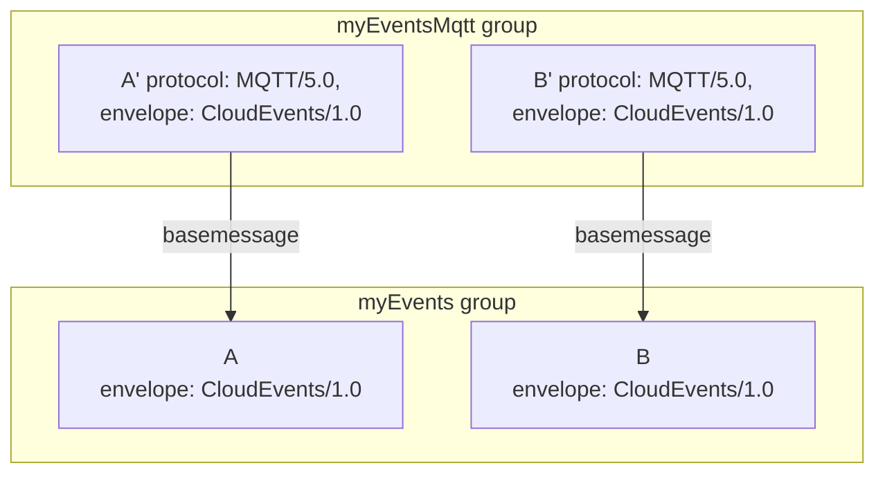

# Message Definitions Registry Service - Version 1.0-rc2

## Abstract

This specification defines a message and event catalog extension to the
xRegistry document format and API [specification](../core/spec.md). The
message definitions registry service (or "message catalog") allows for
declaring the metadata (headers, properties, attributes) of messages and/or
events and their relationships to schemas, and for grouping those declarations
such that they can be associated with endpoints. With the help of this
metadata, users can provide constraints for messaging channels, declaring
precisely which messages or events are permitted to be sent or can be expected
to be received, and how these messages can be distinguished.

## Table of Contents

- [Message Definitions Registry Service - Version 1.0-rc2](#message-definitions-registry-service---version-10-rc2)
  - [Abstract](#abstract)
  - [Table of Contents](#table-of-contents)
  - [Overview](#overview)
    - [Message Definitions](#message-definitions)
    - [Message Metadata](#message-metadata)
    - [Context Attributes](#context-attributes)
    - [Reusing Message Definitions](#reusing-message-definitions)
    - [Message Definition Matching](#message-definition-matching)
  - [Message Groups](#message-groups)
  - [Notations and Terminology](#notations-and-terminology)
    - [Notational Conventions](#notational-conventions)
    - [Terminology](#terminology)
      - [Message and Event](#message-and-event)
      - [Envelopes and Protocols](#envelopes-and-protocols)
  - [Message Definition Registry Model](#message-definition-registry-model)
    - [Message Definition Groups](#message-definition-groups)
      - [`envelope` (Message Group)](#envelope-message-group)
      - [`protocol` (Message Group)](#protocol-message-group)
    - [Message Definitions](#message-definitions-message-group)
      - [`basemessage`](#basemessage)
      - [`envelope`](#envelope)
      - [`envelopemetadata`](#envelopemetadata)
      - [`envelopeoptions`](#envelopeoptions)
      - [`protocol`](#protocol)
      - [`protocoloptions`](#protocoloptions)
      - [`dataschemaformat`](#dataschemaformat)
      - [`dataschema`](#dataschema)
      - [`dataschemauri`](#dataschemauri)
      - [`dataschemaxid`](#dataschemaxid)
      - [`datacontenttype`](#datacontenttype)
    - [Metadata Envelopes and Message Protocols](#metadata-envelopes-and-message-protocols)
      - [Property Definitions](#property-definitions)
        - [`description`](#description)
        - [`required`](#required)
        - [`specurl`](#specurl)
        - [`type`](#type)
        - [`value`](#value)
      - [Metadata Envelopes](#metadata-envelopes)
        - [CloudEvents/1.0](#cloudevents10)
      - [Message Protocols](#message-protocols)
        - ["HTTP/1.1", "HTTP/2", "HTTP/3" protocols](#http11-http2-http3-protocols)
        - ["AMQP/1.0" protocol](#amqp10-protocol)
        - [`properties` (AMQP 1.0)](#properties-amqp-10)
        - [`application-properties` (AMQP 1.0)](#application-properties-amqp-10)
        - [`message-annotations` (AMQP 1.0)](#message-annotations-amqp-10)
        - [`delivery-annotations` (AMQP 1.0)](#delivery-annotations-amqp-10)
          - [`header` (AMQP 1.0)](#header-amqp-10)
          - [`footer` (AMQP 1.0)](#footer-amqp-10)
        - ["MQTT/3.1.1" and "MQTT/5.0" protocols](#mqtt311-and-mqtt50-protocols)
        - ["KAFKA" protocol](#kafka-protocol)
        - ["NATS" protocol](#nats-protocol)

## Overview

The goal of this message metadata model, in conjunction with the [endpoint
model](../endpoint/spec.md), is to provide metadata structure to asynchronous
topics, streams and queues in a way that is similar to how table and column
definitions provide structure to databases. Database schemas structure data
that you have. Endpoint definitions with their referenced, or embedded message
definitions, with referenced, or embedded, schema definitions structure data
that will be transmitted.

Continuing that analogy, the endpoint scope corresponds to the database, the
message groups are schema scopes, and the message definitions correspond to
tables. The schema associated with a message definition determines the column
layout of the table. As event streams often end up landing in databases for
long-term archival and analysis, this structural alignment is very helpful.

Managing the description of the payloads of those messages and events is not in
scope, but delegated to the [schema registry extension](../schema/spec.md) for
xRegistry. Schemas are linked from messages and event declarations through a
URI Reference.

### Message Definitions

A Message Definition ("message") describes constraints for the metadata of a
message or event. It declares, for instance, the concrete values or
permissible value patterns for the `type`, `source`, and `subject` attributes
of a CloudEvent.

A message definition has two key purposes:

1. A message definition is a template. When an application needs to raise an
   event, the message definition declares precisely, which attributes,
   headers or properties need to be set on the event envelope or on the
   protocol message, and which constant values are to be set, or which type of
   pattern constraints apply. Such templates can be evaluated by tools and
   code generators, which can then create an interface or event factory for
   the application programmer that minimizes opportunities to introduce
   mapping errors.

2. A message definition is a filter condition. When an application needs to
   demultiplex an incoming stream, messages, or events that come through the
   same channel, it can use a collection of message definitions as a set of
   candidate messages that are expected and can be handled. The metadata of
   the incoming events or messages is tested against the declarations of the
   candidate definitions, attribute by attribute, yielding none, one, or more
   matches for the incoming message. If there is no match, the incoming
   message is unexpected and will likely be sidelined. If there is one match,
   the message can be passed on to the application. If there are multiple
   matches, the message might be evaluated further by matching the body
   content against the associated data schema.

For message and event producers, the template aspect is the primary concern.
Following the declared rules, including validating the payload against the
associated schema, ensures that all consumers receive messages with the
expected content.

For message and event consumers, the filter aspect is the primary concern.
Consumer applications and frameworks can rely on the declared message metadata
to demultiplex and dispatch messages and events to handlers and they can
sideline non-conformant messages, for instance into dead-letter queues.

### Message Metadata

Any message definition covers up to three aspects:

1. Envelope: An `envelope` is a transport independent metadata convention that
   lets a producer convey the context of an event or message to consumers or
   intermediaries (like publish/subscribe routers) without them having to
   understand the particular payload format or having to read the payload. The
   only predefined envelope model in this specification is CNCF CloudEvents
   1.0. Once the `envelope` selector is set, constraints for the attributes
   of the CloudEvents envelope can be defined in the `envelopeoptions`.

2. Protocol: The `protocol` selector picks a specific application protocol to
   which the given message is bound. If a protocol is chosen, constraints for
   the protocol-specific message model can be defined in `protocoloptions`.
   For instance, if you choose the `MQTT/5.0` protocol, you can constrain the
   topic path to which this message can be sent and/or the quality-of-service
   QoS level that is to be used. This specification covers the full metadata
   set of the application protocols AMQP/1.0, MQTT/3.1.1, MQTT/5.0, Kafka,
   NATS, and HTTP.

3. Payload: The `dataschema*` and `datacontenttype` attributes declare the
   content type of the payload and a schema that can be used to construct,
   validate, decode and/or encode the payload. The `dataschemaformat`
   declaration selects the kind of schema (e.g. XML Schema, Protobuf, Avro or
   others) that is embedded at or referenced by the chosen `dataschema*`
   attribute.

A `message` definition MAY contain any combination of `envelope`, `protocol`,
and data payload declarations. A payload-only declaration can be useful if
messages are sent through varying protocols without a fixed envelope model and
are distinguished by content-type (including parameters) or even only through
whether payload schema definitions match an incoming message.

Where attributes (or properties or headers; depending on protocol nomenclature)
can be defined in the `envelopeoptions` and `protocoloptions`, the general
pattern used in this model is that the attribute can have a name, a
description, a type and a value. Setting a value makes that value constant for
all instances of that message, which is useful for discriminators like AMQP’s
subject property or CloudEvents’ type attribute.

The `uritemplate` type permits the values to have embedded placeholders (Level
1 URI templates), which turns the values into templates for publishers where
the application inserts context information into designated places. For
consumers, the templates act as pattern matching filters and to extract
context values into named variables.

### Context Attributes

The embedded placeholders in values of the `uritemplate` type can refer to
context attributes provided by the application environment in which the metadata
is evaluated. For instance, a message definition might declare a `source`
attribute in the `envelopeoptions` of a CloudEvent, with a `uritemplate` type
and a `value` definition `/vehicles/{vin}/systems/{system}/sensor/{sensor}`.

If the application environment from which the message is published provides values
for the `vin`, `system`, and `sensor` context attributes, those values can be
easily inserted into the URI template when the message is published. Reversely,
if a message is received with a URI that matches the template, the values can
be extracted and made available as context attributes.

A further use of such context attributes is the mapping of protocol-native
messages to CloudEvents. An application evaluating message definitions that
contain both, a `protocol` and an `envelope` definition might nevertheless
choose to accept protocol-native messages that are not CloudEvents and then
use context attributes to map them to the CloudEvents model.

For example, let there be this definition:

```json
{
  "protocol": "MQTT/5.0",
  "protocoloptions": {
    "topic_name": "/store/{storeid}/cashierdesk/{cdid}"
    "user_properties" : [
      { "name": "eventType", "type": "uritemplate", "value": "{eventType}" }
    ]
  },
  "envelope": "CloudEvents/1.0",
  "envelopeoptions": {
    "type": { "type": "uritemplate", "value": "{eventType}" },
    "source": { "type": "uritemplate", "value": "{storeid}" },
    "subject": { "type": "uritemplate", "value": "{cdid}" }
  }
}
```

An application might use this definition to match incoming MQTT messages only
against the `protocol`/`protocoloptions` part of the definition. If an incoming
message matches this part, the application can then use the `envelope` and
`envelopeoptions` definitions to transform the message into a CloudEvent, with
the context attributes carrying the values.

Context attributes and their handling are not covered by the following normative
part of this specification.

### Reusing Message Definitions

In complex event-driven enterprise applications it might be desirable to reuse
common definitions across different applications. There might also be a need
to route the same set of CloudEvents through a specific protocol route, like
MQTT, where it would be useful to provide protocol-specific hints in addition
to the CloudEvents declaration like requiring a specific topic path pattern
for the event type.

The `basemessage` attribute, an xid-typed reference to another message
definition, enables such reuse scenarios. Any message definition MAY refer to
another message definition as its base, which effects a copy of the base
message’s definitions into the message that defines it. The mechanism is
transitive, which means that `basemessage` relationships MUST be resolved
recursively as long as they do not result in circular references.

All aspects of the collected base message are "shadowed" by the definitions of
the message that references it. If the base message defines an "envelope" but
no "protocol", the new definition can add the aforementioned MQTT aspects with
a new "protocol" selector and corresponding options.



### Message Definition Matching

One popular use of a Message Registry is to be a catalog of Message definitions
that are used to validate incoming messages. In these scenarios, the receiver
of a message might need to "match" it to the corresponding Message definition
that the message is meant to adhere to. This specification does not mandate how
this "matching" is done. For example, matching headers or schema of the
incoming message to the Message definitions in the Registry is one option.

In a Registry with many Message definitions, and each one of those having
potentially multiple Versions, results in a 2-dimensional collection of
Message definitions to match against, which could make finding the exact
Message definition complex, non-deterministic or very slow. To help with these
situations, this specification provides the following guidance:

- Use of CloudEvents is RECOMMENDED as it will provide well-defined
  metadata that will appear in each Message to help differentiate Message
  definitions.
- Messages definitions SHOULD have a `messageid` value that is the same as the
  CloudEvents' `type` context attribute defined for that Message. This will
  allow for an exact mapping from the incoming Message's `type` attribute to
  its related Message definition.
- Message Resource types SHOULD be defined with a `maxversions` of `1`. This
  eliminates the need for each incoming Message to include some unique
  Version discriminator.
- Modifications to Message definitions SHOULD NOT result in "on the wire"
  changes to the resulting messages as that could break existing systems.
  Rather, new Messages definitions SHOULD be created, with new `type` and
  `messageid` values, and referenced through the use of the `deprecated`
  attribute.

Implementations, and Registry model authors, MAY deviate from these
recommendations however they are then responsible for defining the mechanisms
by which a unique Message definition is matched to incoming messages.

## Message Groups

All message definitions MUST be contained in a group. A message group can be
formed for many reasons. At a minimum, the group will be an access control
boundary in many implementations of this specification even though none is
mandated.

In many cases, message groups will be a logical boundary around a set of
related events that are commonly routed through the channel. A (primitive) air
travel luggage handling system might have "checkedin", "loaded", "unloaded",
and "delivered" events related to items it moves. If those are reported to
external parties through the same channels, it likely makes sense to group
them.

A benefit of message groups is that they are very similar to "interfaces" in
common programming languages. When a message group is associated with a
channel, like a queue, the messages contained in the group form the permitted
and expected message set. The association becomes a contract.

This association is formalized in the [Endpoint Registry](../endpoint/spec.md),
a related registry that allows associating one or more message definition
groups with an endpoint, thus effectively defining a contract for the endpoint.
An "endpoint" as defined in that specification is also a message definition
group in itself, with the message definitions following the rules of this
specification.

When message definitions are to be recombined into different groups, the
original message definitions can be referenced instead of copied. For
instance, a pubsub topic might take 4 messages as input but a filtering
subscription might only yield 1 of those messages as output. In this case, one
would create a distinct message group for the subscription and "xref" the
message definition from the input group (sample to follow in the merged doc).

Similarly, one could create a new message group to be associated with an MQTT
endpoint if the messages annotate CloudEvent definitions with MQTT protocol
options using the "basemessage" mechanism. (sample also to follow)

## Notations and Terminology

### Notational Conventions

The key words "MUST", "MUST NOT", "REQUIRED", "SHALL", "SHALL NOT", "SHOULD",
"SHOULD NOT", "RECOMMENDED", "MAY", and "OPTIONAL" in this document are to be
interpreted as described in [RFC 2119](https://tools.ietf.org/html/rfc2119).

For clarity, OPTIONAL attributes (specification-defined and extensions) are
OPTIONAL for clients to use, but the servers' responsibility will vary.
Server-unknown extension attributes MUST be silently stored in the backing
datastore. Specification-defined, and server-known extension, attributes MUST
generate an error if corresponding feature is not supported or enabled.
However, as with all attributes, if accepting the attribute would result in a
bad state (such as exceeding a size limit, or results in a security issue),
then the server MAY choose to reject the request.

In the pseudo JSON format snippets `?` means the preceding attribute is
OPTIONAL, `*` means the preceding attribute MAY appear zero or more times,
and `+` means the preceding attribute MUST appear at least once. The presence
of the `#` character means the remaining portion of the line is a comment.
Whitespace characters in the JSON snippets are used for readability and are
not normative.

### Terminology

This specification defines the following terms:

#### Message and Event

A **message** is a transport wrapper around a **message body** (interchangeably
referred to as payload) that is decorated with **metadata**. The metadata
describes the message body without an intermediary having to inspect it and
carries further information useful for identification, routing, and
dispatching.

In this specification, **message** is an umbrella term that refers to all kinds
of messages as well as to **events** as a special form of messages.

The definition of [message][message] from the CloudEvents specification
applies.

#### Envelopes and Protocols

An **envelope** is a transport protocol-independent message metadata
convention. The [CNCF CloudEvents][CloudEvents] specification is an example of
a message envelope and is the only envelope explicitly defined in this
specification.

A similar transport protocol-independent message metadata convention is, for
example, the [W3C SOAP 1.2 envelope][SOAP] for which support could be added by
an extension.

This specification uses **protocol** as a selector into the protocol-specific
message metadata that is defined under the `protocol.ifvalues` section of the
model. When a known protocol is explicitly specified for a message definition,
the `protocoloptions` section MAY contain constraints for the
protocol-specific metadata.

## Message Definition Registry Model

The formal xRegistry extension model of the Message Definitions Registry
resides in the [model.json](model.json) file.

For easy reference, the JSON serialization of a Message Registry adheres to
this form:

```yaml
{
  "specversion": "<STRING>",
  "registryid": "<STRING>",
  "self": "<URL>",
  "shortself": "<URL>", ?
  "xid": "<XID>",
  "epoch": <UINTEGER>,
  "name": "<STRING>", ?
  "description": "<STRING>", ?
  "documentation": "<URL>", ?
  "labels": {
    "<STRING>": "<STRING>" *
  }, ?
  "createdat": "<TIMESTAMP>",
  "modifiedat": "<TIMESTAMP>",

  "capabilities": { ... }, ?
  "model": { ... }, ?
  "modelsource": { ... }, ?

  "messagegroupsurl": "<URL>",
  "messagegroupscount": <UINTEGER>,
  "messagegroups": {
    "<KEY>": {                                  # messagegroupid
      "messagegroupid": "<STRING>",             # xRegistry core attributes
      "self": "<URL>",
      "shortself": "<URL>", ?
      "xid": "<XID>",
      "epoch": <UINTEGER>,
      "name": "<STRING>", ?
      "description": "<STRING>", ?
      "documentation": "<URL>", ?
      "labels": { "<STRING>": "<STRING>" * }, ?
      "createdat": "<TIMESTAMP>",
      "modifiedat": "<TIMESTAMP>",
      "deprecated": { ... }, ?

      # MessageGroup extension attributes
      "envelope": "<STRING>", ?                 # e.g. CloudEvents/1.0
      "protocol": "<STRING>", ?                 # e.g. HTTP/1.1

      "messagesurl": "<URL>",
      "messagescount": <UINTEGER>,
      "messages" : {
        "<KEY>": {                              # messageid
          "messageid": "<STRING>",              # xRegistry core attributes
          "versionid": "<STRING>",
          "self": "<URL>",
          "shortself": "<URL>", ?
          "xid": "<XID>",

          # Start of default Version's attributes
          "epoch": <UINTEGER>,
          "name": "<STRING>", ?
          "description": "<STRING>", ?
          "documentation": "<URL>", ?
          "labels": { "<STRING>": "<STRING>" * }, ?
          "createdat": "<TIMESTAMP>",
          "modifiedat": "<TIMESTAMP>",
          "ancestor": "<STRING>",

          # Start of Message extension attributes
          "basemessage": "<URL>", ?            # Message being extended

          "envelope": "<STRING>", ?            # e.g. CloudEvents/1.0
          "envelopemetadata": {
            "<STRING>": <JSON-VALUE> *

            # CloudEvents/1.0 "envelope" the "envelopemetadata" is of the form:
            "<STRING>": {
              "type": "<TYPE>",                # Default=string
              "value": <ANY>, ?
              "required": <BOOLEAN>            # Default=false
            } *
          }, ?
          "envelopeoptions": {
            "<STRING>": <JSON-VALUE> *
          }, ?

          "protocol": "<STRING>", ?            # e.g. HTTP/1.1
          "protocoloptions": { ... }, ?

          "dataschemaformat": "<STRING>", ?
          "dataschema": <ANY>, ?
          "dataschemauri": "<URI>", ?
          "dataschemaxid": "<XID>", ?
          "datacontenttype": "<STRING>", ?
          # End of Message extensions and default Version's attributes

          "metaurl": "<URL>",
          "meta": { ... }, ?
          "versionsurl": "<URL>",
          "versionscount": <UINTEGER>,
          "versions": { ... } ?
      } ?
    } *
  } ?
}
```

### Message Definition Groups

The Group plural name (`<GROUPS>`) is `messagegroups`, and the Group singular
name (`<GROUP>`) is `messagegroup`.

The following attributes are defined for the `messagegroup` object in addition
to the xRegistry-defined core
[attributes](../core/spec.md#attributes-and-extensions):

#### `envelope` (Message Group)

- Type: String
- Description: Identifies a common, transport protocol-independent message
  metadata format. Message metadata envelopes are referenced by name and
  version as `<NAME>/<VERSION>`. This specification defines a set of common
  [metadata envelope names](#metadata-envelopes) that MUST be used for the
  given envelopes, but applications MAY define extensions for other envelopes
  on their own. All messages inside a group MUST use this same envelope.
- Constraints:
  - If present, MUST be a non-empty case-insensitive string.
  - If present, MUST follow the naming convention `<NAME>/<VERSION>`, whereby
    `<NAME>` is the name of the metadata envelope and `<VERSION>` is the
    version of the metadata envelope.
- Examples:
  - `CloudEvents/1.0`

#### `protocol` (Message Group)

- Type: String
- Description: Identifies a transport protocol to be bound to for this Message.
  Protocols are referenced by name and version as `<NAME>/<VERSION>`. This
  specification defines a set of common [message protocol
  names](#message-protocols) that MUST be used for the given protocols, but
  applications MAY define extensions for other protocols on their own. All
  messages inside a group MUST use this same protocol.
- Constraints:
  - If present, MUST be a non-empty case-insensitive string.
  - If present, MUST follow the naming convention `<NAME>` or
    `<NAME>/<VERSION>`, whereby `<NAME>` is the name of the protocol and
    `<VERSION>` is the version of protocol. The version is REQUIRED if
    multiple, mutually incompatible versions of the protocol exist and
    protocol options differ between versions.
- Examples:
  - `MQTT/3.1.1`
  - `AMQP/1.0`
  - `KAFKA`

### Message Definitions (Message Group)

The Resource plural name (`<RESOURCES>`) is `messages`, and the Resource
singular name (`<RESOURCE>`) is `message`.

Different from schemas, message definitions do not contain a
version history. If the metadata of two messages differs, they are considered
different messages.

When [CloudEvents](https://cloudevents.io) is used for a particular
message, it is RECOMMENDED that the message's `messageid` attribute be the
same as the [CloudEvents `type`
attribute](https://github.com/cloudevents/spec/blob/main/cloudevents/spec.md#type).
Doing so makes for easier management of the meta-model by correlating
the look-up value (id) of messages with their related events.

The following extensions are defined for the `message` Resource in addition to
the core xRegistry Resource
[attributes](../core/spec.md#attributes-and-extensions):

#### `basemessage`

- Type: XID
- Description: if present, the XID points to a message definition that is the
  base for this message definition. By following the XID, the base message
  can be retrieved and extended with the properties of this message. This is
  useful for defining variants of messages that only differ in minor additive
  aspects to avoid repetition. For example, messages that only have a
  `envelope` with associated `envelopemetadata` to be bound to various
  protocols.

  Referenced messages MAY themselves have a `basemessage` value, however,
  the chain of messages MUST NOT be recursive.

  The processing that a client SHOULD take to materialize the message is
  to follow the `basemessage` attributes to the end of the chain of messages,
  get that message's attributes, and then walk back up the chain performing a
  "merge" operation of the next message's attributes. Note in the case of an
  inherited attribute being a complex type (e.g. map, object), and the
  overlaying attribute is scalar, then the entire inherited attribute (and
  nested values) are replaced by that scalar value. For complex types, the
  merge is "deep", meaning each level of the complex type is merged
  appropriately rather than it being a complete replacement of the entire
  complex type.

  If the referenced message can not be found then an error MUST NOT be
  generated, dangling references are permitted.

- Constraints:
  - OPTIONAL.
  - If present, MUST be the `xid` of a Resource, or Version, of type `message`
    as defined by this specification.

- Examples:
  - `/messagegroups/group1/messages/msg1`
  - `/messagegroups/group1/messages/msg1/versions/v1.0`

#### `envelope`

Same as the [`envelope`](#envelope-message-group) attribute of the
`messagegroup` object.

Since messages MAY be cross-referenced ("borrowed") across message group
boundaries, this attribute is also REQUIRED and MUST be the same as the
`envelope` attribute of the `messagegroup` object into which the message is
embedded or referenced.

Illustrating example:

```yaml
"messagegroupsurl": "...",
"messagegroupscount": 2,
"messagegroups": {
  "com.example.abc": {
    "messagegroupid": "com.example.abc",
    "envelope": "CloudEvents/1.0",

    "messagesurl": "...",
    "messagescount": 2,
    "messages": {
      "com.example.abc.event1": {
        "messageid": "com.example.abc.event1",
        "envelope": "CloudEvents/1.0",
         # details ...
        }
      },
      "com.example.abc.event2": {
        "messageid": "com.example.abc.event1",
        "envelope": "CloudEvents/1.0",
        # details ...
      }
  },
  "com.example.def": {
    "messagegroupid": "com.example.def",
    "envelope": "CloudEvents/1.0",

    "messagesurl": "...",
    "messagescount": 1,
    "messages": {
      "com.example.abc.event1": {
        "uri": "#/messagegroups/com.example.abc/messages/com.example.abc.event1",
        # details ...
      }
    }
  }
}
```

#### `envelopemetadata`

- Type: Object
- Description: Describes the metadata constraints for messages of this type.
  The content of this property is defined by the message `envelope`, but all
  envelopes use a common schema for the constraints defined for their
  metadata headers, properties or attributes.
- Constraints:
  - REQUIRED if `envelope` is specified.
- Examples:
  - See [Metadata Envelopes](#metadata-envelopes)

#### `envelopeoptions`

- Type: Map
- Description: Configuration details of the Message with respect to the
  envelope format used to format the messages. See
  [Metadata Envelopes](#metadata-envelopes) for more details.
- Constraints:
  - OPTIONAL.

#### `protocol`

- Same as the [`protocol`](#protocol-message-group) attribute of the
  `messagegroup` object.

#### `protocoloptions`

- Type: Object
- Description: Describes the message constraints for the protocol being used.
  The content of this property is defined by the protocol message binding,
  but all protocols use a common schema model for the
  constraints defined for their metadata headers, properties or attributes.
- Constraints:
  - REQUIRED if `protocol` is specified.
- Examples:
  - See [Message protocols](#message-protocols)

#### `dataschemaformat`

- Type: String
- Description: Identifies the schema format applicable to the message payload,
  equivalent to the schema ['format'](../schema/spec.md#format)
  attribute.
- Constraints:
  - OPTIONAL.
  - If present, MUST be a non-empty case-insensitive string.
  - If present, MUST follow the naming convention `<NAME>/<VERSION>`, whereby
    `<NAME>` is the name of the schema format and `<VERSION>` is the version of
    the schema format in the format defined by the schema format itself.
- Examples:
  - 'JSONSchema/draft-07'
  - 'Avro/1.9.0'
  - 'Protobuf/3'

#### `dataschema`

- Type: Any
- Description: Contains the inline schema for the message payload. The schema
  format is identified by the `dataschemaformat` attribute. Equivalent to the
  ['schema'](../schema/spec.md#schema) attribute.
- Constraints:
  - OPTIONAL.
  - Mutually exclusive with the `dataschemauri` attribute.
  - If present, `dataschemaformat` MUST be present.
- Examples:
  - See [Schema Formats](../schema/spec.md#schema-formats)

#### `dataschemauri`

- Type: URI-reference
- Description: Contains a relative or absolute URI that points to the schema
  object to use for the message payload. The schema format is identified by the
  `dataschemaformat` attribute. See
  [Schema Formats](../schema/spec.md#schema-formats) for details on
  how to reference specific schema objects for the message payload. It is not
  sufficient for the URI-reference to point to a schema document; it MUST
  resolve to a concrete schema object.
- Constraints:
  - OPTIONAL.
  - Mutually exclusive with the `dataschema` attribute.
  - If present, `dataschemaformat` MUST be present.

#### `dataschemaxid`

- Type: XID
- Description: Contains the `xid` of the xRegistry `schema` Resource entity
  associated with the `dataschemauri` referenced schema document. Note that
  this means the entity MUST be located within the same Registry.
- Constraints:
  - OPTIONAL.
  - If `dataschemauri` is also present then its value MUST be the `self`
    URL of the entity referenced by this attribute.


#### `datacontenttype`

- Type: `String` per [RFC 2046](https://tools.ietf.org/html/rfc2046)
- Description: Content type of the message payload. This attribute MAY be
  duplicative with some other metadata within the message definition. For
  example, in the case of using CloudEvents, the `envelopemetadata` attribute
  might include the `datacontenttype` attribute. This possible duplication
  of data is expected so as to allow for a more consistent, and easy, discovery
  of the message's format. This means that if this information does appear in
  more than one location within the message metadata they MUST all have the
  same values.

  Note that when an `envelope` is defined for a message and the data of
  interest is serialized as being nested within the envelope (e.g.
  CloudEvents "structured" mode), then this attribute MUST be the content type
  of the message envelope and not of the data nested within the envelope.

  As specified in [RFC 2045](https://tools.ietf.org/html/rfc2045), the media
  type part of the content type MUST be treated in a case-insensitive manner
  by consumers, along with the attribute names in parameters. For example,
  a `datacontenttype` of `text/plain; charset=utf-8` MUST be treated in the
  same way as `TEXT/Plain; CharSet=utf-8`.
- Constraints:
  - OPTIONAL
  - If present, MUST adhere to the format specified in
    [RFC 2046](https://tools.ietf.org/html/rfc2046). For Media Type examples
    see [IANA Media
    Types](http://www.iana.org/assignments/media-types/media-types.xhtml)

### Metadata Envelopes and Message Protocols

This section defines the metadata envelopes and message protocols that are
directly supported by this specification.

Metadata envelopes lean on a protocol-neutral metadata definition like
CloudEvents. Message protocols lean on a message model definition of a specific
protocol like AMQP, MQTT or Kafka.

A message can use either a metadata `envelope`, a message `protocol`, or both.

If a message only uses a metadata `envelope`, any implicit protocol bindings
defined by the envelope apply. For instance, a message definition that uses the
"CloudEvents/1.0" envelope but no explicit `protocol` implicitly applies to all
protocols for which CloudEvents bindings exist, and using the respective
protocol binding rules.

If a message uses both a metadata `envelope` and a message `protocol`, the
message binding rules takes precedence over the metadata envelope rules. For
instance, if a message definition uses the "CloudEvents/1.0" envelope and an
"AMQP/1.0" protocol, then the implicit protocol bindings of the
"CloudEvents/1.0" envelope are overridden by the "AMQP/1.0" protocol rules.

If a message uses only a message `protocol`, only the metadata constraints
defined by the message `protocol` rules apply.

#### Property Definitions

The following attributes are used to define the properties associated with
the headers, properties or attributes defined for message:

##### `description`

- Type: String
- Description: A human-readable description of the property.
- Constraints:
  - OPTIONAL.
  - If present, MUST be a non-empty string.

##### `required`

- Type: Boolean
- Description: Indicates whether the property is REQUIRED to be present in a
  message of this type.
- Constraints:
  - OPTIONAL.
  - Default value MUST be `false`.

##### `specurl`

- Type: URI-reference
- Description: Contains a relative or absolute URI that points to the
  human-readable specification of the property.
- Constraints:
  - OPTIONAL.

##### `type`

- Type: String
- Description: The type of the property. This is used to constrain the value of
  the property.
- Constraints:
  - OPTIONAL.
  - Default value MUST be "string".
  - The valid types are those defined in the [CloudEvents][CloudEvents Types]
    core specification, with some additions:
    - `any`: Any type of value, including `null`.
    - `binary`: CloudEvents "Binary" type.
    - `boolean`: CloudEvents "Boolean" type.
    - `duration`: RFC3339 Duration.
    - `integer`: CloudEvents "Integer" type (RFC 7159, Section 6).
    - `number`: IEEE754 Double.
    - `string`: CloudEvents "String" type.
    - `symbol`: A `string` that is restricted to alphanumerical characters and
      underscores.
    - `timestamp`: CloudEvents "Timestamp" type (RFC3339 DateTime)
    - `uri`: CloudEvents URI type (RFC3986 URI).
    - `urireference`: CloudEvents "URI-reference" type (RFC3986 URI-reference).
    - `uritemplate`: [RFC6570][RFC6570] Level 1 URI Template.

##### `value`

- Type: Any
- Description: The value of the property. With a few exceptions, see below,
  this is the value that MUST be literally present in the message for the
  message to be considered conformant with the message definition.
- Constraints:
  - OPTIONAL.
  - If present, MUST be a valid value for the property.

If the `type` property has the value `uritemplate`, `value` MAY contain
placeholders. As defined in [RFC6570][RFC6570] (Level 1), the placeholders MUST
be enclosed in curly braces (`{` and `}`) and MUST be a valid `symbol`.
Placeholders that are used multiple times in the same message definition MUST
to represent identical values.

When validating a message property against this value, the placeholders act as
wildcards. For example, the value `{foo}/bar` would match the value `abc/bar`
or `xyz/bar`.

When creating a message based on a metaschema with such a value, the
placeholders MUST be replaced with valid values. For example, the value
`{foo}/bar` would be replaced with `abc/bar` or `xyz/bar` when creating a
message.

If the `type` property has the value `timestamp` and the `value` property is
set to a value of `0000-01-01T00:00:00Z`, the value MUST be replaced with the
current timestamp when creating a message.

#### Metadata Envelopes

This specification only defines one metadata envelope: "CloudEvents/1.0".

##### CloudEvents/1.0

For the "CloudEvents/1.0" envelope, the
[`envelopemetadata`](#envelopemetadata) object contains a property
`attributes`, which is an object whose properties correspond to the
CloudEvents context attributes.

As with the [CloudEvents specification][CloudEvents], the attributes form a
flat list and extension attributes are allowed. Attribute names are restricted
to lower-case alphanumerical characters without separators.

The base attributes are defined as follows:

| Attribute         | Type          |
| ----------------- | ------------- |
| `specversion`     | `string`      |
| `id`              | `string`      |
| `type`            | `string`      |
| `source`          | `uritemplate` |
| `subject`         | `string`      |
| `time`            | `timestamp`   |
| `dataschema`      | `uritemplate` |
| `datacontenttype` | `string`      |

The following rules apply to the attribute declarations:

- All attribute declarations are OPTIONAL. Requirements for absent
  definitions are implied by the CloudEvents specification.
- The `specversion` attribute is implied by the message envelope and is
  OPTIONAL. If present, it MUST be declared with a `string` type and set to the
  value "1.0".
- The `type`, `id`, and `source` attributes implicitly have the `required` flag
  set to `true` and MUST NOT be declared as `required: false`.
- The `id` attribute's `value` SHOULD NOT be defined.
- The `time` attribute's `value` default value MUST be `0000-01-01T00:00:00Z`
  ("current time") and SHOULD NOT be declared with a different value.
- The `datacontenttype` attribute's `value` is inferred from the
  [`dataschemaformat`](#dataschemaformat) attribute of the message definition
  if absent.
- The `dataschema` attribute's `value` is inferred from the
  [`dataschemauri`](#dataschemauri) attribute or
  [`dataschema`](#dataschema) attribute of the message definition if
  absent. If present, the value MUST match the `dataschemauri` attribute of the
  message definition.
- The `type` of the property definition defaults to the CloudEvents type
  definition for the attribute, if any. The `type` of an attribute MAY be
  modified be to further constrained. For instance, the `source` type
  `urireference` MAY be changed to
  `uritemplate` or the `subject` type `string` MAY be constrained to a
  `urireference` or `stringified integer`. If no CloudEvents type definition
  exists, the default value MUST be `string`.

The values of all `string` and `uritemplate`-typed attributes MAY contain
placeholders using the [RFC6570][RFC6570] Level 1 URI Template syntax. When the
same placeholder is used in multiple properties, the value of the placeholder
is assumed to be identical.

The following shows the format of a CloudEvents "envelopemetadata" section for
a message (see the [model file](model.json) for the complete definition):

```yaml
"envelope": "CloudEvents/1.0",
"envelopemetadata" {
  # "CloudEvents/1.0" envelope metadata
  "specversion": {
    "value": "1.0",
    "type": "string"
  },
  "id": {
    "value": "<STRING>", ?
    "type": "string"
  },
  "type": {
    "value": "<STRING>", ?
    "type": "string"
  },
  "source": {
    "value": "<STRING>", ?
    "type": "string"
  },
  "subject": {
    "value": "<STRING>", ?
    "type": "string"
  },
  "time": {
    "value": "<TIMESTAMP>", ?
    "type": "timestamp" ?
  },
  "dataschema": {
    "value": "<URITEMPLATE>", ?
    "type": "uritemplate" ?
  },
  "*": {
    "value": <ANY>, ?
    "type": "<TYPE>"
  }
}
```

The following example declares a CloudEvent with a JSON payload. The attribute
`id` is REQUIRED in the declared event per the CloudEvents specification in
spite of such a declaration being absent here, the `type` of the `type`
attribute is `string` and the attribute is `required` even though the
declarations are absent. The `time` attribute is made `required` contrary to
the CloudEvents base specification. The implied CloudEvents `datacontenttype`
attribute value is `application/json` and the implied CloudEvents `dataschema`
attribute value is `https://example.com/schemas/com.example.myevent.json`:

```yaml
{
  "envelope": "CloudEvents/1.0",
  "envelopemetadata": {
    "type": {
      "value": "com.example.myevent"
    },
    "source": {
      "value": "https://{tenant}/{module}/myevent",
      "type": "uritemplate"
    },
    "subject": {
      "type": "urireference"
    },
    "time": {
      "required": true
    },
  },
  "dataschemaformat": "JsonSchema/draft-07",
  "dataschemauri": "https://example.com/schemas/com.example.myevent.json"
}
```

For clarity of the definition, you MAY always declare all implied attribute
properties explicitly, but they MUST conform with the rules above.

#### Message Protocols

##### "HTTP/1.1", "HTTP/2", "HTTP/3" protocols

The "HTTP" protocol is used to define messages that are sent over an HTTP
connection. The protocol is based on the
[HTTP Message Format][HTTP Message Format] and is common across all versions of
HTTP.

The [`protocoloptions`](#protocoloptions) object MAY contain several
properties as defined below:

| Property  | Type          | Description                 |
| --------- | ------------- | --------------------------- |
| `headers` | Array         | The HTTP headers. See below |
| `query`   | Map           | The HTTP query parameters   |
| `path`    | `uritemplate` | The HTTP path               |
| `method`  | `string`      | The HTTP method             |
| `status`  | `string`      | The HTTP status code        |

HTTP allows for multiple headers with the same name. The `headers` property is
therefore an array of objects with `name` and `value` properties. The `name`
property is a string that MUST be a valid HTTP header name.

The `query` property is a map of string keys to string values.

The `path` property is a URI template.

The `method` property is a string that MUST be a valid HTTP method.

The `status` property is a string that MUST be a valid HTTP response
code. The `status` and `method` properties are mutually exclusive and
MUST NOT be present at the same time.

The values of all `string` and `uritemplate`-typed properties and headers and
query elements MAY contain placeholders using the [RFC6570][RFC6570] Level 1
URI Template syntax. When the same placeholder is used in multiple properties,
the value of the placeholder is assumed to be identical.

The following example defines a message that is sent over HTTP/1.1:

```yaml
{
  "protocol": "HTTP",
  "protocoloptions": {
    "headers": [
      {
        "name": "Content-Type",
        "value": "application/json"
      }
    ],
    "query": [
      {
        "name": "foo",
        "value": "bar"
      }
    ],
    "path": "/foo/{bar}",
    "method": "POST"
  },
  "dataschemaformat": "JsonSchema/draft-07",
  "dataschemauri": "https://example.com/schemas/com.example.myevent.json",
}
```

##### "AMQP/1.0" protocol

The "AMQP/1.0" protocol is used to define messages that are sent over an
[AMQP][AMQP 1.0] connection. It is based on the default
[AMQP 1.0 Message Format][AMQP 1.0 Message Format].

The [`protocoloptions`](#protocoloptions) object MAY contain several
properties, each of which corresponds to a section of the AMQP 1.0 Message,
as defined below:

| Property                 | Type | Description                                                                     |
| ------------------------ | ---- | ------------------------------------------------------------------------------- |
| `properties`             | Map  | The AMQP 1.0 [Message Properties][AMQP 1.0 Message Properties] section          |
| `application-properties` | Map  | The AMQP 1.0 [Application Properties][AMQP 1.0 Application Properties] section. |
| `message-annotations`    | Map  | The AMQP 1.0 [Message Annotations][AMQP 1.0 Message Annotations] section        |
| `delivery-annotations`   | Map  | The AMQP 1.0 [Delivery Annotations][AMQP 1.0 Delivery Annotations] section      |
| `header`                 | Map  | The AMQP 1.0 [Message Header][AMQP 1.0 Message Header] section                  |
| `footer`                 | Map  | The AMQP 1.0 [Message Footer][AMQP 1.0 Message Footer] section                  |

As in AMQP, all sections and properties are OPTIONAL.

The values of all `string`, `symbol`, `uri`, and `uritemplate`-typed properties
MAY contain placeholders using the [RFC6570][RFC6570] Level 1 URI Template
syntax. When the same placeholder is used in multiple properties, the value of
the placeholder is assumed to be identical.

Example for an AMQP 1.0 message type that declares a fixed `subject` (analogous
to CloudEvents' `type`), a custom property, and a `content-type` of
`application/json` without declaring a schema reference in the message
definition:

```yaml
{
  "protocol": "AMQP/1.0",
  "protocoloptions": {
    "properties": {
      "message-id": {
        "required": true
      },
      "to": {
        "value": "https://{host}/{queue}"
      },
      "subject": {
        "value": "MyMessageType",
        "required": true
      },
      "content-type": {
        "value": "application/json"
      },
      "content-encoding": {
        "value": "gzip"
      }
    },
    "application-properties": {
      "my-application-property": {
        "value": "my-application-property-value"
      }
    }
  }
}
```

##### `properties` (AMQP 1.0)

The `properties` property is an object that contains the fixed properties of
the AMQP 1.0 [Message Properties][AMQP 1.0 Message Properties] section. The
following properties are defined, with type constraints:

| Property               | Type             | Description                                                                      |
| ---------------------- | ---------------- | -------------------------------------------------------------------------------- |
| `message-id`           | (see note below) | uniquely identifies a message within the message system                          |
| `user-id`              | `binary`         | identity of the user responsible for producing the message                       |
| `to`                   | `uritemplate`    | address of the node to send the message to                                       |
| `subject`              | `string`         | message subject                                                                  |
| `reply-to`             | `uritemplate`    | address of the node to which the receiver of this message ought to send replies  |
| `correlation-id`       | `string`         | client-specific id that can be used to mark or identify messages between clients |
| `content-type`         | `symbol`         | MIME content type for the message                                                |
| `content-encoding`     | `symbol`         | MIME content encoding for the message                                            |
| `absolute-expiry-time` | `timestamp`      | time when this message is considered expired                                     |
| `group-id`             | `string`         | group this message belongs to                                                    |
| `group-sequence`       | `integer`        | position of this message within its group                                        |
| `reply-to-group-id`    | `uritemplate`    | group-id to which the receiver of this message ought to send replies to          |

The `message-id` permits the types `ulong`, `uuid`, `binary`, `string`, and
`uritemplate`. A `value` constraint for `message-id` property SHOULD NOT be
defined in the message definition except for the case where the `message-id`
is a `uritemplate`.

##### `application-properties` (AMQP 1.0)

The `application-properties` property is a map that contains the custom
properties of the AMQP 1.0 [Application Properties][AMQP 1.0 Application
Properties] section.

The names of the properties MUST be of type `symbol` and MUST be unique within
the scope of the map. The values of the properties MAY be of any permitted
type.

##### `message-annotations` (AMQP 1.0)

The `message-annotations` property is a map that contains the custom
properties of the AMQP 1.0 [Message Annotations][AMQP 1.0 Message Annotations]
section.

The names of the properties MUST be of type `symbol` and MUST be unique within
the scope of the map. The values of the properties MAY be of any permitted
type.

##### `delivery-annotations` (AMQP 1.0)

The `delivery-annotations` property is a map that contains the custom
properties of the AMQP 1.0
[Delivery Annotations][AMQP 1.0 Delivery Annotations] section.

The names of the properties MUST be of type `symbol` and MUST be unique within
the scope of the map. The values of the properties MAY be of any permitted
type.

###### `header` (AMQP 1.0)

The `header` property is an object that contains the properties of the
AMQP 1.0 [Message Header][AMQP 1.0 Message Header] section. The
following properties are defined, with type constraints:

| Property         | Type      | Description                                                    |
| ---------------- | --------- | -------------------------------------------------------------- |
| `durable`        | `boolean` | specify durability requirements                                |
| `priority`       | `integer` | relative message priority                                      |
| `ttl`            | `integer` | message time-to-live in milliseconds                           |
| `first-acquirer` | `boolean` | indicates whether the message has not been acquired previously |
| `delivery-count` | `integer` | number of prior unsuccessful delivery attempts                 |

###### `footer` (AMQP 1.0)

The `footer` property is a map that contains the custom properties of the AMQP
1.0 [Message Footer][AMQP 1.0 Message Footer] section.

The names of the properties MUST be of type `symbol` and MUST be unique within
the scope of the map. The values of the properties MAY be of any permitted
type.

##### "MQTT/3.1.1" and "MQTT/5.0" protocols

The "MQTT/3.1.1" and "MQTT/5.0" protocols are used to define messages that are
sent over [MQTT 3.1.1][MQTT 3.1.1] or [MQTT 5.0][MQTT 5.0] connections. The
format describes the [MQTT PUBLISH packet][MQTT 5.0] content.

The [`protocoloptions`](#protocoloptions) object contains the elements of the
MQTT PUBLISH packet directly, with the `user-properties` element corresponding
to the application properties collection of other protocols.

The following properties are defined. The MQTT 3.1.1 and MQTT 5.0 columns
indicate whether the property is supported for the respective MQTT version.

| Property                  | Type          | MQTT 3.1.1 | MQTT 5.0 | Description                      |
| ------------------------- | ------------- | ---------- | -------- | -------------------------------- |
| `qos`                     | `integer`     | yes        | yes      | Quality of Service level         |
| `retain`                  | `boolean`     | yes        | yes      | Retain flag                      |
| `topic_name`              | `uritemplate` | yes        | yes      | Topic name                       |
| `payload_format`          | `integer`     | no         | yes      | Payload format indicator         |
| `message_expiry_interval` | `integer`     | no         | yes      | Message expiry interval          |
| `response_topic`          | `uritemplate` | no         | yes      | Response topic                   |
| `correlation_data`        | `binary`      | no         | yes      | Correlation data                 |
| `content_type`            | `symbol`      | no         | yes      | MIME content type of the payload |
| `user_properties`         | Array         | no         | yes      | User properties                  |

Like HTTP, the MQTT allows for multiple user properties with the same name,
so the `user_properties` property is an array of objects, each of which
contains a single property name and value.

The values of all `string`, `symbol`, and `uritemplate`-typed properties and
user properties MAY contain placeholders using the [RFC6570][RFC6570] Level 1
URI Template syntax. When the same placeholder is used in multiple properties,
the value of the placeholder is assumed to be identical.

The following example shows a message with the "MQTT/5.0" protocol, asking for
QoS 1 delivery, with a topic name of "mytopic", and a user property of
"my-application-property" with a value of "my-application-property-value":

```yaml
{
  "protocol": "MQTT/5.0",
  "protocoloptions": {
    "qos": 1,
    "retain":  false,
    "topic_name": "mytopic",
    "user_properties": [
      {
        "name": "My Application Property",
        "value": "Value 1"
      }
    ]
  }
}
```

##### "KAFKA" protocol

The "KAFKA" protocol is used to define messages that are sent using the [Apache
Kafka][Apache Kafka] RPC protocol.

The [`protocoloptions`](#protocoloptions) object contains the common elements
of the Kafka [producer][Apache Kafka producer] and
[consumer][Apache Kafka consumer] records, with the `headers` element
corresponding to the application properties collection of other protocols.

The following properties are defined:

| Property     | Type      | Description                                                               |
| ------------ | --------- | ------------------------------------------------------------------------- |
| `topic`      | `string`  | The topic the record will be appended to                                  |
| `partition`  | `integer` | The partition to which the record is to be sent or has been received from |
| `key`        | `string`  | The key that is associated with the record, UTF-8 encoded                 |
| `key_base64` | `binary`  | The key that is associated with the record as a base64 encoded string     |
| `headers`    | Map       | A map of headers to set on the record                                     |

The `key` and `key_base64` properties are mutually exclusive and MUST NOT be
present at the same time.

The `partition` property is included because there are cases where applications
use partitions explicitly for addressing and routing messages within the scope
of a topic.

The values of all `string`, `symbol`, `uritemplate`-typed properties
and headers MAY contain placeholders using the [RFC6570][RFC6570] Level 1 URI
Template syntax. When the same placeholder is used in multiple properties, the
value of the placeholder is assumed to be identical.

Example:

```yaml
{
  "protocol": "Kafka",
  "protocoloptions": {
    "topic": "mytopic",
    "key": "thisdevice"
  }
}
```

##### "NATS" protocol

The "NATS" protocol is used to define messages that are sent using the
[NATS][NATS] protocol.

The [`protocoloptions`](#protocoloptions) object contains the available
elements of the NATS message for the `HPUB` operation.

The following properties are defined:

| Property   | Type          | Description                                  |
| ---------- | ------------- | -------------------------------------------- |
| `subject`  | `uritemplate` | The subject the message will be published to |
| `reply-to` | `uritemplate` | The subject the receiver ought to reply to   |
| `headers`  | Array         | A list of headers to set on the message      |

The values of all `string`, `symbol`, `uritemplate`-typed properties
and headers MAY contain placeholders using the [RFC6570][RFC6570] Level 1 URI
Template syntax. When the same placeholder is used in multiple properties, the
value of the placeholder is assumed to be identical.

Example:

```yaml
{
  "protocol": "NATS",
  "protocoloptions": {
    "subject": "mytopic",
    "reply-to": "replytopic"
  }
}
```

[CloudEvents Types]: https://github.com/cloudevents/spec/blob/v1.0.2/cloudevents/spec.md#type-system
[AMQP 1.0]: https://docs.oasis-open.org/amqp/core/v1.0/os/amqp-core-overview-v1.0-os.html
[AMQP 1.0 Message Format]: http://docs.oasis-open.org/amqp/core/v1.0/os/amqp-core-messaging-v1.0-os.html#section-message-format
[AMQP 1.0 Message Properties]: http://docs.oasis-open.org/amqp/core/v1.0/os/amqp-core-messaging-v1.0-os.html#type-properties
[AMQP 1.0 Application Properties]: http://docs.oasis-open.org/amqp/core/v1.0/os/amqp-core-messaging-v1.0-os.html#type-application-properties
[AMQP 1.0 Message Annotations]: http://docs.oasis-open.org/amqp/core/v1.0/os/amqp-core-messaging-v1.0-os.html#type-message-annotations
[AMQP 1.0 Delivery Annotations]: http://docs.oasis-open.org/amqp/core/v1.0/os/amqp-core-messaging-v1.0-os.html#type-delivery-annotations
[AMQP 1.0 Message Header]: http://docs.oasis-open.org/amqp/core/v1.0/os/amqp-core-messaging-v1.0-os.html#type-header
[AMQP 1.0 Message Footer]: http://docs.oasis-open.org/amqp/core/v1.0/os/amqp-core-messaging-v1.0-os.html#type-footer
[MQTT 5.0]: https://docs.oasis-open.org/mqtt/mqtt/v5.0/mqtt-v5.0.html
[MQTT 3.1.1]: https://docs.oasis-open.org/mqtt/mqtt/v3.1.1/mqtt-v3.1.1.html
[CloudEvents]: https://github.com/cloudevents/spec/blob/main/cloudevents/spec.md
[NATS]: https://docs.nats.io/reference/reference-protocols/nats-protocol
[Apache Kafka]: https://kafka.apache.org/protocol
[Apache Kafka producer]: https://kafka.apache.org/31/javadoc/org/apache/kafka/clients/producer/ProducerRecord.html
[Apache Kafka consumer]: https://kafka.apache.org/31/javadoc/org/apache/kafka/clients/consumer/ConsumerRecord.html
[HTTP Message Format]: https://www.rfc-editor.org/rfc/rfc9110#section-6
[RFC6570]: https://www.rfc-editor.org/rfc/rfc6570
[rfc3339]: https://tools.ietf.org/html/rfc3339
[message]: https://github.com/cloudevents/spec/blob/main/cloudevents/spec.md#message
[SOAP]: https://www.w3.org/TR/soap12-part1/
