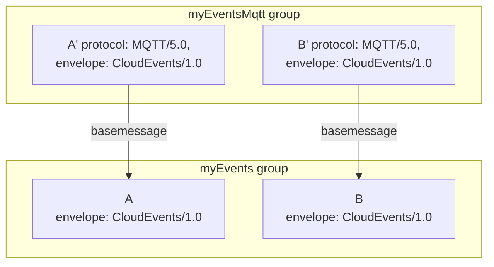

# Message Definitions Registry Service - Version 1.0-rc4

<!-- words: formatvalidated compatibilityvalidated -->
<!-- words: formatvalidatedreason compatibilityvalidatedreason -->

## Abstract

This specification defines a message and event catalog extension to the
xRegistry document format and API [specification](../core/spec.md). The
message definitions registry service (or "message catalog") allows for
declaring the metadata (headers, properties, attributes) of messages and/or
events and their relationships to schemas, and for grouping those declarations
such that they can be associated with endpoints. With the help of this
metadata, users can provide constraints for messaging channels, declaring
precisely which messages or events are permitted to be sent or can be expected
to be received, and how these messages can be distinguished.

## Table of Contents

- [Abstract](#abstract)
- [Table of Contents](#table-of-contents)
- [Overview](#overview)
  - [Message Definitions](#message-definitions)
  - [Message Metadata](#message-metadata)
  - [Context Attributes](#context-attributes)
  - [Reusing Message Definitions](#reusing-message-definitions)
  - [Message Definition Matching](#message-definition-matching)
- [Message Groups](#message-groups)
- [Notations and Terminology](#notations-and-terminology)
  - [Notational Conventions](#notational-conventions)
  - [Terminology](#terminology)
    - [Message and Event](#message-and-event)
    - [Envelopes and Protocols](#envelopes-and-protocols)
- [Message Definition Registry Model](#message-definition-registry-model)
  - [Message Definition Groups](#message-definition-groups)
    - [`envelope` (Message Group)](#envelope-message-group)
    - [`protocol` (Message Group)](#protocol-message-group)
  - [Message Definitions](#message-definitions-message-group)
    - [`basemessage`](#basemessage)
    - [`envelope`](#envelope)
    - [`envelopemetadata`](#envelopemetadata)
    - [`envelopeoptions`](#envelopeoptions)
    - [`protocol`](#protocol)
    - [`protocoloptions`](#protocoloptions)
    - [`dataschemaformat`](#dataschemaformat)
    - [`dataschema`](#dataschema)
    - [`dataschemauri`](#dataschemauri)
    - [`dataschemaxid`](#dataschemaxid)
    - [`datacontenttype`](#datacontenttype)
  - [Metadata Envelopes and Message Protocols](#metadata-envelopes-and-message-protocols)
    - [Property Definitions](#property-definitions)
      - [`description`](#description)
      - [`required`](#required)
      - [`specurl`](#specurl)
      - [`type`](#type)
      - [`value`](#value)
    - [Metadata Envelopes](#metadata-envelopes)
      - [CloudEvents/1.0](#cloudevents10)
    - [Message Protocols](#message-protocols)
      - ["HTTP/1.1", "HTTP/2", "HTTP/3" protocols](#http11-http2-http3-protocols)
      - ["AMQP/1.0" protocol](#amqp10-protocol)
      - [`properties` (AMQP 1.0)](#properties-amqp-10)
      - [`application-properties` (AMQP 1.0)](#application-properties-amqp-10)
      - [`message-annotations` (AMQP 1.0)](#message-annotations-amqp-10)
      - [`delivery-annotations` (AMQP 1.0)](#delivery-annotations-amqp-10)
        - [`header` (AMQP 1.0)](#header-amqp-10)
        - [`footer` (AMQP 1.0)](#footer-amqp-10)
      - ["MQTT/3.1.1" and "MQTT/5.0" protocols](#mqtt311-and-mqtt50-protocols)
      - ["KAFKA" protocol](#kafka-protocol)
      - ["NATS" protocol](#nats-protocol)

## Overview

The goal of this message metadata model, in conjunction with the [endpoint
model](../endpoint/spec.md), is to provide metadata structure to asynchronous
topics, streams and queues in a way that is similar to how table and column
definitions provide structure to databases. Database schemas structure data
that you have. Endpoint definitions with their referenced, or embedded message
definitions, with referenced, or embedded, schema definitions structure data
that will be transmitted.

Continuing that analogy, the endpoint scope corresponds to the database, the
message groups are schema scopes, and the message definitions correspond to
tables. The schema associated with a message definition determines the column
layout of the table. As event streams often end up landing in databases for
long-term archival and analysis, this structural alignment is very helpful.

Managing the description of the payloads of those messages and events is not in
scope, but delegated to the [schema registry extension](../schema/spec.md) for
xRegistry. Schemas are linked from messages and event declarations through a
URI Reference.

### Message Definitions

A Message Definition ("message") describes constraints for the metadata of a
message or event. It declares, for instance, the concrete values or
permissible value patterns for the `type`, `source`, and `subject` attributes
of a CloudEvent.

A message definition has two key purposes:

1. A message definition is a template. When an application needs to raise an
   event, the message definition declares precisely which attributes,
   headers or properties need to be set on the event envelope or on the
   protocol message, and which constant values are to be set, or which type of
   pattern constraints apply. Such templates can be evaluated by tools and
   code generators, which can then create an interface or event factory for
   the application programmer that minimizes opportunities to introduce
   mapping errors.

2. A message definition is a filter condition. When an application needs to
   demultiplex an incoming stream, messages, or events that come through the
   same channel, it can use a collection of message definitions as a set of
   candidate messages that are expected and can be handled. The metadata of
   the incoming events or messages is tested against the declarations of the
   candidate definitions, attribute by attribute, yielding none, one, or more
   matches for the incoming message. If there is no match, the incoming
   message is unexpected and will likely be sidelined. If there is one match,
   the message can be passed on to the application. If there are multiple
   matches, the message might be evaluated further by matching the body
   content against the associated data schema.

For message and event producers, the template aspect is the primary concern.
Following the declared rules, including validating the payload against the
associated schema, ensures that all consumers receive messages with the
expected content.

For message and event consumers, the filter aspect is the primary concern.
Consumer applications and frameworks can rely on the declared message metadata
to demultiplex and dispatch messages and events to handlers and they can
sideline non-conformant messages, for instance into dead-letter queues.

### Message Metadata

Any message definition covers up to three aspects:

1. Envelope: An `envelope` is a transport independent metadata convention that
   lets a producer convey the context of an event or message to consumers or
   intermediaries (like publish/subscribe routers) without them having to
   understand the particular payload format or having to read the payload. The
   only predefined envelope model in this specification is CNCF CloudEvents
   1.0. Once the `envelope` selector is set, constraints for the attributes
   of the CloudEvents envelope can be defined in the `envelopeoptions`.

2. Protocol: The `protocol` selector picks a specific application protocol to
   which the given message is bound. If a protocol is chosen, constraints for
   the protocol-specific message model can be defined in `protocoloptions`.
   For instance, if you choose the `MQTT/5.0` protocol, you can constrain the
   topic path to which this message can be sent and/or the quality-of-service
   QoS level that is to be used. This specification covers the full metadata
   set of the application protocols AMQP/1.0, MQTT/3.1.1, MQTT/5.0, Kafka,
   NATS, and HTTP.

3. Payload: The `dataschema*` and `datacontenttype` attributes declare the
   content type of the payload and a schema that can be used to construct,
   validate, decode and/or encode the payload. The `dataschemaformat`
   declaration selects the kind of schema (e.g. XML Schema, Protobuf, Avro or
   others) that is embedded at or referenced by the chosen `dataschema*`
   attribute.

An unbound `message` definition MAY contain any combination of `envelope`,
`protocol`, and data payload declarations. Binding-context requirements are
described by the [`envelope`](#envelope) attribute below.
A payload-only declaration can be useful if
messages are sent through varying protocols without a fixed envelope model and
are distinguished by content-type (including parameters) or even only through
whether payload schema definitions match an incoming message.

Where attributes (or properties or headers; depending on protocol nomenclature)
can be defined in the `envelopeoptions` and `protocoloptions`, the general
pattern used in this model is that the attribute can have a name, a
description, a type and a value. Setting a value makes that value constant for
all instances of that message, which is useful for discriminators like AMQP’s
subject property or CloudEvents’ type attribute.

The `uritemplate` type permits the values to have embedded placeholders (Level
1 URI templates), which turns the values into templates for publishers where
the application inserts context information into designated places. For
consumers, the templates act as pattern-matching filters and extract
context values into named variables.

### Context Attributes

The embedded placeholders in values of the `uritemplate` type can refer to
context attributes provided by the application environment in which the metadata
is evaluated. For instance, a message definition might declare a `source`
attribute in the `envelopeoptions` of a CloudEvent, with a `uritemplate` type
and a `value` definition `/vehicles/{vin}/systems/{system}/sensor/{sensor}`.

If the application environment from which the message is published provides values
for the `vin`, `system`, and `sensor` context attributes, those values can be
easily inserted into the URI template when the message is published. Reversely,
if a message is received with a URI that matches the template, the values can
be extracted and made available as context attributes.

A further use of such context attributes is the mapping of protocol-native
messages to CloudEvents. An application evaluating message definitions that
contain both a `protocol` and an `envelope` definition might nevertheless
choose to accept protocol-native messages that are not CloudEvents and then
use context attributes to map them to the CloudEvents model.

For example, let there be this definition:

```json
{
  "protocol": "MQTT/5.0",
  "protocoloptions": {
    "topic_name": "/store/{storeid}/cashierdesk/{cdid}"
    "user_properties" : [
      { "name": "eventType", "type": "uritemplate", "value": "{eventType}" }
    ]
  },
  "envelope": "CloudEvents/1.0",
  "envelopeoptions": {
    "type": { "type": "uritemplate", "value": "{eventType}" },
    "source": { "type": "uritemplate", "value": "{storeid}" },
    "subject": { "type": "uritemplate", "value": "{cdid}" }
  }
}
```

An application might use this definition to match incoming MQTT messages only
against the `protocol`/`protocoloptions` part of the definition. If an incoming
message matches this part, the application can then use the `envelope` and
`envelopeoptions` definitions to transform the message into a CloudEvent, with
the context attributes carrying the values.

Context attributes and their handling are not covered by the following normative
part of this specification.

### Reusing Message Definitions

In complex event-driven enterprise applications it might be desirable to reuse
common definitions across different applications. There might also be a need
to route the same set of CloudEvents through a specific protocol route, like
MQTT, where it would be useful to provide protocol-specific hints in addition
to the CloudEvents declaration like requiring a specific topic path pattern
for the event type.

The `basemessage` attribute, a URI-typed reference to another message
definition, enables such reuse scenarios. Any message definition MAY refer to
another message definition as its base, which effects a copy of the base
message’s definitions into the message that defines it. The mechanism is
transitive, which means that `basemessage` relationships MUST be resolved
recursively as long as they do not result in circular references.

All aspects of the collected base message are "shadowed" by the definitions of
the message that references it. If the base message defines an "envelope" but
no "protocol", the new definition can add the aforementioned MQTT aspects with
a new "protocol" selector and corresponding options.
[Merging a base message](#merging-a-base-message) defines that shadowing
exactly, and
[Unavailable bases](#unavailable-bases-and-incomplete-materialization) defines
the outcome when a base cannot be obtained.


```mermaid
flowchart TB
  %% Accessibility: Derived definitions (A', B', C') reference base definitions (A, B, C) via basemessage links.
  subgraph DerivedMqtt["myEventsMqtt group"]
    direction TB
    APrime["A' protocol: MQTT/5.0,
    envelope: CloudEvents/1.0"]
    BPrime["B' protocol: MQTT/5.0,
    envelope: CloudEvents/1.0"]
  end

  subgraph Base["myEvents group"]
    direction TB
    ABase["A
    envelope: CloudEvents/1.0"]
    BBase["B
    envelope: CloudEvents/1.0"]
  end

  APrime -- "basemessage" --> ABase
  BPrime -- "basemessage" --> BBase
```

### Message Definition Matching

One popular use of a Message Registry is to be a catalog of Message definitions
that are used to validate incoming messages. In these scenarios, the receiver
of a message might need to "match" it to the corresponding Message definition
that the message is meant to adhere to. This specification does not mandate how
this "matching" is done. For example, matching headers or schema of the
incoming message to the Message definitions in the Registry is one option.

A Registry with many Message definitions, each potentially having
multiple Versions, results in a 2-dimensional collection of Message
definitions to match against, which could make finding the exact Message
definition complex, non-deterministic or very slow. To help with these
situations, this specification provides the following guidance:

- Use of CloudEvents is RECOMMENDED as it will provide well-defined
  metadata that will appear in each Message to help differentiate Message
  definitions.
- Message definitions SHOULD have a `messageid` value that is the same as the
  CloudEvents' `type` context attribute defined for that Message. This will
  allow for a mapping from the incoming Message's `type` attribute to its
  related Message Resource. If the Resource retains multiple Versions, the
  `type` value alone does not necessarily distinguish those Versions.
- Message Resource types SHOULD be defined with a `maxversions` of `1`. This
  eliminates the need for each incoming Message to include some unique
  Version discriminator.
- Modifications to Message definitions SHOULD NOT result in "on the wire"
  changes to the resulting messages as that could break existing systems.
  Rather, new Message definitions SHOULD be created, with new `type` and
  `messageid` values, and referenced through the use of the `deprecated`
  attribute.

Implementations and Registry model authors MAY deviate from these
recommendations; however, they are then responsible for defining the
mechanisms by which a unique Message definition is matched to incoming
messages.

A customized history-enabled model can use an explicit Version reference,
a runtime Version discriminator, or another explicitly defined matching
policy. If more than one Version matches the available evidence, that result
MUST NOT be reported as a unique match without such a selection. This
specification does not prescribe a matching algorithm or make the default
Version an implicit discriminator for all historical messages.

## Message Groups

All message definitions MUST be contained in a group. A message group can be
formed for many reasons. At a minimum, the group will be an access control
boundary in many implementations of this specification even though none is
mandated.

In many cases, message groups will be a logical boundary around a set of
related events that are commonly routed through the channel. A (primitive) air
travel luggage handling system might have "checkedin", "loaded", "unloaded",
and "delivered" events related to items it moves. If those are reported to
external parties through the same channels, it likely makes sense to group
them.

A benefit of message groups is that they are very similar to "interfaces" in
common programming languages. When a message group is associated with a
channel, like a queue, the messages contained in the group form the permitted
and expected message set. The association becomes a contract.

This association is formalized in the [Endpoint Registry](../endpoint/spec.md),
a related registry that allows associating one or more message definition
groups with an endpoint, thus effectively defining a contract for the endpoint.
An "endpoint" as defined in that specification is also a message definition
group in itself, with the message definitions following the rules of this
specification.

When message definitions are to be recombined into different groups, the
original message definitions can be referenced instead of copied. For
instance, a pubsub topic might take 4 messages as input but a filtering
subscription might only yield 1 of those messages as output. In this case, one
would create a distinct message group for the subscription and "xref" the
message definition from the input group (sample to follow in the merged doc).

Similarly, one could create a new message group to be associated with an MQTT
endpoint if the messages annotate CloudEvent definitions with MQTT protocol
options using the "basemessage" mechanism. (sample also to follow)

## Notations and Terminology

### Notational Conventions

The key words "MUST", "MUST NOT", "REQUIRED", "SHALL", "SHALL NOT", "SHOULD",
"SHOULD NOT", "RECOMMENDED", "MAY", and "OPTIONAL" in this document are to be
interpreted as described in [RFC 2119](https://tools.ietf.org/html/rfc2119).

For clarity, OPTIONAL attributes (specification-defined and extensions) are
OPTIONAL for clients to use, but the servers' responsibility will vary.
Server-unknown extension attributes MUST be silently stored in the backing
datastore. Specification-defined attributes and server-known extension
attributes MUST generate an error if the corresponding feature is not supported
or enabled. However, as with all attributes, if accepting the attribute results
in a bad state (such as exceeding a size limit or resulting in a security
issue), then the server MAY choose to reject the request.

In the pseudo JSON format snippets `?` means the preceding attribute is
OPTIONAL, `*` means the preceding attribute MAY appear zero or more times,
and `+` means the preceding attribute MUST appear at least once. The presence
of the `#` character means the remaining portion of the line is a comment.
Whitespace characters in the JSON snippets are used for readability and are
not normative.

### Terminology

This specification defines the following terms:

#### Message and Event

A **message** is a transport wrapper around a **message body** (interchangeably
referred to as payload) that is decorated with **metadata**. The metadata
describes the message body without an intermediary having to inspect it and
carries further information useful for identification, routing, and
dispatching.

In this specification, **message** is an umbrella term that refers to all kinds
of messages as well as to **events** as a special form of messages.

The definition of [message][message] from the CloudEvents specification
applies.

#### Envelopes and Protocols

An **envelope** is a transport protocol-independent message metadata
convention. The [CNCF CloudEvents][CloudEvents] specification is an example of
a message envelope and is the only envelope explicitly defined in this
specification.

A similar transport protocol-independent message metadata convention is, for
example, the [W3C SOAP 1.2 envelope][SOAP] for which support could be added by
an extension.

This specification uses **protocol** as a selector into the protocol-specific
message metadata that is defined under the `protocol.ifvalues` section of the
model. When a known protocol is explicitly specified for a message definition,
the `protocoloptions` section MAY contain constraints for the
protocol-specific metadata.

## Message Definition Registry Model

The formal xRegistry extension model of the Message Definitions Registry
resides in the [model.json](model.json) file.

For easy reference, the JSON serialization of a Message Registry adheres to
this form:

```yaml
{
  "specversion": "<STRING>",
  "registryid": "<STRING>",
  "self": "<URL>",
  "shortself": "<URL>", ?
  "xid": "<XID>",
  "epoch": <UINTEGER>,
  "name": "<STRING>", ?
  "description": "<STRING>", ?
  "documentation": "<URL>", ?
  "labels": {
    "<STRING>": "<STRING>" *
  }, ?
  "createdat": "<TIMESTAMP>",
  "modifiedat": "<TIMESTAMP>",

  "capabilities": { ... }, ?
  "model": { ... }, ?
  "modelsource": { ... }, ?

  "messagegroupsurl": "<URL>",
  "messagegroupscount": <UINTEGER>,
  "messagegroups": {
    "<KEY>": {                                  # messagegroupid
      "messagegroupid": "<STRING>",             # xRegistry core attributes
      "self": "<URL>",
      "shortself": "<URL>", ?
      "xid": "<XID>",
      "epoch": <UINTEGER>,
      "name": "<STRING>", ?
      "description": "<STRING>", ?
      "documentation": "<URL>", ?
      "labels": { "<STRING>": "<STRING>" * }, ?
      "createdat": "<TIMESTAMP>",
      "modifiedat": "<TIMESTAMP>",
      "deprecated": { ... }, ?

      # MessageGroup extension attributes
      "envelope": "<STRING>", ?                 # e.g. CloudEvents/1.0
      "protocol": "<STRING>", ?                 # e.g. HTTP/1.1

      "messagesurl": "<URL>",
      "messagescount": <UINTEGER>,
      "messages" : {
        "<KEY>": {                              # messageid
          "messageid": "<STRING>",              # xRegistry core attributes
          "versionid": "<STRING>",
          "self": "<URL>",
          "shortself": "<URL>", ?
          "xid": "<XID>",

          # Start of default Version's attributes
          "epoch": <UINTEGER>,
          "name": "<STRING>", ?
          "description": "<STRING>", ?
          "documentation": "<URL>", ?
          "labels": { "<STRING>": "<STRING>" * }, ?
          "createdat": "<TIMESTAMP>",
          "modifiedat": "<TIMESTAMP>",
          "ancestorid": "<STRING>",
          "contenttype": "<STRING>", ?
          "format": "<STRING>", ?
          "formatvalidated": <BOOLEAN>, ?
          "formatvalidatedreason": "<STRING>", ?
          "compatibilityvalidated": <BOOLEAN>, ?
          "compatibilityvalidatedreason": "<STRING>", ?

          # Start of Message extension attributes
          "basemessage": "<URI>", ?            # Message being extended

          "envelope": "<STRING>", ?            # e.g. CloudEvents/1.0
          "envelopemetadata": {
            "<STRING>": <JSON-VALUE> *

            # CloudEvents/1.0 "envelope" the "envelopemetadata" is of the form:
            "<STRING>": {
              "type": "<TYPE>",                # Default=string
              "value": <ANY>, ?
              "required": <BOOLEAN>            # Default=false
            } *
          }, ?
          "envelopeoptions": {
            "<STRING>": <JSON-VALUE> *
          }, ?

          "protocol": "<STRING>", ?            # e.g. HTTP/1.1
          "protocoloptions": { ... }, ?

          "dataschemaformat": "<STRING>", ?
          "dataschema": <ANY>, ?
          "dataschemauri": "<URI>", ?
          "dataschemaxid": "<XID>", ?
          "datacontenttype": "<STRING>", ?
          # End of Message extensions and default Version's attributes

          "metaurl": "<URL>",
          "meta": { ... }, ?

          "versionsurl": "<URL>",
          "versionscount": <UINTEGER>,
          "versions": { ... } ?
      } ?
    } *
  } ?
}
```

### Message Definition Groups

The Group plural name (`<GROUPS>`) is `messagegroups`, and the Group singular
name (`<GROUP>`) is `messagegroup`.

The following attributes are defined for the `messagegroup` object in addition
to the xRegistry-defined core
[attributes](../core/spec.md#attributes-and-extensions):

#### `envelope` (Message Group)

- Type: String
- Description: Identifies a common, transport protocol-independent message
  metadata format. Message metadata envelopes are referenced by name and
  version as `<NAME>/<VERSION>`. This specification defines a set of common
  [metadata envelope names](#metadata-envelopes) that MUST be used for the
  given envelopes, but applications MAY define extensions for other envelopes
  on their own. If the Group declares this attribute, all messages used in
  that Group MUST satisfy its envelope constraint.
- Constraints:
  - OPTIONAL.
  - If present, MUST be a non-empty case-insensitive string.
  - If present, MUST follow the naming convention `<NAME>/<VERSION>`, whereby
    `<NAME>` is the name of the metadata envelope and `<VERSION>` is the
    version of the metadata envelope.
- Examples:
  - `CloudEvents/1.0`

#### `protocol` (Message Group)

- Type: String
- Description: Identifies a transport protocol to be bound to for this Message.
  Protocols are referenced by name and version as `<NAME>/<VERSION>`. This
  specification defines a set of common [message protocol
  names](#message-protocols) that MUST be used for the given protocols, but
  applications MAY define extensions for other protocols on their own. All
  messages inside a group MUST use this same protocol.
- Constraints:
  - If present, MUST be a non-empty case-insensitive string.
  - If present, MUST follow the naming convention `<NAME>` or
    `<NAME>/<VERSION>`, whereby `<NAME>` is the name of the protocol and
    `<VERSION>` is the version of protocol. The version is REQUIRED if
    multiple, mutually incompatible versions of the protocol exist and
    protocol options differ between versions.
- Examples:
  - `MQTT/3.1.1`
  - `AMQP/1.0`
  - `KAFKA`

### Message Definitions (Message Group)

The Resource plural name (`<RESOURCES>`) is `messages`, and the Resource
singular name (`<RESOURCE>`) is `message`.

In the RECOMMENDED and default Message profile, Resource types have
`maxversions` set to `1` and do not retain a Version history. Wire-visible
metadata changes are instead represented by different Message Resources as
RECOMMENDED in [Message Definition Matching](#message-definition-matching).
This describes a profile, not a prohibition on Message histories.

Customized models MAY retain multiple Versions of a Message by selecting a
larger `maxversions`, or `0` for no stated limit, subject to the Core
[`maxversions` rules](../core/model.md#groupsstringresourcesstringmaxversions).
Different metadata in those Versions does not require a different
`messageid` in this customized profile. Core Version operations, default
Version selection, and retention rules continue to apply; a limit of `0`
does not promise indefinite retention.

A Message Resource reference selects its
[default Version](../core/spec.md#default-version-of-a-resource). A precise
Version reference, including one used by `basemessage`, selects that Version
independently of the current default. A precise reference does not imply
immutable contents or guarantee that the Version remains available. If the
referenced Version is unavailable, a consumer MUST NOT silently substitute
the default Version and claim to have resolved the precise reference.

A customized model with `maxversions` set to `2` can expose the following
Message projection (other server-managed attributes are omitted):

```json
{
  "messageid": "com.example.order",
  "xid": "/messagegroups/orders/messages/com.example.order",
  "meta": { "defaultversionid": "v2" },
  "versions": {
    "v1": {
      "versionid": "v1",
      "envelope": "CloudEvents/1.0",
      "envelopemetadata": {
        "type": { "value": "com.example.order" }
      },
      "datacontenttype": "application/json"
    },
    "v2": {
      "versionid": "v2",
      "envelope": "CloudEvents/1.0",
      "envelopemetadata": {
        "type": { "value": "com.example.order" }
      },
      "datacontenttype": "application/xml"
    }
  }
}
```

Here `/messagegroups/orders/messages/com.example.order` selects `v2`, while
`/messagegroups/orders/messages/com.example.order/versions/v1` selects `v1`.
Matching only the runtime CloudEvents `type` yields two candidates. A matching
policy that also examines the payload content type can distinguish these
particular Versions. No general matching policy is implied by this example.

When [CloudEvents](https://cloudevents.io) is used for a particular
message, it is RECOMMENDED that the message's `messageid` attribute be the
same as the [CloudEvents `type`
attribute](https://github.com/cloudevents/spec/blob/main/cloudevents/spec.md#type).
Doing so makes for easier management of the meta-model by correlating
the look-up value (id) of messages with their related events.

The following extensions are defined for the `message` Resource in addition to
the core xRegistry Resource
[attributes](../core/spec.md#attributes-and-extensions):

#### `basemessage`

- Type: URI
- Description: if present, the URI points to a message definition that is the
  base for this message definition. By following the reference, the base
  message can be retrieved and extended with the properties of this message.
  This is useful for defining variants of messages that only differ in minor
  additive aspects to avoid repetition. For example, this applies to messages
  that only have an `envelope` with associated `envelopemetadata` to be bound
  to various protocols.

  When the value is a relative reference (begins with `/`), it MUST be a
  valid XID referencing a Resource, or Version, of type `message` within the
  same registry. When the value is an absolute URI, it MUST point to a
  message definition in an external registry, but the server is not mandated
  to validate or resolve external references.

  Referenced messages MAY themselves have a `basemessage` value; however,
  the chain of messages MUST NOT be recursive.

  The process that a client SHOULD follow to materialize the message is
  to follow the `basemessage` references to the end of the chain of messages,
  get that message's attributes, and then walk back up the chain applying the
  merge defined in [Merging a base message](#merging-a-base-message) at each
  step.

  If the referenced message can not be found, whether due to a dangling
  reference, an unreachable external registry, or insufficient permissions,
  an error MUST NOT be generated. Dangling references are permitted, and the
  outcome is defined in
  [Unavailable bases](#unavailable-bases-and-incomplete-materialization).

  Resolution of absolute URIs is a client responsibility. The server stores
  the URI value but is not mandated to fetch, validate, or cache external
  message definitions.

- Constraints:
  - OPTIONAL.
  - If the value is a relative reference, it MUST be a valid `xid` of a
    Resource, or Version, of type `message` as defined by this specification.
  - If the value is an absolute URI, it MUST point to a message definition
    but the server MUST NOT validate the target.

- Examples:
  - `/messagegroups/group1/messages/msg1`
  - `/messagegroups/group1/messages/msg1/versions/v1.0`
  - `https://catalog.example.com/messagegroups/shared/messages/base-event`

##### Merging a base message

One merge rule set applies at every step of the chain. The *base* is the
already-materialized result of everything below the current message, and the
*overlay* is the current message. The table is exhaustive for the JSON values
that a message definition can hold.

| Overlay value | Base value | Result |
| --- | --- | --- |
| Member absent from the overlay | Anything | The base value is retained unchanged |
| Object | Object | Deep merge: apply this table member by member |
| Object | Array, scalar, literal `null`, or absent | The overlay object replaces the base value |
| Array | Anything | The overlay array replaces the base array entirely. Entries are neither concatenated nor merged by index |
| Scalar | Anything | The overlay scalar replaces the base value |
| Literal `null` | Anything | The overlay `null` replaces the base value |

Deep merge applies to every JSON object, including a
[native-name map](#declaration-containers), whose keys are merged as object
members. It does not apply inside an
[ordered array](#declaration-containers): an overlay `headers`, `query` or
`user_properties` array replaces the inherited one, so an overlay that means
to keep inherited entries MUST restate them.

A member that is absent from the overlay is inherited. A member that the
overlay sets to a literal `null` is not absent: it is an explicit value.
Inside a [declaration record](#declaration-records) that `null` is the
declared data described in that section and it replaces the inherited value,
it does not delete the surrounding declaration. Outside a declaration record,
the ordinary Core treatment of a `null` attribute in a request is unchanged;
merging is a client-side materialization step and is not a Registry write.

Two attributes select which inherited options remain meaningful.

- If the overlay specifies an [`envelope`](#envelope) that differs from the
  base's, the inherited [`envelopemetadata`](#envelopemetadata) and
  [`envelopeoptions`](#envelopeoptions) MUST be discarded before the merge,
  and only the overlay's own values apply.
- If the overlay specifies a [`protocol`](#protocol) that differs from the
  base's, the inherited [`protocoloptions`](#protocoloptions) MUST be
  discarded before the merge, and only the overlay's own values apply.

Both comparisons use the case-insensitive selector comparison defined for
those attributes. No other attribute is reset by a selector change, and an
overlay that does not state a selector inherits the base's selector together
with its options.

For example, a base declaring `"headers": [ { "name": "A" } ]` and an overlay
declaring `"headers": [ { "name": "B" } ]` materializes to
`[ { "name": "B" } ]`, never to `[ { "name": "A" }, { "name": "B" } ]`. A base
declaring `"protocol": "AMQP/1.0"` with AMQP `protocoloptions` and an overlay
declaring `"protocol": "KAFKA"` materializes with the overlay's Kafka options
only; the AMQP options are not carried into the Kafka contract.

##### Unavailable bases and incomplete materialization

A base is *unavailable* when it cannot be obtained: a dangling relative
reference, an unreachable or unauthorized external registry, or a client that
does not resolve external references at all.

- An unavailable base MUST NOT generate an error, and MUST NOT cause a client
  or server to acquire the base in order to complete the merge.
- The result of the materialization is *incomplete*: it consists of the
  attributes that were actually merged, and the client MUST treat the
  contribution of the unavailable base and of everything below it in the
  chain as unknown rather than as absent.
- A client MUST NOT report an incomplete result as a complete effective
  definition, and MUST NOT conclude from it that an attribute is undeclared,
  that a constraint does not apply, or that a message fails to conform.
- Where this specification requires an effective definition to satisfy a
  context, an incomplete result leaves that check unresolved, in the same way
  as the unresolved outcomes defined for
  [`envelope`](#envelope) and [`protocol`](#protocol).

This is a property of one materialization attempt by one client at one time.
This specification defines no attribute that records completeness, no error
code reserved for unavailability, and no retry or caching obligation. A later
attempt by a client that can reach the base produces a complete result from
the same stored definitions.

#### `envelope`

Same as the [`envelope`](#envelope-message-group) attribute of the
`messagegroup` object.

The attribute is OPTIONAL for an unbound Message definition. In particular,
payload-only and protocol-only definitions are valid when no applicable
owning or referencing Message Group or Endpoint declares an envelope
constraint. An unbound context does not prohibit a Message from declaring
its own envelope.

When a Message is used in a context that declares an `envelope`, its
effective definition MUST have an `envelope` that satisfies that context.
For a Message Group, the selector MUST be the same, using the case-insensitive
comparison defined above. For an Endpoint, it MUST satisfy the Endpoint's
[`envelope` constraints](../endpoint/spec.md#envelope), including permitted
version refinement rather than requiring identical text for a less specific
selector. Version refinement follows the envelope's version rules; a generic
string prefix does not establish compatibility.

These checks apply to the effective Message after available `basemessage`
inheritance or cross-reference resolution, not just to the attributes written
on a derived declaration. An owning or referencing Group's selector is not
automatically copied into a Message. A borrowed Message MUST satisfy each
context in which it is used; matching its original Group alone is not enough.
If an effective definition is unavailable, compatibility cannot be asserted.
This does not introduce a Registry-side target-existence requirement or force
acquisition of unavailable definitions.

An unbound Message Group can contain these payload-only and protocol-only
definitions (other server-managed attributes are omitted):

```json
{
  "messagegroupid": "unbound",
  "messages": {
    "payload": {
      "messageid": "payload",
      "dataschemaformat": "JSONSchema/draft-07",
      "dataschema": { "type": "object" }
    },
    "protocol": {
      "messageid": "protocol",
      "protocol": "HTTP/1.1",
      "protocoloptions": {}
    }
  }
}
```

Using either definition unchanged in a Group requiring `CloudEvents/1.0`
would leave that binding requirement unsatisfied. It does not make the
unbound declaration itself invalid.

Illustrating example:

```yaml
"messagegroupsurl": "...",
"messagegroupscount": 2,
"messagegroups": {
  "com.example.abc": {
    "messagegroupid": "com.example.abc",
    "envelope": "CloudEvents/1.0",

    "messagesurl": "...",
    "messagescount": 2,
    "messages": {
      "com.example.abc.event1": {
        "messageid": "com.example.abc.event1",
        "envelope": "CloudEvents/1.0",
         # details ...
        }
      },
      "com.example.abc.event2": {
        "messageid": "com.example.abc.event1",
        "envelope": "CloudEvents/1.0",
        # details ...
      }
  },
  "com.example.def": {
    "messagegroupid": "com.example.def",
    "envelope": "CloudEvents/1.0",

    "messagesurl": "...",
    "messagescount": 1,
    "messages": {
      "com.example.abc.event1": {
        "uri": "#/messagegroups/com.example.abc/messages/com.example.abc.event1",
        # details ...
      }
    }
  }
}
```

#### `envelopemetadata`

- Type: Object
- Description: Describes the metadata constraints for messages of this type.
  The content of this property is defined by the message `envelope`, but all
  envelopes use a common schema for the constraints defined for their
  metadata headers, properties or attributes.
- Constraints:
  - REQUIRED if `envelope` is specified.
- Examples:
  - See [Metadata Envelopes](#metadata-envelopes)

#### `envelopeoptions`

- Type: Map
- Description: Configuration details of the Message with respect to the
  envelope format used to format the messages. See
  [Metadata Envelopes](#metadata-envelopes) for more details. For
  `CloudEvents/1.0`, `mode` and `format` have the meanings defined by the
  [Endpoint envelope options](../endpoint/spec.md#cloudevents10).
- Constraints:
  - OPTIONAL.

#### `protocol`

- Same as the [`protocol`](#protocol-message-group) attribute of the
  `messagegroup` object.

#### `protocoloptions`

- Type: Object
- Description: Describes the message constraints for the protocol being used.
  The content of this property is defined by the protocol message binding,
  but all protocols use a common schema model for the
  constraints defined for their metadata headers, properties or attributes.
- Constraints:
  - REQUIRED if `protocol` is specified.
- Examples:
  - See [Message protocols](#message-protocols)

#### `dataschemaformat`

- Type: String
- Description: Identifies the schema format applicable to the message payload,
  equivalent to the schema ['format'](../core/spec.md#format-attribute)
  attribute.
- Constraints:
  - OPTIONAL.
  - If present, MUST be a non-empty case-insensitive string.
  - If present, MUST follow the naming convention `<NAME>/<VERSION>`, whereby
    `<NAME>` is the name of the schema format and `<VERSION>` is the version of
    the schema format in the format defined by the schema format itself.
- Examples:
  - 'JSONSchema/draft-07'
  - 'Avro/1.9.0'
  - 'Protobuf/3'

#### `dataschema`

- Type: Any
- Description: Contains the inline schema for the message payload. The schema
  format is identified by the `dataschemaformat` attribute. Equivalent to the
  ['schema'](../schema/spec.md#221-schema) attribute.
- Constraints:
  - OPTIONAL.
  - Mutually exclusive with the `dataschemauri` attribute.
  - If present, `dataschemaformat` MUST be present.
- Examples:
  - See [Schema Formats](../schema/spec.md#43-schema-formats)

#### `dataschemauri`

- Type: URI
- Description: Contains a relative or absolute URI that points to the schema
  object to use for the message payload. The schema format is identified by the
  `dataschemaformat` attribute. See
  [Schema Formats](../schema/spec.md#43-schema-formats) for details on
  how to reference specific schema objects for the message payload. It is not
  sufficient for the URI to point to a schema document; it MUST resolve to a
  concrete schema object.
- Constraints:
  - OPTIONAL.
  - Mutually exclusive with the `dataschema` attribute.
  - If present, `dataschemaformat` MUST be present.

#### `dataschemaxid`

- Type: XID
- Description: Contains the `xid` of the xRegistry `schema` Resource entity
  associated with the schema document referenced by `dataschemauri`. Note that
  this means the entity MUST be located within the same Registry.
- Constraints:
  - OPTIONAL.
  - If `dataschemauri` is also present then its value MUST be the `self`
    URL of the entity referenced by this attribute.


#### `datacontenttype`

- Type: `String` per [RFC 2046](https://tools.ietf.org/html/rfc2046)
- Description: Content type of the message payload data, whether or not that
  data is nested within an envelope. For CloudEvents, it describes the event
  data, as does the CloudEvents
  [`datacontenttype`](https://github.com/cloudevents/spec/blob/v1.0.2/cloudevents/spec.md#datacontenttype)
  attribute. If both the Message `datacontenttype` and
  `envelopemetadata.datacontenttype.value` specify a value, they MUST agree.
  Consistency checks apply only to values describing this same data layer.

  In CloudEvents structured mode, `envelopeoptions.format` identifies the
  media type of the serialized envelope, for example
  `application/cloudevents+json`. It does not describe the nested event data
  and MUST NOT be substituted for the Message `datacontenttype`. The event
  format determines how the data is represented inside the envelope; encoding
  binary data as base64 does not change the media type of the original data.

  A protocol's content type describes the bytes in that protocol's body.
  Under the CloudEvents
  [HTTP binding](https://github.com/cloudevents/spec/blob/v1.0.2/cloudevents/bindings/http-protocol-binding.md),
  HTTP `Content-Type` therefore describes the event data in binary mode, but
  the serialized envelope in structured mode. It MUST agree with the
  corresponding layer, not unconditionally with the Message `datacontenttype`.

  As specified in [RFC 2045](https://tools.ietf.org/html/rfc2045), the media
  type part of the content type MUST be treated in a case-insensitive manner
  by consumers, along with the attribute names in parameters. For example,
  a `datacontenttype` of `text/plain; charset=utf-8` MUST be treated in the
  same way as `TEXT/Plain; CharSet=utf-8`.
- Constraints:
  - OPTIONAL
  - If present, MUST adhere to the format specified in
    [RFC 2046](https://tools.ietf.org/html/rfc2046). For Media Type examples
    see [IANA Media
    Types](http://www.iana.org/assignments/media-types/media-types.xhtml)

For binary mode or a structured JSON envelope, the following combinations
are valid:

| Mode         | Payload data type          | HTTP Content-Type              |
| ------------ | -------------------------- | ------------------------------ |
| `binary`     | `application/json`         | `application/json`             |
| `binary`     | `application/xml`          | `application/xml`              |
| `binary`     | `application/octet-stream` | `application/octet-stream`     |
| `structured` | `application/json`         | `application/cloudevents+json` |
| `structured` | `application/xml`          | `application/cloudevents+json` |
| `structured` | `application/octet-stream` | `application/cloudevents+json` |

For example, this Message declares XML event data in a structured JSON
envelope:

```json
{
  "envelope": "CloudEvents/1.0",
  "envelopeoptions": {
    "mode": "structured",
    "format": "application/cloudevents+json"
  },
  "datacontenttype": "application/xml",
  "envelopemetadata": {
    "type": { "value": "com.example.order" },
    "datacontenttype": { "value": "application/xml" }
  }
}
```

The relevant HTTP content type and body are shown below; other HTTP fields
and transport framing are omitted:

```http
Content-Type: application/cloudevents+json

{
  "specversion": "1.0",
  "id": "42",
  "source": "https://example.com/orders",
  "type": "com.example.order",
  "datacontenttype": "application/xml",
  "data": "<order id=\"42\"/>"
}
```

An absent data media type is not inferred from the envelope media type or
from a schema language name alone. Defaults defined by a particular
CloudEvents event format or protocol binding still apply to that format or
binding; they are not universal Message defaults. Declarations that formerly
used `datacontenttype` for the outer envelope need to move that constraint to
`envelopeoptions.format` and describe the payload separately.

### Metadata Envelopes and Message Protocols

This section defines the metadata envelopes and message protocols that are
directly supported by this specification.

Metadata envelopes lean on a protocol-neutral metadata definition like
CloudEvents. Message protocols lean on a message model definition of a specific
protocol like AMQP, MQTT or Kafka.

A message can use either a metadata `envelope`, a message `protocol`, or both.

If a message only uses a metadata `envelope`, any implicit protocol bindings
defined by the envelope apply. For instance, a message definition that uses the
"CloudEvents/1.0" envelope but no explicit `protocol` implicitly applies to all
protocols for which CloudEvents bindings exist, using the respective protocol
binding rules.

If a message uses both a metadata `envelope` and a message `protocol`, the
message binding rules take precedence over the metadata envelope rules. For
instance, if a message definition uses the "CloudEvents/1.0" envelope and an
"AMQP/1.0" protocol, then the implicit protocol bindings of the
"CloudEvents/1.0" envelope are overridden by the "AMQP/1.0" protocol rules.

If a message uses only a message `protocol`, only the metadata constraints
defined by the message `protocol` rules apply.

#### Property Definitions

A message definition constrains a protocol header, a protocol property or an
envelope attribute by *declaring* it. Each declaration is a single JSON
object, and this section is the only normative definition of that object. The
[metadata envelope](#metadata-envelopes) and
[message protocol](#message-protocols) sections name the properties of each
family and link back here instead of restating these rules.

##### Declaration containers

A declaration is reached through one of three container shapes, and the shape
determines how the declared property is named.

| Container shape | Used by | Property name |
| --- | --- | --- |
| Flat object with defined member names | CloudEvents `envelopemetadata`, AMQP `properties` | The member name |
| Native-name map | AMQP `application-properties`, `message-annotations`, `delivery-annotations` and `footer`; Kafka `headers`; HTTP `query` | The map key |
| Ordered array | HTTP `headers`; NATS `headers`; MQTT `user_properties` | The entry's `name` member |

CloudEvents `envelopemetadata` is a flat object whose members are the
CloudEvents context attributes themselves; it does not nest them inside a
further wrapper. The AMQP `header` section is not a declaration container: its
members are direct Boolean and integer values defined in
[`header` (AMQP 1.0)](#header-amqp-10).

##### Declaration records

- A declaration MUST be a JSON object whose members are `description`,
  `required`, `specurl`, `type` and `value` as defined below, plus `name` when
  the container is an ordered array. A member that is not one of these is
  invalid.
- A declaration is stored as opaque JSON data. This preserves the JSON kind of
  the values it carries and keeps a native property name free of the xRegistry
  attribute and map key character sets. Opacity is a storage boundary and not
  a statement of validity: a schema generated from the message model admits
  any JSON object at this boundary, and that MUST NOT be read as evidence that
  a declaration, a property name or a declared value is valid for the protocol
  that owns it.
- A declared `value` keeps the JSON kind it was authored with. A Boolean
  `false`, an integer `42` and a number `1.5` MUST be preserved as a JSON
  Boolean, integer and number respectively. An implementation MUST NOT
  substitute the strings `"false"` or `"42"` for them, and MUST NOT round an
  exact value.
- A declaration whose `value` member is present and is the literal `null`
  constrains the property to a null value. It is distinct from a declaration
  that has no `value` member, which places no constraint on the value. Both
  MUST be preserved as authored. This applies to the declaration record only
  and does not change how a Registry treats a `null` attribute anywhere else.
- Defaults apply only inside a declaration that is present. An absent
  declaration MUST NOT be created so that it can hold a default, and an
  explicitly declared member MUST NOT be replaced by a default. Interpreting a
  declaration MUST NOT modify the caller's data.

The complete record shape is:

```yaml
{
  "name": "<STRING>", ?         # Ordered-array containers only; REQUIRED there
  "description": "<STRING>", ?
  "required": <BOOLEAN>, ?      # Default: false
  "specurl": "<URI>", ?
  "type": "<TYPE>", ?           # Default: "string"
  "value": <ANY> ?              # Absent, or any JSON value including null
}
```

##### Declared property names

A property name is checked against the rules of the family that owns it
rather than against one universal pattern.

| Family | Name rule |
| --- | --- |
| CloudEvents attributes | A base attribute name from the table in [CloudEvents/1.0](#cloudevents10), or an extension name of lower-case alphanumeric characters without separators |
| AMQP `properties` | One of the fixed names defined in [`properties` (AMQP 1.0)](#properties-amqp-10) |
| AMQP `application-properties`, `message-annotations`, `delivery-annotations`, `footer` | An AMQP `symbol` |
| Kafka `headers` | A Kafka header name |
| HTTP `headers` | A valid HTTP field name |
| HTTP `query` | A valid HTTP query parameter name |
| NATS `headers` | A valid NATS header name |
| MQTT `user_properties` | An MQTT user property name |

Names such as `MyProperty` or `_tag` are therefore admitted wherever the
owning protocol permits them. This does not widen the CloudEvents extension
rule, which stays lower-case alphanumeric without separators.

In a native-name map the key is the sole canonical name of the property, and a
declaration in such a map MUST NOT carry a `name` member. Earlier revisions of
the Kafka `headers` model additionally mandated an inner `name`; a declaration
that still carries that member MUST be migrated by deleting it and keeping
the outer key. This specification defines no precedence between an outer key
and an inner name, and defines no alias for the case in which the two agree.

HTTP `query` uses string values, not these declaration records; see the
[HTTP protocol](#http11-http2-http3-protocols) for its shape and migration.

In an ordered array the order of the entries is significant and MUST be
preserved, the same `name` MAY appear in more than one entry, and the array
MUST NOT be converted into a keyed map. This specification does not define
wire de-duplication semantics for repeated names.

##### Refinements

A *refinement* narrows the value space that a declaration accepts. A
refinement MUST NOT change the JSON kind in which the `value` is stored, and
it MUST NOT be read as a conversion instruction.

- A refinement MAY replace a declared `type` with a narrower one over the same
  JSON kind. `string` MAY be refined to `uri`, `uritemplate`, `symbol` or
  `timestamp`, all of which are stored as JSON strings.
- A refinement MUST NOT widen a type, and MUST NOT cross JSON kinds. A
  declaration of `integer` MUST NOT be refined to `string`, and a declaration
  of `string` MUST NOT be refined to `integer`.
- A declared `value` that does not satisfy the refined type is invalid. It is
  not silently converted: the number `42` does not become the string `"42"`,
  and the string `"42"` does not become the number `42`.
- A declaration MAY state a range, precision or lexical restriction in its
  `description` or by `specurl`. Such a restriction further narrows an
  already-valid value space; it never admits a value the declared type
  excludes.

Earlier revisions of this specification used the undefined name
`stringified integer` for a decimal integer carried as text. That is a
`string` refined to the lexical form defined by the owning protocol, and
authors SHOULD state that lexical form explicitly. `stringified integer` is
not a type name of this specification and MUST NOT be used as one.

##### Wire encoding

A refinement describes the stored declaration. It does not determine how the
value appears on a protocol. The encoding contract below is the only mapping
this specification defines, and each row defers to the standard that owns the
protocol.

| Family | Property value space | Encoding of a declared value |
| --- | --- | --- |
| HTTP `headers`, HTTP `query` | Text | The field or parameter value, as defined by [HTTP][HTTP Message Format] |
| NATS `headers` | Text | The header value, as defined by [NATS][NATS] |
| MQTT `user_properties` | UTF-8 text pairs | The user property value, as defined by [MQTT 5.0][MQTT 5.0] |
| Kafka `headers` | Byte sequence | The header value bytes, as defined by [Apache Kafka][Apache Kafka] |
| AMQP `properties`, `application-properties`, `message-annotations`, `delivery-annotations`, `footer` | The AMQP type system | The AMQP typed value, as defined by [AMQP 1.0][AMQP 1.0] |
| CloudEvents `envelopemetadata` | The CloudEvents type system | The value in the applicable CloudEvents binding |

The following rules apply across those families:

- A numeric value MUST keep its exact value. An implementation that cannot
  represent the range or precision of a declared number MUST report that
  limitation rather than round, truncate or substitute. `uuid` values use the
  lexical form defined by [RFC 9562][RFC9562], `timestamp` values use
  [RFC 3339][rfc3339], and `duration` values use
  [ISO 8601-1:2019][ISO 8601-1] as stated under [`type`](#type).
- The range of a numeric property is the range of the protocol type that
  carries it, not a range invented here. An AMQP `ulong` is an unsigned
  64-bit integer and `properties.group-sequence` is an unsigned 32-bit
  integer, both as defined by AMQP; a declared value outside that range is
  invalid.
- Byte data and text are distinct. A `binary` value is a sequence of bytes
  and MUST be written in JSON as a [RFC 4648][RFC4648] section 4 base64
  string; that base64 string is the JSON representation of the bytes and is
  not itself the value. A Kafka header value is bytes, so a declared `string`
  is encoded to bytes using the encoding the definition states. A text-valued
  header in HTTP, NATS or MQTT MUST NOT be filled with raw bytes.
- A declaration whose `value` is the literal `null` requires the property to
  carry the protocol's own representation of no value, such as the AMQP
  `null` type. Where a protocol has no such representation, the declaration
  cannot be satisfied and MUST be reported as unsatisfiable. The strings
  `""` and `"null"` MUST NOT be substituted for it.
- The property name that reaches the wire is the one defined in
  [Declared property names](#declared-property-names). For Kafka that is the
  outer map key, and no inner `name` participates in encoding.
- Admitting a declaration proves only that it was stored. It is not evidence
  that a codec exists for it, and a schema-admission result MUST NOT be
  turned into one. The scalar projection profile used by derived carriers is
  a separate contract and is not a native protocol codec.

##### Conformance evidence and limits

The obligations above are conformance requirements on authors and on clients
that interpret a message definition. A Registry server is not obligated to
check them, and this specification does not define a validator for them.

Schemas generated from the message model project the container shapes - which
sections exist, which of them are native-name maps, and which are ordered
arrays - but not the record contract, because the records are opaque at that
boundary. A consumer that relied on the previously generated closed record
properties, on a string-only `value`, on generated `required` and `type`
defaults, or on the Kafka inner `name`, MUST adopt the migration described
above.

##### `name`

- Type: String
- Description: The name of the declared property.
- Constraints:
  - REQUIRED in an ordered array container, and MUST NOT be used in any other
    container.
  - MUST be a non-empty string that satisfies the name rule of the owning
    family.

##### `description`

- Type: String
- Description: A human-readable description of the property.
- Constraints:
  - OPTIONAL.
  - If present, MUST be a non-empty string.

##### `required`

- Type: Boolean
- Description: Indicates whether the property is REQUIRED to be present in a
  message of this type.
- Constraints:
  - OPTIONAL.
  - Default value MUST be `false`. This default applies only when the
    declaration itself is present.
  - MUST be a JSON Boolean. The strings `"true"` and `"false"` are not valid
    values.

##### `specurl`

- Type: URI
- Description: Contains a relative or absolute URI that points to the
  human-readable specification of the property.
- Constraints:
  - OPTIONAL.

##### `type`

- Type: String
- Description: The type of the property. This is used to constrain the value of
  the property.
- Constraints:
  - OPTIONAL.
  - Default value MUST be "string". This default applies only when the
    declaration itself is present.
  - The valid types are those defined in the [CloudEvents][CloudEvents Types]
    core specification, with some additions:
    - `any`: Any type of value, including `null`.
    - `binary`: CloudEvents "Binary" type.
    - `boolean`: CloudEvents "Boolean" type.
    - `duration`: [ISO 8601-1:2019][ISO 8601-1] duration representation.
    - `integer`: CloudEvents "Integer" type (RFC 7159, Section 6).
    - `number`: IEEE754 Double.
    - `string`: CloudEvents "String" type.
    - `symbol`: A `string` that is restricted to alphanumerical characters and
      underscores.
    - `timestamp`: CloudEvents "Timestamp" type (RFC3339 DateTime)
    - `uri`: CloudEvents URI type (RFC3986 URI).
    - `uritemplate`: [RFC6570][RFC6570] Level 1 URI Template.

The `duration` type uses the duration representations defined by
[ISO 8601-1:2019][ISO 8601-1], not an RFC3339 timestamp. This specification
references that standard for a duration's grammar and value space rather than
restating them, and it does not define a local duration subset or profile.

A property's own definition can further restrict the durations it accepts, for
example to non-negative values, to a limited range, or to a limited precision.
Those property-specific constraints still apply. Interpreting a duration
against a calendar requires the context supplied by the property that carries
the value; a calendar month MUST NOT be silently converted to a fixed number
of days.

An implementation that cannot represent a value's precision or range MUST
report that limitation rather than silently round or substitute a value. This
type does not change fields that are already defined as integer counts, such
as the AMQP `ttl` in milliseconds, and it does not select a native wire
encoding. Declarations that relied on a timestamp syntax for `duration` need
to be revised accordingly.

##### `value`

- Type: Any
- Description: The value of the property. With a few exceptions, see below,
  this is the value that MUST be literally present in the message for the
  message to be considered conformant with the message definition.
- Constraints:
  - OPTIONAL.
  - If present, MUST be a valid value for the property.
  - The authored JSON kind MUST be preserved, and a present literal `null`
    MUST be distinguished from an absent member, as described in
    [Declaration records](#declaration-records).

If the `type` property has the value `uritemplate`, `value` MAY contain
placeholders. As defined in [RFC6570][RFC6570] (Level 1), the placeholders MUST
be enclosed in curly braces (`{` and `}`) and each MUST be a valid `symbol`.
Placeholders that are used multiple times in the same message definition MUST
represent identical values.

When validating a message property against this value, the placeholders act as
wildcards. For example, the value `{foo}/bar` would match the value `abc/bar`
or `xyz/bar`.

When creating a message based on a metaschema with such a value, the
placeholders MUST be replaced with valid values. For example, the value
`{foo}/bar` would be replaced with `abc/bar` or `xyz/bar` when creating a
message.

If the `type` property has the value `timestamp` and the `value` property is
set to a value of `0000-01-01T00:00:00Z`, the value MUST be replaced with the
current timestamp when creating a message.

#### Metadata Envelopes

This specification only defines one metadata envelope: "CloudEvents/1.0".

##### CloudEvents/1.0

For the "CloudEvents/1.0" envelope, the
[`envelopemetadata`](#envelopemetadata) object is a flat object whose members
are declarations of the CloudEvents context attributes. Each member is a
declaration record as defined in
[Property Definitions](#property-definitions).

As with the [CloudEvents specification][CloudEvents], the attributes form a
flat list and extension attributes are allowed. Attribute names are restricted
to lower-case alphanumerical characters without separators.

The base attributes are defined as follows:

| Attribute         | Type          |
| ----------------- | ------------- |
| `specversion`     | `string`      |
| `id`              | `string`      |
| `type`            | `string`      |
| `source`          | `uritemplate` |
| `subject`         | `string`      |
| `time`            | `timestamp`   |
| `dataschema`      | `uritemplate` |
| `datacontenttype` | `string`      |

The following rules apply to the attribute declarations:

- All attribute declarations are OPTIONAL. Requirements for absent
  definitions are implied by the CloudEvents specification.
- The `specversion` attribute is implied by the message envelope and is
  OPTIONAL. If present, it MUST be declared with a `string` type and set to the
  value "1.0".
- The `type`, `id`, and `source` attributes implicitly have the `required` flag
  set to `true` and MUST NOT be declared as `required: false`.
- The `id` attribute's `value` SHOULD NOT be defined.
- The `time` attribute's `value` MUST default to `0000-01-01T00:00:00Z`
  ("current time") and SHOULD NOT be declared with a different value.
- An explicit Message [`datacontenttype`](#datacontenttype) supplies the
  CloudEvents data media type when this attribute's `value` is absent. If
  both are specified, they MUST agree. Explicit and inferred values describe
  the same data layer, never the serialized envelope's media type.
  [`dataschemaformat`](#dataschemaformat) identifies a schema language, not a
  media type, and MUST NOT be used to infer this value: `JSONSchema/draft-07`
  determines neither `application/json` nor any other concrete media type for
  the payload. When no explicit Message `datacontenttype` and no declared
  `value` exist, this attribute's value is unresolved; the author MUST supply
  it explicitly if the definition is to constrain it.
- The `dataschema` attribute's `value` is inferred from the
  [`dataschemauri`](#dataschemauri) attribute of the message definition when
  this attribute's `value` is absent. An inline
  [`dataschema`](#dataschema) has no retrieval URI, so it MUST NOT be used to
  infer this value and a locator MUST NOT be synthesized for it: a definition
  that carries only an inline schema leaves the CloudEvents `dataschema`
  attribute unresolved unless the author declares its `value` explicitly.
  Publishing the inline schema in order to obtain a URI is out of scope for
  this specification.
- When both this attribute's `value` and the message definition's
  `dataschemauri` are present, they MUST identify the same schema object:
  their resolved owning Schema Resource or Version MUST be the same entity,
  compared separately from the format-defined object selector described in
  [Schema Formats](../schema/spec.md#43-schema-formats) and applied by
  [`dataschemaxid`](#dataschemaxid). Literal string equality of the two URIs
  is neither REQUIRED nor sufficient, and an owner MUST NOT be inferred by
  stripping fragments, queries or selector suffixes.
- An inference produces a value only where the inputs above determine one.
  Where they do not, the outcome is an unresolved obligation on the author,
  not a value chosen by the reader. Two readers of the same definition MUST
  therefore produce the same inferred values.
- The `type` of the property definition defaults to the CloudEvents type
  definition for the attribute, if any. The `type` of an attribute MAY be
  modified to be further constrained, subject to
  [Refinements](#refinements). For instance, the `source` type `uri` MAY be
  changed to `uritemplate`, and the `subject` type `string` MAY be
  constrained to a `uri` or to a `string` carrying a decimal integer in a
  stated lexical form. If no CloudEvents type definition exists, the default
  value MUST be `string`.

The values of all `string` and `uritemplate`-typed attributes MAY contain
placeholders using the [RFC6570][RFC6570] Level 1 URI Template syntax. When the
same placeholder is used in multiple properties, the value of the placeholder
is assumed to be identical.

The following shows the format of a CloudEvents "envelopemetadata" section for
a message. Each member is a declaration record, so `description`, `required`
and `specurl` MAY also be present in any of them; see
[Property Definitions](#property-definitions) for the complete record shape
and the [model file](model.json) for the complete definition.

```yaml
"envelope": "CloudEvents/1.0",
"envelopemetadata" {
  # "CloudEvents/1.0" envelope metadata
  "specversion": {
    "value": "1.0",
    "type": "string"
  },
  "id": {
    "value": "<STRING>", ?
    "type": "string"
  },
  "type": {
    "value": "<STRING>", ?
    "type": "string"
  },
  "source": {
    "value": "<STRING>", ?
    "type": "string"
  },
  "subject": {
    "value": "<STRING>", ?
    "type": "string"
  },
  "time": {
    "value": "<TIMESTAMP>", ?
    "type": "timestamp" ?
  },
  "dataschema": {
    "value": "<URITEMPLATE>", ?
    "type": "uritemplate" ?
  },
  "datacontenttype": {
    "value": "<STRING>", ?
    "type": "string" ?
  },
  "*": {
    "value": <ANY>, ?
    "type": "<TYPE>"
  }
}
```

The following example declares a CloudEvent with a JSON payload. The attribute
`id` is REQUIRED in the declared event per the CloudEvents specification in
spite of such a declaration being absent here; the `type` of the `type`
attribute is `string` and the attribute is `required` even though the
declarations are absent. The `time` attribute is made `required` contrary to
the CloudEvents base specification. The explicit Message `datacontenttype`
supplies the CloudEvents value `application/json`; the implied CloudEvents
`dataschema` attribute value is
`https://example.com/schemas/com.example.myevent.json`:

```yaml
{
  "envelope": "CloudEvents/1.0",
  "envelopemetadata": {
    "type": {
      "value": "com.example.myevent"
    },
    "source": {
      "value": "https://{tenant}/{module}/myevent",
      "type": "uritemplate"
    },
    "subject": {
      "type": "uri"
    },
    "time": {
      "required": true
    },
  },
  "datacontenttype": "application/json",
  "dataschemaformat": "JsonSchema/draft-07",
  "dataschemauri": "https://example.com/schemas/com.example.myevent.json"
}
```

For clarity of the definition, you MAY always declare all implied attribute
properties explicitly, but they MUST conform with the rules above.

#### Message Protocols

##### "HTTP/1.1", "HTTP/2", "HTTP/3" protocols

The "HTTP" protocol is used to define messages that are sent over an HTTP
connection. The protocol is based on the
[HTTP Message Format][HTTP Message Format] and is common across all versions of
HTTP.

The [`protocoloptions`](#protocoloptions) object MAY contain several
properties as defined below:

| Property  | Type          | Description                 |
| --------- | ------------- | --------------------------- |
| `headers` | Array         | The HTTP headers. See below |
| `query`   | Map           | The HTTP query parameters   |
| `path`    | `uritemplate` | The HTTP path               |
| `method`  | `string`      | The HTTP method             |
| `status`  | `string`      | The HTTP status code        |

HTTP allows for multiple headers with the same name. The `headers` property is
therefore an ordered array of declaration records, each carrying a REQUIRED
`name` member, as defined in [Property Definitions](#property-definitions).
Entry order and repeated names are preserved, and the `name` of each entry
MUST be a valid HTTP header name.

The `query` property is a native-name map of string keys to string values.
Each key is the HTTP query parameter name and is not constrained by the
xRegistry map key rules. Values are strings, not property declaration records.
Earlier array or declaration-record forms need to be rewritten as this
string-valued map.

The `path` property is a URI template.

The `method` property is a string that MUST be a valid HTTP method.

The `status` property is a string that MUST be a valid HTTP response
code. The `status` and `method` properties are mutually exclusive and
MUST NOT be present at the same time.

The values of all `string` and `uritemplate`-typed properties and headers and
query elements MAY contain placeholders using the [RFC6570][RFC6570] Level 1
URI Template syntax. When the same placeholder is used in multiple properties,
the value of the placeholder is assumed to be identical.

The following example defines a message that is sent over HTTP/1.1:

```yaml
{
  "protocol": "HTTP",
  "protocoloptions": {
    "headers": [
      {
        "name": "Content-Type",
        "value": "application/json"
      }
    ],
    "query": {
      "foo": {
        "value": "bar"
      }
    },
    "path": "/foo/{bar}",
    "method": "POST"
  },
  "dataschemaformat": "JsonSchema/draft-07",
  "dataschemauri": "https://example.com/schemas/com.example.myevent.json",
}
```

##### "AMQP/1.0" protocol

The "AMQP/1.0" protocol is used to define messages that are sent over an
[AMQP][AMQP 1.0] connection. It is based on the default
[AMQP 1.0 Message Format][AMQP 1.0 Message Format].

The [`protocoloptions`](#protocoloptions) object MAY contain several
properties, each of which corresponds to a section of the AMQP 1.0 Message,
as defined below:

| Property                 | Type | Description                                                                     |
| ------------------------ | ---- | ------------------------------------------------------------------------------- |
| `properties`             | Map  | The AMQP 1.0 [Message Properties][AMQP 1.0 Message Properties] section          |
| `application-properties` | Map  | The AMQP 1.0 [Application Properties][AMQP 1.0 Application Properties] section. |
| `message-annotations`    | Map  | The AMQP 1.0 [Message Annotations][AMQP 1.0 Message Annotations] section        |
| `delivery-annotations`   | Map  | The AMQP 1.0 [Delivery Annotations][AMQP 1.0 Delivery Annotations] section      |
| `header`                 | Map  | The AMQP 1.0 [Message Header][AMQP 1.0 Message Header] section                  |
| `footer`                 | Map  | The AMQP 1.0 [Message Footer][AMQP 1.0 Message Footer] section                  |

As in AMQP, all sections and properties are OPTIONAL. Every member of the
sections above is a declaration record as defined in
[Property Definitions](#property-definitions), except for `header`, whose
members are direct values. Because AMQP declarations are OPTIONAL, the
`required` member of a declaration defaults to `false` in every AMQP section.
An earlier revision of the model preset `properties.subject` to
`required: true`; that preset was erroneous and has been removed. A definition
that relies on a mandatory subject MUST declare `"required": true` explicitly.

The values of all `string`, `symbol`, `uri`, and `uritemplate`-typed properties
MAY contain placeholders using the [RFC6570][RFC6570] Level 1 URI Template
syntax. When the same placeholder is used in multiple properties, the value of
the placeholder is assumed to be identical.

Example for an AMQP 1.0 message type that declares a fixed `subject` (analogous
to CloudEvents' `type`), a custom property, and a `content-type` of
`application/json` without declaring a schema reference in the message
definition:

```yaml
{
  "protocol": "AMQP/1.0",
  "protocoloptions": {
    "properties": {
      "message-id": {
        "required": true
      },
      "to": {
        "value": "https://{host}/{queue}"
      },
      "subject": {
        "value": "MyMessageType",
        "required": true
      },
      "content-type": {
        "value": "application/json"
      },
      "content-encoding": {
        "value": "gzip"
      }
    },
    "application-properties": {
      "my-application-property": {
        "value": "my-application-property-value"
      }
    }
  }
}
```

##### `properties` (AMQP 1.0)

The `properties` property is an object that contains the fixed properties of
the AMQP 1.0 [Message Properties][AMQP 1.0 Message Properties] section. The
following properties are defined, with type constraints:

| Property               | Type             | Description                                                                      |
| ---------------------- | ---------------- | -------------------------------------------------------------------------------- |
| `message-id`           | (see note below) | uniquely identifies a message within the message system                          |
| `user-id`              | `binary`         | identity of the user responsible for producing the message                       |
| `to`                   | `uritemplate`    | address of the node to send the message to                                       |
| `subject`              | `string`         | message subject                                                                  |
| `reply-to`             | `uritemplate`    | address of the node to which the receiver of this message ought to send replies  |
| `correlation-id`       | `string`         | client-specific id that can be used to mark or identify messages between clients |
| `content-type`         | `symbol`         | MIME content type for the message                                                |
| `content-encoding`     | `symbol`         | MIME content encoding for the message                                            |
| `absolute-expiry-time` | `timestamp`      | time when this message is considered expired                                     |
| `group-id`             | `string`         | group this message belongs to                                                    |
| `group-sequence`       | `integer`        | position of this message within its group                                        |
| `reply-to-group-id`    | `uritemplate`    | group-id to which the receiver of this message ought to send replies to          |

The `message-id` permits the types `ulong`, `uuid`, `binary`, `string`, and
`uritemplate`. A `value` constraint for the `message-id` property SHOULD NOT be
defined in the message definition except for the case where the `message-id`
is a `uritemplate`.

##### `application-properties` (AMQP 1.0)

The `application-properties` property is a map that contains the custom
properties of the AMQP 1.0 [Application Properties][AMQP 1.0 Application
Properties] section.

The names of the properties MUST be of type `symbol` and MUST be unique within
the scope of the map. It is a native-name map, so the map key is the sole
canonical property name; see
[Declared property names](#declared-property-names). The values of the
properties MAY be of any permitted type.

##### `message-annotations` (AMQP 1.0)

The `message-annotations` property is a map that contains the custom
properties of the AMQP 1.0 [Message Annotations][AMQP 1.0 Message Annotations]
section.

The names of the properties MUST be of type `symbol` and MUST be unique within
the scope of the map. It is a native-name map, so the map key is the sole
canonical property name; see
[Declared property names](#declared-property-names). The values of the
properties MAY be of any permitted type.

##### `delivery-annotations` (AMQP 1.0)

The `delivery-annotations` property is a map that contains the custom
properties of the AMQP 1.0
[Delivery Annotations][AMQP 1.0 Delivery Annotations] section.

The names of the properties MUST be of type `symbol` and MUST be unique within
the scope of the map. It is a native-name map, so the map key is the sole
canonical property name; see
[Declared property names](#declared-property-names). The values of the
properties MAY be of any permitted type.

###### `header` (AMQP 1.0)

The `header` property is an object that contains the properties of the
AMQP 1.0 [Message Header][AMQP 1.0 Message Header] section. The
following properties are defined, with type constraints:

| Property         | Type      | Description                                                    |
| ---------------- | --------- | -------------------------------------------------------------- |
| `durable`        | `boolean` | specify durability requirements                                |
| `priority`       | `integer` | relative message priority                                      |
| `ttl`            | `integer` | message time-to-live in milliseconds                           |
| `first-acquirer` | `boolean` | indicates whether the message has not been acquired previously |
| `delivery-count` | `integer` | number of prior unsuccessful delivery attempts                 |

###### `footer` (AMQP 1.0)

The `footer` property is a map that contains the custom properties of the AMQP
1.0 [Message Footer][AMQP 1.0 Message Footer] section.

The names of the properties MUST be of type `symbol` and MUST be unique within
the scope of the map. It is a native-name map, so the map key is the sole
canonical property name; see
[Declared property names](#declared-property-names). The values of the
properties MAY be of any permitted type.

##### "MQTT/3.1.1" and "MQTT/5.0" protocols

The "MQTT/3.1.1" and "MQTT/5.0" protocols are used to define messages that are
sent over [MQTT 3.1.1][MQTT 3.1.1] or [MQTT 5.0][MQTT 5.0] connections. The
format describes the [MQTT PUBLISH packet][MQTT 5.0] content.

The [`protocoloptions`](#protocoloptions) object contains the elements of the
MQTT PUBLISH packet directly, with the `user-properties` element corresponding
to the application properties collection of other protocols.

The following properties are defined. The MQTT 3.1.1 and MQTT 5.0 columns
indicate whether the property is supported for the respective MQTT version.

| Property                  | Type          | MQTT 3.1.1 | MQTT 5.0 | Description                      |
| ------------------------- | ------------- | ---------- | -------- | -------------------------------- |
| `qos`                     | `integer`     | yes        | yes      | Quality of Service level         |
| `retain`                  | `boolean`     | yes        | yes      | Retain flag                      |
| `topic_name`              | `uritemplate` | yes        | yes      | Topic name                       |
| `payload_format`          | `integer`     | no         | yes      | Payload format indicator         |
| `message_expiry_interval` | `integer`     | no         | yes      | Message expiry interval          |
| `response_topic`          | `uritemplate` | no         | yes      | Response topic                   |
| `correlation_data`        | `binary`      | no         | yes      | Correlation data                 |
| `content_type`            | `symbol`      | no         | yes      | MIME content type of the payload |
| `user_properties`         | Array         | no         | yes      | User properties                  |

Like HTTP, MQTT allows for multiple user properties with the same name,
so the `user_properties` property is an ordered array of declaration records,
each carrying a REQUIRED `name` member, as defined in
[Property Definitions](#property-definitions). Entry order and repeated names
are preserved.

The values of all `string`, `symbol`, and `uritemplate`-typed properties and
user properties MAY contain placeholders using the [RFC6570][RFC6570] Level 1
URI Template syntax. When the same placeholder is used in multiple properties,
the value of the placeholder is assumed to be identical.

`correlation_data` is binary data, as defined by [MQTT 5.0][MQTT 5.0].
The Core model uses `string` for its JSON carrier; `binary` here is the native
MQTT type, not a Core model type. Its JSON representation is an
[RFC 4648][RFC4648] section 4 base64 string, and the
encoding rules in [Wire encoding](#wire-encoding) apply to it. It is not a URI
template and MUST NOT carry placeholders: a placeholder would be part of the
decoded bytes rather than a substitution point.

Migration: an earlier revision of the model typed `correlation_data` as
`uritemplate`. A declaration that relied on that typing MUST be rewritten so
that its value is the base64 representation of the intended bytes. A value
that was a UTF-8 identifier MUST be encoded to bytes first and then base64
encoded; it MUST NOT be carried over unchanged, because the stored string was
previously interpreted as text rather than as the base64 form of bytes.

The following example shows a message with the "MQTT/5.0" protocol, asking for
QoS 1 delivery, with a topic name of "mytopic", and a user property of
"my-application-property" with a value of "my-application-property-value":

```yaml
{
  "protocol": "MQTT/5.0",
  "protocoloptions": {
    "qos": 1,
    "retain":  false,
    "topic_name": "mytopic",
    "user_properties": [
      {
        "name": "My Application Property",
        "value": "Value 1"
      }
    ]
  }
}
```

##### "KAFKA" protocol

The "KAFKA" protocol is used to define messages that are sent using the [Apache
Kafka][Apache Kafka] RPC protocol.

The [`protocoloptions`](#protocoloptions) object contains the common elements
of the Kafka [producer][Apache Kafka producer] and
[consumer][Apache Kafka consumer] records, with the `headers` element
corresponding to the application properties collection of other protocols.

The following properties are defined:

| Property     | Type      | Description                                                               |
| ------------ | --------- | ------------------------------------------------------------------------- |
| `topic`      | `string`  | The topic the record will be appended to                                  |
| `partition`  | `integer` | The partition to which the record is to be sent or has been received from |
| `key`        | `string`  | The key that is associated with the record, UTF-8 encoded                 |
| `key_base64` | `binary`  | The key that is associated with the record as a base64 encoded string     |
| `headers`    | Map       | A map of headers to set on the record                                     |

The `key` and `key_base64` properties are mutually exclusive and MUST NOT be
present at the same time.

The `headers` property is a native-name map of declaration records as defined
in [Property Definitions](#property-definitions). Its map key is the sole
canonical header name, and a declaration MUST NOT carry an inner `name`
member; see [Declared property names](#declared-property-names) for the
migration that applies to declarations written against the earlier model.

The `partition` property is included because there are cases where applications
use partitions explicitly for addressing and routing messages within the scope
of a topic.

The values of all `string`-, `symbol`-, and `uritemplate`-typed properties
and headers MAY contain placeholders using the [RFC6570][RFC6570] Level 1 URI
Template syntax. When the same placeholder is used in multiple properties,
the value of the placeholder is assumed to be identical.

Example:

```yaml
{
  "protocol": "Kafka",
  "protocoloptions": {
    "topic": "mytopic",
    "key": "thisdevice"
  }
}
```

##### "NATS" protocol

The "NATS" protocol is used to define messages that are sent using the
[NATS][NATS] protocol.

The [`protocoloptions`](#protocoloptions) object contains the available
elements of the NATS message for the `HPUB` operation.

The following properties are defined:

| Property   | Type          | Description                                  |
| ---------- | ------------- | -------------------------------------------- |
| `subject`  | `uritemplate` | The subject the message will be published to |
| `reply-to` | `uritemplate` | The subject the receiver ought to reply to   |
| `headers`  | Array         | A list of headers to set on the message      |

The `headers` property is an ordered array of declaration records, each
carrying a REQUIRED `name` member, as defined in
[Property Definitions](#property-definitions). Entry order and repeated names
are preserved.

The values of all `string`-, `symbol`-, and `uritemplate`-typed properties
and headers MAY contain placeholders using the [RFC6570][RFC6570] Level 1 URI
Template syntax. When the same placeholder is used in multiple properties,
the value of the placeholder is assumed to be identical.

Example:

```yaml
{
  "protocol": "NATS",
  "protocoloptions": {
    "subject": "mytopic",
    "reply-to": "replytopic"
  }
}
```

[CloudEvents Types]: https://github.com/cloudevents/spec/blob/v1.0.2/cloudevents/spec.md#type-system
[AMQP 1.0]: https://docs.oasis-open.org/amqp/core/v1.0/os/amqp-core-overview-v1.0-os.html
[AMQP 1.0 Message Format]: http://docs.oasis-open.org/amqp/core/v1.0/os/amqp-core-messaging-v1.0-os.html#section-message-format
[AMQP 1.0 Message Properties]: http://docs.oasis-open.org/amqp/core/v1.0/os/amqp-core-messaging-v1.0-os.html#type-properties
[AMQP 1.0 Application Properties]: http://docs.oasis-open.org/amqp/core/v1.0/os/amqp-core-messaging-v1.0-os.html#type-application-properties
[AMQP 1.0 Message Annotations]: http://docs.oasis-open.org/amqp/core/v1.0/os/amqp-core-messaging-v1.0-os.html#type-message-annotations
[AMQP 1.0 Delivery Annotations]: http://docs.oasis-open.org/amqp/core/v1.0/os/amqp-core-messaging-v1.0-os.html#type-delivery-annotations
[AMQP 1.0 Message Header]: http://docs.oasis-open.org/amqp/core/v1.0/os/amqp-core-messaging-v1.0-os.html#type-header
[AMQP 1.0 Message Footer]: http://docs.oasis-open.org/amqp/core/v1.0/os/amqp-core-messaging-v1.0-os.html#type-footer
[MQTT 5.0]: https://docs.oasis-open.org/mqtt/mqtt/v5.0/mqtt-v5.0.html
[MQTT 3.1.1]: https://docs.oasis-open.org/mqtt/mqtt/v3.1.1/mqtt-v3.1.1.html
[CloudEvents]: https://github.com/cloudevents/spec/blob/main/cloudevents/spec.md
[NATS]: https://docs.nats.io/reference/protocols/client/
[Apache Kafka]: https://kafka.apache.org/protocol
[Apache Kafka producer]: https://kafka.apache.org/31/javadoc/org/apache/kafka/clients/producer/ProducerRecord.html
[Apache Kafka consumer]: https://kafka.apache.org/31/javadoc/org/apache/kafka/clients/consumer/ConsumerRecord.html
[HTTP Message Format]: https://www.rfc-editor.org/rfc/rfc9110#section-6
[RFC6570]: https://www.rfc-editor.org/rfc/rfc6570
[RFC4648]: https://www.rfc-editor.org/rfc/rfc4648
[RFC9562]: https://www.rfc-editor.org/rfc/rfc9562
[ISO 8601-1]: https://www.iso.org/standard/70907.html
[rfc3339]: https://tools.ietf.org/html/rfc3339
[message]: https://github.com/cloudevents/spec/blob/main/cloudevents/spec.md#message
[SOAP]: https://www.w3.org/TR/soap12-part1/
