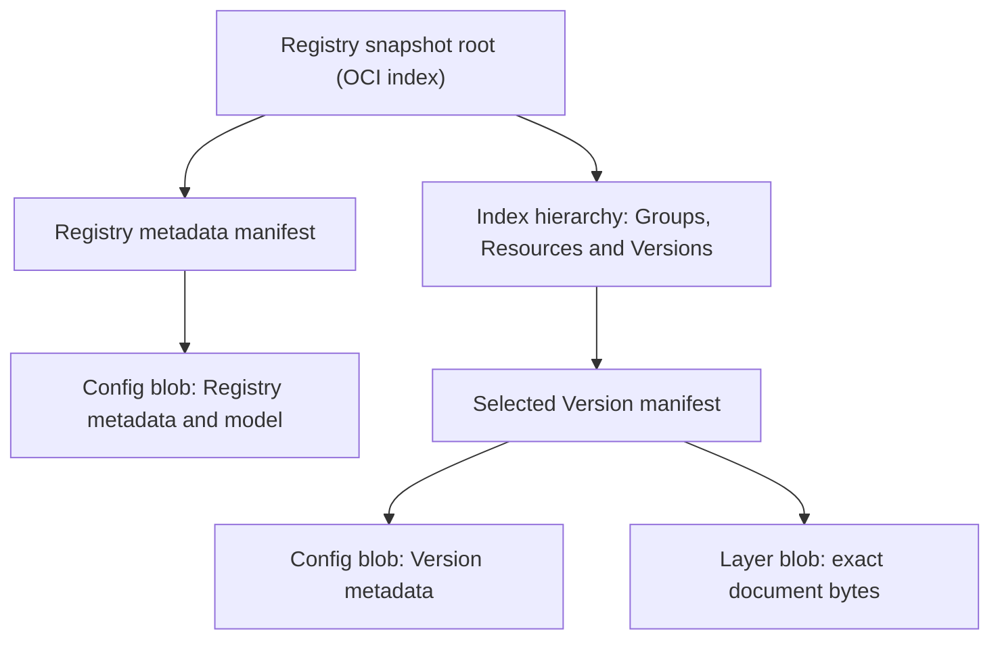
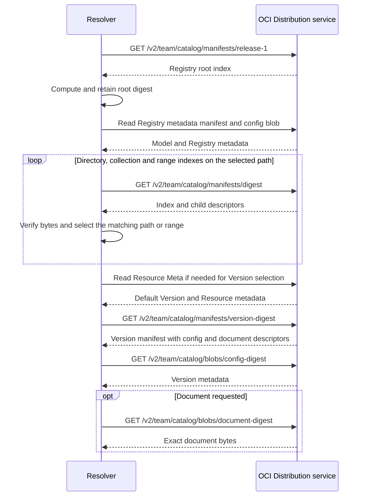

# xRegistry OCI Binding - Working Draft

<!-- words: OCI ORAS DAG DAGs artifactType mediaType schemaVersion -->
<!-- words: modelresolved formatversion hasdocument ximportresources -->
<!-- words: offline-complete bytewise config configs shards sharding -->
<!-- words: unsharded referrers sha256 xref xid xids jsonschema -->
<!-- words: compatibilityvalidated docx federationerror federationprofiles fileid formatvalidated imagelayoutversion namespace opencontainers py readme reparse reserialized standalone symlink -->
<!-- words: resolvedmodelsource -->
<!-- words: registryconfig registrymetadata sequencediagram versionconfig -->

## Abstract

This unreleased working draft defines version 1 of an OCI snapshot format
and a native, read-only federation binding for xRegistry. It supplements
[Core](../../core/spec.md), the [model language](../../core/model.md) and
the [shared federation contract](../federation/spec.md). It is not a
released Core feature, a container image format, or a production client.

One selected OCI image index identifies one complete Registry snapshot.
Standard nested image indexes represent Registry, Group, Resource and
collection containment. Image manifests hold portable metadata configs
and independently addressable Version document blobs. All REQUIRED
content is reachable through ordinary OCI descriptor edges.

## Table of Contents

- [1. Scope and Notation](#1-scope-and-notation)
  - [1.1. Motivation and Example](#11-motivation-and-example)
- [2. Advertisement and Root Selection](#2-advertisement-and-root-selection)
- [3. Media Types and Descriptor Rules](#3-media-types-and-descriptor-rules)
- [4. Containment and Range Shards](#4-containment-and-range-shards)
- [5. Metadata and Documents](#5-metadata-and-documents)
- [6. Native Read Operations](#6-native-read-operations)
  - [Example: Retrieve One Version](#example-retrieve-one-version)
- [7. Production and Publication](#7-production-and-publication)
- [8. Errors and Security](#8-errors-and-security)
- [9. Conformance and Executable Examples](#9-conformance-and-executable-examples)
- [10. References](#10-references)

## 1. Scope and Notation

The key words "MUST", "MUST NOT", "REQUIRED", "SHALL", "SHALL NOT",
"SHOULD", "SHOULD NOT", "RECOMMENDED", "MAY", and "OPTIONAL" are to be
interpreted as described in [RFC 2119][rfc2119].

This profile uses OCI Image Specification **v1.1.1** and Distribution
Specification **v1.1.1**. The former says implementations SHOULD support
nested indexes. This profile strengthens that to **MUST** within its own
producer, resolver and copy-tool conformance boundary. It does not claim
that every OCI client or container runtime supports this format.

An OCI registry service is not the xRegistry Registry entity. An OCI
repository can store many snapshots, possibly from different Registries.
An xRegistry `versionid`, an OCI tag, a Version manifest digest and the
snapshot root digest are four distinct values. None substitutes for
another, and an XID alone does not identify an entity across Registries.

Consumption is read-only. Package construction and publication are
separate operations. Write-through, replication, synchronization, delta
replay, arbitrary domain-document dependency discovery and conflict
resolution are outside this binding. An xRegistry HTTP facade is OPTIONAL
and MUST separately conform to [the HTTP binding](../../core/http.md).

### 1.1. Motivation and Example

OCI artifact stores already distribute immutable, content-addressed data.
This binding packages a Registry as an ordinary OCI descriptor graph so a
publisher can copy and distribute its metadata and documents together,
while consumers can retrieve one Version without downloading every payload.

For example, `oci://registry.example.org/team/catalog` with
`reference: "release-1"` selects a Registry snapshot. The resolver resolves
that tag once, pins the root digest and walks the typed path for
`/dirs/main/files/sample/versions/v1`. Metadata comes from the Version
manifest's config. The document bytes come from its separate layer.

A consumer can perform these native reads directly. A federating API server
can instead use the OCI snapshot as a source behind its consumer-facing API,
following the [shared hosting models](../federation/spec.md#design-hosting-models).
The OCI repository is an access location, not the Registry's XID namespace,
and publishing a new snapshot does not change a pinned read.

The following overview shows what is stored in the artifact. The hierarchy
box includes the Group, Resource, collection-directory and range-shard
indexes detailed in Section 4. It also includes their metadata manifests.



## 2. Advertisement and Root Selection

An advertisement uses the shared `federationprofiles` entry shape:

```json
{
  "name": "oci",
  "endpoint": "oci://registry.example.org/team/catalog",
  "priority": 10,
  "parameters": {
    "reference": "release-1"
  }
}
```

`endpoint` MUST contain an OCI host, an OPTIONAL port, and a nonempty
repository name. The repository MUST obey the Distribution repository
grammar. The endpoint MUST NOT contain credentials, a tag, an `@digest`,
a query, or a fragment. `parameters.reference` is REQUIRED and MUST be
either a Distribution tag (at most 128 characters) or
`sha256:` followed by exactly 64 lowercase hexadecimal digits. Version 1
defines no other parameters. Unknown parameters on a selected entry
produce `unsupported_operation`.

The [advertisement schema](schemas/oci-profile.schema.json) supplements
the shared advertisement rules. URI authority and security checks remain
necessary. Priority and caller selection use the shared contract.

### 2.1. Distribution selection

The locator above maps to the HTTPS Distribution repository
`https://registry.example.org/v2/team/catalog`. Requests use the Distribution
API paths described here. Section 2.2 separately describes a local OCI layout.

The resolver MUST request the selected reference at
`/v2/<repository>/manifests/<reference>`. The returned object MUST be a
Registry index as defined below, not a flat inventory, Version manifest,
layout index, or collection index. The resolver MUST compute SHA-256 over
the exact returned bytes. For a digest reference it MUST compare that
digest with the requested digest. For a tag it MUST retain the computed
digest as the snapshot pin before traversing any child.

All subsequent requests in that operation MUST use descriptor digests,
not re-resolve the tag. Movement of the tag does not change the selected
state. A missing descendant MUST NOT trigger a retry at a newer root.
If a SHA-256 `Docker-Content-Digest` header is present it MUST agree with
the bytes. The header is not a substitute for computing the digest.
An absent header is not an error. A different supported digest algorithm
in that header is verified independently and does not replace the
profile's SHA-256 pin.

### 2.2. Image layout selection

A local layout uses OCI's `oci-layout`, `index.json` and
`blobs/sha256/<hex>` paths. `imageLayoutVersion` MUST be `1.0.0`.
The layout `index.json` is an entry-point index, not itself the Registry
snapshot. It MAY contain several roots and unrelated OCI artifacts.
Every index, including this entry point, MUST satisfy the bounds in
Section 4. A layout with many stored blobs need not list every blob here.

A snapshot entry descriptor MUST use the standard index media type and
`artifactType: application/vnd.xregistry.registry.v1+json`. Its OPTIONAL
`org.opencontainers.image.ref.name` annotation supplies its tag. This
annotation MUST NOT be used as Version identity or on internal edges.
Profile-specific edge annotations are not REQUIRED on layout entries.

A tag selects exactly one matching entry. Multiple entries with that tag
are `ambiguous`, even if they name the same digest. A digest can select a
stored Registry index directly, including one not tagged in `index.json`.
If an interactive tool offers unqualified selection, it MUST select only
when exactly one distinct eligible Registry root digest is advertised.
Zero is `not_found`, and more than one is `ambiguous`. Advertisements
themselves always have an explicit reference.

After selection the resolver MUST verify the root and retain its digest.
It MUST NOT merge different roots. Extra blobs and other selected roots
do not participate in this root's closure. The File binding's
`layout: oci-layout` mode uses these same rules.

## 3. Media Types and Descriptor Rules

The following identifiers are proposed by this unreleased draft. Their
use here does not claim IANA registration.

| Object | `mediaType` | `artifactType` |
| --- | --- | --- |
| Registry index | `application/vnd.oci.image.index.v1+json` | `application/vnd.xregistry.registry.v1+json` |
| Group index | Same standard index type | `application/vnd.xregistry.group.v1+json` |
| Resource index | Same standard index type | `application/vnd.xregistry.resource.v1+json` |
| Collection directory index | Same standard index type | `application/vnd.xregistry.collections.v1+json` |
| Collection index | Same standard index type | `application/vnd.xregistry.collection.v1+json` |
| Metadata manifest | `application/vnd.oci.image.manifest.v1+json` | `application/vnd.xregistry.metadata.v1+json` |
| Version manifest | Same standard manifest type | `application/vnd.xregistry.version.v1+json` |
| Entity config blob | `application/vnd.xregistry.entity.v1+json` | Not applicable |
| Opaque document blob | `application/vnd.xregistry.document.v1` | Not applicable |
| Unused layer placeholder | `application/vnd.oci.empty.v1+json` | Not applicable |

All indexes and manifests MUST set `schemaVersion: 2`, the indicated
`mediaType`, and the indicated `artifactType`. Their annotations MUST
include `io.xregistry.oci.version: "1"`, `io.xregistry.oci.kind`, and
`io.xregistry.oci.xid`. The kind is `registry`, `group`, `resource`,
`collections`, `collection`, `meta`, or `version`, as appropriate.
Metadata manifests use the kind of the entity they describe.

Every internal descriptor MUST contain `mediaType`, `digest`, `size`,
and string-valued annotations `io.xregistry.oci.role` and
`io.xregistry.oci.xid`. The XID is the target entity or collection path.
For collection directories it is the owning entity's XID. A shard
retains its routing index's XID. A config, document or empty layer
descriptor retains its owning entity's XID.

Internal descriptors MUST use SHA-256 and the exact byte length, including
JSON whitespace and any final newline. They MUST NOT use `urls`, `data`,
or `platform`. Blobs MUST actually be available in the same repository
or layout, even for tiny placeholders. An OPTIONAL descriptor
`artifactType` MUST agree with the referenced index or manifest.
Consumers MUST verify both size and digest before interpreting content.

Descriptor roles have these exact meanings:

| Role | Edge and target |
| --- | --- |
| `metadata` | Entity index to its metadata manifest |
| `meta` | Resource index to its Meta metadata manifest |
| `collections` | Entity index to its collection directory |
| `collection` | Directory leaf to one collection index |
| `entity` | Collection leaf to Group/Resource index or Version manifest |
| `shard` | Routing branch to a range shard of the same routing kind |
| `config` | Manifest to the portable entity config |
| `document` | Version manifest to the exact domain-document bytes |
| `empty` | Manifest to the unused-layer placeholder |

`root` is reserved for fixture-tool output and MAY annotate a layout
entry. It is not an internal containment role. A descriptor's role, media
type, XID and target kind MUST agree. Unknown REQUIRED roles are not
silently ignored.

Only the seven annotation suffixes `version`, `kind`, `xid`, `role`,
`mode`, `lower`, and `upper` are defined in `io.xregistry.oci.`.
Unknown keys in that namespace MUST be rejected in version 1. Other OCI
annotations MAY be included but MUST NOT carry REQUIRED containment,
model, labels, or other authoritative entity metadata. Full metadata is
stored in configs, not stringified JSON annotation values. Annotation
keys and string values also obey OCI's annotation rules.

`subject` MUST NOT be used in the REQUIRED snapshot graph. OPTIONAL
provenance and signatures can be separate artifacts associated with the
root through `subject` and referrers. They are not prerequisites for
enumerating or reading the snapshot and are not automatically copied
with ordinary containment.

## 4. Containment and Range Shards

The complete logical structure is:

```text
Registry index
  metadata -> Registry metadata manifest -> config
  collections -> directory index [possibly range-sharded]
    collection -> Group collection index [possibly range-sharded]
      entity -> Group index
        metadata -> Group metadata manifest -> config
        collections -> directory index [possibly range-sharded]
          collection -> Resource collection index [possibly range-sharded]
            entity -> Resource index
              metadata -> Resource metadata manifest -> config
              meta -> Meta metadata manifest -> config
              collections -> directory index
                collection -> versions index [possibly range-sharded]
                  entity -> Version manifest
                    config -> Version metadata config
                    document -> exact bytes
```

All arrows above are standard OCI `manifests[]`, `config`, or `layers[]`
descriptor edges. A custom JSON field containing a digest is not such an
edge. A manifest MUST NOT hide child manifests inside its data layers.

A Registry or Group index MUST contain, in order, exactly one `metadata`
descriptor and one `collections` descriptor. A Resource index MUST
contain, in order, `metadata`, `meta`, and `collections`. Thus entity
indexes remain constant-sized even when the model defines many child
collection types. All their metadata is detached into configs.

A directory has kind `collections`. Its leaf entries use role
`collection` and are keyed by full collection paths. Registry directories
contain exactly the Group collections in the model. Group directories
contain exactly the Resource collections in the resolved model, including
imports and empty collections. A normal Resource directory contains
exactly its `versions` collection. An `xref` Resource directory is empty:
target Versions are not stored again under the source identity.

A collection has kind `collection`. Its leaf entries use role `entity`.
All are immediate children of that collection's typed path. For example,
`/dirs/main/files` contains Resource indexes, while
`/dirs/main/files/report/versions` contains Version manifests. There MUST
be exactly one entry per entity. Paths retain type names as well as IDs.
Neither ID-only keys nor case-folded keys are sufficient.

### 4.1. Bounds and ordering

**Every index MUST have at most 256 `manifests` descriptors and at most
1,048,576 encoded JSON bytes. Both limits apply independently.** Counts
include metadata and control descriptors, not just entity entries.
Routing indexes and the layout entry-point index are not exceptions.
The byte count is over the exact UTF-8 object representation used for
the digest, including whitespace, annotations and a final newline, if any.
It is not the character count or a reserialized estimate.

A producer MUST split a routing index before either limit is exceeded.
It MAY shard smaller indexes. An individual entry or fixed entity index
that cannot fit is `limit_exceeded`. Silently dropping data is forbidden.
No collection size is capped at 256: additional routing levels support
arbitrarily large finite collections. A consumer MAY impose separately
reported depth, total-byte or object-count policy limits.

Keys are complete, validated Core XIDs or collection paths, compared
lexicographically by their UTF-8 bytes, case-sensitively, without URI
decoding, Unicode normalization or locale collation. Core ID grammar
makes these keys ASCII in the referenced Core version. Thus `A` precedes
`a`. `v10` precedes `v2`. Labels do not determine these keys.

### 4.2. Exact range representation

Every directory, collection and shard MUST carry these annotations:

| Annotation | Meaning |
| --- | --- |
| `io.xregistry.oci.mode` | `leaf` or `branch` |
| `io.xregistry.oci.lower` | Inclusive lower key. `""` means negative infinity |
| `io.xregistry.oci.upper` | Exclusive upper key. `""` means positive infinity |

The top directory or collection has range `["", "")`, meaning the whole
key space in this notation, not an empty interval. Other nonempty bounds
MUST themselves be valid keys in the routing scope. A finite lower bound
MUST be strictly less than a finite upper bound.

A **leaf** has only the appropriate `collection` or `entity` descriptors,
strictly sorted by XID. Each key MUST be at least the lower bound and
strictly below the upper bound. Duplicates are invalid even when their
descriptors are identical. An empty collection or directory MUST be an
unsharded leaf with zero descriptors and the whole-space range.

A **branch** has at least two `shard` descriptors. Every shard descriptor
MUST have `lower` and `upper` annotations equal to those on its target
index. Target kind and XID MUST equal the parent's. The first lower
bound MUST equal the parent's lower bound. The last upper bound MUST
equal the parent's upper bound. Every intervening upper bound MUST equal
the next lower bound, and MUST be finite. The descriptors MUST be ordered
by these bounds. All shards MUST contain at least one eventual entry.
Branch and leaf entry roles MUST NOT be mixed.

For example, these two adjacent intervals route key `/dirs/m` to the
second shard:

```json
[
  {"lower": "", "upper": "/dirs/m"},
  {"lower": "/dirs/m", "upper": ""}
]
```

This illustrates the annotation values. A boundary MAY fall between existing
entity IDs. Gaps in the set of entity IDs are ordinary. Gaps or overlaps in
routing intervals are invalid. A producer can choose each split boundary
as the first key in the right-hand shard. Split choice is not globally
canonical.

A lookup selects exactly one containing interval at each level and then
an exact key in a leaf. A well-formed leaf without the key is `not_found`.
Missing shards, conflicting bounds, duplicate keys and overlapping
entries are not absence: they are `invalid_package`. A full validator
MUST verify the complete partition and closure, not just a successful
lookup path. A selective reader validates the path it consumes.

## 5. Metadata and Documents

### 5.1. Portable entity configs

Each metadata or Version manifest has one config conforming to
[the record schema](schemas/oci-record.schema.json). This is a portable
decomposition of Core metadata, not an independent Core API response.

```json
{
  "formatversion": 1,
  "kind": "resource",
  "entity": {
    "fileid": "report",
    "xid": "/dirs/main/files/report"
  }
}
```

The `kind` MUST agree with the containing manifest and structural path.
`entity` MUST preserve Core attributes and model-defined extensions,
including nested extension values, timestamps, epochs, label maps, IDs,
Version ancestry and explicitly selected defaults.

The following storage decomposition is REQUIRED:

- `xid` and the model's singular ID attribute are present on every entity.
  A Version also has `versionid`, `ancestorid`, `isdefault`, `epoch`,
  `createdat` and `modifiedat`. A Registry or Group has `epoch`,
  `createdat` and `modifiedat`.
- A normal Meta has `epoch`, `createdat`, `modifiedat`, `readonly`,
  `defaultversionid` and `defaultversionsticky`. Its default names an
  existing Version, and `isdefault` on every Version agrees with it.
- A Resource record contains its own ID and XID, not a duplicate of the
  default Version attributes. Its Meta and Versions are separate leaves.
- Computed `self`, `shortself`, `metaurl`, `defaultversionurl`, and
  collection `url`/`count` fields are absent from records. Nested Core
  collections and `meta` are absent, since their containment is expressed
  by descriptors. These rules do not delete similarly named properties
  inside extension objects.
- `formatvalidated` and `compatibilityvalidated` are absent, as in Core
  document view. Domain documents are detached, never duplicated in the
  `<RESOURCE>` or `<RESOURCE>base64` fields of configs.

The config schema supplements the Core model. It is not a second,
hand-maintained full Resource schema. Core-required attributes, dynamic
singular names, model constraints and descriptor consistency require
semantic validation in addition to JSON Schema.

### 5.2. Model preservation

The Registry config additionally MUST contain `snapshot` with value
`linked` or `offline-complete`, and `modelresolved`. Its `entity` MUST
include `specversion`, `registryid`, `model`, `modelsource` and
`capabilities`. Capabilities MUST describe access to this read-only
snapshot, not advertise the source server's write operations or unsupported
HTTP flags as native OCI features. Other Registry metadata preserves the
captured identity and state. Capability mapping does not change its XIDs.

The config's capabilities carry the shared
[resolution-owner signal](../federation/spec.md#signaling-who-performs-resolution).
A combined view declares `federation.resolution: "producer"` so consumers read
it directly instead of repeating catalog resolution. An absent signal
defaults to `consumer`. This value describes the supplied view, independently
of the root digest and linked/offline-complete class.

`entity.model` is the full resolved Core model, including Core attributes.
`entity.modelsource` is the original model-source value. `modelresolved`
is that model source after Core `$include`/`$includes` processing but
**before** expanding `ximportresources` or adding implicit Core aspects.
It uses the existing Core model-source language, not a new model format.
It MUST retain Resource type-sharing provenance.

`modelresolved` MUST NOT contain unresolved include directives. The full
model MUST reflect the same resolved definitions and imports. This lets
consumers interpret the snapshot without fetching a mutable remote
model, while preserving the original source for inspection. Includes
are resolved at capture time using Core precedence, JSON Pointer,
cycle detection and the original containing document's URI base.
An original include URI is provenance, not a consumption-time instruction.

Different independently defined Resource types are not equivalent merely
because their expanded schemas are structurally equal. Use the retained
`ximportresources` graph when checking Core `xref` type identity.

### 5.3. Version documents and placeholders

A Version config MUST have a `document` object containing `mode`:

| Mode | Meaning and Version manifest layer |
| --- | --- |
| `embedded` | One `document` layer with exact bytes, possibly zero bytes |
| `external` | One `empty` layer. Core `<RESOURCE>url` names uncaptured content |
| `metadata-only` | One `empty` layer. Resource model has `hasdocument: false` |

An external URL MUST be absolute and credential-free. A relative
domain-document locator MUST be resolved against its original retrieval
base before capture, never against an OCI repository, XID, or config
blob path. A captured copy of an externally stored document uses
`embedded`. Its original locator MAY be retained as `document.origin`,
not as a misleading Core `<RESOURCE>url`. Embedded content MAY also retain
an absolute `document.base` for relative references inside the domain
document. A resolver MUST preserve this base when returning the bytes. It
MUST NOT substitute the OCI repository or config path. Both OPTIONAL fields
MUST be credential-free absolute URIs and MUST appear only in `embedded`
mode. The selected snapshot supplies the pinned bytes, not a fresh fetch
of the original locator.

`metadata-only` MUST agree with `hasdocument: false`. Such Versions MUST
NOT have document bytes or `<RESOURCE>url`. All other modes require
`hasdocument` to be true. Only `external` has a Core `<RESOURCE>url`.
An `external` Version cannot claim to contain bytes. Missing an expected
`embedded` blob is an invalid package, not an empty document. Core requires
a document-capable Version to have a document, even if its length is zero.
There is no successful "absent document" state for that Version.

The opaque document media type on the OCI layer intentionally does not
vary with the domain format. It prevents a domain document that itself
contains OCI JSON from being mistaken for a nested manifest. No tar
wrapper, compression, newline conversion or JSON reformatting is applied.
Core `contenttype`, if present, preserves the domain response media type,
including parameters. If absent, the domain response is
`application/octet-stream`. The absent metadata is not silently rewritten.

All metadata manifests and non-embedded Version manifests MUST have one
`empty` layer. Its media type is `application/vnd.oci.empty.v1+json`,
its content is exactly the two bytes `{}`, its size is 2, and its digest
is `sha256:44136fa355b3678a1146ad16f7e8649e94fb4fc21fe77e8310c060f61caaff8a`.
This follows OCI's portability guidance for an unused layer. It is not a
domain document. In contrast, an actual empty domain document has size
0 and digest
`sha256:e3b0c44298fc1c149afbf4c8996fb92427ae41e4649b934ca495991b7852b855`.
Consumers MUST NOT replace one with the other.

### 5.4. Snapshot completeness

Both snapshot classes MUST contain the complete internal descriptor
closure: all structural indexes, metadata manifests, configs, embedded
documents and placeholders. OCI layout's general allowance for missing
blobs does not relax this profile.

A `linked` snapshot MAY have `external` documents. An `offline-complete`
snapshot MUST NOT: every document declared to exist in its captured
scope has embedded bytes. `metadata-only` explicitly declares no domain
document and does not invalidate offline completeness. An
offline-complete claim does not guarantee availability of a domain
document for every possible document request.

External federation advertisements, descriptive relationships,
documentation URLs, original model-source include URLs and arbitrary
links inside domain documents are not recursively captured by this
claim. Scope is exactly the single selected Registry snapshot, not every
Registry mentioned by its metadata.

### 5.5. Core document-view results and local references

Raw config records are storage objects. A native metadata operation MUST
assemble a Core document-view result rather than expose a config as an
API entity. The baseline view inlines the requested metadata subtree,
including Meta and Version metadata, but not domain-document bytes.
It recreates collection counts and navigation fields. `self` and
navigation URLs MUST be valid `#`-prefixed JSON Pointers into that
returned document. `#` denotes the empty pointer to the document root.
Transport endpoint and snapshot pin are separate result context.

For standalone Meta retrieval, the returned metadata document contains
the owning Resource and its Version metadata, and identifies `/meta` as
the selected JSON Pointer. This supplies a real in-document target for
`defaultversionurl` without inventing an OCI API URL. For collection
retrieval the document is the Core ID-keyed collection map.

An implementation offering a different partial view MUST provide actual
retrievable, Core-conforming absolute URLs for non-inlined navigation, or
report `unsupported_operation`. An arbitrary implementation-defined
`oci:` URI MUST NOT be presented as a conforming `self` URL.

An `xref` Resource and Meta store only their source ID, XID, and, on
Meta, `xref`. Their metadata result keeps source identity and excludes
target metadata and Versions, exactly as Core document view requires.
Metadata requests for their Versions or Versions collection produce
`unsupported_operation` corresponding to Core `cannot_doc_xref`.
Dangling references and targets that are themselves aliases retain this
unexpanded serialization. They are not invalid packages.

A domain-document operation is not the Core `doc` metadata flag. It MAY
resolve the source Resource's default, or an explicit Version's bytes,
through one local `xref` hop. A resolver supporting this operation MUST
verify same-Registry and same Resource model type, MUST NOT chase a second
hop, and MUST retain source target identity separately from the resolved
Version XID. A dangling or alias target has no retrievable document.
Absolute remote `xref` values or wrong Resource model types are invalid.
Core `<RESOURCE>url` is a document locator, never a metadata alias.

## 6. Native Read Operations

The operation names below are the shared abstract read contract, not new
HTTP routes. The native wire protocol is OCI Distribution.

| Requested data | Resolution |
| --- | --- |
| Registry metadata | Root `metadata` config, then its metadata subtree |
| `model`, target `/` | Full `model`, original `modelsource`, and resolved source in a separate `resolvedmodelsource` result field |
| `capabilities`, target `/` | Registry config capabilities |
| Group or Resource metadata | Typed directory/collection path, then metadata leaves |
| Meta | Resource `meta` leaf, assembled with its Resource context |
| Collection enumeration | All leaves of that typed collection |
| Explicit Version metadata | One Version manifest and its config |
| Default document | Resource Meta's `defaultversionid`, then that Version |
| Explicit Version document | That Version's config and `document` layer |

Indexes and manifests use
`GET /v2/<repository>/manifests/<digest>`. Config, document and placeholder
blobs use `GET /v2/<repository>/blobs/<digest>`. Clients MUST NOT use the
blob endpoint for an index merely because a local layout stores all
objects below `blobs`. Nor is the document layer's XID a Distribution URL.

Manifest requests MUST advertise both standard index and image-manifest
media types in `Accept`. The response's media type, ignoring HTTP
parameters, MUST agree with the descriptor and JSON `mediaType`.
`HEAD` MAY be used for existence checks but does not replace byte
verification. Unsupported REQUIRED artifact kinds or format versions
are reported explicitly rather than mistaken for empty collections.

A direct Version lookup fetches the routing path, the selected Version
manifest and config, and, only for a document operation, its payload.
It MUST NOT require downloading unrelated Version documents or the
whole Registry's metadata. Model and capabilities bootstrap, and
Resource Meta needed for default consistency, are permitted.
Full closure validation is a separate, potentially exhaustive operation.

Label selection is scoped to a named collection. It uses the shared
Core case-insensitive string comparison on the named label's literal
value. The key is not an implicit language key. Absent labels do not
match. Empty strings are valid values. There is no forced Unicode
normalization or wildcard interpretation.

A Resource's selection metadata uses the default Version's labels, with
Core one-hop `xref` rules, before document-view serialization removes
that projection. A Group or Version uses its own labels. The resolver
MUST examine every necessary shard before asserting uniqueness. Zero
matches are `not_found`. Multiple matches are `ambiguous`, including a
match on a later page. OPTIONAL acceleration MUST NOT alter this result
or hide missing content. Version documents need not be fetched to select
by label.

For `embedded`, the document result is the verified bytes and preserved
domain content type and any explicit document base. `metadata-only` is
`unsupported_operation`. Missing expected content is an invalid package.
Fetching an `external` document requires
separate caller policy and URI handling, and its mutable bytes are not
pinned by the root digest. An offline-only reader reports `unavailable`
instead of returning the placeholder as document content.

### Example: Retrieve One Version

For `/dirs/main/files/sample/versions/v1`, the resolver follows only the
indexes on that typed path. This sequence summarizes the native Distribution
requests. The resolver verifies each descriptor before interpreting its
referenced bytes. Reading metadata alone stops before the document-layer
request.



`digest`, `version-digest`, `config-digest` and `document-digest` are
placeholders for the complete digests obtained from descriptors, not literal
request values. The initial tag is not read again during this operation.
Other Versions' document layers are not needed.

## 7. Production and Publication

A producer MUST capture a coherent Registry state, including model,
capabilities, defaults and Version metadata. If its source changes in a
way that prevents coherent capture, it MUST report `inconsistent_snapshot`
and MUST NOT publish the capture as a complete snapshot.

Production proceeds from leaves to root:

1. Encode and digest exact config and document bytes, plus placeholders.
2. Construct Version and metadata manifests with those blob descriptors.
3. Construct collection shards, directories and entity indexes bottom-up,
   checking both index bounds against their final encoded bytes.
4. Validate model correspondence, ordering, range partitions, defaults,
   document states and complete descriptor closure.
5. Upload blobs using Distribution's blob upload protocol. Publish child
   manifests and indexes through the manifest endpoint, then the root.
6. Only after the root's closure is available, create or move a tag to it.

A publisher SHOULD use the Distribution existence and blob-mount
mechanisms to reuse content where supported. Reusing an unchanged
subtree's digest avoids rewriting its descendants. Each newly published
root still denotes a complete graph. Reading it MUST NOT require an old
snapshot, parent root, delta chain or replay log.

JSON serialization and shard grouping choices affect digests. A producer
MAY make its own outputs reproducible, but this profile does not define
a globally canonical semantic digest. A digest is integrity for exact
bytes, not proof of common authority or semantic equality.

Copying MUST preserve the selected root and all standard containment
descendants. A compatible artifact copier MUST support nested indexes,
typed artifact configs, opaque layers and zero-byte document blobs.
Normal containment copy does not require a referrers operation.
ORAS's `--recursive` option concerns referrer artifacts. It is not the
definition of nested-index containment traversal.

## 8. Errors and Security

Use the [abstract resolver outcomes](../federation/spec.md#errors) defined
by the Federation specification:

| Condition | Outcome |
| --- | --- |
| The requested root, entity key or Version does not exist | `not_found` |
| A document read through a local alias has no accessible one-hop target | `not_found` |
| A document is requested from a metadata-only Resource | `unsupported_operation` |
| More than one selected root or label match | `ambiguous` |
| Unknown profile or format version | `unsupported_binding` or `unsupported_version` |
| Unsupported operation, view or parameter | `unsupported_operation` |
| Bad digest or byte size | `integrity_error` |
| A referenced index, manifest, config or embedded document blob is missing | `invalid_package` |
| Invalid roles, ranges, model or identity | `invalid_package` |
| Incoherent capture or immutable state replaced during access | `inconsistent_snapshot` |
| Exceeded format or configured traversal limits | `limit_exceeded` |
| Disallowed access, unsafe URI or filesystem escape | `policy_denied` |
| Network or storage access fails | `unavailable` |
| External document content cannot be retrieved through the selected access method | `unavailable` |

Duplicate JSON keys, invalid UTF-8 and non-JSON numbers MUST be rejected.
Consumers MUST detect cycles and impose finite resource budgets. Budget
exhaustion is not successful, truncated enumeration. Verification of a
chosen path does not prove that every unvisited shard is well-formed.

Use authenticated HTTPS and repository-scoped credentials under caller
policy. OCI metadata MUST NOT contain credentials. Redirect destinations,
external document URLs and filesystem roots require independent policy
checks. Authorization headers MUST NOT be forwarded indiscriminately.
A layout reader MUST prevent path traversal and symlink or reparse-point
escape. A blob name is derived from a validated digest, never from an ID.

Untrusted document blobs are data, not executable code. Consumers MUST
NOT execute hooks, start containers, extract archives or interpret domain
links merely to traverse this profile. Integrity does not establish
publisher authorization. Trust decisions and OPTIONAL signature checks
are distinct from format validity. Integrity and policy errors MUST NOT
silently trigger fallback to another
[advertisement](#2-advertisement-and-root-selection), as specified by the
[Federation binding-selection rules](../federation/spec.md#discovery-and-binding-selection).

## 9. Conformance and Executable Examples

A **producer** implements Sections 2 through 5 and 7. A **native resolver**
implements root pinning, metadata/document operations, range traversal,
shared selection, Core view semantics and integrity/error rules. A
**linked snapshot** and an **offline-complete snapshot** satisfy their
respective Section 5.4 requirements. A **compatible copier** preserves
the selected descriptor closure. Claims MUST state which roles apply.

The [graph schema](schemas/oci-graph.schema.json) supplements the
[standard OCI schemas][oci-schemas]. Both sets apply. JSON Schema alone
does not validate exact encoded sizes, digests, sorted non-overlapping
ranges, model semantics or graph completeness.

The checked-in [OCI samples](../federation/samples/oci/README.md) contain
real small layouts, exact digests, metadata-only and zero-byte documents,
multiple roots, local aliases and forced multi-level shards. The helper
[`tools/oci_examples.py`](../../tools/oci_examples.py) builds, validates
and selectively reads these offline fixtures. It records actual file
fetches, distinguishes exhaustive validation from lookup, and performs
no network requests or production publication.

The sample README documents the CLI and reproducible, artifact-aware
layout-to-layout copy command. A copy exercise MUST execute the tool,
then verify the copied root digest and all REQUIRED descendants. Merely
parsing JSON or quoting tool help is not interoperability evidence.
Environment-specific logs and downloaded tools belong outside the
repository's samples.

## 10. References

- [OCI image index v1.1.1][oci-index]
- [OCI image manifest and artifact usage v1.1.1][oci-manifest]
- [OCI descriptors v1.1.1][oci-descriptor]
- [OCI annotations v1.1.1][oci-annotations]
- [OCI image layout v1.1.1][oci-layout]
- [OCI Distribution v1.1.1][oci-distribution]
- [OCI schemas v1.1.1][oci-schemas]
- [Core specification](../../core/spec.md) and
  [model language](../../core/model.md), repository revision of this draft
- [ORAS copy command][oras-copy] (informative. Exercise pins ORAS 1.3.0)
- [JSON Pointer, RFC 6901][rfc6901]

[rfc2119]: https://www.rfc-editor.org/rfc/rfc2119
[rfc6901]: https://www.rfc-editor.org/rfc/rfc6901
[oci-index]: https://github.com/opencontainers/image-spec/blob/v1.1.1/image-index.md
[oci-manifest]: https://github.com/opencontainers/image-spec/blob/v1.1.1/manifest.md
[oci-descriptor]: https://github.com/opencontainers/image-spec/blob/v1.1.1/descriptor.md
[oci-annotations]: https://github.com/opencontainers/image-spec/blob/v1.1.1/annotations.md
[oci-layout]: https://github.com/opencontainers/image-spec/blob/v1.1.1/image-layout.md
[oci-distribution]: https://github.com/opencontainers/distribution-spec/blob/v1.1.1/spec.md
[oci-schemas]: https://github.com/opencontainers/image-spec/tree/v1.1.1/schema
[oras-copy]: https://oras.land/docs/commands/oras_cp/
