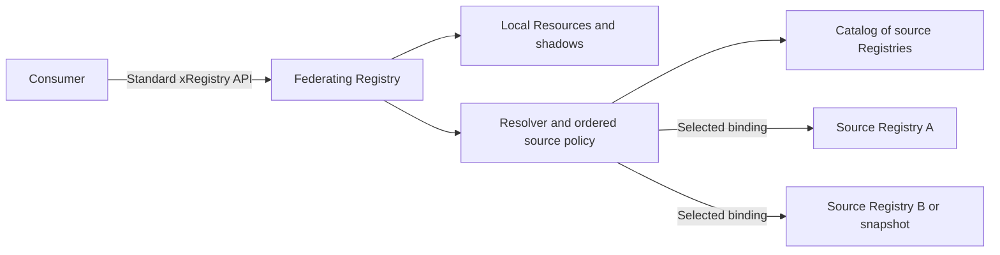
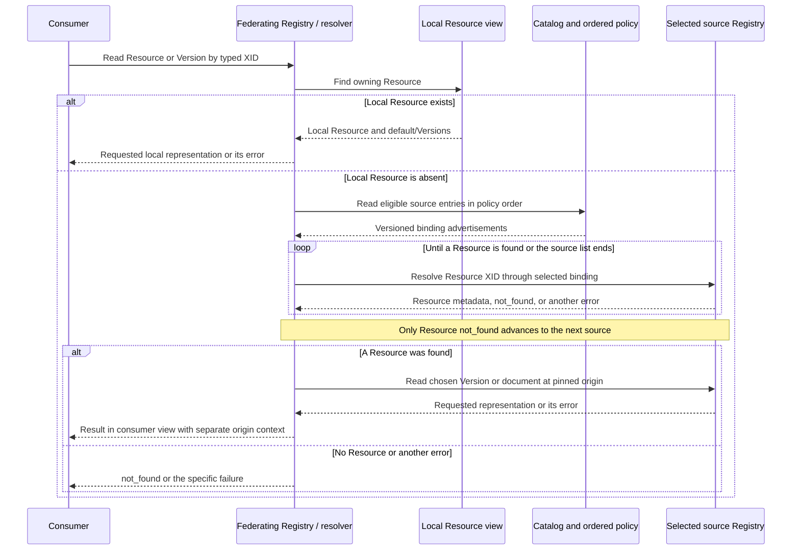

# xRegistry Federation

<!-- words: applicationuri federationprofiles nfc nodeid nodeids opc opcua rebasing registrygroups registryroot reparse standalone symlinks transportprofileuri ua website weburl xregurl -->
<!-- words: py sequencediagram -->
<!-- words: assetid selectedxid -->

## Abstract

This specification defines read-only resolution across independently
administered xRegistries. A Registry of Registries describes access methods.
A resolver chooses a method, establishes a Registry context and interprets
that Registry using xRegistry Core. Protocol bindings define retrieval.

## Table of Contents

- [Overview](#overview)
- [Notations and Terminology](#notations-and-terminology)
- [Design: Hosting Models](#design-hosting-models)
  - [Signaling Who Performs Resolution](#signaling-who-performs-resolution)
- [Design: Resolving a Consumer Request](#design-resolving-a-consumer-request)
  - [Example: Select After Applying Shadows](#example-select-after-applying-shadows)
- [Discovery and Binding Selection](#discovery-and-binding-selection)
- [Read Operations](#read-operations)
- [Identity and References](#identity-and-references)
- [Selectors](#selectors)
- [Representations](#representations)
- [Snapshots and Completeness](#snapshots-and-completeness)
- [Errors](#errors)
- [Security Considerations](#security-considerations)
- [Conformance](#conformance)
- [References](#references)

## Overview

Federation permits a consumer to find and read entities through a Registry
without requiring all content to be stored in that Registry. A Registry can
serve local Resources and obtain other Resources from configured source
Registries. A locally supplied Resource can shadow a Resource available from
a source Registry. The consumer's access point remains the Registry.

The [Registry domain](../models/registry/spec.md) contains a
`categories` / `registries` hierarchy for describing source Registries and
their access methods. These descriptions form a catalog that the resolver
uses for discovery. A catalog entry is a metadata-only Resource describing
another Registry. It is not that Registry's root, and a consumer need not
query or even see the catalog when an API server resolves requests for it.

For example, an organization can expose a Registry containing a locally
approved asset at `/documents/main/assets/approved`. It can also use a
supplier's Registry to serve `/documents/main/assets/supplied`, which is not
locally present. Requests for `approved` use the local Resource even if the
supplier advertises a Resource with that path. The source selection policy
defines which supplier Registries participate and their order.

This specification defines the shared interpretation of resolution requests.
[HTTP](../bindings/http-federation.md), [OCI](../bindings/oci.md),
[Git](../bindings/git.md), [File](../bindings/file.md) and
[OPC UA](../bindings/opcua.md) define how to perform those reads. The
[directory mapping format](../bindings/mapping.md) is shared by Git and File.
Native bindings do not require an HTTP facade.

This specification does not define synchronization, replication, write-through,
global entity identifiers, arbitrary merge precedence or discovery of
dependencies embedded inside domain documents. OCI publication is a separate
producer operation.

## Notations and Terminology

The key words "MUST", "MUST NOT", "REQUIRED", "SHALL", "SHALL NOT",
"SHOULD", "SHOULD NOT", "RECOMMENDED", "MAY", and "OPTIONAL" in this
document are to be interpreted as described in
[RFC2119](https://www.rfc-editor.org/rfc/rfc2119).

This specification uses [Core terminology](../../core/spec.md) and the
[Core model language](../../core/model.md), Version 1.0-rc4. A binding's
format-version discriminator identifies its package interpretation, not a
different Core Version or a catalog-description Version.

| Term | Meaning |
| --- | --- |
| Catalog | A Registry using the Registry domain to describe other Registries. |
| Catalog entry | A `registry` Resource under a `category` Group. |
| Advertisement | One access method in a catalog-description Version. |
| Registry context | The selected logical Registry, model and access context in which an XID is interpreted. |
| Revision pin | A binding's immutable snapshot selection, when supported. |
| Origin | The catalog entry, advertisement and revision used for a result. |
| Resolver | The client-side or server-side component selecting the source and retrieving a requested entity or document. |
| Resolution owner | The side responsible for producing the selected Registry view: its consumer or its producer. |
| Federating Registry | The consumer-visible Registry whose view combines local Resources and explicitly configured source Registries. |
| Source Registry | A Registry selected as a source by the federating Registry's composition policy. |
| Shadow Resource | A local Resource that takes precedence over the same Resource path in configured sources. |
| Alias | A Resource using Core [`meta.xref`](../../core/spec.md#cross-referencing-resources) to reference another Resource in the same Registry. |
| Selector | A criterion used to select members of a collection, such as a label key and value. See [Selectors](#selectors). |
| Snapshot | A captured Registry state read as one selected revision. See [Snapshots and Completeness](#snapshots-and-completeness). |
| Package | A stored representation of a snapshot's metadata and declared documents, using the document-tree or OCI format. |
| Linked snapshot | A complete internal package graph allowing explicit external document references. |
| Offline-complete snapshot | A snapshot also carrying all declared xRegistry documents in its selected scope. |

The catalog's `registryid`, its entry's `registryid` and the described
Registry root's `registryid` have different scopes. Their values need not
match. A catalog-description `versionid`, target Resource `versionid`, OCI
digest, Git commit and endpoint address MUST NOT be treated as interchangeable.

## Design: Hosting Models

Core defines [Registry views](../../core/spec.md#design-registry-views) and
[no-code servers](../../core/spec.md#design-no-code-servers). Federation
supports the same separation between a Registry's representation and the
component performing reads. It does not require every consumer to implement
every binding.

### Client-Side Resolution

A federation-aware consumer can read a Registry and its configured catalog,
select a source and access that source's native binding directly. In this
hosting model, the resolver runs in the consuming application or a library.
The application supplies the local view, permitted source scope and ordering.
The consumer retains each result's source context and revision separately
from its XID.

This is the default when no resolution-owner capability is declared.

This model is useful for offline tools or applications that already support
OCI, Git or other native bindings. A stored catalog alone does not execute
the selection algorithm. The client performs the additional reads.

### API Server Resolution

A federating API server performs resolution for consumers that call its
ordinary xRegistry API. For example, an HTTP consumer reads a Resource or
Version using [Core HTTP](../../core/http.md). The server checks its local
Resource store and, when appropriate, resolves through its configured catalog.
The consumer does not need a separate federation request envelope.

A conforming server-hosted resolver MUST expose a Core-conforming Registry
through each consumer-facing binding that it implements. Its model MUST
describe the resulting view. Responses, including source-derived data, MUST
use the consumer-facing Registry's identity and navigation according to that
binding. Source provenance and revision information remain separate.

The server MUST apply the source-selection, shadowing, error and completeness
rules below. It MUST NOT expose unrelated source identities as though their
XIDs were globally interchangeable. The server's advertised capabilities
describe what it can provide, not the union of features advertised by sources.

The server MUST signal `producer` resolution for this consumer-facing view
as specified below. Its clients read the server's results directly instead
of repeating the server's catalog traversal.

### No-Code and Stored Views

A no-code server can serve a previously assembled Registry representation
without executing federation on each request. A producer performs resolution
when creating that stored view. Its consumers read the captured state, not
live changes in every referenced Registry.

The producer MUST signal `producer` resolution in the stored view's
capabilities. Storing files alone does not imply that federation has been
performed. A stored Registry intended for consumer-side composition retains
the default `consumer` behavior.

Core single-document exports and multiple-document views remain available.
The [directory mapping](../bindings/mapping.md) and
[OCI](../bindings/oci.md) bindings additionally define storage formats with
explicit content and integrity references. Their
[snapshot completeness](#snapshots-and-completeness) rules identify which
content has been captured. A live resolver MAY consume these stored
snapshots as source Registries.

The following topology shows a server-hosted resolver. In the client-side
model the same resolver and policy reside in the consumer instead.



### Signaling Who Performs Resolution

The OPTIONAL `federation` extension in the Registry's enabled
[Core capabilities](../../core/spec.md#registry-capabilities) identifies
who performs federation resolution for the selected view. It is not a
catalog attribute, an `xref` value, or an entry in the `flags` array.

The extension is an object containing the REQUIRED string field
`resolution`. Its values are case-sensitive:

| Value | Producer responsibility | Consumer behavior |
| --- | --- | --- |
| `consumer` | Supplies the local view and catalog information used by the consumer's composition policy. | Applies local shadowing and the configured source-resolution process. |
| `producer` | Supplies the combined view, either assembled before publication or resolved by an API server on demand. | Reads that view directly. Does not repeat its federation resolution. |

If the `federation` capability is absent, the consumer MUST use `consumer`.
This preserves the default behavior for existing Registries. If the
capability is present, `resolution` MUST be present and MUST be a string.
Malformed data produces `invalid_package`. An unknown owner value or
unsupported field produces `unsupported_operation`. It MUST NOT silently
fall back to consumer-side resolution.

For example, a producer supplying a combined, read-only view exposes:

```json
{
  "available": {
    "capabilities": {"mutable": false},
    "entities": {"mutable": false},
    "model": {"mutable": false}
  },
  "federation": {
    "resolution": "producer"
  }
}
```

The explicit consumer form is:

```json
{
  "available": {
    "capabilities": {"mutable": false},
    "entities": {"mutable": false},
    "model": {"mutable": false}
  },
  "federation": {
    "resolution": "consumer"
  }
}
```

Omitting `federation` from the second example has the same resolution
behavior. The [capability schema](schemas/capabilities.json) supplements
Core's capability rules without redefining the other fields.

A federation-aware consumer MUST inspect this signal before traversing a
view's catalog. It obtains enabled capabilities through the selected
binding's capability read or an equivalent inlined representation. An
offered capability is not the enabled value. A failed metadata read is not
an absent signal and MUST be handled according to that binding's error rules.

With `producer`, the consumer MUST NOT use the view's catalog to repeat
composition for the same request. This applies to entity reads, collection
enumeration, label selection and default/explicit Version reads. A
`not_found` or other failure returned by the producer MUST NOT trigger
fallback through that producer's catalog. A producer therefore advertises
this value only when it handles resolution for the whole view it exposes,
not a partially combined result requiring its consumer to finish the work.

For example, suppose a stored combined view already contains the selected
`/documents/main/assets/item`. With `producer`, the consumer reads that
Resource and its chosen Version from the view. It does not read the catalog
and contact source A again. With the capability absent or set to `consumer`,
it follows the local-first process described in the next section.

The value applies to the selected Registry root, access context and revision.
A capture MUST retain the value appropriate to its resulting view, not copy
`producer` from an upstream view whose composition it has not preserved.
Consumers MUST keep that choice for the operation. Observing it change
during a consistent multi-read capture produces `inconsistent_snapshot`.

Resolution ownership does not promise immutability or offline completeness.
A producer-resolved HTTP view can be live. A local snapshot can still declare
consumer resolution if its catalog is intended to be followed. Ordinary
document URL retrieval and local Core aliases keep their existing semantics.
An explicit request to another Registry, or a new composition that uses this
view as one source, is a separate operation rather than automatic repetition
of its catalog resolution.

## Design: Resolving a Consumer Request

The following composition process applies when
[`resolution` is `consumer`](#signaling-who-performs-resolution), including
when the capability is absent. With `producer`, the consumer instead uses
the selected view's ordinary read operations without entering this process.
A server or publisher creating a producer-resolved view applies these same
composition rules to its inputs. The signal describes responsibility to
that view's consumers, not how the producer implements its own resolution.

Resolution starts with an operation and a typed target in the consumer's
Registry view. An exact Resource or Version request uses an XID. A collection
request can additionally use a [selector](#selectors), such as
`stage=production`, to find one matching member. Selecting a source Registry
and selecting a binding for that source are separate decisions.

### Local Resources and Ordered Sources

The federating Registry MUST use an explicit composition policy identifying
the eligible catalog entries, their order and the Resource paths they can
supply. That ordered list is configuration, not JSON object-map order or
Category enumeration order. This specification does not add a catalog
attribute for that list. A caller MAY choose one source explicitly instead.
An unordered set of potentially competing origins is insufficient to choose
a winner and MUST produce `ambiguous` when disambiguation is needed.

For Resource metadata, Meta, Version metadata and document reads, the unit
of shadowing is the Resource, including all of its Versions:

1. Check the requested Resource path in the local Registry view. A present
   local Resource wins, including a local alias. Its missing Version or
   unavailable document MUST NOT be filled from another Registry.
2. If the Resource is absent locally, visit the eligible source entries in
   their configured order. For each entry, select a catalog-description
   Version and then one binding using
   [Discovery and Binding Selection](#discovery-and-binding-selection).
3. Resolve the same typed Resource XID in the selected source context. A
   policy that projects a different source path MUST define that mapping
   explicitly. The source's model and data MUST be compatible with the
   consumer-visible model for that path.
4. A Resource is **found** when that exact Resource exists and its metadata
   can be interpreted under the selected source context and composition
   policy. A successful empty collection, a reachable endpoint or a catalog
   entry alone is not a found Resource.
5. Stop at the first found Resource. Select its requested Version, or its
   Core default Version, and obtain the requested representation. All Meta,
   Version and document reads for this Resource MUST use that selected
   origin and revision. Do not merge Version sets across origins.
6. A source Resource result of `not_found` permits trying the next configured
   source entry. Exhausting the list yields `not_found`. Other failures,
   including authorization denial, unsupported binding/version, malformed
   data and integrity failure, MUST be reported rather than treated as
   absence.

Thus the resolver can retry the same XID in configured source Registries
after a local Resource miss. It does not search arbitrary Registries or
follow descriptive catalog relationships automatically. Ordered shadowing
is an explicit projection policy and does not redefine global identity.
Failing to retrieve a chosen Version or document is not permission to select
a lower-priority Resource from a different origin.



### Collections and Selection

A federating server exposing a combined Group or Resource collection MUST
enumerate all eligible source collections needed for that view and apply the
same Resource-level precedence before returning members. A shadowed source
Resource contributes no additional Versions or alternate label values.
Configured source type mappings MUST account for the collection's model.

A label selector is then evaluated on the resulting visible collection.
Finding one matching member in an early source is not proof of uniqueness.
All necessary collection pages and unshadowed sources MUST be considered.
Errors or incomplete traversal MUST NOT be disguised as a complete result.
Counts, continuation links and model/capability reads MUST describe the
consumer-visible Registry, not whichever source happened to respond first.

The client-side model performs the same selection locally. A consumer that
already selected exactly one source bypasses composition and uses the
single-source read operations below.

### Example: Select After Applying Shadows

Consider a consumer-visible collection `/documents/main/assets`. Its policy
uses local Resources first, then source A, then source B. The sources use
compatible models and remain unchanged for this example. Each row below is
one Resource and the label on its default Version:

| Origin | Resource ID | Default Version | `labels.stage` |
| --- | --- | --- | --- |
| Local | `item` | `v1` | `development` |
| Source A | `item` | `v2` | `production` |
| Source B | `other` | `v7` | `production` |

The consumer requests the collection with this literal selector:

```json
{"label": "stage", "value": "production"}
```

First apply Resource precedence, without filtering:

| Visible Resource | Chosen origin and Version | Reason |
| --- | --- | --- |
| `/documents/main/assets/item` | Local, `v1` | The local Resource shadows source A's entire `item` Resource. |
| `/documents/main/assets/other` | Source B, `v7` | Neither the local view nor source A contains `other`. |

Then compare the visible Resources' default-Version labels. Local `item`
does not match. `other` matches, so it is the unique selected Resource.
Filtering the sources before applying shadows would incorrectly admit A's
`item`, which is not part of the consumer-visible view.

A subsequent default-document read of `other` uses source B's `v7`. It does
not use `v1` or `v2` from `item`. For a server exposing Core HTTP, the selected
Version's metadata can be returned as follows:

```json
{
  "assetid": "other",
  "versionid": "v7",
  "self": "https://registry.example.com/documents/main/assets/other/versions/v7$details",
  "xid": "/documents/main/assets/other/versions/v7",
  "epoch": 1,
  "createdat": "2026-01-01T00:00:00Z",
  "modifiedat": "2026-01-01T00:00:00Z",
  "isdefault": true,
  "ancestorid": "v7",
  "contenttype": "text/plain",
  "labels": {"stage": "production"}
}
```

Here `self` belongs to the consumer-facing Registry, not source B. A document
read returns `source B version v7` followed by one newline. The resolver
retains separate origin information, illustrated below. This is resolver
context, not an additional Core attribute or a new HTTP response envelope:

```json
{
  "source": "B",
  "binding": "http",
  "endpoint": "https://b.example.com/registry",
  "registryid": "supplier-b",
  "selectedxid": "/documents/main/assets/other/versions/v7",
  "revision": null,
  "consistency": "live"
}
```

There is no immutable revision pin for the live HTTP source in this example.

Now remove the local `item` Resource and repeat the collection request.
Source A's `item` becomes visible with default Version `v2`. Both `item` and
`other` now match `stage=production`, so the resolver returns `ambiguous`.
Source order selects the origin of an individual Resource. It does not let
the resolver discard a second visible Resource to manufacture a unique
label match.

## Discovery and Binding Selection

This section chooses among access methods for **one catalog entry**. It does
not rank different source Registries. The preceding composition policy
determines source order and local shadow precedence.

A resolver MUST select a catalog-description Version before interpreting its
advertisements. In the absence of an explicit description Version, it MUST
use the catalog Resource's Core default Version. A resolver MUST NOT infer
an API from `weburl`, a label, a category name or a descriptive relationship.
A website-only entry is a valid catalog entry, but is not resolvable.

The domain's `federationprofiles` array contains advertisements with `name`,
`endpoint`, OPTIONAL `priority` and OPTIONAL `parameters`. Profile names
are case-sensitive. The names defined by this family are:

| Name | Endpoint | Parameters |
| --- | --- | --- |
| `http` | HTTP(S) Registry root | None. |
| `oci` | `oci://host/repository` | `reference`: tag or `sha256` digest. |
| `git` | HTTPS repository URL | `revision`: full ref or complete object ID. `path` defaults to `xregistry`, with an empty string selecting the repository root. |
| `file` | File URI selecting a directory | `layout`: `document-tree` or `oci-layout`. `reference` for OCI layout selection only. |
| `opcua` | Native UA endpoint URL | `registryroot`: portable NodeId. OPTIONAL `applicationuri` and `transportprofileuri`. |

The bindings define parameter grammars and their supported transports.
Endpoints MUST be absolute URIs and MUST NOT embed credentials. A selected
built-in advertisement with an unknown parameter MUST produce
`unsupported_operation`. Silently ignoring a parameter could select a
different Registry or revision. An unknown profile name remains valid catalog
metadata, but MUST NOT be executed as a known profile.

An absent `priority` means zero. Lower unsigned integer values are preferred.
An absent `parameters` means an empty object. Selection MUST proceed as follows:

1. Validate the catalog's advertised xregurl/explicit HTTP consistency as
   specified by the Registry domain.
2. Apply the caller's explicit profile choice and access policy.
3. Remove unsupported profile names from consideration.
4. Order remaining advertisements by ascending priority, preserving array
   order for ties.
5. Choose the first remaining advertisement and validate its parameters.

A present `xregurl` contributes an implicit HTTP advertisement of priority
zero, after explicit advertisements for tie-breaking. This applies even if
an explicit advertisement names the same endpoint at another priority. If
explicit HTTP advertisements exist, at least one endpoint MUST equal
`xregurl` exactly. This exact comparison is a consistency rule, not a
definition of URI identity.

No candidate yields `unsupported_binding`. A caller rejection yields
`policy_denied`. An attempted binding MUST NOT silently fail over after an
integrity error, version mismatch, policy rejection, ambiguous selection or
inconsistent snapshot. A caller MAY initiate another operation with an
explicitly different advertisement after inspecting the failure. A producer's
multiple endpoints claim the same logical Registry, not necessarily the same
instantaneous state. Credentials and trust are established independently.

## Read Operations

These are reads within one selected source context. When the request
addresses a combined Registry view, its
[resolution owner](#signaling-who-performs-resolution) determines who applies
[local and source selection](#local-resources-and-ordered-sources).
Consumers of a producer-resolved view use these reads directly.

The following abstract operations define common behavior, not new URLs,
HTTP verbs or a transport-level request envelope:

| Operation | Target | Result |
| --- | --- | --- |
| `model` | `/` | The selected Registry's interpreted model and available model source. |
| `capabilities` | `/` | Capabilities of the selected access method. |
| `collection` | Typed collection path | Collection members, with explicit completeness or continuation information. |
| `entity` | Registry, Group, Resource, Meta or Version XID | xRegistry metadata, not raw domain content. |
| `document` | Resource or Version XID | Domain bytes, or an explicit failure or external-document locator. |

A Resource document request selects its Core default Version. An explicit
Version request selects exactly that Version, case-sensitively. Neither
operation selects the greatest Version string, latest OCI tag, newest Git
commit or most recently modified file. Metadata-only Resources have no domain
document. Requesting one MUST produce `unsupported_operation`.

For each operation a resolver MUST:

1. Establish the selected Registry root and any revision pin.
2. Obtain the model needed to interpret the target and check supported Core
   and binding versions before interpreting entities.
3. Obtain or derive the binding's declared capabilities without inventing
   support for filters, writes, atomic snapshots or inline representations.
   Honor the enabled resolution-owner signal before traversing its catalog.
4. Resolve the typed target and any selector in that Registry context.
5. Apply Core Resource, default-Version, Meta and `xref` semantics.
6. Retrieve the requested view, checking the binding's integrity and
   consistency rules.
7. Return the result with its origin and revision context, or a specific
   failure.

Origin information MUST identify the chosen advertisement, catalog-description
Version when applicable, target XID and revision pin or the absence of an
immutable pin. It MUST travel separately from Core identity attributes.
A standalone endpoint supplied by the caller MAY bypass catalog discovery,
but MUST still establish all other context.

If a model is captured, the package MUST preserve enough model source to
retain Resource type sharing. An expanded model alone can obscure
`ximportresources` provenance. Included model documents MUST be resolved
within the captured scope, or supplied with immutable checked references.
Offline-complete interpretation MUST NOT fetch mutable external includes.
Unknown Core versions MUST NOT be accepted merely because a document parses.

## Identity and References

An XID identifies an entity only within one Registry. Resolvers MUST preserve
both its Registry context and typed collection path. Equal XIDs in unrelated
Registries are not evidence that the entities or their bytes are identical.
Core IDs are unique case-insensitively within their parent, but are looked up
case-sensitively. Storage bindings MUST NOT weaken either rule.

### Local Cross-References

Core [`meta.xref`](../../core/spec.md#cross-referencing-resources) remains
an intra-Registry Resource XID. Federation chooses a source Registry through
the catalog and composition policy, rather than adding a remote meaning to
this Core attribute. Its source and target MUST have the
same Resource model type. Structurally identical independent definitions
are insufficient. Sharing between Group types uses
[`ximportresources`](../../core/model.md#reuse-of-resource-definitions).

An [alias](#notations-and-terminology) is the source Resource in that Core
cross-reference. In the following example, `mirrors` is simply the name of
a Group type that imports the `assets` Resource type. It is not a standard
mirror-Group feature or a replication mechanism. This model source permits
a local alias in such a Group to reference an asset in a `documents` Group:

```json
{
  "groups": {
    "documents": {
      "singular": "document",
      "resources": {
        "assets": {
          "singular": "asset"
        }
      }
    },
    "mirrors": {
      "singular": "mirror",
      "ximportresources": ["/documents/assets"]
    }
  }
}
```

An alias in `/mirrors/local/assets/copy` can then carry
`meta.xref: "/documents/main/assets/item"`. When Core calls for inherited
target metadata, source IDs and navigation MUST remain source-relative.
If the target is itself an alias, a resolver MUST NOT follow another `xref`.
If the target is unavailable, Core's minimal ID-like alias serialization
applies. This is not automatically `not_found` for the source.

A malformed XID or nonexistent model type is not the same as a dangling
entity instance. Core's malformed-reference rules still apply. Document
view MUST NOT expand the target. A document-view request for an alias's
Versions or an individual Version MUST retain Core's `cannot_doc_xref`
behavior. This specification does not add remote writes to aliases.

### Remote References and Composition

A Version's `<RESOURCE>url` references a domain document. It MUST NOT be
interpreted as remote Resource metadata or as a request to import Versions.
Reading its bytes does not change the identity of the describing Version.

A projected Registry MAY expose locally modeled Resources representing
external content. Any `xref` it exposes MUST satisfy Core within that
projected Registry. A projection MUST NOT equate resources solely because
their XIDs collide. Competing origins require an explicit selection or
`ambiguous`, not an undocumented winner. A shared logical-identity policy
can be defined by a domain, but does not alter XID scope.

Catalog relationships are descriptions, not instructions to walk a graph,
copy registries, establish trust or synchronize changes.

### Reference Bases

| Reference | Resolution base |
| --- | --- |
| Core XID or `meta.xref` | Selected Registry root, never the current file's directory. |
| Relationship target starting with `/` | Containing catalog Registry root. |
| Absolute relationship target | The explicitly identified external catalog. |
| Package storage reference | The selected package root or record base defined by its format. |
| Relative domain-document URI | The document's declared origin/base under its binding. Not an inferred catalog URL. |
| Model include | The model source document containing the include, following Core. |
| `#` JSON Pointer navigation | The returned JSON document. |

A resolver MUST NOT substitute one of these bases for another. A binding
that cannot preserve or supply the base needed to interpret a relative
document URI MUST report `invalid_package` or `unsupported_operation`
rather than guess.

## Selectors

A selector is a condition used to choose members of a named collection.
This specification uses Core label matching for that condition, as described
under [the Filter flag](../../core/spec.md#filter-flag). It does not create
a new entity identifier. A label selector is scoped to one named collection.
Its JSON illustration,
used by the conformance examples, is:

```json
{
  "operation": "collection",
  "target": "/documents/main/assets",
  "selector": {
    "label": "stage",
    "value": "production"
  }
}
```

The [request schema](schemas/request.json) constrains these example envelopes.
The operation table and Core constrain typed paths and semantics.

The `label` names a map key. `value` is a literal string. Labels MAY be absent,
and an empty string value is valid. An absent key does not match an empty
value. Comparison MUST follow Core's case-insensitive string filtering.
En-US Unicode collation is STRONGLY RECOMMENDED by Core. This specification
adds neither mandatory language keys nor NFC normalization. Map-key selection
remains exact. Comparison applies to the selected value.

A resolver using a transport filter MUST escape its literal value and
attribute path under that binding. `*`, `\`, `.` or an operator in a selector
MUST NOT accidentally become a wildcard or another expression. Implementations
MAY instead enumerate and compare locally. An optimization MUST NOT change
the matching or ambiguity outcome.

Zero matches yields `not_found`. Exactly one complete match yields the
selected entity. Multiple matches yields `ambiguous`. A resolver MUST inspect
all necessary continuation pages before claiming uniqueness. It MAY report
ambiguity after a second match without reading further pages. A request
limit, incomplete page chain or unstable collection MUST NOT be reported as
a unique selection. Resource selectors examine the effective metadata of
their default Versions as defined by Core, not only the reduced Resource
object in document view.

## Representations

Metadata and domain documents are distinct results, even when both are JSON.
`self`, `metaurl` and `defaultversionurl` locate metadata under the relevant
Core binding. They MUST NOT automatically be treated as raw-byte locations.

Native access to a [snapshot](#snapshots-and-completeness) uses Core
[document view](../../core/spec.md#doc-flag), with storage descriptors and
transport context outside the Core entity. This requires removal of duplicated
default-Version attributes, Version validation-result attributes and
`shortself`, and suppression of alias-target expansion. Links to entities
included in the returned document MUST use document-local JSON Pointers.
Links to entities not included MUST NOT be rewritten to nonexistent local
pointers. Reassembling records into a larger document requires rebasing
pointers to that document, not concatenating independently relative records.

Native bindings MUST distinguish these document-view serializations from
the logical operation that retrieves an alias's target document under Core.
An unsupported view or alias-Version document view MUST be reported, not
silently converted to a different view.

A binding offering API-view results MUST define actually retrievable
Core-conforming `self` and navigation URLs. An implementation-defined URI
with no retrieval contract is insufficient. An OPTIONAL HTTP facade MUST
conform separately to [Core HTTP](../../core/http.md). Neither `oci://`
locators nor UA NodeIds become Core XIDs.

Formats MUST preserve extension attributes and domain bytes. A zero-byte
document is present content and MUST NOT be replaced by `{}`, `null` or a
missing document. Binary documents MUST NOT pass through text conversion.

## Snapshots and Completeness

A snapshot is a captured state of a Registry, including the model, metadata
and declared domain documents in its selected scope. It lets a consumer make
related reads against one chosen state instead of observing different live
states between requests. A package stores such a snapshot using the
[directory mapping](../bindings/mapping.md) or [OCI](../bindings/oci.md)
representation. Core Resource Versions remain distinct from the revision
of a snapshot that contains them.

Every snapshot MUST have a complete internal containment graph. A linked
snapshot MAY retain explicit external document references. An
offline-complete snapshot MUST additionally contain the declared xRegistry
document content for its selected scope and the model material needed to
interpret it. The producer MUST identify that scope and completeness class.
Missing internally referenced data is an invalid package in either class.

Offline completeness does not mean copying all cataloged Registries or
discovering arbitrary links inside every domain document. External reference
bases and known content integrity descriptors MUST survive packaging.
Materializing external content requires preserving its actual bytes.

An immutable revision MUST remain pinned throughout an operation. A moving
tag, branch or mutable directory name is not a revision pin. A live HTTP or
UA endpoint without a snapshot guarantee MUST be reported as live, not as
an atomic snapshot. Revision identifiers MUST NOT be substituted for Resource
Version IDs.

Digests identify exact bytes, not semantic equality. Equivalent publications
can have different digests. New snapshots MAY reuse unchanged content and
subtrees, but MUST be readable without replaying older snapshots.

## Errors

These are abstract resolver outcomes, not additions to Core's error catalog
or mandates for new HTTP status codes:

| Outcome | Meaning |
| --- | --- |
| `unsupported_binding` | No selected supported access method. |
| `unsupported_version` | Unsupported Core, binding or package format version. |
| `unsupported_operation` | Unsupported view, parameter or read operation. |
| `not_found` | No selected entity, Version, root or label match. |
| `ambiguous` | More than one eligible result without disambiguation. |
| `policy_denied` | Access, credential, trust or traversal policy rejected the operation. |
| `integrity_error` | Size, digest or authenticated identity check failed. |
| `invalid_package` | Malformed advertisement, metadata or containment structure. |
| `inconsistent_snapshot` | Data cannot be read as the selected state. |
| `limit_exceeded` | A resource or traversal bound prevents completion. |
| `unavailable` | A transport or backing object is temporarily unavailable. |

An error MUST retain the underlying Core error or transport diagnostic when
available, without exposing credentials. An incomplete retrieval MUST NOT
be returned as a successful empty collection. Core's dangling-alias exception
is preserved.

## Security Considerations

Catalog data and package contents are untrusted input. Discovery is not an
authorization grant. A resolver MUST apply caller policy before contacting
endpoints, following redirects, reading local paths or retrieving external
documents. Credentials MUST be scoped to the authenticated destination and
MUST NOT be forwarded merely because a catalog entry or redirect names it.

Resolvers MUST bound traversal depth, request count and aggregate bytes,
detect discovery/redirect cycles, and surface exhausted bounds. SHA-256
integrity does not authenticate a publisher. Signature and provenance
policies are separate from containment completeness. Git readers MUST NOT
execute repository content. Filesystem readers MUST enforce containment
including symlinks and reparse points.

## Conformance

A **catalog producer** conforms to the Registry domain. Its base class does
not imply usable endpoints. A **resolvable entry** satisfies the domain's
stricter advertisement requirements.

A **federation resolver** MUST implement resolution-owner signaling, selection,
context, Core semantics, representations and failures above and identify each
implemented binding. Conformance to one binding does not imply support for
another.

A **snapshot producer** MUST identify its format, scope and linked or
offline-complete class and produce a complete internal graph. An OPTIONAL
API facade requires separate protocol-binding conformance.

The executable examples are offline conformance aids, not production
resolvers. [Shared vectors](samples/selection.json) distinguish identity,
selection and reference cases. Binding fixtures exercise transport-specific
retrieval. Tests MUST distinguish full graph validation from selective
lookup. A validator walking everything does not demonstrate efficient
selective resolution.

The [source-selection example](../../tools/federation_resolution_examples.py)
uses in-memory read functions to demonstrate local shadow precedence,
ordered source misses and selection of one Resource origin for all Version
reads. It does not introduce a federation wire API. The caller supplies
already authorized sources with compatible model mappings.

The same helper accepts enabled capabilities on the selected `Source`.
It demonstrates the consumer default and direct reads of producer-resolved
views, including errors that do not trigger a second catalog traversal.

## References

- [xRegistry Core](../../core/spec.md)
- [xRegistry Model](../../core/model.md)
- [xRegistry HTTP](../../core/http.md)
- [Registry of Registries](../models/registry/spec.md)
- [RFC3986: URI Syntax](https://www.rfc-editor.org/rfc/rfc3986)
- [RFC6901: JSON Pointer](https://www.rfc-editor.org/rfc/rfc6901)
